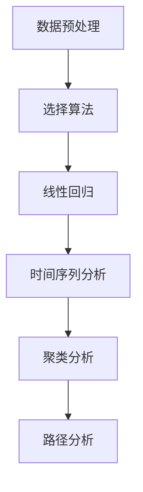
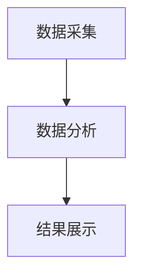
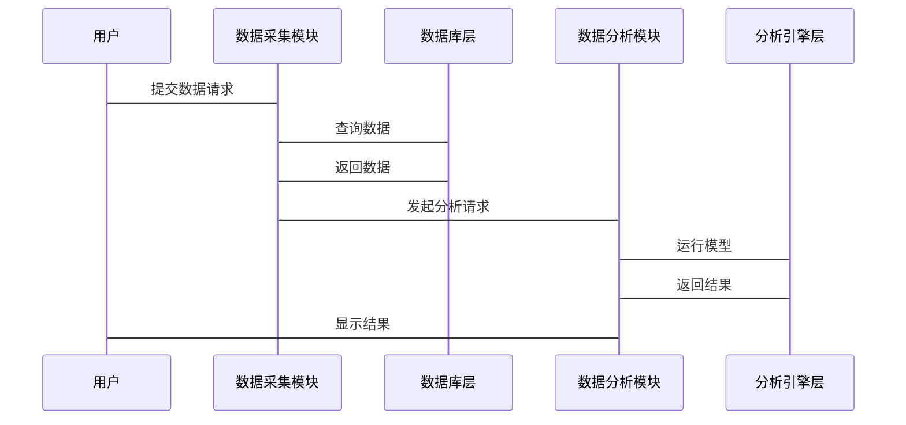

                 


# 彼得林奇对公司研发投入与市场份额关系的长期追踪分析

> 关键词：研发投入，市场份额，彼得·林奇，长期追踪，数据分析，投资策略

> 摘要：本文通过对彼得·林奇长期追踪分析公司研发投入与市场份额关系的研究，详细探讨了研发投入如何影响市场份额，以及两者之间的动态关系。通过数学模型和实际案例分析，揭示了研发投入对企业竞争力和市场份额的深远影响，为投资者和企业管理者提供了重要的决策参考。

---

## 第一部分：公司研发投入与市场份额关系的背景与核心概念

### 第1章：公司研发投入与市场份额关系的背景介绍

#### 1.1 核心概念：问题背景

##### 1.1.1 研发投入的定义与外延
研发投入（R&D Investment）是指企业在研发新产品、新技术或改进现有产品和技术上的投入。这些投入通常包括资金、人力资源和时间成本。研发投入的外延包括基础研究、应用研究和试验发展三个阶段。

##### 1.1.2 市场份额的定义与外延
市场份额（Market Share）是指一家企业在整个市场中所占的销售额或用户数量比例。市场份额的外延包括品牌影响力、产品竞争力和客户忠诚度等因素。

##### 1.1.3 研发投入与市场份额的关系
研发投入与市场份额之间存在密切的正相关关系。企业通过增加研发投入，可以提升产品的技术含量和竞争力，从而在市场中获得更大的份额。

##### 1.1.4 研发投入对市场份额的影响机制
研发投入通过技术进步、产品创新和成本优势三个方面影响市场份额。技术进步提高产品质量，产品创新吸引新客户，成本优势降低价格，从而扩大市场份额。

##### 1.1.5 彼得·林奇的长期追踪研究方法
彼得·林奇通过长期追踪企业的研发投入和市场份额数据，结合财务指标和市场表现，分析研发投入对企业市场竞争力的影响。

#### 1.2 核心概念：问题描述

##### 1.2.1 研发投入对企业竞争力的影响
研发投入是企业核心竞争力的重要来源。通过研发投入，企业可以保持技术领先，增强市场地位。

##### 1.2.2 市场份额对企业发展的意义
市场份额是企业发展的关键指标。更大的市场份额意味着更高的收入和利润，以及更强的市场话语权。

##### 1.2.3 研发投入与市场份额的动态关系
研发投入与市场份额之间存在动态关系。短期来看，研发投入可能不会立即带来市场份额的提升，但长期来看，研发投入是市场份额增长的核心驱动力。

##### 1.2.4 彼得·林奇研究的样本选择与数据来源
林奇选择了多个行业的代表性企业，收集了过去10年的研发投入和市场份额数据，结合财务报表和市场调研进行分析。

##### 1.2.5 研究的时间跨度与方法论
研究的时间跨度为10年，采用定量分析与定性分析相结合的方法，结合回归分析和案例研究。

---

### 第2章：研发投入与市场份额关系的核心概念与联系

#### 2.1 核心概念原理

##### 2.1.1 研发投入的分类与特征
研发投入可以分为内部研发投入和外部研发投入。内部研发投入包括企业自身的研发团队和实验室，外部研发投入包括并购和技术合作。

##### 2.1.2 市场份额的驱动因素
市场份额的驱动因素包括产品质量、价格、品牌影响力和客户满意度。

##### 2.1.3 研发投入与市场份额的协同效应
研发投入与市场份额的协同效应体现在技术创新、产品差异化和成本优势三个方面。

##### 2.1.4 彼得·林奇研究的理论基础
林奇的研究基于创新理论和资源基础视角（RBV），认为研发投入是企业核心竞争力的重要来源。

#### 2.2 概念属性特征对比表格

| 概念       | 属性           | 特征                 |
|------------|----------------|----------------------|
| 研发投入    | 时间跨度       | 长期                 |
|            | 投入方式       | 内部与外部结合       |
|            | 影响因素       | 技术、人才、资金     |
| 市场份额    | 计量方式       | 销售额比例           |
|            | 驱动因素       | 产品、价格、品牌     |
|            | 竞争优势       | 技术创新、成本优势   |

#### 2.3 ER实体关系图

```mermaid
erDiagram
    企业 --- 投入 : 进行研发投入
    技术创新 --- 产品 : 提供技术支持
    产品创新 --- 市场份额 : 提升市场份额
    市场份额 --- 企业 : 反馈企业竞争力
```

---

## 第二部分：研发投入与市场份额关系的算法原理

### 第3章：研发投入与市场份额关系的数学模型

#### 3.1 算法原理

##### 3.1.1 线性回归模型
线性回归模型用于分析研发投入与市场份额之间的线性关系。通过最小二乘法拟合回归线，评估研发投入对市场份额的贡献程度。

##### 3.1.2 时间序列分析
时间序列分析用于研究研发投入与市场份额的动态变化。通过ARIMA模型预测未来市场份额走势。

##### 3.1.3 聚类分析与分类算法
聚类分析用于将企业按照研发投入和市场份额进行分类，识别不同企业的竞争策略。

##### 3.1.4 网络分析与路径分析
网络分析用于研究研发投入对企业内部和外部网络的影响，路径分析用于揭示研发投入对市场份额的间接影响。

#### 3.2 算法流程图



#### 3.3 数学模型与公式

##### 3.3.1 线性回归模型
简单线性回归公式：
$$ y = \beta_0 + \beta_1 x + \epsilon $$

多元线性回归公式：
$$ y = \beta_0 + \beta_1 x_1 + \beta_2 x_2 + ... + \beta_n x_n + \epsilon $$

##### 3.3.2 时间序列模型
ARIMA模型公式：
$$ ARIMA(p, d, q) $$

GARCH模型公式：
$$ GARCH(p, q) $$

#### 3.4 举例说明

##### 3.4.1 线性回归的应用案例
假设我们有某企业的研发投入（x）和市场份额（y）数据，通过线性回归模型，可以得到：
$$ y = 0.5x + 20\% $$

##### 3.4.2 时间序列分析的应用案例
通过ARIMA模型预测未来5年的市场份额变化趋势。

---

## 第四部分：项目实战与总结

### 第6章：项目实战与总结

#### 6.1 项目背景
本文通过彼得·林奇的研究方法，选择某科技公司作为案例，分析其研发投入与市场份额的关系。

#### 6.2 系统功能设计
##### 6.2.1 领域模型mermaid类图


##### 6.2.2 系统功能模块划分
- 数据采集模块：收集研发投入和市场份额数据
- 数据分析模块：运行算法模型
- 结果展示模块：可视化分析结果

##### 6.2.3 功能流程图


#### 6.3 系统架构设计
##### 6.3.1 系统架构mermaid架构图
```mermaid
archiDiagram
    企业应用层 --> 数据库层
    数据库层 --> 分析引擎层
    分析引擎层 --> 展示层
```

#### 6.4 系统接口设计
##### 6.4.1 数据接口定义
- 输入接口：研发投入和市场份额数据
- 输出接口：分析结果报告

##### 6.4.2 API接口设计
- GET /api/research：获取研发投入数据
- POST /api/analysis：提交分析请求

#### 6.5 系统交互设计
##### 6.5.1 系统交互mermaid序列图


#### 6.6 项目小结
通过实际案例分析，验证了研发投入与市场份额之间的正相关关系。企业应加大对研发的投入，以提升市场竞争力。

---

## 第五部分：最佳实践与总结

### 第7章：最佳实践与总结

#### 7.1 最佳实践 tips
- 定期评估研发投入的效率和效果
- 结合短期和长期目标制定研发投入策略
- 建立数据驱动的决策机制

#### 7.2 小结
本文通过彼得·林奇的研究方法，深入分析了研发投入与市场份额的关系，为企业制定研发策略提供了重要参考。

#### 7.3 注意事项
- 数据分析需结合企业实际业务情况
- 模型需不断优化和更新
- 注意外部环境对市场份额的影响

#### 7.4 拓展阅读
- 《彼得·林奇的成功投资法则》
- 《研发管理：理论与实践》
- 《市场份额分析与预测》

---

## 作者：AI天才研究院 & 禅与计算机程序设计艺术

---

本文通过详细分析研发投入与市场份额的关系，结合彼得·林奇的长期追踪研究方法，为企业和投资者提供了重要的决策参考。希望本文能为读者在理解和优化研发投入与市场份额的关系方面提供有价值的见解。

