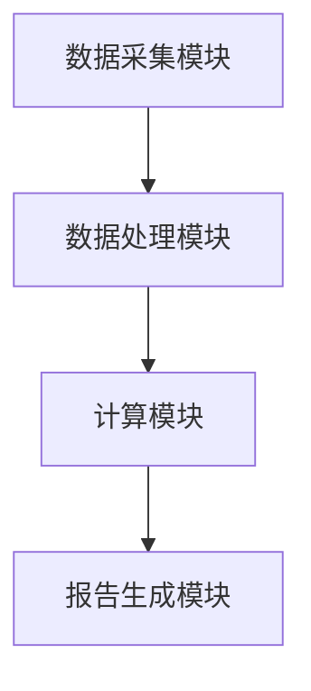

                 


# 彼得林奇对公司研发投入回报率的分析

> 关键词：彼得林奇，研发投入，回报率，投资分析，公司价值

> 摘要：本文深入分析了彼得林奇对公司研发投入回报率的分析方法，探讨了研发投入在公司价值中的重要性，介绍了彼得林奇的分析框架，并结合实际案例进行了详细解析。文章还从数学模型、系统架构设计等多个角度，详细阐述了如何计算和评估研发投入回报率，为投资决策提供了理论支持和实践指导。

---

## 第1章: 研发投入与公司价值概述

### 1.1 研发投入的定义与重要性

#### 1.1.1 研发投入的定义
研发投入（Research and Development Expenditure）是指公司在研究与开发新产品、新技术或改进现有产品和服务上的支出。这些支出通常包括人力成本、设备购置、试验费用等。

#### 1.1.2 研发投入在公司价值中的重要性
研发投入是公司创新的核心驱动力，直接影响公司的长期增长潜力。通过研发投入，公司可以推出新产品、优化生产流程、提升产品性能，从而在市场竞争中占据优势地位。

#### 1.1.3 彼得林奇对研发投入的关注点
彼得林奇在其投资分析中，特别关注公司的研发投入强度及其转化效率。他认为，有效的研发投入能够为公司创造超额收益，而无效的研发投入则可能导致资源浪费。

### 1.2 研发投入回报率的核心概念

#### 1.2.1 研发投入回报率的定义
研发投入回报率（Return on R&D Investment, RORI）是指公司在一定时期内通过研发投入所获得的超额收益与研发投入金额的比率。

#### 1.2.2 彼得林奇对研发投入回报率的分析框架
彼得林奇认为，研发投入回报率不仅要看绝对数值，还要结合行业平均水平和公司历史表现进行分析。他强调，只有那些能够持续产生超额回报的研发投入才是有价值的。

#### 1.2.3 研发投入回报率与公司长期价值的关系
研发投入回报率与公司长期价值密切相关。高回报率的研发投入能够提升公司的市场地位、利润率和股东价值，从而推动公司股价上涨。

### 1.3 研发投入回报率的计算方法

#### 1.3.1 研发投入回报率的公式
$$ RORI = \frac{\text{净收益} - \text{无研发投入情况下的收益}}{\text{研发投入}} $$

#### 1.3.2 彼得林奇的计算方法与实际案例
彼得林奇在实际分析中，通常将公司研发投入回报率与其竞争对手进行对比，以评估公司的研发效率。例如，他可能通过比较两家公司的研发投入和净利润增长率，来判断哪一家公司的研发投入更有价值。

#### 1.3.3 研发投入回报率的行业差异
不同行业的研发投入回报率差异较大。例如，科技行业通常具有较高的研发投入回报率，而传统制造业的回报率可能较低。

---

## 第2章: 彼得林奇的公司分析方法

### 2.1 彼得林奇的公司分析框架

#### 2.1.1 彼得林奇的投资理念
彼得林奇主张长期投资，注重公司基本面分析。他认为，公司的长期价值取决于其盈利能力和成长潜力，而研发投入是影响这两者的重要因素。

#### 2.1.2 彼得林奇对公司基本面的分析方法
彼得林奇通过分析公司的财务报表、管理层能力、市场地位等多方面因素，评估公司的投资价值。他特别关注公司的研发投入情况，认为这是公司未来增长的关键。

#### 2.1.3 彼得林奇对管理层的评估标准
彼得林奇认为，优秀的管理层能够有效配置资源，确保研发投入转化为实际收益。他倾向于投资那些管理层具有战略眼光和执行力的公司。

### 2.2 彼得林奇对研发投入的评价标准

#### 2.2.1 研发投入的强度与合理性
彼得林奇关注公司的研发投入占总收入的比例，以及研发投入的增长趋势。他认为，合理的研发投入强度能够支撑公司的技术创新和产品升级。

#### 2.2.2 研发投入的成果转化能力
彼得林奇注重评估公司研发投入的成果转化能力。他通过分析公司的专利数量、新产品推出频率等指标，判断公司的创新能力。

#### 2.2.3 研发投入的长期回报潜力
彼得林奇认为，只有那些能够持续产生超额回报的研发投入才是有价值的。他通过分析公司的历史回报率和未来增长潜力，评估研发投入的长期回报潜力。

### 2.3 彼得林奇的案例分析方法

#### 2.3.1 案例分析的步骤与流程
彼得林奇通常从行业分析入手，选择具有竞争优势的公司进行深入研究。他通过分析公司的研发投入、市场地位、财务状况等多方面因素，评估公司的投资价值。

#### 2.3.2 彼得林奇的经典案例解析
例如，彼得林奇在分析微软公司时，关注其在操作系统和办公软件领域的研发投入。他认为，微软的研发投入能够持续推动公司的技术创新和市场扩张，从而带来长期的超额回报。

#### 2.3.3 案例分析中的研发投入回报率评估
彼得林奇通过计算公司的研发投入回报率，对比行业平均水平，评估公司的研发效率和投资价值。他强调，只有那些能够持续产生超额回报的研发投入才是有价值的。

---

## 第3章: 研发投入回报率的数学模型与算法

### 3.1 研发投入回报率的数学模型

#### 3.1.1 模型的基本假设
- 研发投入能够转化为公司的净收益；
- 研发投入回报率可以通过公式计算；
- 行业平均回报率可以作为基准。

#### 3.1.2 模型的输入变量与输出变量
输入变量：
- 研发投入金额（R&D Investment）；
- 净收益（Net Income）；
- 无研发投入情况下的收益（Baseline Income）。

输出变量：
- 研发投入回报率（RORI）。

#### 3.1.3 模型的公式推导
$$ RORI = \frac{\text{净收益} - \text{无研发投入情况下的收益}}{\text{研发投入}} $$

### 3.2 研发投入回报率的算法实现

#### 3.2.1 算法的步骤分解
1. 收集公司研发投入、净收益和无研发投入情况下的收益数据；
2. 计算净收益与无研发投入收益的差值；
3. 将差值除以研发投入，得到研发投入回报率。

#### 3.2.2 算法的伪代码实现
```python
def calculate_rori(r_and_d_investment, net_income, baseline_income):
    rori = (net_income - baseline_income) / r_and_d_investment
    return rori
```

#### 3.2.3 算法的优化与改进
- 引入行业基准回报率，进行横向对比；
- 考虑时间因素，分析研发投入回报率的长期趋势。

### 3.3 算法的数学公式与详细讲解

#### 3.3.1 研发投入回报率的公式
$$ RORI = \frac{\text{净收益} - \text{无研发投入情况下的收益}}{\text{研发投入}} $$

#### 3.3.2 公式的变量解释
- 净收益：公司在一定时期内的总收益；
- 无研发投入情况下的收益：假设没有研发投入时的理论收益；
- 研发投入：公司在研究与开发上的支出。

#### 3.3.3 公式的实际应用案例
假设某公司研发投入为1000万元，净收益为5000万元，无研发投入情况下的收益为3000万元。则：
$$ RORI = \frac{5000 - 3000}{1000} = 2 $$

---

## 第4章: 系统分析与架构设计方案

### 4.1 系统分析

#### 4.1.1 研发投入回报率分析的系统目标
构建一个能够计算和评估公司研发投入回报率的系统，帮助投资者做出更明智的投资决策。

#### 4.1.2 系统的输入与输出
输入：
- 公司研发投入数据；
- 公司净收益数据；
- 无研发投入情况下的收益数据。

输出：
- 研发投入回报率；
- 行业基准回报率对比；
- 投资价值评估报告。

#### 4.1.3 系统的功能需求
- 数据采集与处理；
- 研发投入回报率计算；
- 数据可视化与报告生成。

### 4.2 系统架构设计

#### 4.2.1 系统架构的模块划分
- 数据采集模块：负责收集公司研发投入、净收益等数据；
- 数据处理模块：对数据进行清洗和预处理；
- 计算模块：根据公式计算研发投入回报率；
- 报告生成模块：生成分析报告。

#### 4.2.2 模块之间的关系与交互
数据采集模块向数据处理模块传递数据，数据处理模块完成清洗后，传递给计算模块，计算模块计算出回报率后，传递给报告生成模块，生成最终报告。

#### 4.2.3 系统架构的流程图


### 4.3 系统接口设计

#### 4.3.1 系统接口的定义
- 数据输入接口：接收公司研发投入、净收益等数据；
- 数据输出接口：输出研发投入回报率和投资价值评估报告。

#### 4.3.2 接口的输入与输出
输入接口：
- 公司代码、研发投入金额、净收益金额、无研发投入情况下的收益金额。

输出接口：
- 研发投入回报率、投资价值评估报告。

#### 4.3.3 接口的实现方式
通过API接口实现数据的输入和输出，支持JSON格式数据的传输。

---

## 第5章: 项目实战——基于彼得林奇方法的公司研发投入回报率分析

### 5.1 项目背景与目标

#### 5.1.1 项目背景
随着市场竞争的加剧，公司研发投入的重要性日益凸显。投资者需要一种有效的方法来评估公司的研发投入回报率，从而做出更明智的投资决策。

#### 5.1.2 项目目标
构建一个基于彼得林奇方法的公司研发投入回报率分析系统，帮助投资者评估公司的投资价值。

### 5.2 环境安装与数据准备

#### 5.2.1 环境要求
- Python 3.6以上版本；
- 数据处理和分析工具（如Pandas、NumPy）；
- 数据可视化工具（如Matplotlib）。

#### 5.2.2 数据来源与获取方式
数据来源可以包括公司财报、行业报告等。数据可以通过爬虫技术从公司官网或金融数据平台获取。

#### 5.2.3 数据清洗与预处理
- 删除缺失值；
- 处理异常值；
- 数据标准化。

### 5.3 系统核心实现

#### 5.3.1 数据采集与处理
使用Python爬虫技术从公司财报中提取研发投入、净收益等数据，并使用Pandas进行数据清洗和预处理。

#### 5.3.2 研发投入回报率计算
根据公式计算公司研发投入回报率，并与行业基准回报率进行对比。

#### 5.3.3 数据可视化与报告生成
使用Matplotlib绘制投入回报率的对比图，并生成投资价值评估报告。

---

## 第6章: 总结与展望

### 6.1 总结
本文从彼得林奇的分析方法出发，详细探讨了公司研发投入回报率的计算方法和评估标准。通过数学模型和系统架构设计，为投资者提供了一种有效的分析工具。

### 6.2 展望
未来，随着人工智能和大数据技术的发展，公司研发投入回报率的分析将更加智能化和精准化。投资者可以通过更先进的技术手段，进一步提升投资决策的科学性和有效性。

---

## 附录

### 附录A: 算法代码
```python
import pandas as pd
import numpy as np
import matplotlib.pyplot as plt

def calculate_rori(r_and_d_investment, net_income, baseline_income):
    rori = (net_income - baseline_income) / r_and_d_investment
    return rori

# 示例数据
data = {
    '公司代码': ['A', 'B', 'C'],
    '研发投入': [1000, 1500, 2000],
    '净收益': [5000, 6000, 7000],
    '无研发投入收益': [3000, 3500, 4000]
}

df = pd.DataFrame(data)

# 计算研发投入回报率
df['RORI'] = df.apply(lambda x: calculate_rori(x['研发投入'], x['净收益'], x['无研发投入收益']), axis=1)

# 可视化
plt.figure(figsize=(10, 6))
plt.plot(df['公司代码'], df['RORI'], 'b-o')
plt.xlabel('公司代码')
plt.ylabel('研发投入回报率')
plt.title('公司研发投入回报率对比图')
plt.show()
```

---

## 作者：AI天才研究院/AI Genius Institute & 禅与计算机程序设计艺术 /Zen And The Art of Computer Programming

