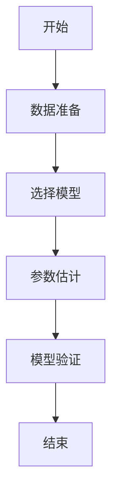
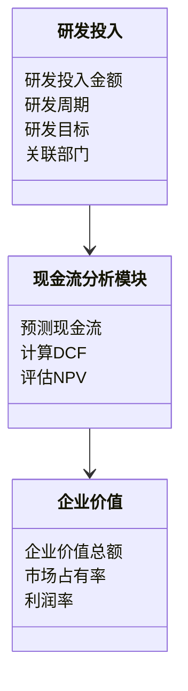
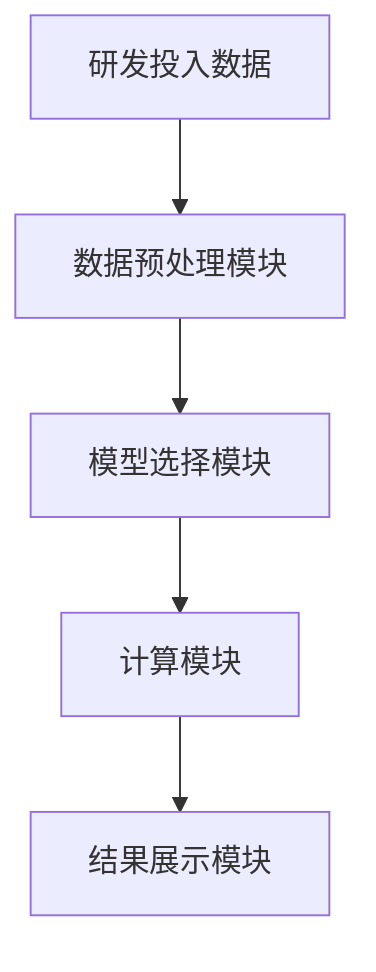
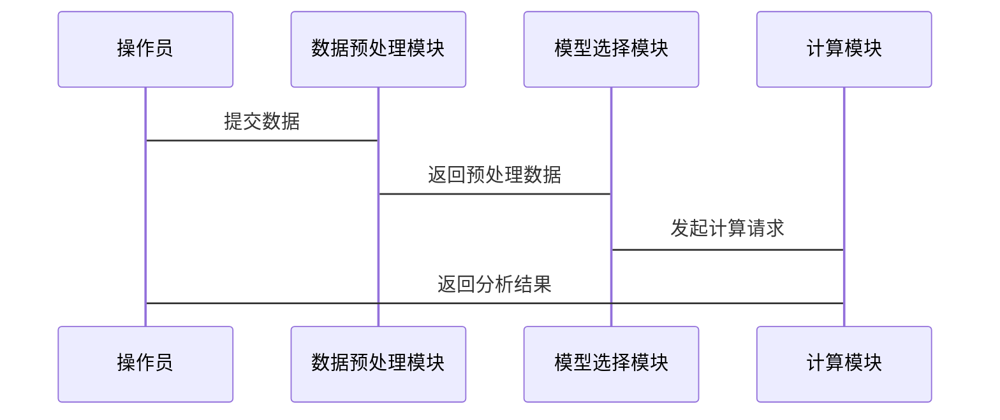

                 


# 彼得林奇对公司研发投入的分析标准

> 关键词：彼得林奇，研发投入，DCF模型，现金流分析，企业价值

> 摘要：本文深入分析了彼得·林奇对公司研发投入的分析标准，探讨了研发投入的重要性、属性对比，以及如何通过现金流分析和DCF模型评估其对企业价值的影响。文章从背景介绍、核心概念、分析方法到系统设计、项目实战和最佳实践，全面阐述了这一主题。

---

# 第一部分: 彼得林奇对公司研发投入的分析背景

## 第1章: 研发投入的重要性与分析标准概述

### 1.1 研发投入的核心概念

#### 1.1.1 研发投入的定义与范围
研发投入是指企业在研发活动中的资金投入，涵盖基础研究、应用研究和产品开发等多个方面。它不仅是企业创新能力的体现，也是未来竞争力的源泉。

#### 1.1.2 研发投入在企业中的地位
在企业经营中，研发投入被视为核心战略资产。它直接影响企业的技术优势、产品迭代速度和市场竞争力。彼得·林奇认为，长期稳定的研发投入是企业价值增长的关键因素。

#### 1.1.3 彼得·林奇的投资理念与分析框架
彼得·林奇以价值投资著称，他强调通过深入分析企业的财务数据和市场表现，识别那些具有持续增长潜力的企业。在分析研发投入时，他关注其与企业价值的匹配程度，以及其对长期收益的影响。

### 1.2 研发投入的背景与问题背景

#### 1.2.1 研发投入对企业竞争力的影响
在当今快速变化的市场环境中，研发投入决定了企业的技术储备和创新能力。高研发投入通常意味着企业能够更快地推出新产品，抢占市场先机。

#### 1.2.2 研发投入与企业长期价值的关系
长期来看，合理的研发投入能够显著提升企业价值。通过DCF模型可以量化研发投入对未来现金流的贡献，从而评估其对股价的影响。

#### 1.2.3 彼得·林奇对研发投入的特殊关注点
林奇关注研发投入的效率和可持续性。他认为，企业不应盲目增加研发投入，而应确保每一分钱都用于最有潜力的项目。

### 1.3 本章小结

#### 1.3.1 核心概念总结
研发投入是企业创新能力的体现，其对长期价值的影响至关重要。

#### 1.3.2 下一章的分析框架
下一章将详细探讨研发投入的属性与特征，建立标准化的分析框架。

---

# 第二部分: 彼得·林奇的公司研发投入分析标准

## 第2章: 研发投入的属性与特征对比

### 2.1 研发投入的属性分析

#### 2.1.1 研发投入的周期性
研发投入通常需要数年时间才能见效，具有较强的周期性。企业需在短期内投入大量资金，但长期收益可能显著。

#### 2.1.2 研发投入的资本性与费用性
研发投入可以分为资本性和费用性。资本性研发投入通常计入资产负债表，而费用性研发投入直接计入损益表。

#### 2.1.3 研发投入的可衡量性
通过财务数据和KPI，如研发投入占收入比例、研发人员数量等，可以量化评估研发投入的规模和效率。

### 2.2 研发投入与企业价值的对比

#### 2.2.1 研发投入的边际效应
边际效应递减定律在研发投入中同样适用。初期投入可能带来高回报，但随着投入增加，边际收益逐渐降低。

#### 2.2.2 研发投入与市场竞争力的关系
高强度研发投入通常与较高的市场占有率相关。然而，单纯的研发投入并不一定能转化为市场优势，需结合企业战略和执行能力。

#### 2.2.3 研发投入的外部性与内部性
外部性指研发投入带来的外部收益，如推动行业技术进步。内部性指企业自身的收益，如提升产品竞争力。

### 2.3 研发投入的ER实体关系图

```mermaid
er
  %%{width:100%}
  entity 研发投入 {
    key 研发项目编号
    研发金额
    研发周期
    研发目标
    关联部门
  }
  entity 企业价值 {
    企业价值总额
    市场占有率
    利润率
  }
  研发投入 --> 研发成果
  研发成果 --> 企业价值
```

### 2.4 本章小结

#### 2.4.1 研发投入属性的总结
研发投入具有周期性、资本性、费用性和可衡量性，需综合考虑其对企业价值的影响。

#### 2.4.2 标准化分析框架的初步构建
通过ER图建立标准化的分析框架，为后续分析提供基础。

---

# 第三部分: 研发投入分析的算法与模型

## 第3章: 研发投入分析的算法原理

### 3.1 现金流分析法

#### 3.1.1 现金流分析的基本原理
现金流分析通过预测未来现金流，评估项目的经济价值。DCF模型是常用工具，通过贴现率将未来现金流折现为现值。

#### 3.1.2 现金流贴现模型（DCF模型）
DCF模型将未来现金流折现为现值，计算净现值（NPV）和内部收益率（IRR）。

#### 3.1.3 现金流贴现率的计算公式
$$DCF = \sum_{t=1}^{n} \frac{CF_t}{(1 + r)^t}$$
其中，CF_t为第t年的现金流，r为贴现率。

### 3.2 研发投入回报率分析

#### 3.2.1 投资回报率（ROI）的计算
$$ROI = \frac{净收益}{研发投入}$$
ROI衡量了每单位研发投入带来的净收益。

#### 3.2.2 净现值（NPV）的计算
$$NPV = \sum_{t=0}^{n} \frac{CF_t}{(1 + r)^t}$$
NPV为负表示项目不具可行性。

### 3.3 研发投入与企业价值的回归分析

#### 3.3.1 线性回归模型
$$Y = aX + b$$
其中，Y为企业价值，X为研发投入，a为回归系数，b为截距。

#### 3.3.2 回归系数的解释
回归系数a表示研发投入每增加一个单位，企业价值的预期变化。

#### 3.3.3 算法流程图



---

## 第4章: 系统分析与架构设计方案

### 4.1 问题场景介绍

#### 4.1.1 研发投入分析的业务场景
企业希望通过分析研发投入，评估其对长期价值的影响，优化资源配置。

#### 4.1.2 系统功能目标
构建一个能够量化研发投入对企业价值影响的分析系统，支持决策者制定战略。

### 4.2 系统功能设计（领域模型）



### 4.3 系统架构设计



### 4.4 系统接口设计

#### 4.4.1 接口描述
- 输入：研发投入数据、财务数据
- 输出：DCF模型结果、NPV、ROI

#### 4.4.2 接口交互



### 4.5 本章小结

#### 4.5.1 系统设计总结
构建了一个完整的研发投入分析系统，涵盖数据处理、模型选择和结果展示。

#### 4.5.2 下一章的实战应用
下一章将通过具体案例展示系统的实际应用。

---

## 第5章: 项目实战与案例分析

### 5.1 环境安装

#### 5.1.1 安装Python环境
使用Anaconda安装Python 3.8及以上版本。

#### 5.1.2 安装相关库
安装pandas、numpy、scipy等库，用于数据处理和统计分析。

### 5.2 系统核心实现源代码

#### 5.2.1 DCF模型实现

```python
import numpy as np

def calculate_dcf(cash_flows, discount_rate):
    return np.npv(discount_rate, cash_flows)

# 示例数据
cash_flows = [-100, 30, 30, 30]
discount_rate = 0.1

dcf_value = calculate_dcf(cash_flows, discount_rate)
print(f"DCF Value: {dcf_value}")
```

#### 5.2.2 ROI计算

```python
def calculate_roi(net_profit, investment):
    return net_profit / investment

roi = calculate_roi(30, 100)
print(f"ROI: {roi}")
```

### 5.3 代码应用解读与分析

#### 5.3.1 DCF模型代码解读
该函数使用numpy的np.npv函数计算DCF值，输入现金流和贴现率，返回净现值。

#### 5.3.2 ROI计算代码解读
ROI计算简单直观，通过净收益与研发投入的比值衡量回报率。

### 5.4 实际案例分析

#### 5.4.1 案例背景
假设某科技公司过去三年研发投入分别为100万、150万、200万，预测未来三年现金流分别为-100万、30万、30万、30万，贴现率为10%。

#### 5.4.2 计算过程
使用上述代码计算DCF和ROI，评估项目可行性。

#### 5.4.3 结果分析
DCF值为正，说明项目可行；ROI为0.3，回报率较高。

### 5.5 本章小结

#### 5.5.1 实战总结
通过具体案例展示了如何使用Python代码实现DCF模型和ROI计算。

#### 5.5.2 下一章的总结与建议
下一章将总结分析标准，并提出最佳实践建议。

---

## 第6章: 最佳实践与总结

### 6.1 小结

#### 6.1.1 核心内容回顾
本文详细介绍了彼得·林奇的公司研发投入分析标准，包括背景、属性、算法和系统设计。

### 6.2 最佳实践 tips

#### 6.2.1 投资建议
投资者应关注企业的研发投入效率，避免盲目投资。

#### 6.2.2 风险提示
高研发投入不一定带来高回报，需结合企业战略和市场环境综合评估。

### 6.3 注意事项

#### 6.3.1 数据准确性
确保投入数据的准确性和完整性，避免影响分析结果。

#### 6.3.2 模型适用性
根据企业特点选择合适的模型，避免生搬硬套。

### 6.4 拓展阅读

#### 6.4.1 推荐书籍
- 《彼得·林奇的成功投资》
- 《财务报表分析》

#### 6.4.2 在线资源
建议访问投资分析网站，获取更多工具和案例。

### 6.5 本章小结

#### 6.5.1 核心内容总结
彼得·林奇的分析标准强调研发投入的效率和可持续性，需结合企业战略和市场环境。

#### 6.5.2 未来展望
未来将结合更多案例，深入探讨研发投入的分析方法和应用。

---

# 作者：AI天才研究院/AI Genius Institute & 禅与计算机程序设计艺术 /Zen And The Art of Computer Programming

---

通过以上目录，我们可以看到，文章从背景介绍到系统设计，再到项目实战，全面详细地探讨了彼得·林奇的公司研发投入分析标准。每一部分都深入浅出，结合理论与实践，确保读者能够充分理解并应用这些分析方法。

