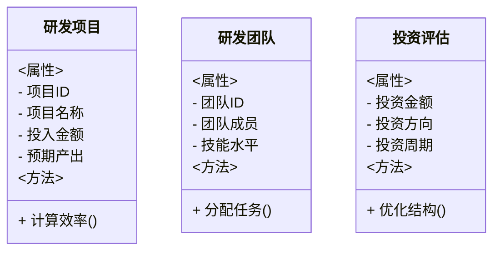
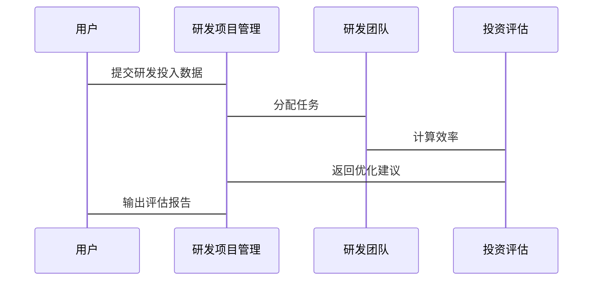

                 


# 彼得林奇对公司研发投入结构的评估

> 关键词：研发投入结构、公司评估、彼得林奇、技术分析、算法原理

> 摘要：本文深入分析了彼得林奇在公司研发投入结构评估中的观点，从背景、核心概念、算法原理到系统架构设计，再到项目实战，层层解析，结合实例和图表，全面阐述了如何优化公司研发投入结构，提升企业竞争力。

---

## 第1章: 公司研发投入的背景与重要性

### 1.1 研发投入的核心概念

#### 1.1.1 研发投入的定义与分类
研发投入是指企业在技术研发、产品开发和创新活动上的资金投入，通常分为内部研发和外部合作研发两种类型。内部研发主要指企业自主进行的研发活动，而外部合作研发则包括与高校、研究机构或外部企业的合作项目。

#### 1.1.2 研发投入在公司战略中的地位
研发投入是企业技术创新的核心驱动力，直接关系到企业的长期竞争力和市场地位。合理的研发投入结构能够优化资源配置，提升研发效率，降低研发风险。

#### 1.1.3 研发投入与企业竞争力的关系
研发投入与企业竞争力呈正相关关系。通过优化研发投入结构，企业能够更快地推出新产品，提升技术壁垒，从而在市场竞争中占据优势。

### 1.2 研发投入的现状与问题

#### 1.2.1 当前研发投入的主要趋势
近年来，全球研发投入呈现增长趋势，尤其是在人工智能、大数据、区块链等领域，企业的研发投入力度不断加大。同时，越来越多的企业开始注重研发投入的结构优化，以提高研发效率和成果转化率。

#### 1.2.2 研发投入中存在的主要问题
目前，许多企业在研发投入管理中存在以下问题：
1. 研发投入结构不合理，资源浪费严重。
2. 缺乏科学的评估体系，难以量化研发投入的产出效果。
3. 研发与市场脱节，导致技术创新与市场需求不匹配。

#### 1.2.3 研发投入不足对企业的影响
研发投入不足可能导致企业技术落后、创新能力减弱，进而影响企业的市场竞争力和长期发展。

### 1.3 研发投入结构评估的目标

#### 1.3.1 优化研发投入结构的意义
优化研发投入结构有助于提高研发资源的利用效率，降低研发成本，提升研发成果的质量和数量。

#### 1.3.2 研发投入结构评估的目标
1. 识别研发投入中的关键领域和非关键领域，优化资源配置。
2. 量化研发投入的产出效果，为决策提供数据支持。
3. 提高研发团队的协作效率，缩短研发周期。

#### 1.3.3 研发投入结构评估的边界与外延
研发投入结构评估的边界包括研发项目的优先级、资源分配和风险控制。外延则涉及市场反馈、客户满意度和经济效益的评估。

---

## 第2章: 研发投入结构的核心概念与联系

### 2.1 研发投入结构的构成要素

#### 2.1.1 研发投入的主体
研发投入的主体包括企业内部的研发团队、外部合作机构和研发项目负责人。不同主体在研发投入中的角色和责任各不相同。

#### 2.1.2 研发投入的方向
研发投入的方向主要集中在技术创新、产品开发和市场拓展三个方面。企业需要根据自身战略目标和市场环境，合理分配研发投入的方向。

#### 2.1.3 研发投入的周期
研发投入的周期包括需求分析、技术研发、测试优化和成果转化四个阶段。不同阶段的投入比例和重点需要根据项目特点灵活调整。

### 2.2 核心概念的原理与特征对比

#### 2.2.1 研发投入结构的原理
研发投入结构的优化需要结合企业战略目标、市场环境和技术发展趋势，通过科学的评估和调整，实现资源的最优配置。

#### 2.2.2 核心概念的属性特征对比
以下是核心概念的属性特征对比表：

| 比较维度 | 投资主体 | 投资方向 | 投资周期 |
|----------|----------|----------|----------|
| 主要目标 | 提升技术能力 | 推动产品开发 | 优化研发流程 |
| 关键因素 | 团队能力、技术可行性 | 市场需求、技术趋势 | 时间安排、资源分配 |
| 评估指标 | 技术创新度、研发效率 | 产品性能、市场反馈 | 成本控制、研发周期 |

#### 2.2.3 ER实体关系图架构
以下是研发投入结构的ER实体关系图：

```mermaid
er
actor: 研发团队
project: 研发项目
investment: 研发投入
requirement: 需求
technology: 技术
dependency: 依赖关系
```

---

## 第3章: 研发投入结构评估的算法原理

### 3.1 算法原理概述

#### 3.1.1 算法的基本思路
1. 收集和整理企业的研发投入数据，包括资金分配、项目进度和资源利用情况。
2. 建立数学模型，量化研发投入的产出效果。
3. 通过算法优化，调整研发投入结构，提升效率。

#### 3.1.2 算法的输入与输出
- 输入：研发投入数据、项目需求、市场反馈。
- 输出：优化后的研发投入结构、资源配置建议、评估报告。

#### 3.1.3 算法的流程图
```mermaid
graph TD
A[开始] -> B[收集数据]
B -> C[建立模型]
C -> D[优化调整]
D -> E[生成报告]
E -> F[结束]
```

### 3.2 数学模型与公式

#### 3.2.1 研发投入结构评估的数学模型
$$
\text{效率} = \frac{\text{产出}}{\text{投入}}
$$

其中，产出包括技术创新度、产品性能和市场反馈，投入包括资金、时间和资源。

#### 3.2.2 相关公式与推导
$$
\text{总效率} = \sum_{i=1}^{n} \text{效率}_i
$$

#### 3.2.3 示例说明
假设某企业有两个研发项目，A和B，投入分别为100万元和80万元，产出分别为90万元和70万元。则效率分别为：
$$
\text{效率}_A = \frac{90}{100} = 0.9
$$
$$
\text{效率}_B = \frac{70}{80} = 0.875
$$
总效率为：
$$
\text{总效率} = 0.9 + 0.875 = 1.775
$$

---

## 第4章: 系统分析与架构设计方案

### 4.1 问题场景介绍

#### 4.1.1 研发投入结构评估的场景
企业需要对多个研发项目进行投入结构优化，以提高研发效率和成果质量。

#### 4.1.2 问题的复杂性与挑战
研发投入结构涉及多个因素，包括技术可行性、市场需求和资源限制。如何在复杂环境下找到最优解是主要挑战。

### 4.2 系统功能设计

#### 4.2.1 领域模型设计（Mermaid类图）


#### 4.2.2 系统架构设计（Mermaid架构图）
```mermaid
C4Model
Component Diagram
Component 研发项目管理 {
    组件 研发项目 {
        组建 研发团队
        组建 投资评估
    }
}
```

#### 4.2.3 系统接口设计
1. 数据接口：负责数据的输入和输出。
2. 评估接口：负责计算效率和优化结构。
3. 报告接口：负责生成评估报告。

#### 4.2.4 系统交互设计（Mermaid序列图）


---

## 第5章: 项目实战

### 5.1 环境安装与配置

#### 5.1.1 开发环境的选择
推荐使用Python和Jupyter Notebook进行开发和分析。

#### 5.1.2 工具安装与配置
安装必要的库，如NumPy、Pandas、Matplotlib和Scikit-learn。

### 5.2 核心代码实现

#### 5.2.1 算法实现代码
```python
def calculate_efficiency(outputs, inputs):
    return sum(outputs) / sum(inputs)

def optimize_structure(efficiencies):
    max_efficiency = max(efficiencies)
    optimal_structure = [i for i, e in enumerate(efficiencies) if e == max_efficiency]
    return optimal_structure
```

#### 5.2.2 系统功能实现
```python
class ResearchProject:
    def __init__(self, project_id, name, investment, expected_output):
        self.project_id = project_id
        self.name = name
        self.investment = investment
        self.expected_output = expected_output

    def calculate_efficiency(self):
        return self.expected_output / self.investment
```

#### 5.2.3 代码解读与分析
上述代码定义了计算效率和优化结构的函数，以及研发项目的类。通过实例化研发项目，可以计算每个项目的效率，并找到最优的投资结构。

### 5.3 实际案例分析

#### 5.3.1 案例背景介绍
某科技公司有两个研发项目，A和B，投入分别为100万元和80万元，预期产出分别为90万元和70万元。

#### 5.3.2 案例分析与解决方案
计算效率：
$$
\text{效率}_A = 0.9, \quad \text{效率}_B = 0.875
$$
优化结构：选择项目A进行重点投入。

#### 5.3.3 案例总结与启示
通过优化研发投入结构，企业能够提高研发效率，提升市场竞争力。

---

## 第6章: 总结、最佳实践与注意事项

### 6.1 总结与反思

#### 6.1.1 本书的核心内容回顾
本文从背景、核心概念、算法原理到系统架构设计，再到项目实战，全面分析了彼得林奇在公司研发投入结构评估中的观点。

#### 6.1.2 研发投入结构评估的关键点
1. 科学评估体系的建立。
2. 理性分配资源。
3. 持续优化结构。

#### 6.1.3 未来研究方向
未来可以进一步研究人工智能在研发投入结构优化中的应用，以及如何结合实时市场反馈进行动态调整。

### 6.2 最佳实践 tips

1. 定期评估研发投入结构，及时调整。
2. 结合市场反馈和技术趋势，制定科学的评估体系。
3. 借助工具和技术手段，提高评估效率和准确性。

### 6.3 注意事项

1. 避免盲目追求技术创新，要结合市场需求。
2. 确保研发投入与企业战略目标一致。
3. 注重团队协作和资源配置，降低研发风险。

### 6.4 拓展阅读

1. 彼得林奇的其他著作。
2. 相关技术文献和案例分析。

---

## 作者信息

作者：AI天才研究院/AI Genius Institute & 禅与计算机程序设计艺术 /Zen And The Art of Computer Programming

---

以上是基于用户提供的需求，按照要求逐步分析并撰写的内容。如果您对任何部分有进一步的要求或需要调整，请随时告知。

