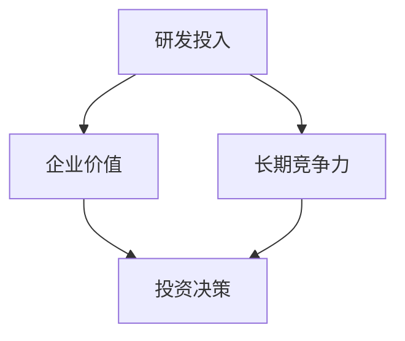
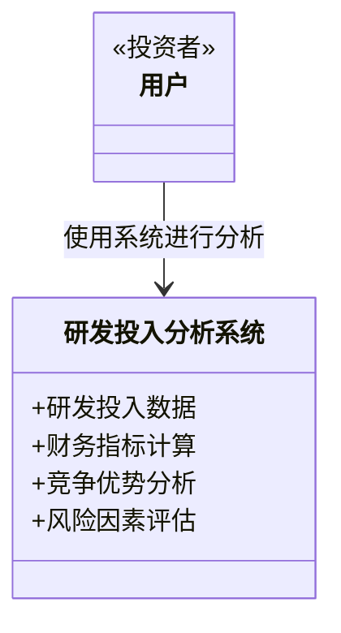

                 


# 彼得林奇对公司研发投入结构的长期跟踪分析

> 关键词：彼得林奇、研发投入结构、公司估值、投资分析、长期跟踪

> 摘要：本文通过分析彼得·林奇对公司研发投入结构的长期跟踪方法，深入探讨了研发投入结构对企业发展和投资价值的影响。文章从研发投入结构的背景与重要性出发，逐步分析其核心概念、数学模型、系统架构，并结合实际案例进行实战演练，最终总结出一套完整的分析方法。

---

## 第一部分：背景介绍

### 第1章：公司研发投入结构的背景与重要性

#### 1.1 研发投入的基本概念

- **1.1.1 研发投入的定义**  
  研发投入（R&D Investment）是指企业在研究与开发活动中的资金投入，主要用于技术创新、产品升级和工艺改进等。

- **1.1.2 研发投入的分类与特征**  
  研发投入可以分为应用研究、基础研究和试验发展三类。其特征包括周期性长、风险高、回报不确定性强。

- **1.1.3 研发投入在企业中的地位**  
  研发投入是企业技术创新的核心驱动力，也是提升企业竞争力和长期价值的关键因素。

#### 1.2 彼得·林奇的投资理念

- **1.2.1 彼得·林奇的简介与投资风格**  
  彼得·林奇是全球著名投资家，以其对基本面分析的重视而闻名。他强调通过深入研究企业基本面来寻找投资机会。

- **1.2.2 林奇对研发投入的重视**  
  林奇认为，研发是企业未来增长的核心驱动力。他通过分析企业的研发投入结构，判断企业是否具备长期竞争优势。

- **1.2.3 研发投入与公司长期价值的关系**  
  研发投入直接关系到企业的技术积累和产品创新能力。高研发投入往往意味着企业具备更强的市场竞争力和长期增长潜力。

#### 1.3 研发投入结构分析的意义

- **1.3.1 企业竞争力的基石**  
  研发投入结构决定了企业的技术储备和创新能力。

- **1.3.2 投资决策的重要依据**  
  通过分析研发投入结构，投资者可以更好地判断企业的成长潜力和投资价值。

- **1.3.3 行业发展趋势的风向标**  
  行业内的研发投入结构变化反映了技术创新的趋势和方向。

---

## 第二部分：核心概念与联系

### 第2章：研发投入结构的核心概念与联系

#### 2.1 核心概念的原理

- **2.1.1 研发投入的构成要素**  
  研发投入包括人员工资、设备购置、材料费用等。

- **2.1.2 研发投入的周期性特征**  
  研发投入具有周期性，通常与企业的经营状况和市场环境密切相关。

- **2.1.3 研发投入与收益的关系**  
  高研发投入不一定直接带来高收益，但长期来看，合理的研发投入能够提升企业的市场竞争力。

#### 2.2 核心概念的对比分析

- **2.2.1 研发投入与运营成本的对比**  
  研发投入是战略性支出，而运营成本是维持性支出。

- **2.2.2 研发投入与资本支出的对比**  
  研发投入主要用于技术创新，资本支出主要用于生产能力的提升。

- **2.2.3 研发投入与净利润的关系**  
  高研发投入可能短期内影响净利润，但长期来看能够提升企业的盈利能力。

#### 2.3 实体关系图



---

## 第三部分：算法原理与数学模型

### 第3章：研发投入结构的数学模型与公式

#### 3.1 研发强度的计算公式

$$
研发强度 = \frac{\text{研发投入}}{\text{营业收入}} \times 100\%
$$

#### 3.2 研发周期模型

$$
研发周期 = \frac{\text{研发总投入}}{\text{年均研发投入}}
$$

#### 3.3 研发效率评估

$$
研发效率 = \frac{\text{新产品数量}}{\text{研发投入总额}}
$$

---

## 第四部分：系统分析与架构设计方案

### 第4章：系统分析与架构设计方案

#### 4.1 问题场景介绍

- 研发投入结构分析的常见问题包括：如何量化研发投入的效率、如何判断研发投入的合理性、如何预测研发投入对业绩的影响等。

#### 4.2 系统功能设计



---

## 第五部分：项目实战

### 第5章：项目实战

#### 5.1 环境安装

- 数据获取工具：Python、Excel、SQL
- 数据处理库：Pandas、NumPy
- 可视化工具：Matplotlib、Seaborn

#### 5.2 核心实现

```python
import pandas as pd

# 示例数据加载
data = pd.read_csv('研发投入.csv')

# 计算研发强度
data['研发强度'] = data['研发投入'] / data['营业收入'] * 100

# 可视化图表
import matplotlib.pyplot as plt

plt.plot(data['公司名称'], data['研发强度'], 'b-')
plt.xlabel('公司名称')
plt.ylabel('研发强度 (%)')
plt.title('公司研发强度对比')
plt.show()
```

---

## 第六部分：总结与展望

### 6.1 最佳实践 Tips

- 通过定期跟踪企业的研发投入结构，投资者可以更好地判断企业的长期发展潜力。
- 结合财务指标和市场环境，综合评估企业的研发投入是否合理。

### 6.2 小结

本文通过分析彼得·林奇对公司研发投入结构的长期跟踪方法，详细探讨了研发投入结构对企业发展和投资价值的影响。通过数学模型和系统架构的设计，结合实际案例的实战演练，为投资者提供了一套完整的分析方法。

### 6.3 注意事项

- 投资者在分析研发投入结构时，应结合企业的整体财务状况和市场环境。
- 长期跟踪是关键，需要持续关注企业的研发投入变化。

### 6.4 拓展阅读

- 《彼得·林奇的投资哲学》
- 《企业研发投入与市场竞争力》
- 《财务报表分析与投资决策》

---

## 作者：AI天才研究院 & 禅与计算机程序设计艺术

