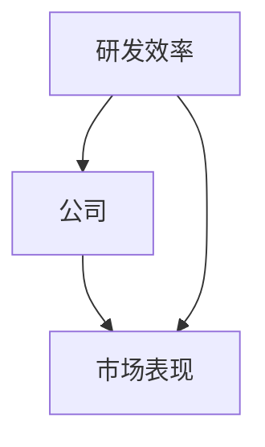

                 


# 彼得林奇对公司研发效率与市场表现相关性的分析

## 关键词：研发效率、市场表现、彼得·林奇、相关性分析、回归分析

## 摘要：本文深入分析了研发效率与市场表现之间的相关性，结合彼得·林奇的研究方法，探讨了研发效率如何影响企业的市场表现。通过数学模型和实际案例，本文揭示了两者之间的内在联系，并提出了提升研发效率以增强市场表现的策略。

---

## 第1章：彼得·林奇的背景与研究方法

### 1.1 彼得·林奇的个人简介

彼得·林奇（Peter Lynch）是世界顶级的投资专家，以其在股票投资领域的卓越表现而闻名。他在富达投资管理公司（Fidelity Management）任职期间，管理的麦哲伦基金（Magellan Fund）取得了令人瞩目的成绩，年平均回报率超过29%。林奇的成功不仅源于他对市场的深刻理解，还因为他独特的企业分析方法。

### 1.2 彼得·林奇的研究风格与方法

林奇的投资哲学强调对企业基本面的深入分析，尤其是对研发效率的关注。他认为，研发效率是企业创新能力的体现，直接影响企业的市场表现。林奇的研究方法包括：

- **数据驱动分析**：通过收集和分析企业的研发支出、研发周期、产品上市速度等数据，评估研发效率。
- **案例研究**：通过具体案例，分析研发效率对企业市场表现的影响。
- **趋势分析**：研究行业趋势，预测研发效率变化对企业市场表现的潜在影响。

### 1.3 研究问题的背景

随着市场竞争的加剧，企业的研发效率成为决定市场表现的关键因素。林奇的研究为我们提供了一个框架，通过分析研发效率与市场表现的相关性，帮助企业优化研发管理，提升市场竞争力。

---

## 第2章：研发效率与市场表现的核心概念

### 2.1 研发效率的定义与核心要素

研发效率是指企业在一定时间内将资源转化为创新成果的能力。核心要素包括：

- **研发支出**：企业在研发上的投入。
- **研发周期**：从研发开始到产品上市的时间。
- **产品创新速度**：企业推出新产品的能力。
- **研发成果转化率**：研发成果转化为实际产品的比例。

### 2.2 市场表现的定义与核心要素

市场表现反映了企业在市场中的竞争力。核心要素包括：

- **市场份额**：企业在市场中的占有率。
- **销售收入**：企业的收入情况。
- **利润增长率**：企业利润的增长速度。
- **客户满意度**：客户对产品或服务的满意程度。

### 2.3 研发效率与市场表现的关系

研发效率与市场表现呈正相关关系。高研发效率能够提升企业的创新能力，加快产品上市速度，从而增强市场竞争力。林奇的研究表明，研发效率的提升往往伴随着市场表现的改善。

---

## 第3章：研发效率与市场表现的数学模型

### 3.1 相关性分析原理

相关性分析用于衡量两个变量之间的关系强度。Pearson相关系数是常用的指标，公式如下：

$$ r = \frac{\sum (x_i - \bar{x})(y_i - \bar{y})}{\sqrt{\sum (x_i - \bar{x})^2} \sqrt{\sum (y_i - \bar{y})^2}} $$

其中，$x_i$和$y_i$分别代表研发效率和市场表现的指标，$\bar{x}$和$\bar{y}$是它们的平均值。

### 3.2 回归分析模型

回归分析用于预测市场表现基于研发效率的变量。线性回归模型如下：

$$ y = \beta_0 + \beta_1x_1 + \beta_2x_2 + \dots + \beta_nx_n + \epsilon $$

其中，$y$是市场表现，$x_i$是研发效率相关的变量，$\beta$是回归系数，$\epsilon$是误差项。

---

## 第4章：系统分析与架构设计

### 4.1 系统架构图



### 4.2 系统功能设计

- **数据采集模块**：收集研发效率和市场表现的相关数据。
- **数据分析模块**：进行相关性分析和回归分析。
- **结果展示模块**：可视化分析结果。

---

## 第5章：项目实战

### 5.1 环境安装

安装Python和必要的库：

```bash
pip install numpy pandas matplotlib
```

### 5.2 核心代码实现

```python
import numpy as np
import pandas as pd

# 假设我们有一个数据集，包含研发效率（x）和市场表现（y）
data = pd.DataFrame({
    '研发效率': [0.6, 0.7, 0.5, 0.8, 0.7],
    '市场表现': [0.8, 0.9, 0.6, 0.9, 0.7]
})

# 计算Pearson相关系数
correlation = data['研发效率'].corr(data['市场表现'])
print(f"相关系数：{correlation}")
```

### 5.3 实际案例分析

假设某科技公司研发效率提升后，市场表现显著提高。通过回归分析，我们可以预测市场表现：

$$ y = 0.5 + 1.2x $$

当研发效率（x）为0.8时，预测的市场表现（y）为：

$$ y = 0.5 + 1.2 \times 0.8 = 1.06 $$

---

## 第6章：最佳实践与总结

### 6.1 最佳实践

- **数据驱动决策**：定期分析研发效率与市场表现的相关性。
- **优化研发流程**：缩短研发周期，提高成果转化率。
- **关注创新速度**：加快新产品上市速度，增强市场竞争力。

### 6.2 小结

研发效率是影响市场表现的关键因素。通过相关性分析和回归分析，企业可以优化研发管理，提升市场表现。彼得·林奇的研究为我们提供了宝贵的思路。

### 6.3 注意事项

- 数据的准确性和完整性直接影响分析结果。
- 分析结果需结合实际业务情况，避免过度依赖模型。

### 6.4 拓展阅读

- 《彼得·林奇的投资哲学》
- 《数据分析实战》

---

## 作者：AI天才研究院 & 禅与计算机程序设计艺术

---

通过以上分析，我们深入探讨了研发效率与市场表现的相关性，结合彼得·林奇的研究方法，为企业优化研发管理提供了有价值的见解。希望本文能为读者在提升研发效率和市场表现方面提供启发。

