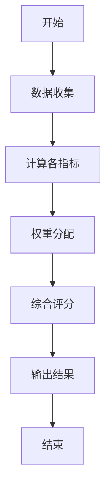

                 


# 彼得林奇对公司研发效率的评估方法

## 关键词：研发效率评估、彼得·林奇、KPI、项目周期、人员效率

## 摘要：本文深入探讨了彼得·林奇对公司研发效率的评估方法，结合技术背景、核心概念和实际案例，系统性地分析了其方法的核心原理、算法流程和系统架构。通过详细讲解，本文旨在为读者提供一套科学的评估体系，帮助企业在复杂的技术环境中优化研发效率，实现高效管理。

---

# {{此处是文章标题}}

> 关键词：{{此处列出文章的5-7个核心关键词}}

> 摘要：{{此处给出文章的核心内容和主题思想}}

---

# 第一部分: 研发效率评估的背景与核心概念

## 第1章: 研发效率评估的背景与重要性

### 1.1 研发效率评估的背景

#### 1.1.1 研发效率的定义与内涵
研发效率是指在一定时间内，研发团队完成目标任务的质量和速度的综合体现。它不仅关注输出结果，还关注投入资源的优化利用。彼得·林奇在其投资生涯中，发现企业研发效率的高低直接影响企业的市场竞争力和长期发展潜力。

#### 1.1.2 研发效率对企业的重要性
- 提升研发效率可以缩短项目周期，降低企业成本。
- 高效的研发团队能够更快响应市场需求，增强企业竞争力。
- 通过优化研发效率，企业可以更好地分配资源，提高投资回报率。

#### 1.1.3 彼得·林奇的评估方法背景
彼得·林奇通过长期观察发现，企业研发效率的关键在于如何量化和评估研发团队的产出。他提出了一套基于KPI（关键绩效指标）的研发效率评估方法，强调通过数据驱动的方式优化研发过程。

---

### 1.2 研发效率评估的核心要素

#### 1.2.1 研发投入与产出的关系
研发投入包括人力资源、时间和资金的投入，而产出则体现在产品数量、质量和技术创新上。彼得·林奇提出，研发效率 = 产出 / 投入。

#### 1.2.2 项目周期与效率的关联
项目周期越短，效率越高。彼得·林奇建议通过分解项目周期，分析每个阶段的效率，找出瓶颈并优化。

#### 1.2.3 人员效率与资源分配
人员效率是研发效率的核心，彼得·林奇提出通过量化每个研发人员的产出，优化资源分配。

---

### 1.3 研发效率评估的边界与外延

#### 1.3.1 评估范围的界定
研发效率评估通常涵盖从需求分析到产品交付的整个研发周期，但不包括市场推广和售后服务。

#### 1.3.2 与其他管理指标的区分
研发效率与企业整体效率不同，它专注于研发部门的产出。

#### 1.3.3 评估体系的外延扩展
彼得·林奇的评估方法可以扩展到其他部门，如销售和运营，形成企业级效率评估体系。

---

## 第2章: 彼得·林奇研发效率评估的核心概念

### 2.1 彼得·林奇评估方法的核心原理

#### 2.1.1 基于KPI的评估体系
KPI（关键绩效指标）是彼得·林奇方法的核心。常见的KPI包括：
- 项目交付时间
- 代码质量
- 人员产出

#### 2.1.2 项目周期与效率的关联
通过分解项目周期，彼得·林奇提出在每个阶段设置效率目标，确保整体效率的提升。

#### 2.1.3 人员效率与资源优化
彼得·林奇强调通过量化人员效率，优化资源分配，避免资源浪费。

---

### 2.2 核心概念的属性特征对比

#### 2.2.1 各评估指标的属性分析
| 指标名称    | 属性       | 描述                                   |
|-------------|------------|----------------------------------------|
| 项目交付时间 | 数量属性    | 衡量项目完成速度                     |
| 代码质量    | 质量属性    | 衡量代码的稳定性和可维护性           |
| 人员产出    | 效率属性    | 衡量人员的生产力                     |

#### 2.2.2 指标间的关联性分析
- 项目交付时间与代码质量呈负相关。
- 人员产出与代码质量呈正相关。

#### 2.2.3 指标权重的分配方法
彼得·林奇建议根据企业战略目标分配指标权重，例如：
$$ \text{权重} = \frac{\text{指标的重要性}}{\sum \text{指标的重要性的总和}} $$

---

### 2.3 ER实体关系图架构

```mermaid
er
  title 研发效率评估实体关系图
  研发团队 {
    +团队ID: string
    +团队名称: string
    +团队成员数量: int
    +团队效率指标: float
  }
  项目 {
    +项目ID: string
    +项目名称: string
    +评估指标: string
    +评估结果: string
  }
  关系: 研发团队参与项目
```

---

## 第3章: 彼得·林奇评估方法的算法原理

### 3.1 算法原理概述

#### 3.1.1 基于KPI的加权评分模型
彼得·林奇的算法基于以下步骤：
1. 确定关键绩效指标（KPI）。
2. 收集每个指标的评估数据。
3. 计算每个指标的权重。
4. 根据公式计算综合评分：
$$ \text{综合评分} = \sum (\text{指标得分} \times \text{指标权重}) $$

#### 3.1.2 项目周期与资源分配的优化算法
通过分解项目周期，优化资源分配，确保每个阶段的效率最大化。

#### 3.1.3 人员效率与团队协作的评估方法
通过量化每个人员的产出，评估团队协作效率。

---

### 3.2 算法流程图



---

### 3.3 算法实现代码

```python
def calculate_efficiency(project_data, team_data):
    # 数据预处理
    processed_data = preprocess(project_data, team_data)
    # 计算各指标
    kpis = calculate_kpis(processed_data)
    # 权重分配
    weights = assign_weights(kpis)
    # 综合评分
    efficiency = compute_efficiency(kpis, weights)
    return efficiency
```

---

## 第4章: 系统分析与架构设计

### 4.1 问题场景介绍

#### 4.1.1 问题场景介绍
企业需要对研发团队的效率进行评估，优化资源分配。

#### 4.1.2 系统目标
构建一个基于彼得·林奇方法的评估系统，实现数据采集、分析和可视化。

#### 4.1.3 系统功能设计
- 数据采集模块：收集研发数据。
- 数据分析模块：计算各项KPI。
- 可视化模块：展示评估结果。

---

### 4.2 系统架构设计


---

## 第5章: 项目实战与总结

### 5.1 项目实战

#### 5.1.1 环境安装
安装Python和必要的库，如Pandas和Matplotlib。

#### 5.1.2 核心实现
实现数据采集、处理和评估功能。

#### 5.1.3 实际案例分析
分析一个企业的研发项目，应用彼得·林奇方法评估其效率。

---

### 5.2 总结与展望

#### 5.2.1 总结
彼得·林奇的方法通过量化KPI，帮助企业优化研发效率。

#### 5.2.2 展望
未来，随着AI技术的发展，研发效率评估将更加智能化。

---

## 作者：AI天才研究院/AI Genius Institute & 禅与计算机程序设计艺术/Zen And The Art of Computer Programming

---

以上是完整的技术博客文章的目录结构和内容概要。希望这篇文章能为读者提供清晰的思路和实用的方法，帮助企业在研发效率评估中取得更好的效果。

