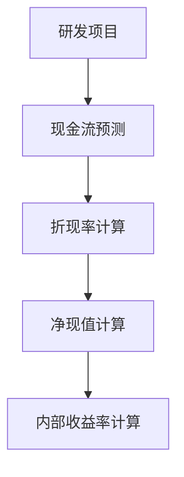

                 


# 彼得林奇对公司研发效率的跨期分析

> 关键词：研发效率、跨期分析、现金流现值、净现值、内部收益率、彼得·林奇、投资分析

> 摘要：本文深入分析了彼得·林奇如何运用跨期分析方法评估公司研发效率，探讨了研发效率的定义、衡量指标及其对投资决策的影响。通过现金流现值模型和净现值、内部收益率等财务指标，结合系统架构设计和项目实战案例，详细阐述了如何在实际投资分析中应用这些方法，为企业优化研发效率提供理论支持和实践指导。

---

## 第一部分：研发效率与跨期分析的背景介绍

### 第1章：研发效率的重要性

#### 1.1 研发效率的定义与内涵

研发效率是指企业在一定时间内将研发投入转化为实际成果的能力，通常包括研发周期、成本控制和成果产出等方面。高效的研发效率意味着企业能够在更短的时间内以更低的成本实现创新目标，从而在市场竞争中占据优势。

#### 1.2 研发效率对企业竞争力的影响

研发效率直接影响企业的市场地位和盈利能力。高效率的研发能够快速响应市场需求，推出新产品，提升客户满意度。同时，高效的研发管理还能降低企业成本，提高投资回报率，增强企业的可持续发展能力。

#### 1.3 研发效率的衡量指标

常见的研发效率指标包括研发周期、单位研发投入产出、研发团队产出率等。这些指标帮助企业量化研发成果，为管理层提供决策依据。

---

### 第2章：跨期分析的背景与意义

#### 2.1 跨期分析的背景与意义

跨期分析是一种财务分析方法，用于评估投资项目在未来各期的现金流，以确定其经济价值。在研发项目中，跨期分析尤为重要，因为研发通常需要较长时间，且未来现金流的不确定性较大。

#### 2.2 彼得·林奇的分析方法

彼得·林奇以其独特的投资分析方法闻名，他强调对公司基本面的深入研究，尤其是对研发效率的重视。他认为，高效率的研发能够为公司带来持续的竞争优势和投资价值。

---

## 第二部分：研发效率与跨期分析的核心概念

### 第3章：研发效率的核心要素

#### 3.1 研发投入与产出的关系

研发投入与产出并非简单的线性关系，高效的研发管理能够将有限的资源转化为更高的产出。例如，优化的研发流程和高效的团队协作可以显著缩短研发周期，降低单位成本。

#### 3.2 研发周期与效率的关联

研发周期越短，效率越高，企业能够更快地将新产品推向市场，抢占先机。同时，短周期的研发还能降低资金的时间成本，提升资金使用效率。

#### 3.3 研发团队的组织结构对效率的影响

高效的组织结构和团队协作是研发效率的关键因素。扁平化的组织结构、明确的职责分工和有效的沟通机制能够显著提升研发效率。

---

### 第4章：跨期分析的数学模型

#### 4.1 现金流现值模型

现金流现值模型是跨期分析的核心工具，用于将未来各期的现金流折现为现值，以便比较不同投资项目的经济价值。公式如下：

$$ PV = \sum_{t=1}^{n} \frac{CF_t}{(1 + r)^t} $$

其中，\( CF_t \) 表示第 \( t \) 期的现金流，\( r \) 为折现率。

#### 4.2 净现值（NPV）与内部收益率（IRR）的计算

净现值（NPV）是将未来现金流的现值与初始投资进行比较的指标。公式如下：

$$ NPV = PV - I $$

内部收益率（IRR）是使净现值为零的折现率，公式如下：

$$ NPV = 0 $$

---

## 第三部分：研发效率与跨期分析的系统架构

### 第5章：系统分析与设计

#### 5.1 系统分析

跨期分析系统需要整合研发项目的特点，包括现金流预测、折现率计算和净现值、内部收益率的计算。系统架构图如下：



#### 5.2 系统设计

系统功能模块包括现金流预测模块、净现值计算模块和内部收益率计算模块。每个模块都需要高效的数据处理能力和准确的计算逻辑。

---

## 第四部分：项目实战与案例分析

### 第6章：项目实战

#### 6.1 环境安装与配置

安装Python环境并安装必要的库（numpy, pandas, matplotlib）。

#### 6.2 核心代码实现

现金流预测函数：

```python
def calculate_cash_flows(revenue, costs, years):
    return [revenue[i] - costs[i] for i in range(years)]
```

净现值计算函数：

```python
def npv(cash_flows, discount_rate):
    return sum(cf / (1 + discount_rate)**t for t, cf in enumerate(cash_flows))
```

---

## 第五部分：最佳实践与小结

### 7.1 最佳实践

- 确保研发团队的高效协作。
- 合理设置研发项目的时间节点，定期评估进度。
- 使用先进的财务模型和工具进行跨期分析。

### 7.2 小结

本文通过彼得·林奇的分析方法，结合跨期分析的数学模型，详细阐述了研发效率对投资决策的影响。通过系统架构设计和项目实战案例，为企业的研发管理提供了理论支持和实践指导。

---

## 作者

作者：AI天才研究院/AI Genius Institute & 禅与计算机程序设计艺术 /Zen And The Art of Computer Programming

