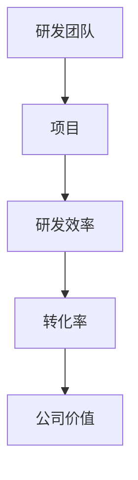
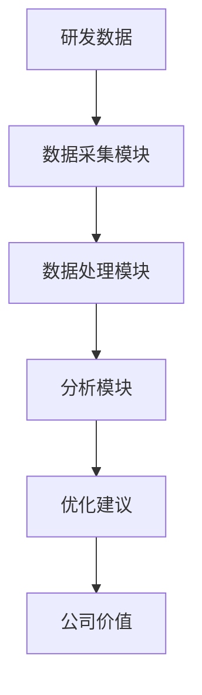

                 


# 彼得林奇对公司研发效率转化率的分析

## 关键词：研发效率，转化率，彼得·林奇，公司价值，研发管理

## 摘要：本文通过分析彼得·林奇对研发效率和转化率的关注点，揭示研发效率如何转化为公司价值，探讨提升研发效率和转化率的有效方法，为企业优化研发管理提供参考。

---

# 第1章: 研发效率与转化率的基本概念

## 1.1 研发效率的定义与衡量标准

### 1.1.1 研发效率的定义

研发效率是指在单位时间内，研发团队完成高质量研发成果的能力。它衡量了研发资源的利用效果，包括人力、时间和预算的投入。

### 1.1.2 研发效率的衡量指标

- **代码提交频率（Lines of Code per Unit Time）**：衡量开发人员的产出速度。
- **任务完成时间（Time to Completion）**：从任务分配到完成的时间。
- **缺陷率（Defects per Line of Code）**：代码质量的反向指标。
- **团队产出（Team Output）**：团队整体完成的功能模块数量。

### 1.1.3 彼得·林奇对研发效率的关注点

林奇认为，研发效率是公司创新能力和市场竞争力的核心。他关注研发团队的产出质量，而非单纯的速度，强调效率与成果的结合。

## 1.2 转化率的定义与应用

### 1.2.1 转化率的定义

转化率是将研发成果转化为实际收益的能力。在研发管理中，转化率指研发成果在市场上的实际应用和收益比例。

### 1.2.2 转化率在研发中的应用

- **市场反馈分析**：评估研发成果是否符合市场需求。
- **收益预测**：预估研发成果的商业价值。
- **资源配置优化**：调整研发资源分配以提高转化率。

### 1.2.3 彼得·林奇对转化率的分析框架

林奇提出，转化率依赖于市场定位、产品创新和执行效率。他强调通过市场研究和用户反馈，优化研发方向，提升转化率。

## 1.3 研发效率与转化率的关系

### 1.3.1 研发效率对转化率的影响

研发效率高，意味着更快的开发速度和更高的代码质量，从而提高转化率。例如，高效团队能快速迭代产品，更快响应市场变化，提升转化率。

### 1.3.2 转化率对研发效率的反向作用

高转化率表明研发成果符合市场需求，激励团队保持高效。低转化率则提示调整研发策略，优化效率。

### 1.3.3 彼得·林奇的分析视角

林奇认为，研发效率和转化率是相辅相成的。他建议企业通过数据驱动的方法，量化效率和转化率，持续优化两者的关系，提升整体研发绩效。

---

# 第2章: 研发效率与转化率的核心概念与联系

## 2.1 核心概念原理

### 2.1.1 研发效率的构成要素

- **团队能力**：成员的技术能力和协作能力。
- **工具支持**：开发工具和协作平台的效率。
- **流程优化**：敏捷开发等方法的应用。

### 2.1.2 转化率的实现路径

- **市场需求匹配**：研发成果符合市场需求。
- **产品创新性**：产品是否有独特价值。
- **市场推广策略**：产品如何推向市场。

### 2.1.3 两者之间的协同关系

研发效率高且转化率高的组合，能快速响应市场变化，持续创造价值。

## 2.2 核心概念属性特征对比

| 属性 | 研发效率 | 转化率 |
|------|----------|--------|
| 定义 | 单位时间内的研发产出 | 研发成果转化为收益的能力 |
| 关注点 | 开发速度与质量 | 市场需求与收益 |
| 影响因素 | 团队能力、工具、流程 | 市场定位、产品创新、资源配置 |

### 2.3 ER实体关系图



---

# 第3章: 研发效率与转化率的数学模型与公式

## 3.1 研发效率的数学模型

### 3.1.1 研发效率计算公式

$$研发效率 = \frac{研发成果}{研发资源}$$

### 3.1.2 研发效率的动态变化模型

$$\Delta E = k \cdot (T - E)$$

其中，$E$ 表示当前效率，$T$ 表示目标效率，$k$ 表示调整系数。

## 3.2 转化率的数学模型

### 3.2.1 转化率计算公式

$$转化率 = \frac{实际转化成果}{潜在转化成果}$$

### 3.2.2 转化率的预测模型

$$P = a \cdot R + b \cdot C + c$$

其中，$R$ 表示研发效率，$C$ 表示市场反馈，$a$ 和 $b$ 是系数，$c$ 是常数项。

---

# 第4章: 系统分析与架构设计方案

## 4.1 系统分析

### 4.1.1 问题场景介绍

- 需要分析研发效率和转化率之间的关系，优化研发管理。
- 目标是提升公司价值。

### 4.1.2 项目介绍

设计一个分析研发效率和转化率的系统，提供数据支持和优化建议。

## 4.2 系统功能设计

- **数据采集模块**：收集研发数据和市场反馈。
- **分析模块**：计算研发效率和转化率，生成优化建议。

## 4.3 系统架构设计



---

# 第5章: 项目实战

## 5.1 环境安装

安装必要的工具，如Python、数据分析库（Pandas、NumPy）等。

## 5.2 核心实现源代码

```python
def calculate_efficiency(dev_results, resources):
    return dev_results / resources

def predict_conversion_rate(efficiency, market_feedback):
    return efficiency * market_feedback
```

## 5.3 实际案例分析

以某科技公司为例，分析其研发效率和转化率，优化建议。

---

# 第6章: 总结与最佳实践

## 6.1 最佳实践 tips

- 定期评估研发效率和转化率。
- 优化研发流程和工具，提升效率。
- 加强市场反馈分析，提高转化率。

## 6.2 小结

研发效率和转化率是企业创新和竞争力的关键因素，两者相辅相成，需协同优化。

## 6.3 注意事项

- 避免单纯追求速度，忽视质量。
- 转化率依赖市场需求，需动态调整。

## 6.4 拓展阅读

推荐相关书籍和文章，深入学习研发管理。

---

# 作者：AI天才研究院 & 禅与计算机程序设计艺术

---

通过以上步骤，我们逐步分析了研发效率和转化率的定义、关系、数学模型、系统架构和实际应用，为提升公司研发管理提供了全面的指导和实践方法。

