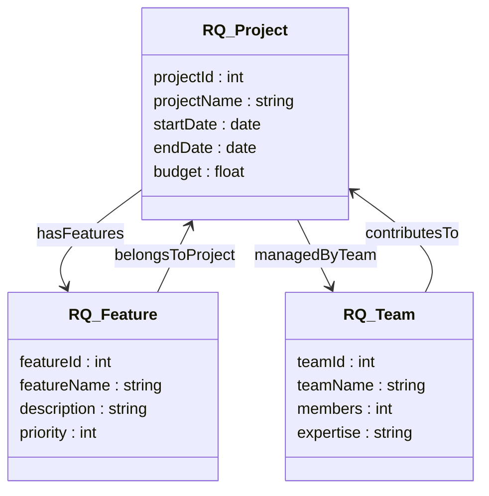

                 


# 彼得林奇对公司研发管线质量的评估

> 关键词：研发管线质量评估，彼得林奇方法论，研发战略，投资决策，企业竞争力

> 摘要：本文深入探讨了彼得·林奇对公司研发管线质量的评估方法，分析其核心概念、评估标准和实际应用，为企业管理者和投资者提供有价值的参考。

---

## 第一部分：研发管线质量评估的背景与重要性

### 第1章：研发管线质量评估的背景介绍

#### 1.1 研发管线质量评估的核心概念
- **1.1.1 研发管线的定义与分类**
  - 研发管线是指企业将创新想法转化为实际产品或服务的完整流程，包括研发、测试、量产等阶段。
  - 分为技术型管线、市场型管线和混合型管线。

- **1.1.2 研发管线质量评估的重要性**
  - 质量评估决定了研发项目的成功率和投资回报率。
  - 优质研发管线是企业竞争力的核心，直接影响市场地位和投资者信心。

- **1.1.3 彼得林奇的评估方法概述**
  - 强调从市场需求和技术可行性出发，评估研发项目的潜力和风险。

#### 1.2 研发管线质量评估的必要性
- **1.2.1 企业研发战略的核心作用**
  - 优质研发管线是企业持续创新和发展的基础。
  - 通过评估优化研发流程，提高效率和成功率。

- **1.2.2 研发管线质量对投资决策的影响**
  - 投资者关注研发管线的质量，以评估企业的长期发展潜力。
  - 高质量的管线吸引更多投资，提升企业融资能力。

- **1.2.3 研发管线质量与企业竞争力的关系**
  - 质量高的研发管线使企业在市场竞争中更具优势。
  - 良好的研发管理能力是企业核心竞争力的关键。

---

## 第二部分：研发管线质量评估的核心概念与联系

### 第2章：研发管线质量评估的核心概念

#### 2.1 核心概念的原理
- **2.1.1 研发管线的质量维度**
  - 技术可行性：评估技术的创新性和实现难度。
  - 市场需求：分析产品是否符合市场和客户需求。
  - 团队能力：评估研发团队的经验和能力。
  - 时间规划：确保项目按时完成，避免延误。

- **2.1.2 评估指标的分类与特征对比**
  | 指标类型 | 技术可行性 | 市场需求 | 团队能力 | 时间规划 |
  |----------|------------|----------|----------|----------|
  | 特点     | 创新性高    | 需求明确 | 能力强劲 | 进度可控 |

- **2.1.3 彼得林奇评估模型的构成**
  - 包括市场需求分析、技术可行性评估、团队能力和项目时间规划四个模块。

#### 2.2 核心概念的ER实体关系图

```mermaid
erDiagram
    RQ-Project {
        id projectId
        string projectName
        date startDate
        date endDate
        float budget
    }
    RQ-Feature {
        id featureId
        string featureName
        string description
        int priority
    }
    RQ-Team {
        id teamId
        string teamName
        int members
        string expertise
    }
    RQ-Project <--- RQ-Feature : hasFeatures
    RQ-Feature <.. RQ-Project : belongsToProject
    RQ-Project <.. RQ-Team : managedByTeam
    RQ-Team <.. RQ-Project : contributesTo
```

---

## 第三部分：研发管线质量评估的系统分析与架构设计

### 第4章：研发管线质量评估的系统分析

#### 4.1 问题场景介绍
- **研发管线质量评估的典型场景**
  - 投资者评估初创企业的研发能力。
  - 企业内部优化研发流程。

- **彼得林奇方法的应用案例**
  - 某科技公司通过彼得林奇模型优化了研发流程，提高了项目成功率。

#### 4.2 系统功能设计
- **领域模型 Mermaid 类图**


- **系统架构设计 Mermaid 架构图**


---

## 第四部分：研发管线质量评估的项目实战

### 第5章：研发管线质量评估的项目实战

#### 5.1 环境安装与数据准备
- **安装必要的工具**
  - 安装Python和相关库（如pandas、numpy）。

- **数据收集与预处理**
  - 收集研发项目的数据，包括项目周期、预算、团队规模等。

#### 5.2 核心代码实现
- **评估算法的 Python 代码实现**

```python
def assess_risk(project_data):
    risk_level = 0
    if project_data['budget'] < 0.5:
        risk_level += 1
    if project_data['team_expertise'] < 0.6:
        risk_level += 1
    if project_data['market_demand'] < 0.5:
        risk_level += 1
    return risk_level
```

- **代码功能与实现细节解读**
  - 函数根据预算、团队能力和市场需求评估项目风险等级。

---

## 第五部分：总结与最佳实践

### 第6章：总结与最佳实践

#### 6.1 项目小结
- **项目回顾与关键点总结**
  - 通过彼得林奇模型优化研发流程，提升了项目成功率。

- **实践中的注意事项与经验分享**
  - 定期评估和调整研发管线质量，确保与市场需求同步。

#### 6.2 最佳实践 tips
- **评估过程中的常见问题与解决方案**
  - 数据不足时，可以采用行业基准或专家意见补充。

- **未来研究方向与发展趋势**
  - 结合AI技术优化研发管线质量评估，实现智能化评估。

---

## 附录：完整代码示例

```python
import pandas as pd
import numpy as np

def calculate_risk_level(project_data):
    risk_level = 0
    # 技术可行性评估
    if project_data['technology_feasibility'] < 0.6:
        risk_level += 1
    # 市场需求评估
    if project_data['market_demand'] < 0.5:
        risk_level += 1
    # 团队能力评估
    if project_data['team_ability'] < 0.7:
        risk_level += 1
    return risk_level

# 示例数据
data = {
    'project_name': ['Project A', 'Project B', 'Project C'],
    'technology_feasibility': [0.8, 0.4, 0.6],
    'market_demand': [0.7, 0.3, 0.5],
    'team_ability': [0.8, 0.6, 0.7]
}

df = pd.DataFrame(data)
risk_levels = df.apply(lambda x: calculate_risk_level(x), axis=1)
print(risk_levels)
```

---

## 作者：AI天才研究院/AI Genius Institute & 禅与计算机程序设计艺术/Zen And The Art of Computer Programming

---

**总结**：本文系统地介绍了彼得·林奇对公司研发管线质量的评估方法，从背景、核心概念到系统设计和项目实战，为读者提供了全面的指导。通过实际案例和代码示例，帮助读者更好地理解和应用这些评估方法，提升企业的研发能力和投资吸引力。

