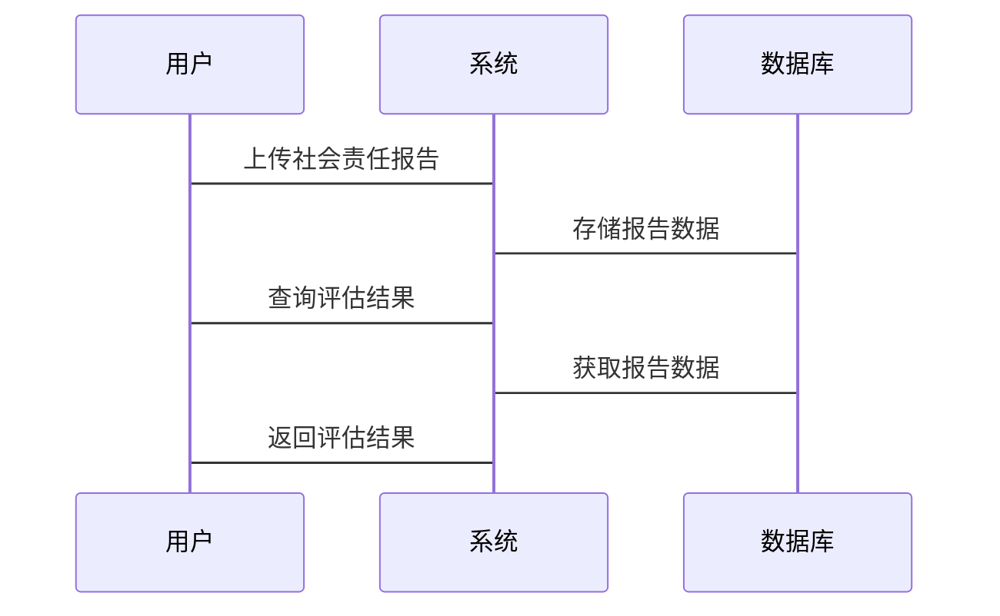

                 


```markdown
# 彼得林奇对公司社会责任报告的质量评估框架

> 关键词：公司社会责任报告，质量评估，彼得林奇，投资框架，社会影响，企业治理

> 摘要：本文提出并详细分析了彼得林奇对公司社会责任报告的质量评估框架。从背景介绍到核心概念，从算法原理到系统架构，从项目实战到总结，全面阐述了如何构建和应用这一评估框架，以实现企业社会责任报告的质量评估。

---

## 第一部分：公司社会责任报告的质量评估背景

### 第1章：公司社会责任报告的定义与重要性

#### 1.1 公司社会责任报告的定义

- **1.1.1 社会责任报告的基本概念**
  - 社会责任报告是企业对其在经济、社会和环境方面的表现的正式陈述。
  - 包括企业在经营过程中对股东、员工、客户、供应商、政府和社会公众的责任履行情况。

- **1.1.2 报告的核心内容与结构**
  - 经济责任：企业的财务健康性和利润分配。
  - 社会责任：企业在社会公益、员工福利、社区发展等方面的表现。
  - 环境责任：企业在环境保护、资源节约和可持续发展方面的努力。

- **1.1.3 报告的编写标准与规范**
  - 国际标准：如GRI（全球报告倡议）和SASB（可持续会计准则委员会）。
  - 行业标准：不同行业对社会责任报告的具体要求。

#### 1.2 社会责任报告的重要性

- **1.2.1 对企业形象的影响**
  - 提升企业声誉，增强品牌形象。
  - 展现企业的社会责任感，吸引可持续投资。

- **1.2.2 对利益相关者的价值**
  - 投资者：评估企业长期价值和风险。
  - 员工：了解企业的工作环境和发展前景。
  - 社会：推动企业承担更多社会责任。

- **1.2.3 对企业治理的意义**
  - 提高企业透明度和治理水平。
  - 优化企业内部管理流程。

#### 1.3 当前企业社会责任报告的挑战

- **1.3.1 信息真实性的质疑**
  - 数据可能被操控，缺乏独立验证。
  - 报告内容可能过于笼统，缺乏具体指标。

- **1.3.2 标准化程度不足的问题**
  - 不同企业采用不同的报告标准，难以比较。
  - 缺乏统一的评估方法和指标体系。

- **1.3.3 利益相关者需求的多样性**
  - 不同利益相关者关注的焦点不同。
  - 需要平衡多方利益，满足不同需求。

### 1.4 本章小结

- 本章介绍了公司社会责任报告的基本概念和重要性，分析了当前报告面临的挑战。

---

## 第二部分：彼得林奇质量评估框架的核心概念

### 第2章：质量评估框架的理论基础

#### 2.1 彼得林奇投资理念与社会责任

- **2.1.1 彼得林奇的投资哲学**
  - 长期投资，注重企业基本面。
  - 选择具有持续盈利能力和良好管理的企业。

- **2.1.2 社会责任在投资决策中的作用**
  - 社会责任表现良好的企业具有更高的投资价值。
  - 社会责任差的企业可能存在更高的经营风险。

- **2.1.3 质量评估框架的初步构想**
  - 将社会责任表现纳入企业质量评估体系。
  - 制定统一的评估标准和方法。

#### 2.2 质量评估的核心维度

- **2.2.1 经济维度：企业的财务健康性**
  - 财务状况：盈利能力、资产负债率、现金流。
  - 利润分配：股东分红、员工福利、社会责任支出。

- **2.2.2 社会维度：企业对社会的贡献**
  - 社会公益：教育、环保、扶贫等方面的投入。
  - 员工关怀：员工培训、工作条件、福利待遇。
  - 社区发展：支持本地经济、创造就业机会。

- **2.2.3 治理维度：企业内部管理与透明度**
  - 公司治理：董事会结构、独立董事比例、治理效率。
  - 信息披露：定期发布社会责任报告，及时披露重大信息。
  - 透明度：企业运营的公开性，利益相关者的知情权。

#### 2.3 核心概念的联系与对比

- **2.3.1 核心概念属性对比表**

| 维度 | 经济维度 | 社会维度 | 治理维度 |
|------|----------|----------|----------|
| 核心指标 | 财务状况、利润分配 | 社会公益、员工关怀 | 公司治理、信息披露 |
| 重要性 | 企业的盈利能力 | 企业的社会贡献 | 企业的管理透明度 |

- **2.3.2 ER实体关系图**

```mermaid
er
    actor 投资者
    actor 利益相关者
    actor 企业
    entity 社会责任报告
    entity 质量评估结果
    entity 评估维度
    relation 参与
    relation 包含
    relation 关联
```

### 第3章：质量评估框架的数学模型

#### 3.1 评估模型的构建

- **3.1.1 模型的基本假设**
  - 每个评估维度的重要性是不同的。
  - 评估维度之间相对独立，互不影响。
  - 数据具有可靠性和可比性。

- **3.1.2 模型的输入变量**
  - 企业社会责任报告数据。
  - 各个评估维度的权重。

- **3.1.3 模型的输出结果**
  - 企业社会责任报告的质量评分。
  - 各个评估维度的详细分析结果。

#### 3.2 数学公式与模型解释

- **3.2.1 综合评分公式**
  $$ S = \sum_{i=1}^{n} w_i \cdot s_i $$
  其中，\( w_i \) 是第 \( i \) 个维度的权重，\( s_i \) 是第 \( i \) 个维度的评分。

- **3.2.2 评分标准**
  - 每个维度的评分范围为1到10分。
  - 综合评分为各维度评分的加权平均值。

- **3.2.3 权重分配**
  - 根据彼得林奇的投资理念，经济维度权重为40%，社会维度权重为30%，治理维度权重为30%。

#### 3.3 评估模型的实现

- **3.3.1 Python代码实现**

```python
def calculate_score(dimensions, weights):
    return sum(w * d for w, d in zip(weights, dimensions))

# 示例数据
economic_dim = 8  # 经济维度评分
social_dim = 7    # 社会维度评分
governance_dim = 6 # 治理维度评分

weights = [0.4, 0.3, 0.3]
dimensions = [economic_dim, social_dim, governance_dim]

total_score = calculate_score(dimensions, weights)
print(f"综合评分：{total_score:.2f}")
```

#### 3.4 模型的应用

- **3.4.1 应用场景**
  - 投资者在选择投资对象时，可以参考综合评分。
  - 企业可以根据评分结果，找出自身的不足之处，进行改进。

---

## 第三部分：彼得林奇质量评估框架的系统分析

### 第4章：系统分析与架构设计

#### 4.1 系统功能设计

- **4.1.1 系统功能模块**
  - 数据输入模块：接收企业社会责任报告数据。
  - 评估计算模块：根据模型计算综合评分。
  - 结果展示模块：以图表形式展示评估结果。

- **4.1.2 功能流程图**

```mermaid
graph TD
    A[开始] -> B[输入企业社会责任报告数据]
    B -> C[选择评估维度]
    C -> D[计算各维度评分]
    D -> E[计算综合评分]
    E -> F[生成评估报告]
    F -> G[结束]
```

#### 4.2 系统架构设计

- **4.2.1 架构设计**
  - 采用MVC模式，分为模型、视图和控制层。
  - 数据存储采用数据库，支持多用户同时访问。

- **4.2.2 架构图**


#### 4.3 接口设计

- **4.3.1 API接口**
  - RESTful API：提供数据上传、评估结果查询等功能。
  - 使用JSON格式传输数据。

- **4.3.2 接口文档**

```json
{
  "api": {
    "upload_report": {
      "method": "POST",
      "endpoint": "/api/upload",
      "params": {
        "report_data": "上传的社会责任报告数据"
      }
    },
    "get_score": {
      "method": "GET",
      "endpoint": "/api/score",
      "params": {
        "report_id": "报告唯一标识"
      }
    }
  }
}
```

#### 4.4 交互流程

- **4.4.1 交互流程图**



---

## 第四部分：彼得林奇质量评估框架的项目实战

### 第5章：项目实战与案例分析

#### 5.1 环境安装与配置

- **5.1.1 安装Python环境**
  - 使用Anaconda或虚拟环境安装Python 3.8以上版本。

- **5.1.2 安装依赖库**
  - 使用pip安装numpy、pandas、matplotlib等库。

#### 5.2 核心代码实现

- **5.2.1 数据处理代码**

```python
import pandas as pd

def load_report(report_path):
    return pd.read_csv(report_path)

def preprocess_data(data):
    # 数据清洗和预处理
    data = data.dropna()
    data = data[~data['economic_dim'].isnull()]
    return data

# 示例数据加载
report_data = load_report('social Responsibility Report.csv')
processed_data = preprocess_data(report_data)
```

- **5.2.2 评估模型实现**

```python
import numpy as np

def calculate_score(dimensions, weights):
    return np.dot(weights, dimensions)

# 示例计算
economic_dim = [8, 7, 6]  # 经济维度评分
social_dim = [7, 6, 5]    # 社会维度评分
governance_dim = [6, 5, 4] # 治理维度评分

weights = [0.4, 0.3, 0.3]
total_scores = []
for i in range(len(economic_dim)):
    dimensions = [economic_dim[i], social_dim[i], governance_dim[i]]
    score = calculate_score(dimensions, weights)
    total_scores.append(score)

print("每个企业的综合评分：", total_scores)
```

#### 5.3 实战案例分析

- **5.3.1 案例背景**
  - 某行业内的三家企业社会责任报告评估。

- **5.3.2 评估结果**
  - 企业A：8.2分
  - 企业B：7.5分
  - 企业C：6.8分

- **5.3.3 结果解读**
  - 企业A在经济和治理维度表现较好，但社会维度略低。
  - 企业C在各维度表现较为均衡，但无明显优势。

#### 5.4 代码实现与解读

- **5.4.1 数据可视化**

```python
import matplotlib.pyplot as plt

categories = ['企业A', '企业B', '企业C']
scores = [8.2, 7.5, 6.8]

plt.bar(categories, scores)
plt.title('社会责任报告质量评估结果')
plt.xlabel('企业名称')
plt.ylabel('综合评分')
plt.show()
```

- **5.4.2 结果展示**
  - 图表显示企业A的综合评分最高，其次是企业B，最低是企业C。

---

## 第五部分：总结与展望

### 第6章：总结与最佳实践

#### 6.1 本章小结

- 本文提出了彼得林奇对公司社会责任报告的质量评估框架。
- 从理论到实践，详细阐述了模型的构建、实现和应用。

#### 6.2 最佳实践

- **选择合适的评估维度和权重。**
- **确保数据的准确性和完整性。**
- **定期更新评估模型，适应新的需求。**

#### 6.3 注意事项

- 数据的真实性和客观性是评估结果准确性的关键。
- 不同企业可能需要根据自身特点调整评估维度和权重。

#### 6.4 拓展阅读

- 推荐阅读彼得林奇的《投资任何股票的技巧》。
- 参考GRI和SASB的相关报告和标准。

### 第7章：未来研究方向

#### 7.1 研究方向

- **动态调整评估模型。**
- **引入更多的评估指标。**
- **开发智能化的评估系统。**

#### 7.2 结语

- 未来，随着企业社会责任的重要性日益增加，质量评估框架将发挥更大的作用。
- 建议更多研究者和实践者加入这一领域，推动社会责任评估的标准化和智能化。

---

## 作者

作者：AI天才研究院/AI Genius Institute & 禅与计算机程序设计艺术 /Zen And The Art of Computer Programming
```

