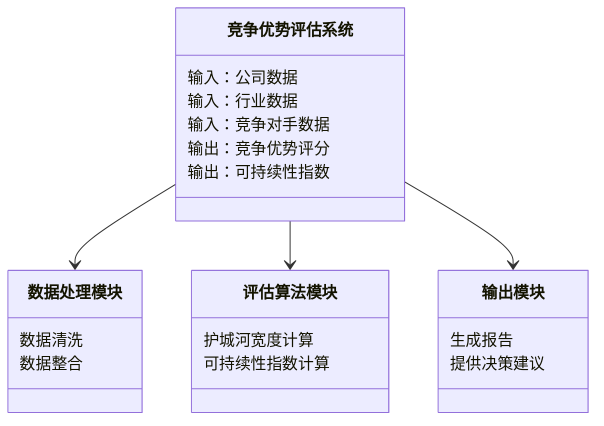

                 


# 彼得林奇对公司竞争优势持续性的评估

## 关键词：竞争优势，护城河，持续性评估，投资策略，彼得林奇

## 摘要

彼得·林奇是全球著名的价值投资者，他提出了竞争优势（也称为“护城河”）的概念，并强调了对竞争优势持续性进行评估的重要性。本文将从彼得林奇的竞争优势理论出发，详细分析竞争优势的类型、特征及其持续性评估的方法，结合实际案例，探讨如何通过系统化的方法识别和评估公司的竞争优势，并制定相应的投资策略。文章内容包括竞争优势的定义、类型、评估框架，持续性评估的方法，系统分析与架构设计，项目实战等部分，旨在为投资者和企业管理者提供理论和实践上的指导。

---

## 第一部分：彼得林奇投资理念与竞争优势概述

### 第1章：彼得林奇投资理念概述

#### 1.1 投资的定义与核心目标

- 投资的定义：通过购买资产或股权，以获得未来收益或资本增值的行为。
- 投资的核心目标：寻找具有持续竞争优势的企业，实现长期稳定的收益。

#### 1.2 彼得林奇的价值投资理念

- 价值投资的定义：以低于内在价值的价格购买优质资产。
- 竞争优势是价值投资的核心：公司必须具备某种竞争优势，才能在长期竞争中存活并创造超额收益。

#### 1.3 投资者的心理与行为特征

- 投资者需要具备独立思考能力，避免随市场波动盲目决策。
- 长期视角的重要性：关注企业的长期发展，而非短期市场波动。

#### 1.4 竞争优势的定义与重要性

- 竞争优势：公司能够在市场上长期保持领先地位的某种独特能力或资源。
- 竞争优势的重要性：决定公司的长期盈利能力，是投资决策的核心依据。

---

## 第二部分：竞争优势的类型与特征

### 第2章：竞争优势的类型

#### 2.1 成本优势

- 定义：公司能够以低于竞争对手的成本生产产品或提供服务。
- 特征：
  - 低成本生产模式（如规模经济、自动化生产）。
  - 供应链优势（如原材料采购成本低）。
- 持续性分析：
  - 成本优势是否能够长期维持，取决于企业的生产效率和技术水平。
  - 注意成本优势可能被技术进步或行业变化削弱。

#### 2.2 品牌优势

- 定义：公司拥有强大的品牌影响力，能够在市场上获得溢价收益。
- 特征：
  - 品牌知名度高。
  - 消费者对品牌的忠诚度高。
- 持续性分析：
  - 品牌优势需要通过持续的品牌营销和客户维护来维持。
  - 竞争对手的品牌挑战可能会影响优势的持续性。

#### 2.3 技术优势

- 定义：公司拥有独特的技术或专利，能够在市场上提供差异化的产品。
- 特征：
  - 技术创新能力强。
  - 技术壁垒高，难以被竞争对手复制。
- 持续性分析：
  - 技术优势需要通过持续的研发投入来维持。
  - 技术进步可能使优势逐渐削弱。

#### 2.4 资源优势

- 定义：公司拥有独特的资源储备，如原材料、数据或渠道资源。
- 特征：
  - 资源稀缺性高。
  - 资源获取成本低。
- 持续性分析：
  - 资源优势可能因市场变化或资源枯竭而削弱。
  - 资源管理能力是优势持续的关键。

---

## 第三部分：竞争优势持续性评估的方法论

### 第3章：竞争优势的识别与评估框架

#### 3.1 竞争优势识别的步骤

1. **行业分析**：了解行业竞争格局，识别行业中的关键成功因素。
2. **公司分析**：分析公司在行业中的地位，识别其核心竞争力。
3. **竞争对手分析**：比较公司与竞争对手的优劣势，找出公司的独特优势。

#### 3.2 竞争优势评估框架

- **护城河宽度**：竞争优势的强弱决定了护城河的宽度。
- **竞争优势的可持续性**：评估竞争优势是否能够在未来持续存在。
- **竞争优势的可扩展性**：竞争优势是否能够支持公司的规模扩张。

#### 3.3 竞争优势评估的数学模型

##### 护城河宽度计算公式

$$ \text{护城河宽度} = \frac{\text{公司市场份额} \times \text{竞争优势强度}}{\text{行业平均市场份额}} $$

其中，竞争优势强度可以用0到1的分数表示，1表示最强。

##### 竞争优势可持续性指数

$$ \text{可持续性指数} = \left( \frac{\text{公司竞争优势评分}}{\text{行业平均竞争优势评分}} \right) \times 100 $$

---

## 第四部分：系统分析与架构设计

### 第4章：竞争优势评估的系统架构

#### 4.1 系统功能设计

- **领域模型**：定义竞争优势评估的核心实体及其关系。



#### 4.2 系统架构设计


---

## 第五部分：项目实战

### 第5章：竞争优势评估的实战项目

#### 5.1 环境安装

- **工具安装**：安装Python、Pandas、Scikit-learn等工具。
- **数据准备**：收集目标公司的行业数据、财务数据和竞争对手数据。

#### 5.2 核心代码实现

```python
import pandas as pd
from sklearn.metrics import pairwise_distances

# 示例数据：公司A与行业竞争对手的市场份额和竞争优势评分
companies = pd.DataFrame({
    '公司': ['A', 'B', 'C', 'D'],
    '市场份额': [0.3, 0.25, 0.2, 0.25],
    '竞争优势评分': [0.8, 0.6, 0.5, 0.4]
})

# 计算护城河宽度
market_share_mean = companies['市场份额'].mean()
护城河宽度 = companies['市场份额'] * companies['竞争优势评分'] / market_share_mean

# 计算可持续性指数
行业平均竞争优势评分 = companies['竞争优势评分'].mean()
可持续性指数 = (companies['竞争优势评分'] / 行业平均竞争优势评分) * 100

print("护城河宽度：", 护城河宽度)
print("可持续性指数：", 可持续性指数)
```

#### 5.3 案例分析

- **案例背景**：假设公司A在行业中的市场份额为30%，竞争优势评分为80，行业平均评分为60。
- **计算结果**：
  - 护城河宽度 = (0.3 * 0.8) / (行业平均市场份额)。
  - 可持续性指数 = (0.8 / 0.6) * 100 = 133.3。

#### 5.4 项目总结

- 通过代码实现，我们可以快速评估公司的竞争优势。
- 通过案例分析，我们验证了评估模型的有效性。

---

## 第六部分：总结与最佳实践

### 第6章：总结与最佳实践

#### 6.1 总结

- 彼得林奇的竞争优势理论为我们提供了评估公司投资价值的重要方法。
- 通过系统化的方法和工具，我们可以更准确地识别和评估公司的竞争优势。

#### 6.2 投资建议

- 投资者应重点关注那些具有强大竞争优势的公司。
- 竞争优势的持续性是投资决策的核心考量因素。

#### 6.3 注意事项

- 竞争优势可能随着市场变化而改变，需定期评估。
- 投资者应结合宏观经济环境和行业趋势进行综合判断。

#### 6.4 未来趋势

- 随着技术的进步，竞争优势的评估将更加依赖数据分析和人工智能。
- 竞争优势的动态变化将推动投资策略的不断创新。

---

## 作者：AI天才研究院/AI Genius Institute & 禅与计算机程序设计艺术/Zen And The Art of Computer Programming

---

**注**：本文基于彼得林奇的竞争优势理论，结合实际案例和系统设计，为投资者和企业管理者提供了理论和实践上的指导。

