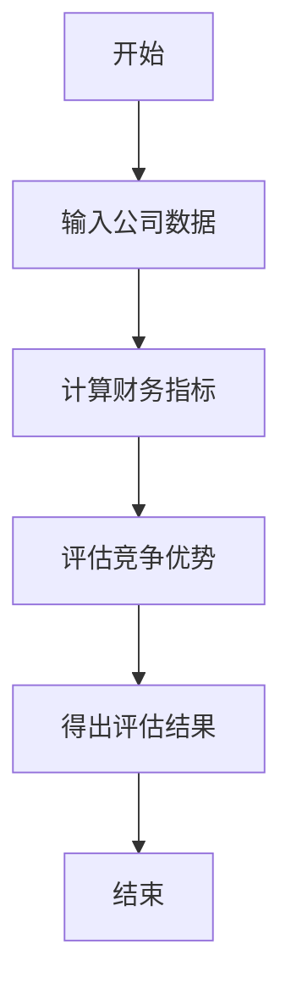

                 


# 彼得林奇对公司竞争策略有效性的评估

> 关键词：彼得林奇，竞争策略，竞争优势，财务指标，市场定位

> 摘要：本文详细探讨了彼得林奇对公司竞争策略有效性的评估方法。通过分析其核心概念、评估模型、算法原理以及实际案例，本文揭示了彼得林奇如何通过竞争优势、财务指标和市场定位等多维度评估公司竞争策略的有效性。文章结构清晰，内容详实，结合理论与实践，为读者提供了深入的理解和实用的工具。

---

## 第1章: 竞争策略评估的背景与概念

### 1.1 竞争策略的基本概念

#### 1.1.1 竞争策略的定义
竞争策略是指企业在市场中为实现长期竞争优势而采取的一系列战略行为和决策。它包括产品定位、定价策略、市场进入方式、成本控制、创新研发等多个方面。

#### 1.1.2 竞争策略的核心要素
- **市场定位**：企业在目标市场中的位置，包括目标客户、产品特点等。
- **竞争优势**：企业在市场上独有的优势，如成本优势、技术优势、品牌优势等。
- **资源分配**：企业在不同业务领域的资源投入和配置。
- **战略执行**：策略的实施过程，包括组织结构、管理风格等。

#### 1.1.3 竞争策略的分类与对比
竞争策略可以分为成本导向型、差异化导向型和聚焦型策略。成本导向型以低成本为主要竞争优势，差异化导向型以独特的产品或服务吸引客户，聚焦型则专注于特定市场或客户群体。

---

### 1.2 彼得林奇投资哲学简介

#### 1.2.1 彼得林奇的投资者背景
彼得林奇是美国著名投资专家，以其独特的竞争优势分析方法闻名。他通过深入分析公司的财务状况、市场地位和管理团队，评估公司的竞争策略有效性。

#### 1.2.2 彼得林奇的投资理念
彼得林奇强调长期投资和价值发现，认为公司的竞争优势是决定其长期盈利能力的关键因素。

#### 1.2.3 彼得林奇的竞争策略分析框架
彼得林奇的竞争策略分析框架包括以下步骤：
1. **分析公司的竞争优势**：包括成本优势、产品差异化、市场定位等。
2. **评估财务健康状况**：通过财务指标（如ROE、ROA）判断公司的盈利能力。
3. **研究行业环境**：分析行业趋势、竞争格局和潜在风险。

---

## 第2章: 竞争优势的识别与分析

### 2.1 核心竞争力的定义与特征

#### 2.1.1 核心竞争力的定义
核心竞争力是指公司能够在市场上持续提供独特价值的能力，通常是公司独有的资源或能力。

#### 2.1.2 核心竞争力的特征对比
| 特征 | 描述 |
|------|------|
| 独有性 | 竞争对手难以复制的能力或资源。 |
| 持续性 | 能够长期为公司创造价值。 |
| 价值性 | 能够为客户提供独特价值，提高市场竞争力。 |

---

### 2.2 彼得林奇的竞争优势评估方法

#### 2.2.1 产品差异化分析
产品差异化是通过提供独特的产品或服务来区别于竞争对手。彼得林奇认为，产品差异化是公司在市场中获得竞争优势的重要手段。

#### 2.2.2 成本优势分析
成本优势是指公司在生产或运营过程中能够以更低的成本提供产品或服务。彼得林奇认为，成本优势是公司长期盈利能力的重要保障。

#### 2.2.3 市场定位分析
市场定位是指公司在目标市场中的位置，包括目标客户、产品特点等。彼得林奇强调，正确的市场定位是公司成功的关键。

---

### 2.3 竞争优势的定量评估指标

#### 2.3.1 市场占有率分析
市场占有率是公司在目标市场中的销售比例。彼得林奇认为，高市场占有率通常意味着公司在市场上具有较强的竞争力。

#### 2.3.2 盈利能力分析
盈利能力是公司通过竞争策略实现的利润水平。彼得林奇常用ROE（净资产收益率）和ROA（资产回报率）来衡量公司的盈利能力。

#### 2.3.3 财务健康状况分析
财务健康状况是公司财务状况的综合评估，包括资产负债表、利润表和现金流量表等。彼得林奇认为，健康的财务状况是公司竞争策略成功的基础。

---

## 第3章: 竞争策略的有效性评估模型

### 3.1 彼得林奇竞争策略评估模型概述

#### 3.1.1 模型的构建逻辑
彼得林奇的竞争策略评估模型基于以下逻辑：
1. 分析公司的竞争优势。
2. 评估公司的财务状况。
3. 研究行业环境和趋势。
4. 综合评估公司竞争策略的有效性。

#### 3.1.2 模型的输入变量
- 公司的财务数据（如收入、利润、资产等）。
- 行业数据（如市场规模、竞争格局等）。
- 公司的市场定位和竞争优势。

#### 3.1.3 模型的输出结果
- 竞争优势得分。
- 财务健康状况评分。
- 竞争策略有效性评估。

---

### 3.2 竞争策略评估的核心算法

#### 3.2.1 算法原理
彼得林奇的竞争策略评估算法通过以下步骤实现：
1. 计算公司的财务指标（如ROE、ROA）。
2. 评估公司的竞争优势（如成本优势、产品差异化）。
3. 综合评估公司竞争策略的有效性。

#### 3.2.2 算法流程图


#### 3.2.3 算法实现代码示例
```python
def calculate_roe(net_profit, equity):
    return net_profit / equity

def calculate_roa(net_profit, total_assets):
    return net_profit / total_assets

def peterson_strategy_assessment(company_data):
    roe = calculate_roe(company_data['净利润'], company_data['股东权益'])
    roa = calculate_roa(company_data['净利润'], company_data['总资产'])
    industry_average_roe = 0.12  # 行业平均ROE
    industry_average_roa = 0.08  # 行业平均ROA

    edge_score = 0
    if roe > industry_average_roe:
        edge_score += 1
    if roa > industry_average_roa:
        edge_score += 1
    
    return edge_score
```

---

## 第4章: 竞争策略的有效性评估实践

### 4.1 实际案例分析

#### 4.1.1 案例背景
以某公司为例，分析其竞争策略的有效性。假设该公司在市场中具有较高的市场占有率，但财务状况较为一般。

#### 4.1.2 数据分析
通过计算ROE和ROA，评估公司的财务健康状况。

#### 4.1.3 竞争优势评估
分析公司的成本优势和产品差异化能力。

---

### 4.2 案例分析结果

#### 4.2.1 竞争优势得分
- ROE：0.15（高于行业平均值0.12）。
- ROA：0.10（高于行业平均值0.08）。
- 竞争优势得分：2分（满分2分）。

#### 4.2.2 竞争策略有效性评估
该公司在财务状况和竞争优势方面表现良好，但需要进一步提升市场定位和客户满意度。

---

## 第5章: 竞争策略评估的总结与展望

### 5.1 本章小结
彼得林奇的竞争策略评估方法通过分析公司的竞争优势、财务状况和行业环境，为投资者提供了有效的工具和思路。本文详细介绍了其评估模型和算法，并通过实际案例分析展示了其应用过程。

### 5.2 未来展望
未来，随着市场竞争的加剧，竞争策略的有效性评估将更加复杂。彼得林奇的方法可以结合大数据和人工智能技术，进一步提升评估的准确性和效率。

---

## 作者：AI天才研究院/AI Genius Institute & 禅与计算机程序设计艺术 /Zen And The Art of Computer Programming

---

以上是《彼得林奇对公司竞争策略有效性的评估》的技术博客文章的完整大纲和内容。

