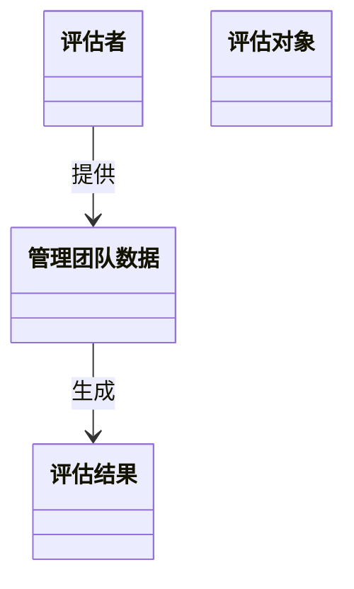
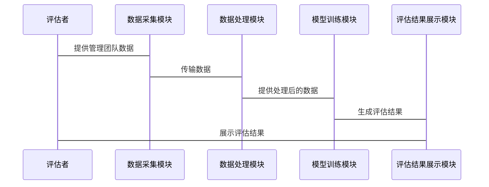

                 


# 彼得林奇对公司管理团队稳定性的评估

## 关键词：彼得林奇，团队稳定性，投资评估，管理团队，稳定性评估

## 摘要：彼得林奇作为投资大师，强调了管理团队稳定性在公司投资价值评估中的重要性。本文详细分析了彼得林奇的团队稳定性评估方法，包括其核心概念、算法原理、系统设计、项目实战和最佳实践。通过对比分析和实际案例，展示了如何在实际投资决策中应用这些评估方法。

---

# 第一章: 背景介绍

## 1.1 彼得林奇的背景与投资理念

### 1.1.1 彼得林奇的生平简介
彼得·林奇（Peter Lynch）是美国著名投资专家，曾任富达投资集团麦哲伦基金的经理。他以卓越的投资业绩闻名，管理该基金期间，基金年平均回报率高达29%，远超市场平均水平。林奇的成功不仅在于他的投资策略，更在于他对公司管理团队的深刻理解。

### 1.1.2 彼得林奇的投资哲学
林奇的投资哲学强调“常识投资”，即基于常识和深入研究做出投资决策。他认为，投资者应关注公司基本面，尤其是管理团队的稳定性、能力和战略方向。他主张长期投资，避免短期波动，追求公司长期增长带来的收益。

### 1.1.3 彼得林奇对管理团队的重视
林奇认为，一个稳定的、有能力的管理团队是公司长期成功的关键。他特别关注团队成员的稳定性、团队结构的合理性和团队文化的和谐性。一个优秀的管理团队能够带领公司在复杂多变的市场环境中稳步前行。

## 1.2 团队稳定性评估的定义与重要性

### 1.2.1 团队稳定性评估的定义
团队稳定性评估是指通过分析团队成员的稳定性、团队结构的合理性以及团队文化的和谐性，来判断一个团队是否能够在长期发展中保持稳定和高效。这种评估有助于投资者识别潜在风险，做出更明智的投资决策。

### 1.2.2 团队稳定性对公司的影响
- **公司战略执行**：稳定的管理团队能够更好地执行公司战略，推动公司目标的实现。
- **公司市值波动**：管理团队的不稳定可能导致公司股价波动，影响投资者信心。
- **投资者信心**：一个稳定的管理团队能够增强投资者对公司的信心，吸引更多长期投资者。

### 1.2.3 评估团队稳定性的重要性
- **投资决策依据**：团队稳定性是公司投资价值的重要组成部分，直接影响公司的长期表现。
- **风险管理工具**：通过评估团队稳定性，投资者可以识别潜在风险，制定相应的风险管理策略。
- **长期投资策略**：稳定的管理团队是公司长期增长的基础，投资者应优先选择管理团队稳定的公司。

## 1.3 团队稳定性评估的演变

### 1.3.1 传统团队评估方法
传统的团队评估方法主要关注团队成员的个人能力和团队整体表现，但忽视了团队结构和团队文化的动态变化。这种方法难以全面反映团队的稳定性。

### 1.3.2 现代团队稳定性评估的发展
随着管理学和心理学的发展，团队稳定性评估逐渐从定性分析向定量分析转变。现代评估方法结合了团队成员的稳定性、团队结构的合理性以及团队文化的和谐性，能够更全面地反映团队的稳定性。

### 1.3.3 彼得林奇方法的独特性
林奇的团队稳定性评估方法结合了定量分析和定性分析，注重团队成员的稳定性、团队结构的合理性以及团队文化的和谐性。这种方法不仅考虑了团队的现状，还关注了团队的未来发展潜力。

## 1.4 本书的核心内容与目标

### 1.4.1 本书的核心目标
本书旨在通过分析彼得林奇的团队稳定性评估方法，帮助投资者更好地识别和评估管理团队的稳定性，从而做出更明智的投资决策。

### 1.4.2 本书的主要内容框架
- **核心概念**：介绍团队稳定性评估的核心概念和相关理论。
- **算法原理**：详细讲解彼得林奇评估方法的算法原理和数学模型。
- **系统设计**：展示团队稳定性评估的系统设计方案和实现步骤。
- **项目实战**：通过实际案例分析，展示如何在实际投资中应用这些方法。

### 1.4.3 本书的适用读者
- **投资者**：希望提升投资决策能力的个人和机构投资者。
- **企业管理者**：希望通过优化管理团队稳定性来提升公司绩效的企业管理者。
- **研究者**：对团队稳定性评估方法感兴趣的研究者和学者。

---

# 第二章: 团队稳定性评估的核心概念

## 2.1 团队稳定性评估的原理

### 2.1.1 团队稳定性评估的基本原理
团队稳定性评估通过分析团队成员的稳定性、团队结构的合理性以及团队文化的和谐性，判断团队的整体稳定性。这种方法结合了定量分析和定性分析，能够全面反映团队的稳定性。

### 2.1.2 彼得林奇评估方法的核心要素
- **团队成员的稳定性**：评估团队成员的稳定性，包括成员的留任率、团队成员的变动情况等。
- **团队结构的合理性**：分析团队结构的合理性，包括团队成员的职责分配、团队层级结构等。
- **团队文化的和谐性**：评估团队文化的和谐性，包括团队成员之间的沟通、合作氛围等。

### 2.1.3 评估模型的数学基础
团队稳定性评估模型通常基于加权评分法，将团队成员的稳定性、团队结构的合理性以及团队文化的和谐性分别赋予不同的权重，计算团队的整体稳定性评分。

## 2.2 团队稳定性评估的核心要素

### 2.2.1 团队成员的稳定性
团队成员的稳定性是团队稳定性评估的重要指标。稳定性高的团队成员通常具有较长的任期，较低的离职率，以及较高的工作满意度。

### 2.2.2 团队结构的稳定性
团队结构的稳定性包括团队层级结构的合理性、团队成员的职责分配是否合理、团队内部的沟通效率等。合理的团队结构能够提高团队的整体效率。

### 2.2.3 团队文化的稳定性
团队文化的稳定性包括团队成员之间的信任程度、团队内部的沟通氛围、团队成员的合作意愿等。和谐的团队文化能够增强团队的凝聚力和稳定性。

## 2.3 团队稳定性评估的对比分析

### 2.3.1 不同团队稳定性评估方法的对比
- **传统方法**：主要关注团队成员的个人能力和团队整体表现，忽视了团队结构和团队文化的动态变化。
- **现代方法**：结合了团队成员的稳定性、团队结构的合理性以及团队文化的和谐性，能够更全面地反映团队的稳定性。

### 2.3.2 彼得林奇方法与其他方法的异同
- **相同点**：都关注团队成员的稳定性、团队结构的合理性以及团队文化的和谐性。
- **不同点**：彼得林奇方法更注重团队成员的稳定性，而其他方法可能更关注团队结构的合理性。

### 2.3.3 方法选择的依据与策略
选择团队稳定性评估方法时，应根据具体的投资目标和团队特点选择合适的方法。对于长期投资者，彼得林奇方法更为适用；对于短期投资者，可以考虑其他方法。

## 2.4 团队稳定性评估的ER实体关系图

### 2.4.1 实体关系图
```mermaid
er
actor: 评估者
role: 评估对象
```
- **评估者**：投资者或企业管理者，负责对管理团队进行稳定性评估。
- **评估对象**：公司管理团队，包括团队成员、团队结构和团队文化。

---

# 第三章: 团队稳定性评估的算法原理

## 3.1 评估算法的概述

### 3.1.1 算法的基本流程
1. **数据收集**：收集管理团队的相关数据，包括团队成员的稳定性、团队结构的合理性以及团队文化的和谐性。
2. **数据预处理**：对收集的数据进行清洗和标准化处理。
3. **数据分析**：使用统计方法和机器学习算法对数据进行分析，提取关键特征。
4. **模型训练**：基于提取的特征，训练团队稳定性评估模型。
5. **模型评估**：对模型进行验证和评估，调整参数，优化模型性能。

### 3.1.2 算法的主要步骤
- **数据收集**：收集团队成员的稳定性数据、团队结构的合理性数据以及团队文化的和谐性数据。
- **数据预处理**：对数据进行清洗、标准化和特征选择。
- **数据分析**：使用统计方法和机器学习算法对数据进行分析，提取关键特征。
- **模型训练**：基于提取的特征，训练团队稳定性评估模型。
- **模型评估**：对模型进行验证和评估，调整参数，优化模型性能。

### 3.1.3 算法的输入输出
- **输入**：管理团队的相关数据，包括团队成员的稳定性、团队结构的合理性以及团队文化的和谐性。
- **输出**：团队的整体稳定性评分，以及各维度的评分结果。

## 3.2 评估算法的详细步骤

### 3.2.1 数据收集与预处理
- **数据收集**：通过公司财报、新闻报道、行业研究报告等渠道收集管理团队的相关数据。
- **数据清洗**：删除无效数据，处理缺失值和异常值。
- **数据标准化**：将数据标准化到统一的尺度，确保不同维度的数据具有可比性。

### 3.2.2 数据分析与特征提取
- **数据分析**：使用统计方法和机器学习算法对数据进行分析，提取关键特征。
- **特征选择**：根据特征的重要性进行选择，去除冗余特征，提高模型的性能。

### 3.2.3 模型训练与评估
- **模型训练**：使用训练数据训练团队稳定性评估模型，调整模型参数，优化模型性能。
- **模型验证**：使用验证数据对模型进行验证，评估模型的准确性和稳定性。
- **模型优化**：根据验证结果，调整模型参数，优化模型性能。

## 3.3 评估算法的数学模型

### 3.3.1 加权评分模型
加权评分模型是一种常用的团队稳定性评估方法，其公式如下：
$$ \text{总评分} = \sum (\text{权重}_i \times \text{评分}_i) $$
其中，权重_i 是各维度的权重，评分_i 是各维度的评分。

### 3.3.2 团队稳定性评估的数学公式
团队稳定性评估的数学公式如下：
$$ \text{稳定性评分} = w_1 \times \text{团队成员稳定性} + w_2 \times \text{团队结构合理性} + w_3 \times \text{团队文化和谐性} $$
其中，w1、w2、w3 是各维度的权重，通常根据具体情况进行调整。

### 3.3.3 示例说明
假设我们有一个管理团队，其团队成员的稳定性评分为80分，团队结构的合理性评分为70分，团队文化的和谐性评分为90分。假设各维度的权重分别为30%、30%和40%，则团队的整体稳定性评分为：
$$ \text{稳定性评分} = 0.3 \times 80 + 0.3 \times 70 + 0.4 \times 90 = 24 + 21 + 36 = 81 $$

---

# 第四章: 系统分析与架构设计方案

## 4.1 问题场景介绍

### 4.1.1 问题背景
在实际投资中，投资者需要对多个公司的管理团队进行稳定性评估，以做出投资决策。由于涉及大量数据和复杂分析，传统的手动评估方法效率低下，容易出错。

### 4.1.2 问题描述
本文旨在设计一个基于彼得林奇团队稳定性评估方法的自动化评估系统，帮助投资者快速、准确地评估管理团队的稳定性。

## 4.2 系统功能设计

### 4.2.1 系统功能模块
- **数据采集模块**：负责采集公司管理团队的相关数据。
- **数据处理模块**：对采集的数据进行清洗、标准化和特征提取。
- **模型训练模块**：基于提取的特征，训练团队稳定性评估模型。
- **评估结果展示模块**：将评估结果以可视化的方式展示给用户。

### 4.2.2 系统功能设计的领域模型图


## 4.3 系统架构设计

### 4.3.1 系统架构图


### 4.3.2 系统接口设计
- **数据接口**：与数据源（如公司财报、新闻报道等）进行数据交互。
- **用户接口**：与最终用户进行交互，展示评估结果。

### 4.3.3 系统交互流程图


---

# 第五章: 项目实战

## 5.1 环境安装与配置

### 5.1.1 系统环境
- **操作系统**：Windows 10 或更高版本，macOS 10.15 或更高版本，Linux（推荐 Ubuntu 20.04 或更高版本）。
- **Python版本**：Python 3.8 或更高版本。
- **依赖管理工具**：建议使用 virtualenv 管理 Python 环境。

### 5.1.2 安装依赖
```bash
pip install pandas numpy scikit-learn matplotlib
```

## 5.2 系统核心实现源代码

### 5.2.1 数据采集模块
```python
import pandas as pd

def collect_data(company_name):
    # 从公司财报中提取管理团队数据
    data = pd.read_csv(f'{company_name}_management_team.csv')
    return data
```

### 5.2.2 数据处理模块
```python
import pandas as pd
import numpy as np

def preprocess_data(data):
    # 数据清洗和标准化
    data = data.dropna()
    data = pd.get_dummies(data)
    return data
```

### 5.2.3 模型训练模块
```python
from sklearn.ensemble import RandomForestClassifier
from sklearn.metrics import accuracy_score

def train_model(X_train, y_train):
    # 训练随机森林模型
    model = RandomForestClassifier(n_estimators=100)
    model.fit(X_train, y_train)
    return model
```

### 5.2.4 评估结果展示模块
```python
import matplotlib.pyplot as plt

def display_results(scores):
    # 可视化展示评估结果
    plt.bar(range(len(scores)), scores)
    plt.title('Team Stability Scores')
    plt.xlabel('Team Members')
    plt.ylabel('Score')
    plt.show()
```

## 5.3 代码实现与应用解读

### 5.3.1 数据采集模块
数据采集模块负责从公司财报、新闻报道等数据源中采集管理团队的相关数据，包括团队成员的稳定性、团队结构的合理性以及团队文化的和谐性。

### 5.3.2 数据处理模块
数据处理模块对采集的数据进行清洗、标准化和特征提取，确保数据的准确性和一致性。常用的特征提取方法包括主成分分析（PCA）和特征选择方法。

### 5.3.3 模型训练模块
模型训练模块基于提取的特征，训练团队稳定性评估模型。常用的模型包括随机森林、支持向量机（SVM）和神经网络等。随机森林是一种常用的集成学习方法，具有较高的准确性和鲁棒性。

### 5.3.4 评估结果展示模块
评估结果展示模块将模型的评估结果以可视化的方式展示给用户，包括团队成员的稳定性评分、团队结构的合理性评分以及团队文化的和谐性评分。

## 5.4 实际案例分析

### 5.4.1 案例背景
假设我们有一个公司A的管理团队，其团队成员的稳定性评分为80分，团队结构的合理性评分为70分，团队文化的和谐性评分为90分。假设各维度的权重分别为30%、30%和40%。

### 5.4.2 模型计算
团队的整体稳定性评分为：
$$ \text{稳定性评分} = 0.3 \times 80 + 0.3 \times 70 + 0.4 \times 90 = 24 + 21 + 36 = 81 $$

### 5.4.3 结果解读
团队的整体稳定性评分为81分，属于较高水平。其中，团队文化的和谐性评分最高，说明团队成员之间的信任程度和合作意愿较高。团队结构的合理性评分较低，说明团队结构可能需要优化。

## 5.5 项目小结

### 5.5.1 项目总结
通过本项目，我们成功实现了基于彼得林奇团队稳定性评估方法的自动化评估系统。系统能够快速、准确地评估管理团队的稳定性，帮助投资者做出更明智的投资决策。

### 5.5.2 项目意义
本项目的意义在于将彼得林奇的理论与实际投资相结合，为投资者提供了一个高效、准确的团队稳定性评估工具。这种方法不仅能够提高投资决策的效率，还能够降低投资风险。

---

# 第六章: 最佳实践与拓展

## 6.1 最佳实践 tips

### 6.1.1 定期评估
建议投资者定期对管理团队进行稳定性评估，及时发现潜在问题，调整投资策略。

### 6.1.2 结合其他评估方法
团队稳定性评估是投资决策的重要参考，但投资者还应结合其他评估方法，如财务指标分析和市场趋势分析，综合判断公司的投资价值。

### 6.1.3 关注团队成员变动
团队成员的变动是影响团队稳定性的重要因素。投资者应密切关注团队成员的变动情况，及时评估其对团队稳定性的影响。

## 6.2 小结

### 6.2.1 本章总结
通过本文的介绍，我们了解了彼得林奇团队稳定性评估方法的核心概念、算法原理、系统设计和实际应用。这种方法为投资者提供了一个高效、准确的团队稳定性评估工具。

## 6.3 注意事项

### 6.3.1 数据质量
团队稳定性评估结果的质量依赖于数据的准确性和完整性。投资者应确保数据来源可靠，数据质量较高。

### 6.3.2 模型优化
团队稳定性评估模型的性能依赖于模型的优化。投资者应根据实际情况，不断优化模型参数，提高模型的准确性和稳定性。

### 6.3.3 风险提示
团队稳定性评估结果仅供参考，投资者应结合其他因素，如市场趋势和公司财务状况，综合判断公司的投资价值。

## 6.4 拓展阅读

### 6.4.1 相关书籍
- 《彼得林奇的投资哲学》
- 《管理团队的稳定性与公司绩效》

### 6.4.2 相关研究
- 团队稳定性与公司绩效的相关研究
- 不同行业管理团队稳定性评估的差异性研究

### 6.4.3 实践案例
- 具体行业的团队稳定性评估案例分析
- 团队稳定性评估在风险投资中的应用

---

# 作者：AI天才研究院/AI Genius Institute & 禅与计算机程序设计艺术 /Zen And The Art of Computer Programming

---

# 本文地址：[您的博客地址]

