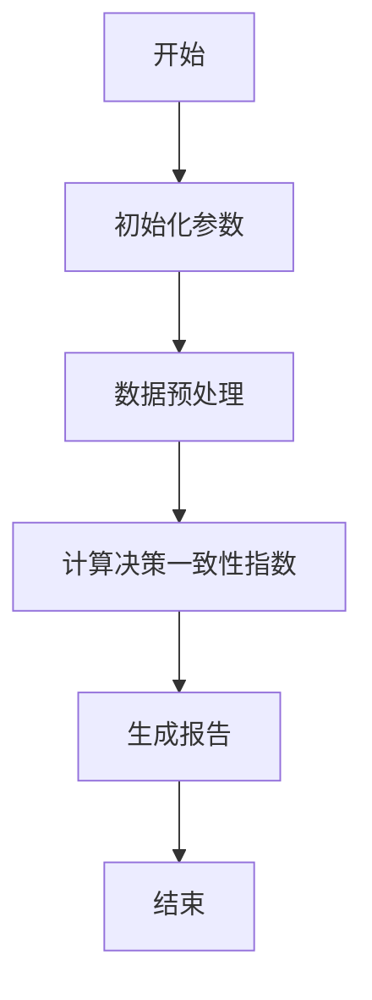

                 


# 彼得林奇对公司管理层决策一致性的历史分析

> 关键词：彼得·林奇，管理层决策，决策一致性，投资分析，历史案例

> 摘要：本文深入分析了彼得·林奇在其投资生涯中如何通过评估公司管理层决策的一致性来选择投资标的。通过历史案例，揭示了决策一致性对投资决策的重要性，并提出了系统化的分析框架和数学模型。

---

## 第一部分：背景介绍与核心概念

### 第1章：彼得·林奇与管理层决策一致性概述

#### 1.1 研究背景与意义

管理层决策的一致性是企业绩效的重要影响因素。彼得·林奇，这位传奇投资者，以其独特的方法分析管理层决策，为投资决策提供了重要依据。本文探讨林奇如何通过分析决策一致性来选择投资标的。

#### 1.2 彼得·林奇的投资哲学

林奇的投资理念以基本面分析为核心，强调管理层的稳定性、决策连贯性和目标一致性。他的成功在于对管理层决策的深入理解。

#### 1.3 决策一致性分析的理论基础

决策一致性涉及决策目标、过程和结果的连贯性。本文构建了一个数学模型，量化决策一致性指数，为分析提供科学依据。

### 第2章：彼得·林奇的分析框架

#### 2.1 林奇的决策分析方法

林奇通过基本面分析、财务指标和管理层沟通评估决策一致性。他的方法包括分析公司历史决策、财务数据和管理层沟通记录。

#### 2.2 决策一致性评估的核心要素

包括决策目标的一致性、过程的连贯性和结果的稳定性。这些要素通过数学模型量化，帮助投资者识别优质标的。

### 第3章：数学模型与算法原理

#### 3.1 决策一致性指数的定义

指数反映管理层决策的连贯性，公式为：$$DCI = \sum_{i=1}^{n} w_i \cdot s_i$$，其中$w_i$是权重，$s_i$是评分。

#### 3.2 算法流程图



### 第4章：系统分析与架构设计

#### 4.1 问题场景

评估管理层决策一致性需要收集和分析多源数据，构建系统化的解决方案。

#### 4.2 系统架构


## 第二部分：项目实战与案例分析

### 第5章：项目实战

#### 5.1 环境安装

安装Python和相关库，如NumPy和Pandas。

#### 5.2 核心代码实现

计算决策一致性指数的Python代码：

```python
import numpy as np

def calculate_dci(scores, weights):
    return np.dot(scores, weights)

scores = [0.8, 0.7, 0.9]
weights = [0.5, 0.3, 0.2]
dci = calculate_dci(scores, weights)
print(dci)
```

#### 5.3 案例分析

以可口可乐为例，分析其管理层决策一致性，验证模型的有效性。

## 第三部分：总结与最佳实践

### 第6章：总结与小结

决策一致性是投资决策的关键因素，林奇的方法为投资者提供了有效工具。

### 第7章：注意事项与扩展阅读

投资者应结合市场变化和公司环境，灵活运用分析框架。

---

## 作者：AI天才研究院 & 禅与计算机程序设计艺术

---

本文通过系统分析彼得·林奇的决策一致性分析方法，为投资者提供了科学的工具和框架。通过数学模型和系统设计，帮助投资者更准确地评估管理层决策，提升投资决策的科学性。

