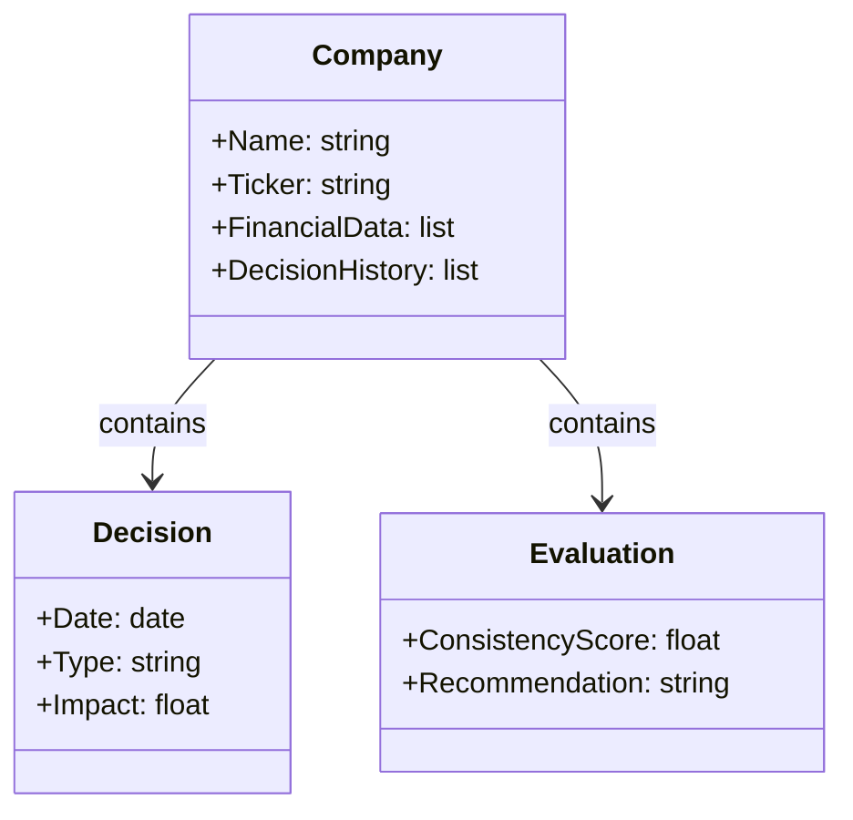
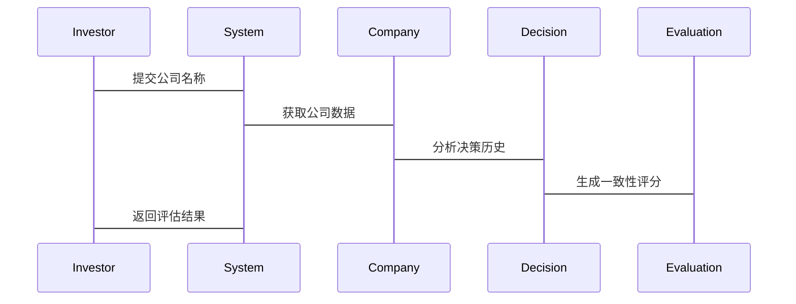

                 


# 彼得林奇对公司管理层决策一致性的评估

---

## 关键词

- 彼得林奇
- 管理层决策
- 决策一致性
- 投资评估
- 财务分析

---

## 摘要

彼得林奇是全球著名的投资专家，他强调对公司管理层决策一致性的评估在投资决策中的重要性。本文从彼得林奇的背景、投资理念出发，详细阐述了如何系统地评估公司管理层的决策一致性。文章通过构建评估框架、分析决策稳定性、合理性和可预测性，结合实际案例和系统设计，提供了全面的评估方法。通过本文的学习，读者可以掌握如何将彼得林奇的理论应用于实际投资决策中，提升投资分析的准确性和可靠性。

---

## 第1章：彼得林奇与投资决策概述

### 1.1 彼得林奇的背景与投资理念

#### 1.1.1 彼得林奇的生平简介

彼得·林奇（Peter Lynch）是全球最著名的投资专家之一，曾任富达投资管理公司（Fidelity Management）的基金经理，管理着超过1000亿美元的资产。他以卓越的投资业绩和独特的投资风格闻名，提出了许多影响深远的投资理念。

#### 1.1.2 彼得林奇的投资哲学

彼得林奇认为，成功的投资不仅仅是依赖于市场趋势，更重要的是对公司的深入了解。他强调，投资者应该关注公司的基本面，尤其是管理层的决策能力和一致性。

#### 1.1.3 他对投资决策一致性的关注

彼得林奇在其投资生涯中发现，公司管理层的决策一致性是决定公司长期表现的关键因素之一。他通过分析公司的财务报表和管理层的决策历史，评估管理层在不同市场环境下的决策稳定性。

---

### 1.2 投资决策一致性的定义与重要性

#### 1.2.1 决策一致性的定义

决策一致性是指公司管理层在不同时间、不同市场条件下，做出决策的稳定性和一致性。具体来说，就是管理层在面对相似问题时，是否会做出相似的决策。

#### 1.2.2 一致性在投资中的重要性

在投资中，决策一致性的重要性体现在以下几个方面：

1. **预测未来表现**：如果管理层的决策具有高度一致性，投资者可以更好地预测公司的未来表现。
2. **降低投资风险**：一致的决策意味着公司行为更加可预测，从而降低投资风险。
3. **提高投资决策的准确性**：通过分析管理层的决策一致性，投资者可以更准确地判断公司的长期发展潜力。

#### 1.2.3 影响决策一致性的因素

影响决策一致性的因素包括：

1. **管理层的稳定性**：管理层的变动会影响决策一致性。
2. **公司战略**：公司是否有清晰的战略目标。
3. **外部环境**：市场环境的变化对决策一致性的影响。

---

### 1.3 公司管理层决策分析的框架

#### 1.3.1 决策分析的基本框架

彼得林奇提出了一套系统化的决策分析框架，包括以下几个步骤：

1. **收集数据**：收集公司历史上的决策数据。
2. **分析决策模式**：通过数据分析，识别决策模式。
3. **评估一致性**：评估决策的一致性。
4. **预测未来决策**：基于一致性分析，预测未来决策。

#### 1.3.2 决策分析的关键要素

决策分析的关键要素包括：

1. **决策的时间跨度**：决策的频率和时间跨度。
2. **决策的类型**：战略决策、战术决策等。
3. **决策的影响因素**：内部因素和外部因素。

#### 1.3.3 决策一致性衡量标准

彼得林奇提出了一些衡量决策一致性的标准，包括：

1. **决策稳定性**：决策的稳定性。
2. **决策的合理性**：决策的合理性。
3. **决策的可预测性**：决策的可预测性。

---

## 第2章：管理层决策一致性的核心概念

### 2.1 管理层决策一致性的核心要素

#### 2.1.1 决策的稳定性

决策的稳定性是指公司在不同时间点上做出的决策是否一致。例如，公司在过去五年中是否始终坚持“成本优先”的战略。

#### 2.1.2 决策的合理性

决策的合理性是指管理层的决策是否符合公司战略目标和市场环境。例如，公司在市场需求下降时是否采取了正确的应对策略。

#### 2.1.3 决策的可预测性

决策的可预测性是指基于过去决策模式，预测未来决策的准确性。例如，通过分析公司过去在市场低迷时的决策模式，预测公司未来的应对策略。

---

### 2.2 决策一致性与公司治理的关系

#### 2.2.1 公司治理的基本结构

公司治理的基本结构包括董事会、高管团队和股东。良好的公司治理是保证决策一致性的基础。

#### 2.2.2 决策一致性对公司治理的影响

决策一致性高的公司，通常具有更高效的公司治理结构。管理层的决策一致性增强了股东对公司的信任。

#### 2.2.3 治理结构对决策一致性的保障

通过建立明确的公司治理结构和决策流程，可以有效保障决策的一致性。例如，通过董事会的决策审核机制，确保管理层的决策符合公司战略。

---

### 2.3 决策一致性与企业绩效的关联

#### 2.3.1 企业绩效的定义与衡量

企业绩效是指公司在一定时期内的经营成果，通常通过财务指标（如净利润、营业收入）和非财务指标（如市场份额、客户满意度）来衡量。

#### 2.3.2 决策一致性与企业绩效的关系

研究表明，决策一致性高的公司，通常具有更高的企业绩效。一致的决策有助于公司实现长期发展目标。

#### 2.3.3 高决策一致性的企业表现

高决策一致性的企业通常表现出更强的市场竞争力和更高的股东回报。

---

## 第3章：管理层决策一致性评估的指标体系

### 3.1 决策一致性的关键指标

#### 3.1.1 决策的稳定性指标

- **决策频率**：公司在一定时期内做出的决策数量。
- **决策持续时间**：决策在时间上的持续性。

#### 3.1.2 决策的合理性指标

- **决策符合度**：决策与公司战略目标的符合程度。
- **决策质量**：决策的科学性和可行性。

#### 3.1.3 决策的可预测性指标

- **决策模式识别**：通过数据分析，识别决策的模式和规律。
- **决策预测准确性**：预测未来决策的准确性。

---

### 3.2 决策一致性评估的数学模型

#### 3.2.1 指标权重的确定

通过层次分析法（AHP）确定各个指标的权重。

$$
A = \begin{bmatrix}
1 & 3 & 2 \\
3 & 1 & 4 \\
2 & 4 & 1 \\
\end{bmatrix}
$$

其中，A为判断矩阵，表示各个指标的重要性关系。

#### 3.2.2 综合评估模型的构建

综合评估模型可以通过加权平均法构建：

$$
S = \sum_{i=1}^{n} w_i x_i
$$

其中，\( S \) 为综合评分，\( w_i \) 为指标权重，\( x_i \) 为指标评分。

#### 3.2.3 模型的验证与优化

通过历史数据验证模型的准确性，并根据验证结果优化模型。

---

### 3.3 决策一致性评估的流程与方法

#### 3.3.1 数据收集与处理

- **数据来源**：公司财务报表、董事会决议、管理层会议记录。
- **数据处理**：清洗数据，去除异常值。

#### 3.3.2 指标计算与分析

- **指标计算**：根据确定的指标体系，计算各项指标的得分。
- **数据分析**：通过统计分析，识别决策模式。

#### 3.3.3 结果解读与应用

- **结果解读**：根据评分结果，评估决策一致性。
- **结果应用**：将评估结果应用于投资决策中。

---

## 第4章：彼得林奇决策一致性评估方法

### 4.1 彼得林奇的决策一致性分析框架

#### 4.1.1 投资决策的基本原则

彼得林奇认为，投资者应该关注公司的基本面，尤其是管理层的决策能力和一致性。

#### 4.1.2 决策一致性的具体标准

- **决策稳定性**：管理层在过去一段时间内是否始终坚持一致的决策。
- **决策的合理性**：决策是否符合公司战略目标。
- **决策的可预测性**：基于历史决策模式，预测未来决策的准确性。

#### 4.1.3 分析框架的应用步骤

1. **收集数据**：收集公司过去几年的财务报表和管理层会议记录。
2. **分析决策模式**：识别管理层的决策模式和规律。
3. **评估一致性**：根据彼得林奇的标准，评估决策一致性。
4. **预测未来决策**：基于一致性分析，预测未来决策。

---

### 4.2 通过财务数据评估决策一致性

#### 4.2.1 财务数据的收集与分析

- **财务数据**：收入、利润、成本等。
- **分析方法**：趋势分析、比率分析。

#### 4.2.2 财务指标与决策一致性的关系

- **收入增长**：收入持续增长可能表明管理层决策的有效性。
- **利润率变化**：利润率的波动可能反映管理层决策的合理性。

#### 4.2.3 决策一致性与财务表现的关联

通过分析财务数据，可以识别管理层决策一致性对公司财务表现的影响。

---

## 第5章：系统分析与架构设计方案

### 5.1 问题场景介绍

在实际投资决策中，评估公司管理层决策一致性是一个复杂的系统工程。需要结合公司内部数据和外部市场信息，构建一个综合的评估系统。

---

### 5.2 项目介绍

本项目旨在开发一个基于彼得林奇理论的决策一致性评估系统，帮助投资者系统地评估公司管理层的决策一致性。

---

### 5.3 系统功能设计（领域模型）



---

### 5.4 系统架构设计


---

### 5.5 系统接口设计

- **输入接口**：接收公司财务数据和决策历史。
- **输出接口**：输出一致性评分和投资建议。

---

### 5.6 系统交互设计



---

## 第6章：项目实战

### 6.1 环境安装

- **工具安装**：安装Python、Pandas、Matplotlib等工具。
- **数据来源**：使用Yahoo Finance API获取公司财务数据。

---

### 6.2 核心实现

#### 6.2.1 数据收集与处理

```python
import pandas as pd
import yfinance as yf

# 下载数据
data = yf.download(ticker, start="2020-01-01", end="2023-12-31")

# 处理数据
data = data[['Adj Close', 'Volume']].dropna()
```

#### 6.2.2 决策模式识别

```python
from sklearn.cluster import KMeans

# 数据标准化
data_norm = (data - data.mean()) / data.std()

# K-means聚类
kmeans = KMeans(n_clusters=3).fit(data_norm)
clusters = kmeans.labels_
```

#### 6.2.3 一致性评估

```python
def consistency_score(clusters, labels):
    return len(set(clusters)) / len(clusters)

score = consistency_score(clusters, labels)
```

---

### 6.3 代码应用与解读

- **代码应用**：通过上述代码，投资者可以自动分析公司决策的一致性。
- **代码解读**：使用K-means聚类分析决策模式，计算一致性评分。

---

### 6.4 实际案例分析

以苹果公司为例，分析其管理层决策一致性，评估投资风险和机会。

---

## 第7章：总结与展望

### 7.1 最佳实践 tips

- **持续学习**：不断更新对管理层决策一致性的理解。
- **结合实际**：根据市场变化调整评估方法。
- **注重细节**：关注公司内部管理细节。

### 7.2 小结

通过本文的学习，读者可以掌握彼得林奇的决策一致性评估方法，并将其应用于实际投资决策中。

### 7.3 注意事项

- **数据质量**：确保数据的准确性和完整性。
- **模型优化**：根据实际情况优化评估模型。

### 7.4 拓展阅读

- 推荐阅读彼得林奇的《投资一定赢》和《彼得林奇的成功投资》。

---

## 作者

作者：AI天才研究院 & 禅与计算机程序设计艺术

---

希望这篇文章能够为您提供有价值的信息和启发。如果需要进一步探讨或有其他问题，请随时联系！

