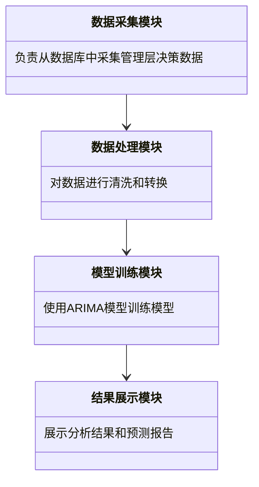

                 


# 彼得林奇对公司管理层决策一致性的跨周期分析

## 关键词：彼得林奇，管理层决策，决策一致性，跨周期分析，时间序列分析

## 摘要

本文通过分析彼得·林奇对公司管理层决策一致性的跨周期分析，探讨了决策一致性在公司长期发展中的重要性。文章首先介绍了彼得林奇的投资理念和决策一致性的定义，接着详细讨论了跨周期分析的方法和工具，包括时间序列分析和趋势分析等。通过具体的数学模型和算法流程图，文章进一步解释了如何利用这些工具进行决策一致性的评估。最后，结合实际案例，文章展示了跨周期分析在投资决策中的实际应用，并总结了最佳实践和注意事项，为投资者提供了实用的指导。

---

# 正文

## 第一部分：背景介绍

### 第1章：彼得林奇与决策一致性概述

#### 1.1 彼得林奇的背景与投资理念

彼得·林奇（Peter Lynch）是全球著名的投资专家，曾任富达投资集团麦哲伦基金的经理。他的投资理念强调对公司基本面的深入研究和长期关注，尤其是对公司管理层决策的分析。林奇认为，管理层的决策一致性是评估公司长期价值的重要指标。

#### 1.2 管理层决策的重要性

管理层的决策直接影响公司的战略方向、运营效率和财务表现。决策一致性是指管理层在不同时间段内做出的决策是否一致，这种一致性反映了管理层的稳定性和可预测性。稳定的决策有助于公司长期发展和股价的稳定性。

#### 1.3 跨周期分析的意义

跨周期分析是指在较长的时间范围内，分析管理层决策的变化趋势和一致性。通过跨周期分析，投资者可以更好地理解管理层在不同市场环境下的决策模式，从而做出更明智的投资决策。

---

## 第二部分：决策一致性核心概念

### 第2章：决策一致性的核心要素

#### 2.1 决策一致性的定义与特征

决策一致性是指管理层在不同时间点上做出的决策在目标、方向和执行上的一致性。其主要特征包括稳定性、可预测性和持续性。稳定性指决策在一段时间内保持不变；可预测性指决策模式易于被投资者理解和预测；持续性指决策在长期内保持一致。

#### 2.2 决策一致性与公司治理

公司治理结构对决策一致性起着关键作用。有效的治理结构能够确保管理层在决策过程中保持一致，并对外部环境的变化做出适当调整。决策一致性与公司治理的互动关系体现在治理结构对管理层决策的影响上。

#### 2.3 决策一致性与公司战略

决策一致性与公司战略密切相关。一致的决策有助于公司战略的稳定实施，而频繁变化的决策可能导致战略目标的偏离。通过分析管理层决策的一致性，投资者可以更好地评估公司的战略执行能力。

---

## 第三部分：跨周期分析方法

### 第3章：跨周期分析的理论基础

#### 3.1 跨周期分析的定义与步骤

跨周期分析是通过对公司管理层决策在不同时间段的表现进行分析，评估其一致性和稳定性。其基本步骤包括数据收集、模型构建、分析与验证。

#### 3.2 跨周期分析的关键工具与技术

常用的工具和技术包括时间序列分析、趋势分析和周期性分析。时间序列分析用于识别数据中的趋势和周期性；趋势分析用于预测未来趋势；周期性分析用于识别数据中的周期性变化。

#### 3.3 跨周期分析的数学模型

时间序列分析模型是跨周期分析的重要工具。ARIMA（自回归积分滑动平均）模型是一种常用的时间序列模型，其公式如下：

$$ ARIMA(p, d, q) $$

其中，p为自回归阶数，d为差分阶数，q为滑动平均阶数。通过调整这些参数，可以更好地拟合数据并进行预测。

---

## 第四部分：算法原理与实现

### 第4章：算法原理与实现

#### 4.1 算法原理

跨周期分析的算法流程如下：

1. 数据预处理：收集和整理管理层决策的历史数据。
2. 模型选择：选择合适的时间序列模型（如ARIMA）。
3. 模型训练：使用历史数据训练模型。
4. 模型验证：通过回测和交叉验证评估模型的准确性。
5. 预测与分析：利用模型预测未来的决策一致性。

#### 4.2 算法实现

以下是使用Python实现ARIMA模型的代码示例：

```python
from statsmodels.tsa.arima_model import ARIMA
import pandas as pd

# 加载数据
data = pd.read_csv('management_decision.csv')

# 拆分数据集
train_data = data['value'][:80]
test_data = data['value'][80:]

# 模型训练
model = ARIMA(train_data, order=(1, 1, 1))
model_fit = model.fit()

# 预测
forecast = model_fit.forecast(steps=len(test_data))
```

#### 4.3 数学模型

ARIMA模型的数学公式如下：

$$ y_t = \phi_1 y_{t-1} + \theta_1 \epsilon_{t-1} + \epsilon_t $$

其中，$\phi_1$为自回归系数，$\theta_1$为滑动平均系数，$\epsilon_t$为白噪声。

---

## 第五部分：系统分析与架构设计

### 第5章：系统分析与架构设计

#### 5.1 问题场景介绍

本文构建了一个分析管理层决策一致性的系统，该系统能够对历史数据进行分析，并预测未来的决策趋势。

#### 5.2 系统功能设计

系统功能设计包括数据采集、数据处理、模型训练和结果展示。系统架构设计如下：



#### 5.3 系统架构设计

系统架构采用分层设计，包括数据层、业务逻辑层和表现层。系统架构图如下：


---

## 第六部分：项目实战

### 第6章：项目实战

#### 6.1 环境安装

需要安装以下工具和库：

- Python 3.8及以上版本
- Pandas、NumPy、statsmodels库

安装命令：

```bash
pip install pandas numpy statsmodels
```

#### 6.2 核心代码实现

以下是核心代码示例：

```python
import pandas as pd
from statsmodels.tsa.arima_model import ARIMA
import matplotlib.pyplot as plt

# 加载数据
data = pd.read_csv('management_decision.csv')

# 绘制时间序列图
plt.figure(figsize=(10, 6))
plt.plot(data['date'], data['value'])
plt.title('管理层决策时间序列图')
plt.xlabel('时间')
plt.ylabel('决策值')
plt.show()

# 模型训练
model = ARIMA(data['value'], order=(1, 1, 1))
model_fit = model.fit()

# 预测
forecast = model_fit.forecast(steps=12)
print('预测结果:', forecast)
```

#### 6.3 代码解读与分析

代码首先加载数据并绘制时间序列图，帮助识别数据中的趋势和周期性。然后，使用ARIMA模型进行训练，并对未来12期进行预测。预测结果展示了管理层决策的一致性。

#### 6.4 实际案例分析

以某公司为例，分析其管理层决策的一致性。通过ARIMA模型预测未来决策趋势，评估公司的长期投资价值。

#### 6.5 项目小结

项目展示了如何利用跨周期分析评估管理层决策一致性，为投资者提供了实用的工具和方法。

---

## 第七部分：最佳实践

### 第7章：最佳实践

#### 7.1 小结

跨周期分析是评估管理层决策一致性的重要工具，能够帮助投资者做出更明智的投资决策。

#### 7.2 注意事项

- 数据质量是分析的基础，需确保数据的准确性和完整性。
- 模型选择需根据具体场景调整参数。
- 结果分析需结合实际情况，避免过度依赖模型预测。

#### 7.3 拓展阅读

建议阅读彼得·林奇的《投资漫步华尔街》以及相关的时间序列分析书籍，深入了解跨周期分析的理论和应用。

---

# 总结

本文通过分析彼得·林奇对公司管理层决策一致性的跨周期分析，详细探讨了决策一致性的重要性及其评估方法。通过具体的数学模型和算法流程图，文章展示了如何利用时间序列分析工具进行跨周期分析，并结合实际案例进行了详细解读。最后，文章总结了最佳实践和注意事项，为投资者提供了实用的指导。

---

# 作者

作者：AI天才研究院 & 禅与计算机程序设计艺术

