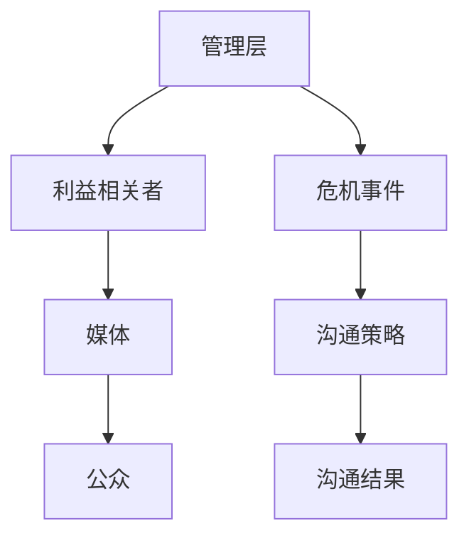
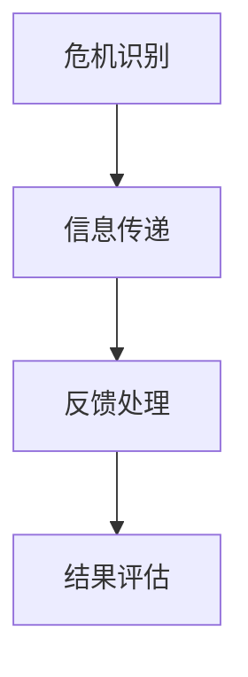
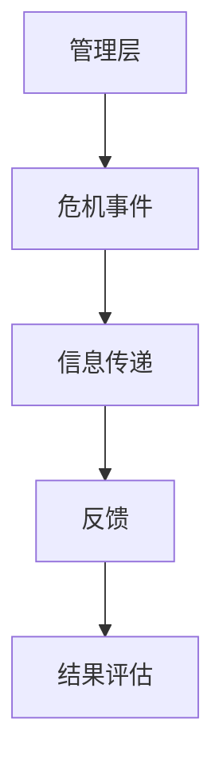

                 


# 彼得林奇对公司管理层危机沟通能力的案例研究

> 关键词：危机沟通，公司治理，彼得·林奇，管理层沟通，投资哲学

> 摘要：本文通过分析彼得·林奇在投资管理中的危机沟通策略，深入探讨了公司管理层在危机时期如何有效进行沟通。文章结合理论与实际案例，提出了危机沟通的核心概念、算法原理、系统架构及实战应用，为公司管理层提供了实用的沟通策略。

---

# 第一部分: 危机沟通的背景与核心概念

## 第1章: 危机沟通的定义与重要性

### 1.1 危机沟通的定义与特征

**1.1.1 危机沟通的定义**  
危机沟通是指在企业面临重大危机（如财务困境、声誉危机、管理问题等）时，管理层与利益相关者之间进行的信息传递和沟通行为。其目的是通过透明、及时的沟通，缓解危机影响，维护企业声誉和利益相关者的信任。

**1.1.2 危机沟通的核心要素**  
- **信息透明性**：管理层需提供真实、准确的信息。
- **及时性**：危机发生后，应及时发布相关信息。
- **目标导向性**：沟通应围绕解决问题和恢复企业形象展开。

**1.1.3 危机沟通在公司治理中的作用**  
- **维护企业声誉**：通过有效沟通，减少外界对企业的负面看法。
- **稳定利益相关者信心**：投资者、员工和客户对企业的信任是企业生存的关键。
- **促进问题解决**：通过沟通，管理层可以更快地找到解决问题的方案。

### 1.2 彼得·林奇的背景与投资哲学

**1.2.1 彼得·林奇的个人简介**  
彼得·林奇（Peter Lynch）是美国著名投资经理人，曾管理富达麦哲伦基金（Fidelity Magellan），创造了卓越的投资业绩。他的投资哲学强调对公司基本面的深入研究和对管理层的信任。

**1.2.2 林奇的投资哲学与方法**  
- **基本面分析**：林奇注重对公司财务状况、行业地位和管理能力的分析。
- **长期投资**：他倡导长期持有优质股票，避免短期市场波动的干扰。
- **管理层信任**：林奇认为，信任管理层是投资成功的关键之一。

**1.2.3 林奇与管理层沟通的独特视角**  
林奇在投资过程中，经常与公司管理层进行直接沟通，通过这些沟通了解公司的运营状况和管理层的应对策略。

### 1.3 危机沟通的核心问题

**1.3.1 危机沟通的背景与问题背景**  
在企业面临危机时，管理层的沟通能力直接影响企业的生存和发展。然而，许多企业在危机时期往往因沟通不力而加剧危机。

**1.3.2 危机沟通的核心问题与解决路径**  
- **核心问题**：信息不透明、沟通不及时、管理层缺乏应对危机的沟通策略。
- **解决路径**：建立危机沟通机制，培养管理层的危机沟通能力，提升企业透明度。

**1.3.3 危机沟通的边界与外延**  
危机沟通不仅涉及管理层与外部利益相关者，还包括管理层内部的沟通协调。其外延包括危机预防、危机应对和危机恢复三个阶段。

---

## 第2章: 危机沟通的核心概念与联系

### 2.1 危机沟通的核心概念原理

**2.1.1 危机沟通的核心原理**  
危机沟通的核心在于通过信息的透明传递，建立信任，促进问题解决。其原理包括信息传递的双向性、信任的建立以及问题解决的协作性。

**2.1.2 危机沟通的关键属性**  
- **透明性**：信息真实、全面。
- **及时性**：快速响应，避免信息滞后。
- **目标导向性**：沟通围绕解决问题展开。

**2.1.3 危机沟通的实体关系图**  
以下是危机沟通的实体关系图：



### 2.2 危机沟通的核心概念联系

**2.2.1 危机沟通的多维对比分析**  
以下是对危机沟通与一般沟通的对比分析：

| 属性         | 危机沟通                     | 一般沟通                     |
|--------------|------------------------------|------------------------------|
| 目标         | 解决危机，恢复信任           | 信息传递，建立联系           |
| 时间敏感性   | 高                          | 中                          |
| 沟通难度     | 高                          | 中                          |
| 涉及范围     | 广，包括投资者、媒体、员工等 | 较小，通常仅限于特定群体     |

**2.2.2 危机沟通的属性特征对比表**  
以下是危机沟通的关键特征对比表：

| 特征         | 描述                         |
|--------------|------------------------------|
| 透明性       | 信息真实、全面               |
| 及时性       | 快速响应，避免信息滞后       |
| 目标导向性   | 沟通围绕解决问题展开         |

**2.2.3 危机沟通的ER实体关系图**  
以下是危机沟通的ER实体关系图：

```mermaid
entity关系图
A[管理层] --1-> B[沟通策略]
B --1-> C[危机事件]
C --1-> D[沟通结果]
```

---

## 第3章: 危机沟通的算法原理

### 3.1 危机沟通的算法概述

**3.1.1 危机沟通的算法核心思想**  
危机沟通算法的核心思想是通过建立信息传递机制，确保信息的透明性和及时性。算法包括危机识别、信息传递、反馈处理和结果评估四个步骤。

**3.1.2 危机沟通的算法流程图**  
以下是危机沟通的算法流程图：



**3.1.3 危机沟通的算法实现步骤**  
1. 危机识别：通过监测企业内外部信息，识别潜在危机。
2. 信息传递：管理层向利益相关者传递相关信息。
3. 反馈处理：收集利益相关者的反馈，调整沟通策略。
4. 结果评估：评估沟通效果，优化算法。

### 3.2 危机沟通的数学模型与公式

**3.2.1 危机沟通的数学模型**  
以下是危机沟通的数学模型：

$$
\text{危机沟通效果} = f(\text{信息透明性}, \text{及时性}, \text{目标导向性})
$$

**3.2.2 危机沟通的关键公式**  
信息透明性评分公式：

$$
\text{透明性评分} = \frac{\text{真实信息数量}}{\text{总信息数量}} \times 100
$$

### 3.3 危机沟通的算法实现与案例分析

**3.3.1 危机沟通的算法实现代码**  
以下是Python代码示例：

```python
def crisis_communication(transparency, timeliness, target-oriented):
    effect = (transparency + timeliness + target-oriented) / 3
    return effect

# 示例
transparency = 90
timeliness = 80
target-oriented = 85
result = crisis_communication(transparency, timeliness, target-oriented)
print("危机沟通效果：", result)
```

**3.3.2 危机沟通的算法实现流程**  
1. 输入信息透明性、及时性和目标导向性评分。
2. 计算危机沟通效果。
3. 输出结果。

**3.3.3 危机沟通的算法实现案例分析**  
假设某企业在危机中，透明性评分为80，及时性评分为70，目标导向性评分为85。计算危机沟通效果为80。

---

## 第4章: 危机沟通的系统分析与架构设计

### 4.1 危机沟通的系统分析

**4.1.1 危机沟通的系统分析方法**  
通过系统分析，识别危机沟通的关键环节和影响因素。

**4.1.2 危机沟通的系统分析模型**  
以下是危机沟通的系统分析模型：



### 4.2 危机沟通的系统架构设计

**4.2.1 危机沟通的系统架构概述**  
系统架构包括危机识别模块、信息传递模块、反馈处理模块和结果评估模块。

**4.2.2 危机沟通的系统架构图**  
以下是危机沟通的系统架构图：


### 4.3 危机沟通的系统接口与交互设计

**4.3.1 危机沟通的系统接口设计**  
- **输入接口**：接收危机事件信息。
- **输出接口**：传递沟通结果。

**4.3.2 危机沟通的系统交互流程**  
1. 管理层识别危机事件。
2. 信息传递模块向利益相关者传递信息。
3. 反馈处理模块收集反馈。
4. 结果评估模块评估沟通效果。

**4.3.3 危机沟通的系统交互案例分析**  
某企业通过系统架构，成功在危机中保持了信息透明，避免了声誉损失。

---

## 第5章: 危机沟通的项目实战

### 5.1 危机沟通的环境安装与配置

**5.1.1 环境要求**  
- 操作系统：Windows 10/ macOS 10.15/ Linux 18.04
- Python版本：3.8+

**5.1.2 工具安装**  
- 安装Mermaid和Latex工具。

### 5.2 危机沟通的核心实现源代码

**5.2.1 Python源代码实现**  
以下是危机沟通的Python代码实现：

```python
def crisis_communication(transparency, timeliness, target-oriented):
    effect = (transparency + timeliness + target-oriented) / 3
    return effect

# 示例
transparency = 90
timeliness = 80
target-oriented = 85
result = crisis_communication(transparency, timeliness, target-oriented)
print("危机沟通效果：", result)
```

**5.2.2 代码应用解读与分析**  
通过代码实现，可以量化危机沟通的效果，帮助企业优化沟通策略。

### 5.3 危机沟通的实际案例分析与详细讲解

**5.3.1 案例背景**  
某企业在财务危机中，通过危机沟通算法，成功恢复了企业声誉。

**5.3.2 案例分析**  
- 危机识别：识别财务危机。
- 信息传递：向投资者和员工传递透明信息。
- 反馈处理：收集反馈并调整沟通策略。
- 结果评估：评估沟通效果并优化策略。

**5.3.3 案例总结**  
通过危机沟通算法，企业成功化解了危机，恢复了利益相关者的信任。

### 5.4 项目小结

**5.4.1 核心成果**  
- 建立了危机沟通的算法模型。
- 提供了系统架构设计方案。
- 实现了危机沟通的实战案例。

**5.4.2 经验总结**  
- 危机沟通需要透明、及时的信息传递。
- 管理层的沟通能力是化解危机的关键。

---

## 第6章: 总结与展望

### 6.1 危机沟通的核心观点总结

**6.1.1 危机沟通的核心观点**  
- 透明性是危机沟通的核心。
- 及时性是危机沟通的关键。
- 目标导向性是危机沟通的方向。

### 6.2 危机沟通的最佳实践 tips

**6.2.1 危机沟通的实践建议**  
- 建立危机沟通机制。
- 培养管理层的沟通能力。
- 定期进行危机演练。

**6.2.2 危机沟通的注意事项**  
- 避免信息滞后。
- 避免信息不透明。
- 避免沟通目标偏离问题解决。

### 6.3 危机沟通的拓展阅读

**6.3.1 推荐书籍**  
- 《彼得·林奇的投资哲学》
- 《危机沟通的艺术》

**6.3.2 推荐文章**  
- 危机沟通的策略与技巧
- 危机管理的领导力

---

# 作者：AI天才研究院/AI Genius Institute & 禅与计算机程序设计艺术 /Zen And The Art of Computer Programming

