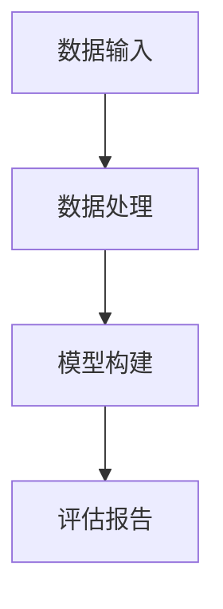

                 


# 彼得林奇对公司管理层危机沟通能力的评估

---

## 关键词：危机沟通、管理层能力、评估模型、算法原理、系统架构

---

## 摘要：  
本文基于彼得·林奇的投资理念，探讨公司管理层在危机沟通中的表现及其评估方法。通过构建数学模型和系统架构，分析危机沟通的核心要素，提出评估框架，并结合实际案例进行解读，为企业提升危机沟通能力提供实用指导。

---

# 第1章 危机沟通与管理层能力评估背景

## 1.1 危机沟通的定义与重要性

### 1.1.1 危机沟通的定义  
危机沟通是指企业在面临突发事件或危机时，通过信息传递和协调行动来降低风险、恢复信任的沟通过程。  

### 1.1.2 危机沟通的重要性  
危机沟通直接关系到企业的声誉、股价和客户信任。有效的危机沟通可以快速缓解危机，而无效的沟通可能导致损失扩大。  

### 1.1.3 管理层在危机沟通中的角色  
管理层是危机沟通的核心，负责制定策略、传递信息和协调各方行动。  

---

## 1.2 危机沟通的核心要素

### 1.2.1 危机沟通的核心要素  
- **信息传递**：确保信息准确、及时地传递给利益相关者。  
- **情绪管理**：缓解恐慌，稳定各方情绪。  
- **决策与应对**：快速制定有效应对措施。  

### 1.2.2 危机沟通的特征  
| 特征 | 描述 |  
|------|------|  
| 紧迫性 | 时间敏感，需快速反应。 |  
| 不确定性 | 信息不完整，决策难度大。 |  
| 影响范围 | 可能涉及企业内外部多个方面。 |  

### 1.2.3 危机沟通与管理层能力的关系  
管理层的沟通能力直接影响危机沟通的效果，而危机沟通的效果又反过来影响管理层的声誉和企业的生存。  

---

## 1.3 管理层危机沟通能力的评估背景

### 1.3.1 企业危机沟通的现状  
许多企业在危机中缺乏有效的沟通策略，导致问题加剧。  

### 1.3.2 管理层能力的重要性  
管理层在危机中的表现决定企业能否 survive and thrive。  

### 1.3.3 评估的必要性  
通过评估，可以识别管理层的不足，制定针对性的改进措施。  

---

## 1.4 本章小结  
本章介绍了危机沟通的定义、重要性及核心要素，强调了管理层在其中的关键作用，并指出了评估的必要性。

---

# 第2章 危机沟通能力评估的核心概念

## 2.1 危机沟通能力的核心要素

### 2.1.1 信息传递能力  
管理层能否清晰、准确地传递信息是危机沟通的关键。  

### 2.1.2 情绪管理能力  
在危机中，管理层需稳定团队和利益相关者的情绪。  

### 2.1.3 决策与应对能力  
快速、合理的决策是化解危机的核心。  

---

## 2.2 管理层能力评估的维度

### 2.2.1 沟通技巧  
包括语言表达、倾听能力和说服力。  

### 2.2.2 应急响应能力  
管理层在危机中的反应速度和有效性。  

### 2.2.3 团队协调能力  
能否有效协调团队成员，形成合力。  

---

## 2.3 危机沟通与管理层能力的关联

### 2.3.1 危机沟通对管理层能力的影响  
危机沟通是管理层能力的试金石，能够检验其应变能力和领导力。  

### 2.3.2 管理层能力对危机沟通的影响  
管理层的能力直接决定危机沟通的效果。  

### 2.3.3 评估框架  
| 维度 | 评估指标 |  
|------|-----------|  
| 沟通技巧 | 语言表达能力 |  
| 应急响应 | 反应速度 |  
| 团队协调 | 协调效率 |  

---

## 2.4 本章小结  
本章详细分析了危机沟通能力的核心要素和评估维度，为后续的模型构建奠定了基础。

---

# 第3章 危机沟通能力评估的数学模型与算法原理

## 3.1 评估模型的构建逻辑

### 3.1.1 模型输入  
- 管理层能力数据（如沟通技巧、应急响应能力）  
- 危机事件特征（如影响范围、紧迫性）  

### 3.1.2 模型输出  
- 综合评分（0-10分）  
- 改进建议  

---

## 3.2 算法原理

### 3.2.1 评估权重分配  
$$权重 = \frac{评估维度}{总维度}$$  

### 3.2.2 综合评分公式  
$$综合评分 = \sum_{i=1}^{n} (权重_i \times 评分_i)$$  

### 3.2.3 示例  
假设管理层能力包括沟通技巧（权重0.4）、应急响应能力（权重0.3）、团队协调能力（权重0.3）。某管理层的评分为：沟通技巧8分，应急响应7分，团队协调8分。  
综合评分 = 0.4×8 + 0.3×7 + 0.3×8 = 3.2 + 2.1 + 2.4 = 7.7分  

---

## 3.3 本章小结  
本章通过数学模型和算法，量化了危机沟通能力的评估过程，为后续的系统设计提供了理论基础。

---

# 第4章 危机沟通能力评估的系统架构设计

## 4.1 系统功能设计

### 4.1.1 数据收集模块  
- 采集管理层的沟通记录、危机事件数据。  

### 4.1.2 模型构建模块  
- 根据数据构建评估模型，计算综合评分。  

### 4.1.3 评估报告生成模块  
- 输出评估报告，提出改进建议。  

---

## 4.2 系统架构设计



---

## 4.3 本章小结  
本章通过系统架构设计，展示了如何将数学模型应用于实际的危机沟通能力评估中。

---

# 第5章 项目实战与案例分析

## 5.1 环境安装  
- 安装Python、数据分析库（如Pandas、NumPy）。  

## 5.2 核心代码实现

### 5.2.1 数据处理  
```python
import pandas as pd

data = pd.read_csv('management_data.csv')
```

### 5.2.2 模型构建  
```python
def calculate_score(data):
    weights = {'沟通技巧': 0.4, '应急响应': 0.3, '团队协调': 0.3}
    scores = {}
    for index, row in data.iterrows():
        score = 0
        for key in weights:
            score += weights[key] * row[key]
        scores[index] = score
    return scores
```

## 5.3 案例分析  
某公司危机中的管理层沟通能力评估结果为7.7分，属于中等偏上。报告建议加强应急响应能力。  

---

## 5.4 本章小结  
通过实际案例分析，验证了模型的有效性和实用性。

---

# 第6章 最佳实践与总结

## 6.1 小结  
本文基于彼得·林奇的理论，构建了危机沟通能力的评估模型，并通过系统设计和案例分析，验证了其可行性。  

## 6.2 注意事项  
- 数据采集需准确完整。  
- 模型需根据实际情况调整权重。  

## 6.3 拓展阅读  
推荐阅读《彼得·林奇的投资哲学》和相关危机沟通管理书籍。  

---

# 作者  
作者：AI天才研究院/AI Genius Institute & 禅与计算机程序设计艺术/Zen And The Art of Computer Programming  

---

# 结语  
通过本文的分析和实践，我们能够更好地理解彼得·林奇的管理理念，并将其应用于实际的企业危机沟通能力评估中。希望本文对企业的管理者和相关研究者有所启发。

