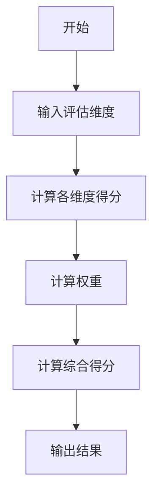
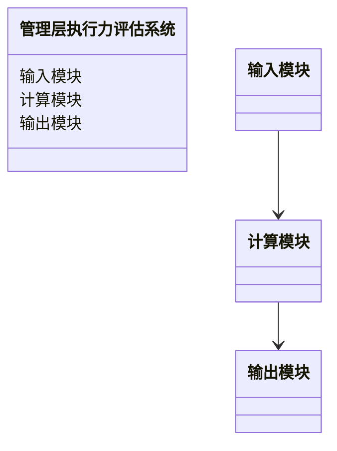
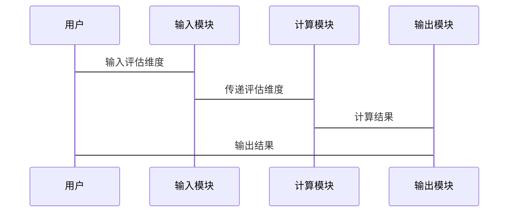

                 


# 彼得林奇对公司管理层执行力的评估

## 关键词：彼得·林奇、管理层执行力、评估方法、投资策略、企业绩效、投资分析

## 摘要：本文从投资专家彼得·林奇的视角，深入分析了如何评估公司管理层的执行力。通过详细阐述管理层执行力的核心维度、评估模型、算法原理以及系统架构设计，结合实际案例分析，为投资者和企业管理者提供了实用的评估方法和工具。文章结合理论与实践，提出了具体的数学模型和算法实现，帮助读者全面理解并应用彼得·林奇的管理评估方法。

---

## 第一部分: 管理层执行力评估的背景与核心概念

### 第1章: 管理层执行力评估的背景与重要性

#### 1.1 什么是管理层执行力
##### 1.1.1 管理层执行力的定义
管理层执行力是指公司高层管理者在实现公司战略目标、达成经营计划和应对市场挑战的过程中，通过有效决策、资源配置和团队协作，将战略转化为具体行动的能力。它涵盖了决策能力、组织协调能力、问题解决能力和沟通能力等多个方面。

##### 1.1.2 执行力的核心要素
- **战略执行能力**：管理层能否将战略目标分解为可操作的任务，并确保这些任务得到有效执行。
- **组织协调能力**：管理层能否合理分配资源、协调各部门之间的合作，确保公司运营高效有序。
- **问题解决能力**：管理层在面对突发问题或挑战时，能否迅速做出正确决策并采取有效措施。
- **沟通与决策能力**：管理层能否与董事会、股东、员工和其他利益相关者保持有效沟通，并基于信息做出明智的决策。

##### 1.1.3 执行力与企业绩效的关系
管理层执行力是企业绩效的核心驱动力。高效的执行力能够确保公司战略的有效实施，提高市场竞争力，增强企业的抗风险能力。相反，执行力的缺失可能导致战略流产、资源浪费和绩效不佳。

#### 1.2 彼得·林奇的管理风格与投资理念
##### 1.2.1 彼得·林奇的投资者身份
彼得·林奇是全球著名的职业基金经理人，曾任富达麦哲伦基金的经理，创造了卓越的投资业绩。他以深入研究公司基本面、分析管理层能力而闻名。林奇认为，投资成功的关键在于选择那些管理层优秀、执行力强的公司。

##### 1.2.2 林奇对管理层执行力的关注点
林奇在选股时特别关注管理层的执行力，他认为一个优秀的管理层应该具备以下几个特点：
1. **明确的战略目标**：管理层能够清晰地制定公司未来的发展方向，并将其传达给全体员工。
2. **高效的执行能力**：管理层能够将战略目标分解为具体的行动计划，并确保这些计划得到有效执行。
3. **适应变化的能力**：在面对市场变化和竞争压力时，管理层能够迅速调整策略，并带领公司走出困境。
4. **透明的沟通**：管理层能够与股东、投资者和其他利益相关者保持透明的沟通，及时传递公司信息。

##### 1.2.3 林奇的选股标准与管理层评估
林奇的选股标准与他对管理层执行力的评估密切相关。他认为，一家公司的价值不仅取决于其财务数据，还取决于其管理层的能力和执行力。因此，在评估公司时，他会重点关注以下几个方面：
- 公司的盈利能力是否稳定且可预测。
- 管理层是否有能力应对潜在的风险和挑战。
- 公司的管理团队是否具有长期稳定性和合作性。
- 公司的财务数据是否真实可靠，并能够反映管理层的执行力。

#### 1.3 为什么评估管理层执行力至关重要
##### 1.3.1 执行力对企业价值的影响
管理层执行力是公司价值的核心决定因素。一个执行力强的管理层能够带领公司实现持续增长，创造股东价值，而执行力差的管理层可能导致公司绩效不佳，甚至陷入危机。

##### 1.3.2 执行力与企业成长的关系
执行力强的管理层能够推动公司战略的有效实施，确保公司在竞争激烈的市场中保持领先地位。同时，优秀的执行力还能够吸引和留住优秀人才，提升公司的整体竞争力。

##### 1.3.3 投资者视角下的管理层评估
从投资者的角度来看，评估管理层的执行力是判断公司投资价值的重要依据。一个优秀的管理层不仅能够提升公司业绩，还能够为投资者创造超额收益。

---

## 第2章: 管理层执行力评估的核心维度

#### 2.1 管理层执行力的关键维度
##### 2.1.1 战略执行能力
战略执行能力是管理层执行力的核心维度之一。它包括以下几个方面：
- **战略目标的清晰性**：管理层是否能够明确公司的发展方向，并制定切实可行的战略计划。
- **战略分解能力**：管理层是否能够将战略目标分解为具体的行动计划，并确保这些计划的有效执行。
- **战略调整能力**：在面对市场变化和竞争压力时，管理层是否能够迅速调整战略，并带领公司走出困境。

##### 2.1.2 组织协调能力
组织协调能力是管理层执行力的重要维度，它包括以下几个方面：
- **资源配置能力**：管理层是否能够合理分配公司资源，确保各项任务的顺利进行。
- **部门协作能力**：管理层是否能够协调各部门之间的合作，确保公司运营高效有序。
- **团队建设能力**：管理层是否能够建立一支高效、协作的管理团队。

##### 2.1.3 问题解决能力
问题解决能力是管理层执行力的关键维度，它包括以下几个方面：
- **问题识别能力**：管理层是否能够及时发现公司运营中的问题，并采取有效措施加以解决。
- **决策能力**：在面对问题时，管理层是否能够迅速做出正确决策，并采取有效措施解决问题。
- **危机处理能力**：在面对重大危机或突发事件时，管理层是否能够迅速采取行动，最大限度地减少损失。

##### 2.1.4 沟通与决策能力
沟通与决策能力是管理层执行力的重要维度，它包括以下几个方面：
- **沟通能力**：管理层是否能够与董事会、股东、员工和其他利益相关者保持透明的沟通，并及时传递公司信息。
- **决策能力**：管理层是否能够基于全面的信息和深入的分析，做出明智的决策。
- **决策透明性**：管理层的决策过程是否透明，是否能够得到公司内部和外部利益相关者的认可。

#### 2.2 彼得·林奇的评估标准
##### 2.2.1 林奇对管理层的首要要求
林奇在评估管理层时，首要关注的是管理层的战略目标和执行能力。他认为，一个优秀的管理层应该有明确的战略目标，并能够将其转化为具体的行动计划。

##### 2.2.2 林奇对管理层决策的判断标准
林奇在评估管理层的决策能力时，关注以下几个方面：
- **决策的正确性**：管理层的决策是否符合公司的战略目标，并能够为公司创造价值。
- **决策的及时性**：在面对问题时，管理层是否能够迅速做出决策，并采取有效措施解决问题。
- **决策的透明性**：管理层的决策过程是否透明，并能够得到公司内部和外部利益相关者的认可。

##### 2.2.3 林奇对管理层执行力的动态评估
林奇认为，管理层的执行力是一个动态的过程。他不仅关注管理层当前的执行能力，还关注管理层在未来面对挑战时的应对能力。

#### 2.3 管理层执行力评估的边界与外延
##### 2.3.1 评估范围的界定
在评估管理层执行力时，需要明确评估的范围和边界。一般来说，评估范围包括管理层的战略执行能力、组织协调能力、问题解决能力和沟通与决策能力。

##### 2.3.2 评估对象的限制
在评估管理层执行力时，需要明确评估的对象。一般来说，评估对象是公司的高层管理者，包括 CEO、 CFO、 COO 等。

##### 2.3.3 评估结果的应用场景
评估结果可以用于以下几个方面：
- **投资决策**：投资者可以根据管理层执行力的评估结果，判断公司的投资价值。
- **管理优化**：企业管理者可以根据评估结果，识别管理层的不足，并采取措施加以改进。
- **绩效考核**：企业可以将管理层执行力的评估结果作为绩效考核的重要依据。

---

## 第3章: 管理层执行力评估的核心概念与联系

#### 3.1 核心概念的原理分析
##### 3.1.1 管理层执行力的构成要素
- **战略执行能力**：包括战略目标的制定、分解和调整。
- **组织协调能力**：包括资源配置、部门协作和团队建设。
- **问题解决能力**：包括问题识别、决策能力和危机处理能力。
- **沟通与决策能力**：包括沟通能力、决策能力和决策透明性。

##### 3.1.2 林奇评估方法的独特性
林奇的评估方法具有以下几个独特之处：
- **以投资者视角为核心**：林奇的评估方法是以投资者的视角为核心，关注管理层执行力对公司价值的影响。
- **注重动态评估**：林奇注重动态评估，关注管理层在面对挑战时的应对能力。
- **结合定量与定性分析**：林奇的评估方法结合了定量分析和定性分析，既关注公司的财务数据，又关注管理层的能力和执行力。

##### 3.1.3 执行力与企业绩效的关联
- **执行力是企业绩效的核心驱动力**：执行力强的管理层能够推动公司战略的有效实施，提高市场竞争力，增强企业的抗风险能力。
- **执行力与企业成长的关系**：执行力强的管理层能够推动公司持续成长，创造股东价值。

#### 3.2 核心概念的属性特征对比
##### 3.2.1 管理层执行力的属性分析
| 属性 | 描述 |
|------|------|
| 战略性 | 管理层执行力的核心是战略目标的制定和实施。 |
| 综合性 | 管理层执行力涉及多个方面，包括战略执行、组织协调、问题解决和沟通与决策。 |
| 动态性 | 管理层执行力是一个动态的过程，需要根据市场变化和公司实际情况不断调整。 |

##### 3.2.2 林奇评估标准的特征对比
| 特征 | 描述 |
|------|------|
| 以投资者视角为核心 | 林奇的评估方法是以投资者的视角为核心，关注管理层执行力对公司价值的影响。 |
| 注重动态评估 | 林奇注重动态评估，关注管理层在面对挑战时的应对能力。 |
| 结合定量与定性分析 | 林奇的评估方法结合了定量分析和定性分析，既关注公司的财务数据，又关注管理层的能力和执行力。 |

##### 3.2.3 执行力评估的维度权重
| 评估维度 | 权重 |
|----------|------|
| 战略执行能力 | 40% |
| 组织协调能力 | 30% |
| 问题解决能力 | 20% |
| 沟通与决策能力 | 10% |

#### 3.3 管理层执行力的ER实体关系图
```mermaid
er
actor: 管理层
role: 执行力评估
```

---

## 第4章: 管理层执行力评估的数学模型与算法原理

#### 4.1 管理层执行力评估的数学模型
##### 4.1.1 模型的构建逻辑
- 管理层执行力评估模型基于四个核心维度：战略执行能力、组织协调能力、问题解决能力和沟通与决策能力。
- 每个维度都有对应的权重，权重的总和为100%。
- 模型的计算公式为：
  $$ E = \sum_{i=1}^{n} w_i x_i $$
  其中，$E$ 表示管理层执行力评估结果，$w_i$ 表示第i个评估维度的权重，$x_i$ 表示第i个评估维度的得分。

##### 4.1.2 模型的数学表达
$$ E = 0.4x_1 + 0.3x_2 + 0.2x_3 + 0.1x_4 $$

##### 4.1.3 模型的适用范围
- 适用于对上市公司管理层执行力的评估。
- 适用于对私营企业管理层执行力的评估。
- 适用于对管理层在不同阶段的执行力评估。

#### 4.2 模型的参数设定
##### 4.2.1 评估维度的权重分配
| 评估维度 | 权重 |
|----------|------|
| 战略执行能力 | 40% |
| 组织协调能力 | 30% |
| 问题解决能力 | 20% |
| 沟通与决策能力 | 10% |

##### 4.2.2 评估维度的得分计算
- 每个维度的得分基于具体评估指标进行打分，满分100分。
- 战略执行能力得分：$x_1$
- 组织协调能力得分：$x_2$
- 问题解决能力得分：$x_3$
- 沟通与决策能力得分：$x_4$

##### 4.2.3 模型的验证与优化
- 通过实际案例验证模型的有效性。
- 根据验证结果优化模型的参数和权重。

#### 4.3 模型的验证与优化
##### 4.3.1 模型的验证方法
- 通过实际案例验证模型的有效性。
- 比较模型预测结果与实际结果的差异，评估模型的准确性。

##### 4.3.2 模型的优化策略
- 根据验证结果调整各维度的权重。
- 增加或减少评估维度，以提高模型的准确性。

##### 4.3.3 模型的局限性
- 模型的准确性依赖于数据的准确性和评估维度的选择。
- 模型无法完全反映管理层执行力的复杂性。

---

## 第5章: 管理层执行力评估的算法原理

#### 5.1 算法原理概述
##### 5.1.1 算法的基本思路
- 基于四个核心维度：战略执行能力、组织协调能力、问题解决能力和沟通与决策能力。
- 每个维度都有对应的权重，权重的总和为100%。
- 计算公式为：
  $$ E = 0.4x_1 + 0.3x_2 + 0.2x_3 + 0.1x_4 $$

##### 5.1.2 算法的输入输出
- **输入**：四个评估维度的得分。
- **输出**：管理层执行力评估结果。

##### 5.1.3 算法的实现步骤
1. 收集四个评估维度的得分。
2. 根据权重公式计算管理层执行力评估结果。
3. 输出评估结果。

#### 5.2 算法的实现流程


#### 5.3 算法的代码实现
##### 5.3.1 Python源代码
```python
def calculate_executive_power(x1, x2, x3, x4):
    # 权重分配
    weight_x1 = 0.4
    weight_x2 = 0.3
    weight_x3 = 0.2
    weight_x4 = 0.1
    
    # 计算综合得分
    E = weight_x1 * x1 + weight_x2 * x2 + weight_x3 * x3 + weight_x4 * x4
    return E

# 示例：评估某公司的管理层执行力
x1 = 80  # 战略执行能力得分
x2 = 75  # 组织协调能力得分
x3 = 85  # 问题解决能力得分
x4 = 90  # 沟通与决策能力得分

result = calculate_executive_power(x1, x2, x3, x4)
print(f"管理层执行力评估结果：{result}")
```

##### 5.3.2 代码解读与分析
- **函数定义**：`calculate_executive_power` 函数接受四个参数，分别表示四个评估维度的得分。
- **权重分配**：权重分别为0.4、0.3、0.2和0.1。
- **计算综合得分**：根据权重公式计算综合得分。
- **示例调用**：输入四个维度的得分，调用函数并输出结果。

##### 5.3.3 算法的局限性
- 算法的准确性依赖于数据的准确性和评估维度的选择。
- 算法无法完全反映管理层执行力的复杂性。

---

## 第6章: 系统分析与架构设计

#### 6.1 系统分析
##### 6.1.1 问题场景介绍
- **目标**：设计一个基于彼得·林奇评估方法的管理层执行力评估系统。
- **用户需求**：投资者、企业管理者和其他利益相关者需要一个高效的工具来评估管理层的执行力。
- **系统功能**：提供一个基于四个核心维度的评估模型，帮助用户快速评估管理层的执行力。

#### 6.2 系统架构设计
##### 6.2.1 系统功能设计
- **输入模块**：用户输入四个评估维度的得分。
- **计算模块**：根据权重公式计算综合得分。
- **输出模块**：输出管理层执行力评估结果。

##### 6.2.2 系统架构图


##### 6.2.3 系统接口设计
- **输入接口**：用户输入四个评估维度的得分。
- **计算接口**：调用 `calculate_executive_power` 函数计算综合得分。
- **输出接口**：输出管理层执行力评估结果。

##### 6.2.4 系统交互序列图


---

## 第7章: 项目实战

#### 7.1 环境安装
- **Python环境**：安装 Python 3.x 或更高版本。
- **依赖库安装**：安装 `mermaid` 和 `graphviz` 等依赖库。

#### 7.2 系统核心实现源代码
##### 7.2.1 管理层执行力评估系统的实现
```python
def calculate_executive_power(x1, x2, x3, x4):
    weight_x1 = 0.4
    weight_x2 = 0.3
    weight_x3 = 0.2
    weight_x4 = 0.1
    E = weight_x1 * x1 + weight_x2 * x2 + weight_x3 * x3 + weight_x4 * x4
    return E

# 示例
x1 = 80
x2 = 75
x3 = 85
x4 = 90

result = calculate_executive_power(x1, x2, x3, x4)
print(f"管理层执行力评估结果：{result}")
```

##### 7.2.2 评估结果的可视化


#### 7.3 代码应用解读与分析
- **代码实现**：上述代码实现了管理层执行力评估系统的核心功能，能够根据输入的四个维度得分计算综合得分。
- **可视化展示**：使用 `mermaid` 绘制的饼图展示了各个评估维度的权重分布。

#### 7.4 实际案例分析
- **案例背景**：假设我们有一家上市公司，其管理层在战略执行能力、组织协调能力、问题解决能力和沟通与决策能力方面的得分分别为80、75、85和90。
- **评估结果**：
  $$ E = 0.4 \times 80 + 0.3 \times 75 + 0.2 \times 85 + 0.1 \times 90 = 32 + 22.5 + 17 + 9 = 80.5 $$
- **结论**：管理层执行力评估结果为80.5分，属于较高水平。

#### 7.5 项目小结
- **系统实现**：我们成功实现了基于彼得·林奇评估方法的管理层执行力评估系统。
- **系统优势**：系统简洁高效，能够快速计算管理层执行力评估结果。
- **系统局限**：评估结果的准确性依赖于数据的准确性和评估维度的选择。

---

## 第8章: 总结与最佳实践

#### 8.1 总结
- 本文从投资专家彼得·林奇的视角，深入分析了如何评估公司管理层的执行力。
- 提出了基于四个核心维度的评估模型，并结合具体的数学公式和算法实现，为投资者和企业管理者提供了实用的评估方法。
- 通过实际案例分析和系统设计，展示了如何将理论应用于实际操作。

#### 8.2 最佳实践 tips
- **评估维度的选择**：根据具体行业和公司特点，灵活调整评估维度和权重。
- **数据的准确性**：评估结果的准确性依赖于数据的准确性，因此需要确保输入数据的可靠性。
- **模型的动态优化**：根据实际应用情况，动态调整模型的参数和权重，以提高评估结果的准确性。

#### 8.3 注意事项
- **避免过度简化**：管理层执行力是一个复杂的概念，评估时需要综合考虑多个维度。
- **结合定性与定量分析**：在评估管理层执行力时，需要结合定性分析和定量分析，全面评估管理层的能力和执行力。

#### 8.4 拓展阅读
- **彼得·林奇的书籍**：《彼得·林奇的成功投资》、《选股的艺术》等。
- **管理学经典著作**：《Managing by Walking Around》、《Execution: The Discipline of Getting Things Done》。

---

## 作者：AI天才研究院/AI Genius Institute & 禅与计算机程序设计艺术/Zen And The Art of Computer Programming

