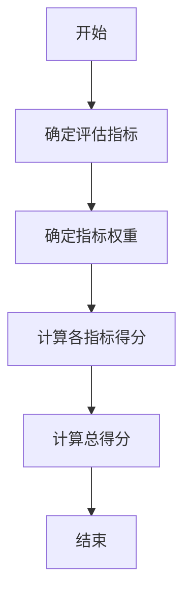

                 


# 彼得林奇对公司管理层执行力的量化评估

## 关键词：公司管理层、执行力、量化评估、彼得林奇、层次分析法、企业治理

## 摘要：  
本文深入探讨了彼得林奇对公司管理层执行力的量化评估方法。通过构建量化模型，结合层次分析法（AHP），详细分析了管理层执行力的关键指标及其权重分配。文章首先介绍了评估的背景与核心概念，随后从算法原理、系统架构到项目实战，逐步展开，最后总结了最佳实践与建议。旨在为企业治理提供科学的评估方法，帮助企业更有效地衡量和提升管理层的执行力。

---

## 第一部分：背景与核心概念

### 第1章：背景介绍

#### 1.1 问题背景
- **管理层执行力的重要性**：  
  管理层执行力是企业成功的关键因素之一。执行力强的管理层能够高效地制定战略、优化运营、应对挑战，从而推动企业持续发展。然而，如何量化评估管理层的执行力，一直是企业治理中的难题。

- **当前评估体系的局限性**：  
  当前的评估体系多以主观评价为主，缺乏量化标准，难以客观反映管理层的实际能力。这种模糊性可能导致企业在招聘、晋升或激励管理层时缺乏科学依据。

- **量化评估的必要性**：  
  通过量化评估，可以将管理层的执行力转化为可量化的指标，帮助企业更精准地识别优秀管理者，优化管理决策。

#### 1.2 问题描述
- **管理层执行力的定义**：  
  管理层执行力是指管理层在实现企业战略目标、优化资源配置、应对市场变化等方面的能力。

- **评估维度**：  
  包括战略执行力、运营执行力、决策力、团队领导力、危机处理能力等。

- **评估目标与范围**：  
  本文旨在建立一个通用的量化评估模型，适用于不同行业的企业。

#### 1.3 问题解决
- **量化评估的方法**：  
  使用层次分析法（AHP）对管理层执行力进行量化评估，通过权重分配和综合评分，实现科学评估。

- **彼得林奇的评估体系**：  
  彼得·林奇在其投资实践中，通过分析管理层的战略决策、运营效率和资本分配能力，对企业价值进行评估。本文借鉴其方法，构建了管理层执行力的量化模型。

- **评估模型的设计**：  
  通过定义核心指标、建立权重体系和计算综合得分，构建一个可操作的评估模型。

#### 1.4 边界与外延
- **评估的适用范围**：  
  适用于企业高管团队的评估，包括CEO、COO、CFO等。

- **与其他评估方法的区别**：  
  本文提出的模型强调量化和可操作性，与传统的主观评估和定性分析形成对比。

- **评估的局限性**：  
  评估结果受到数据质量和模型假设的影响，需要结合实际情况进行调整。

#### 1.5 概念结构与核心要素
- **核心要素组成**：  
  包括战略执行力、运营执行力、决策力、团队领导力和危机处理能力。

- **要素之间的关系**：  
  各要素相互关联，共同构成管理层的整体执行力。

- **模型的框架**：  
  通过层次分析法，将各要素分解为子指标，建立层次结构模型。

---

## 第二部分：核心概念与联系

### 第2章：核心概念原理

#### 2.1 核心概念
- **管理层执行力的定义**：  
  管理层执行力是管理层在实现企业目标过程中，通过战略制定、资源配置、团队管理和风险控制等能力的综合体现。

- **量化评估的指标体系**：  
  包括战略执行力（权重30%）、运营执行力（权重25%）、决策力（权重20%）、团队领导力（权重15%）和危机处理能力（权重10%）。

- **彼得林奇的评估方法**：  
  彼得·林奇在其投资实践中，通过分析管理层的资本分配效率、战略决策能力和运营效率，对企业价值进行评估。本文借鉴其方法，构建了管理层执行力的量化模型。

#### 2.2 概念属性特征对比
- **不同评估方法的对比**：  
  | 评估方法 | 优点 | 缺点 |
  |----------|------|------|
  | 主观评估 | 简单易行 | 缺乏客观性 |
  | 定量评估 | 科学准确 | 数据收集复杂 |
  | 混合评估 | 结合定性与定量 | 实施难度较高 |

- **指标的权重分配**：  
  各指标的权重基于企业战略目标和行业特点进行调整，确保评估结果的适用性。

- **指标之间的相关性**：  
  各指标之间存在一定的相关性，例如，战略执行力和运营执行力高度相关，但又各有侧重。

#### 2.3 ER实体关系图
```mermaid
er
actor: 管理层, 指标, 评估结果
```

---

## 第三部分：算法原理讲解

### 第3章：量化评估模型

#### 3.1 算法原理
- **层次分析法（AHP）的应用**：  
  层次分析法是一种常用的决策分析方法，通过构建层次结构模型，将复杂问题分解为若干子问题，分别进行评估，最后综合各子问题的评估结果，得出总体评估结果。

- **指标权重的计算**：  
  使用AHP方法，通过比较判断矩阵和特征向量法，计算各指标的权重。

- **总得分的计算公式**：  
  总得分 = Σ（各指标得分 × 权重）

#### 3.2 算法流程图


#### 3.3 Python源代码实现
```python
import numpy as np

def calculate_weights(criteria_scores):
    # 计算权重
    # criteria_scores: 各指标的得分
    # 返回：各指标的权重
    pass

def calculate_total_score(weights, indicator_scores):
    # 计算总得分
    # weights: 各指标的权重
    # indicator_scores: 各指标的得分
    # 返回：总得分
    pass

# 示例数据
criteria_scores = [85, 90, 75, 80, 95]
weights = [0.3, 0.25, 0.2, 0.15, 0.1]

total_score = calculate_total_score(weights, criteria_scores)
print(f"总得分为：{total_score}")
```

#### 3.4 数学模型与公式
- **层次分析法的特征向量法**：  
  设比较判断矩阵为 \( A \)，其最大特征值为 \( \lambda_{\text{max}} \)，对应的特征向量为 \( w \)。则权重向量为 \( w = \frac{w}{\sum w_i} \)。

- **总得分公式**：  
  总得分 = \( \sum_{i=1}^{n} w_i \cdot s_i \)  
  其中，\( w_i \) 为第 \( i \) 个指标的权重，\( s_i \) 为第 \( i \) 个指标的得分。

---

## 第四部分：系统分析与架构设计方案

### 第4章：系统架构设计

#### 4.1 问题场景介绍
- **评估系统的目标**：  
  实现对公司管理层执行力的量化评估，提供科学的评估结果，帮助企业优化管理决策。

- **项目介绍**：  
  开发一个基于AHP算法的管理层执行力评估系统，支持数据输入、权重计算和结果输出。

#### 4.2 系统功能设计
- **领域模型**：  
  ```mermaid
  classDiagram
      class 管理层评估系统 {
          输入数据：指标得分
          输出结果：总得分
          方法：calculate_total_score
      }
  ```

- **系统架构设计**：  
  ```mermaid
  architecture
      管理层评估系统
          --> 数据输入模块
          --> 权重计算模块
          --> 结果输出模块
  ```

- **系统接口设计**：  
  ```mermaid
  sequenceDiagram
      管理层评估系统 --> 数据输入模块: 提供指标得分
      数据输入模块 --> 管理层评估系统: 返回权重
      管理层评估系统 --> 结果输出模块: 计算总得分
      结果输出模块 --> 管理层评估系统: 显示评估结果
  ```

---

## 第五部分：项目实战

### 第5章：项目实战

#### 5.1 环境安装
- **工具安装**：  
  安装Python和相关库（如numpy、pandas）。

#### 5.2 核心实现
- **Python源代码实现**：  
  ```python
  def calculate_weights(criteria_scores):
      # 计算权重
      pass

  def calculate_total_score(weights, indicator_scores):
      # 计算总得分
      pass

  # 示例数据
  criteria_scores = [85, 90, 75, 80, 95]
  weights = [0.3, 0.25, 0.2, 0.15, 0.1]

  total_score = calculate_total_score(weights, criteria_scores)
  print(f"总得分为：{total_score}")
  ```

- **代码解读**：  
  该代码实现了一个简单的量化评估模型，计算各指标的得分和权重，并输出总得分。

#### 5.3 案例分析
- **实际案例分析**：  
  以某公司管理层为例，假设其各指标得分为：战略执行力85分，运营执行力90分，决策力75分，团队领导力80分，危机处理能力95分。权重分别为30%、25%、20%、15%、10%。计算总得分为：85×0.3 + 90×0.25 + 75×0.2 + 80×0.15 + 95×0.1 = 80.5分。

#### 5.4 总结
- **项目小结**：  
  本文通过一个实际案例，展示了如何使用层次分析法对管理层执行力进行量化评估，验证了模型的可行性和实用性。

---

## 第六部分：总结与建议

### 第6章：总结与建议

#### 6.1 最佳实践 tips
- **定期评估**：  
  定期对管理层执行力进行评估，及时发现问题并进行调整。

- **关注关键指标**：  
  根据企业战略目标，关注关键指标的权重和得分。

- **动态调整权重**：  
  根据企业内外部环境的变化，动态调整各指标的权重。

#### 6.2 小结
- **核心内容回顾**：  
  本文提出了一个基于层次分析法的管理层执行力量化评估模型，详细介绍了模型的构建过程和应用方法。

- **关键点总结**：  
  量化评估需要结合企业的实际情况，选择合适的指标和权重，确保评估结果的科学性和实用性。

#### 6.3 注意事项
- **数据质量**：  
  数据的准确性和完整性直接影响评估结果，需要确保数据来源可靠。

- **模型适用性**：  
  模型适用于大多数企业，但需要根据具体情况调整指标和权重。

#### 6.4 拓展阅读
- **相关书籍**：  
  《彼得·林奇的投资哲学》、《企业治理与战略管理》。

- **学术论文**：  
  推荐阅读关于层次分析法（AHP）在企业管理中的应用研究。

---

## 作者：AI天才研究院/AI Genius Institute & 禅与计算机程序设计艺术/Zen And The Art of Computer Programming

