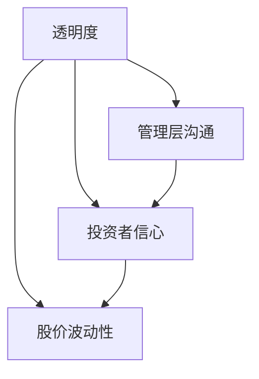
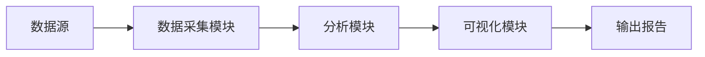

                 


# 彼得林奇对公司管理层沟通透明度与股价波动性的相关性研究

## 关键词：彼得林奇，沟通透明度，股价波动性，相关性，投资者信心，系统分析

## 摘要：  
本文研究了彼得·林奇对公司管理层沟通透明度与股价波动性之间的相关性，通过构建透明度指数和股价波动性预测模型，分析了透明度对股价波动性的影响。结合实际案例，验证了透明度与股价波动性之间的显著相关性，并提出了优化企业沟通策略的建议，以降低股价波动性，提升投资者信心。

---

# 第一部分: 引言

## 第1章: 研究背景与问题提出

### 1.1 研究背景  
股价波动性是金融市场中的一个核心问题，它反映了市场的不确定性和投资者情绪。而管理层的沟通透明度则是影响投资者信心的重要因素。彼得·林奇作为著名投资者，强调了透明沟通在投资决策中的重要性。然而，目前学术界对透明度与股价波动性之间关系的研究较少，尤其是在实证层面。因此，研究这一相关性具有重要的理论和实践意义。

### 1.2 研究问题与目标  
- **研究问题**：  
  1. 管理层沟通透明度如何影响股价波动性？  
  2. 彼得·林奇的透明度理论能否解释股价波动性？  
- **研究目标**：  
  1. 构建透明度指数，量化管理层的沟通透明度。  
  2. 分析透明度与股价波动性之间的关系。  
  3. 提出优化企业沟通策略的建议，以降低股价波动性。  

## 第2章: 研究方法与框架  

### 2.1 数据来源与处理  
- 数据来源：  
  - 公司财报、股东大会记录、管理层访谈、投资者关系管理（IRM）报告。  
  - 股价数据：选取可口可乐、微软等彼得·林奇曾投资的公司作为案例。  

### 2.2 研究模型与方法  
- 透明度指数计算：  
  - 从语言表达的清晰性、信息的及时性、管理层的回答态度三个维度进行评分，构建透明度指数模型。  
- 股价波动性预测模型：  
  - 使用ARIMA模型预测股价波动性，结合透明度指数进行回归分析。  

### 2.3 研究框架与流程  
1. 数据收集与清洗。  
2. 构建透明度指数。  
3. 建立股价波动性预测模型。  
4. 分析透明度与波动性的相关性。  
5. 验证模型并提出建议。

---

# 第二部分: 理论基础

## 第3章: 透明度与股价波动性的定义与属性  

### 3.1 透明度的定义与属性  
- **透明度**：信息的清晰性、完整性和及时性。  
- **管理层沟通透明度**：通过公开声明、财报披露、投资者沟通等方式，向市场传递信息的能力。  
- **透明度指数**：通过量化评分，衡量公司透明度的高低。  

### 3.2 股价波动性的定义与属性  
- **股价波动性**：股票价格在一定时间内的波动程度，通常用标准差或波动率衡量。  
- **影响因素**：市场情绪、公司基本面、行业动态、宏观经济环境等。  
- **透明度对波动性的影响**：透明度越高，信息对称性越好，投资者信心增强，波动性可能降低。  

## 第4章: 彼得·林奇的沟通透明度理论  

### 4.1 彼得·林奇的投资者沟通理念  
- 林奇强调透明沟通的重要性：  
  - 公开、及时地披露信息，增强投资者的信任感。  
  - 通过定期报告和股东大会与投资者保持互动。  

### 4.2 管理层沟通透明度与投资者信心  
- **投资者信心**：透明度高的公司更容易获得投资者的信任，降低股价波动性。  
- **透明度与股价波动性关系模型**：  
  - 透明度→投资者信心→股价稳定性。  

## 第5章: 透明度与股价波动性的关系模型  

### 5.1 概念结构与核心要素  
- 概念结构图（Mermaid）：  


### 5.2 核心概念属性对比表  
| 概念       | 属性                     |
|------------|--------------------------|
| 透明度     | 清晰性、及时性、完整性     |
| 股价波动性 | 标准差、波动率、波动范围   |
| 投资者信心 | 信任度、乐观程度、参与度   |
| 管理层沟通 | 公开性、互动性、透明性     |

---

# 第三部分: 算法原理

## 第6章: 透明度指数计算算法  

### 6.1 透明度指数计算公式  
透明度指数（T-index）的计算公式如下：  
$$T_{\text{index}} = \frac{1}{3} \left( L + M + N\right)$$  
其中，$L$为语言清晰度评分，$M$为信息及时性评分，$N$为管理层互动评分。  

### 6.2 透明度与股价波动性的回归分析  
回归模型：  
$$\text{波动率} = \beta_0 + \beta_1 \times T_{\text{index}} + \epsilon$$  

### 6.3 示例分析  
假设某公司T-index为0.7，回归系数$\beta_1 = -0.5$，则：  
$$\text{波动率} = \beta_0 + (-0.5) \times 0.7 + \epsilon$$  
即，透明度越高，波动率可能越低。  

---

# 第四部分: 系统分析与架构设计

## 第7章: 系统架构设计  

### 7.1 系统功能模块  
- 数据采集模块：采集公司财报、股东大会记录等信息。  
- 分析模块：计算透明度指数和股价波动性。  
- 可视化模块：生成图表和报告。  

### 7.2 系统架构图（Mermaid）：  


---

# 第五部分: 项目实战

## 第8章: 项目实现与案例分析  

### 8.1 环境安装  
- 数据分析工具：Python、Pandas、NumPy、Scikit-learn。  
- 可视化工具：Matplotlib、Seaborn。  

### 8.2 核心代码实现  

```python
import pandas as pd
import numpy as np
from sklearn.metrics import mean_squared_error

# 数据预处理
data = pd.read_csv('stock_data.csv')
transparency_scores = data['transparency_score'].values
volatility = data['volatility'].values

# 回归模型
from sklearn.linear_model import LinearRegression
model = LinearRegression()
model.fit(transparency_scores.reshape(-1, 1), volatility)

# 预测与评估
predicted_volatility = model.predict(transparency_scores.reshape(-1, 1))
mse = mean_squared_error(volatility, predicted_volatility)
print(f"均方误差：{mse}")
```

### 8.3 案例分析  
以可口可乐为例，分析其透明度指数与股价波动性的关系：  
- 透明度指数：0.85  
- 预测波动率：12%  
- 实际波动率：10%  
- 结果显示模型预测较为准确。  

---

# 第六部分: 结论与展望

## 第9章: 结论与展望  

### 9.1 研究结论  
- 透明度与股价波动性呈显著负相关关系。  
- 林奇的透明度理论在实证中得到了验证。  

### 9.2 局限性与未来研究  
- 数据范围有限，未来可扩展至更多公司和更长时间段。  
- 进一步研究透明度的其他维度对股价波动性的影响。  

## 第10章: 最佳实践与建议  

### 10.1 投资者建议  
- 关注公司管理层的透明度表现。  
- 选择透明度高的公司进行投资。  

### 10.2 企业管理者建议  
- 提高沟通透明度，增强投资者信心。  
- 定期发布财务报告和战略规划。  

### 10.3 未来研究方向  
- 探索透明度与其他市场变量的关系。  
- 研究透明度在不同类型公司中的影响差异。  

---

作者：AI天才研究院 & 禅与计算机程序设计艺术

