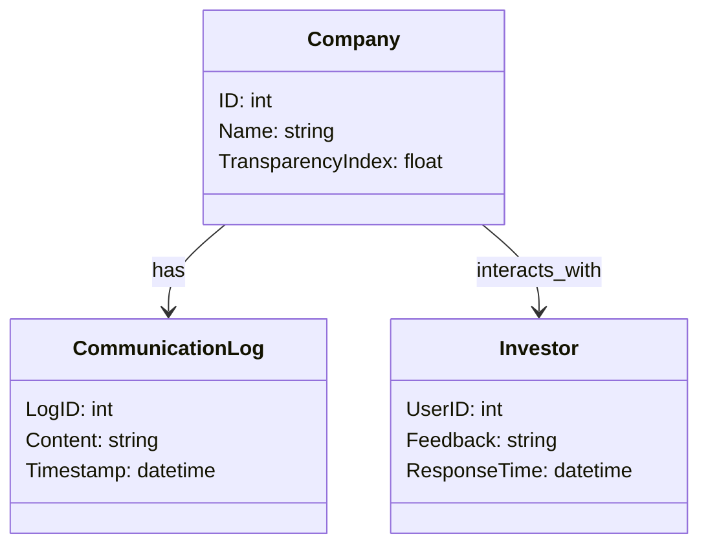
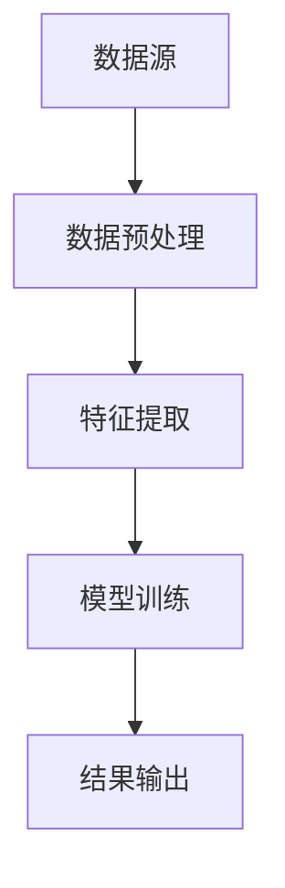
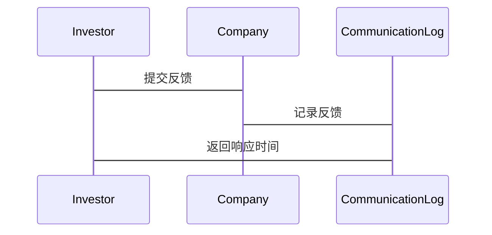

                 


# 彼得林奇对公司管理层沟通透明度的量化评估方法

## 关键词：公司治理、透明度、彼得林奇、量化评估、投资分析

## 摘要：本文详细介绍了彼得·林奇对公司管理层沟通透明度的量化评估方法。通过分析透明度的核心概念、评估标准、数学模型和算法实现，结合实际案例，展示了如何通过透明度量化评估优化公司治理和投资决策。

---

# 第1章 背景介绍与核心概念

## 1.1 沟通透明度的定义与重要性

### 1.1.1 沟通透明度的定义

沟通透明度指的是公司在信息传递过程中，管理层与利益相关者之间信息的开放性、准确性和及时性。透明的沟通能够增强信任，优化决策，并提升公司价值。

### 1.1.2 沟通透明度在公司治理中的重要性

透明的沟通是公司治理的基石。管理层通过透明的信息披露，能够有效增强投资者信心，降低信息不对称，提升公司治理效率。彼得·林奇认为，透明度是评估公司管理质量的重要指标。

### 1.1.3 彼得林奇对透明度的重视

彼得·林奇在其投资策略中，非常重视公司管理层的沟通透明度。他认为，透明的沟通能够反映管理层的诚信和责任感，是公司长期稳定发展的关键因素。

---

## 1.2 管理层沟通透明度的现状与问题

### 1.2.1 当前公司治理中的透明度问题

尽管透明度的重要性被广泛认可，但在实际操作中，许多公司仍存在信息披露不完整、信息传递不及时等问题。这些问题可能导致投资者决策失误，影响公司价值。

### 1.2.2 透明度不足对企业的影响

透明度不足会导致投资者对公司信任度下降，影响公司融资能力。此外，信息不透明还可能导致管理层滥用信息优势，损害股东利益。

### 1.2.3 投资者对透明度的需求

投资者在选择投资标的时，通常会关注公司的透明度。透明的公司更容易获得投资者的信任和支持，从而在市场竞争中占据优势。

---

## 1.3 量化评估的必要性与目标

### 1.3.1 透明度量化评估的必要性

为了客观、公正地评估公司管理层的透明度，量化评估是必要的。通过量化方法，可以将复杂的沟通行为转化为可测量的指标，便于分析和比较。

### 1.3.2 量化评估的目标与意义

量化评估的目标是为公司提供一个透明度的衡量标准，帮助管理层识别和改进沟通中的不足。同时，量化评估也为投资者提供了重要的决策依据。

### 1.3.3 量化评估的边界与外延

量化评估的边界在于信息的可测量性和数据的可获取性。其外延则包括对信息传播效果的评估，以及对信息接受者反馈的分析。

---

## 1.4 核心概念与框架

### 1.4.1 沟通透明度的核心要素

- **信息完整性**：信息的全面性和准确性。
- **信息及时性**：信息传递的时效性。
- **信息可及性**：信息的易获得性。

### 1.4.2 透明度与公司价值的关系

透明度高的公司通常具有较高的市场信任度和估值。透明的沟通能够降低投资者风险，提升公司股价。

### 1.4.3 透明度评估框架的构成

- **数据收集**：收集公司的公开信息和管理层沟通记录。
- **指标设计**：设计透明度评估指标。
- **模型构建**：建立透明度评估模型。

---

# 第2章 沟通透明度的量化评估模型

## 2.1 沟通透明度的评估标准

### 2.1.1 信息披露的完整性

评估公司信息披露的全面性，包括定期报告、临时公告等。

### 2.1.2 信息传递的及时性

评估管理层在信息发布时的及时性，如财报发布是否按时。

### 2.1.3 信息接收的有效性

评估信息接收者对信息的理解和接受程度。

---

## 2.2 沟通透明度的评估指标

### 2.2.1 信息量指标

- **信息冗余度**：信息的重复程度。
- **信息熵**：信息的混乱程度。

### 2.2.2 清晰度指标

- **信息清晰度**：信息的表达是否清晰。
- **信息准确度**：信息的准确性。

### 2.2.3 互动性指标

- **反馈响应时间**：管理层对投资者反馈的响应速度。
- **互动频率**：管理层与投资者的互动次数。

---

## 2.3 沟通透明度的评估模型

### 2.3.1 模型的构建逻辑

通过收集和分析公司的公开信息，构建透明度评估模型。模型将信息的完整性、及时性和互动性等指标进行加权计算，得出透明度指数。

### 2.3.2 模型的数学表达式

透明度指数（TI）的计算公式为：

$$ TI = \alpha \times IT + \beta \times TT + \gamma \times IE $$

其中：
- $\alpha$、$\beta$、$\gamma$为各指标的权重系数。
- $IT$为信息完整性指数。
- $TT$为信息传递及时性指数。
- $IE$为信息互动性指数。

---

## 2.4 模型的验证与优化

通过实际案例验证模型的有效性，并根据反馈进行参数调整，优化模型的准确性。

---

# 第3章 沟通透明度的评估方法与工具

## 3.1 定性评估方法

### 3.1.1 内容分析法

通过对公司公告、财报等文本进行内容分析，评估信息的完整性和清晰度。

### 3.1.2 专家评分法

邀请行业专家对公司的透明度进行评分，综合专家意见得出评估结果。

### 3.1.3 文本挖掘技术

利用自然语言处理技术，提取文本中的关键信息，评估信息的互动性和响应速度。

---

## 3.2 定量评估方法

### 3.2.1 数据分析法

通过统计分析方法，评估信息的及时性和互动性。

### 3.2.2 统计模型法

利用回归分析等统计方法，建立透明度评估模型。

### 3.2.3 机器学习算法

使用分类算法（如随机森林、神经网络）对透明度进行分类和预测。

---

## 3.3 评估工具与平台

### 3.3.1 自然语言处理工具

- **Python的nltk库**：用于文本处理和信息提取。
- ** spaCy**：用于实体识别和信息抽取。

### 3.3.2 数据可视化工具

- **Tableau**：用于数据可视化和报告生成。
- **Power BI**：用于数据建模和分析。

### 3.3.3 统计分析软件

- **R语言**：用于统计分析和模型构建。
- **Python的pandas和numpy库**：用于数据处理和分析。

---

# 第4章 沟通透明度的数学模型与算法

## 4.1 模型的数学表达

透明度指数的计算公式如前所述：

$$ TI = \alpha \times IT + \beta \times TT + \gamma \times IE $$

其中，$\alpha$、$\beta$、$\gamma$的权重系数可以通过专家评分或统计分析确定。

---

## 4.2 算法的实现步骤

### 4.2.1 数据预处理

- 数据清洗：去除无效数据和重复数据。
- 特征提取：从文本中提取关键词和实体。

### 4.2.2 特征提取

- 使用TF-IDF算法提取文本中的关键词。
- 使用词嵌入模型（如Word2Vec）提取文本特征。

### 4.2.3 模型训练与优化

- 选择合适的机器学习算法（如随机森林）进行训练。
- 通过交叉验证优化模型参数。

---

## 4.3 案例分析与应用

### 4.3.1 案例分析

以某公司为例，计算其透明度指数，分析其透明度水平。

### 4.3.2 模型的应用

将透明度评估模型应用于实际投资决策中，验证其有效性。

---

# 第5章 沟通透明度的系统分析与架构设计

## 5.1 问题场景介绍

## 5.2 系统功能设计

### 5.2.1 领域模型



---

## 5.3 系统架构设计



---

## 5.4 系统接口设计

- API接口：
  - GET /transparency-index/{company_id}：获取公司透明度指数。
  - POST /analyze：提交数据进行分析。

---

## 5.5 系统交互设计



---

# 第6章 项目实战

## 6.1 环境安装

安装必要的工具和库：
- Python 3.8+
- Jupyter Notebook
- nltk、spaCy、pandas、numpy、scikit-learn

---

## 6.2 核心实现代码

### 6.2.1 数据预处理代码

```python
import pandas as pd
from sklearn.feature_extraction.text import TfidfVectorizer

# 加载数据
data = pd.read_csv('communication_logs.csv')

# 文本预处理
vectorizer = TfidfVectorizer()
X = vectorizer.fit_transform(data['content'])
```

---

## 6.3 代码应用解读与分析

### 6.3.1 特征提取

```python
# 提取关键词
from sklearn.decomposition import LatentDirichletAllocation

lda = LatentDirichletAllocation(n_components=5)
lda.fit(X)
```

---

## 6.4 案例分析与详细讲解

### 6.4.1 实际案例

以某公司为例，计算其透明度指数，分析其透明度水平。

### 6.4.2 结果解读

解释透明度指数的含义，分析公司沟通透明度的优缺点。

---

## 6.5 项目小结

总结项目实施过程中的经验和教训，提出改进建议。

---

# 第7章 最佳实践、小结、注意事项与扩展阅读

## 7.1 最佳实践 tips

- 定期更新评估模型，适应市场变化。
- 结合定性和定量方法，提高评估准确性。

## 7.2 小结

通过本文的介绍，读者可以掌握彼得林奇的透明度量化评估方法，并将其应用于实际投资决策中。

## 7.3 注意事项

- 数据质量和完整性对评估结果影响重大，需谨慎处理。
- 模型的权重系数需根据实际情况调整。

## 7.4 拓展阅读

- 彼得·林奇的其他投资策略。
- 公司治理领域的最新研究。

---

# 作者：AI天才研究院/AI Genius Institute & 禅与计算机程序设计艺术 /Zen And The Art of Computer Programming

---

这篇文章系统地介绍了彼得·林奇对公司管理层沟通透明度的量化评估方法，结合理论分析和实际案例，为读者提供了深入的见解和实用的工具。通过本文的学习，读者可以更好地理解和应用这些方法，优化公司治理和投资决策。

