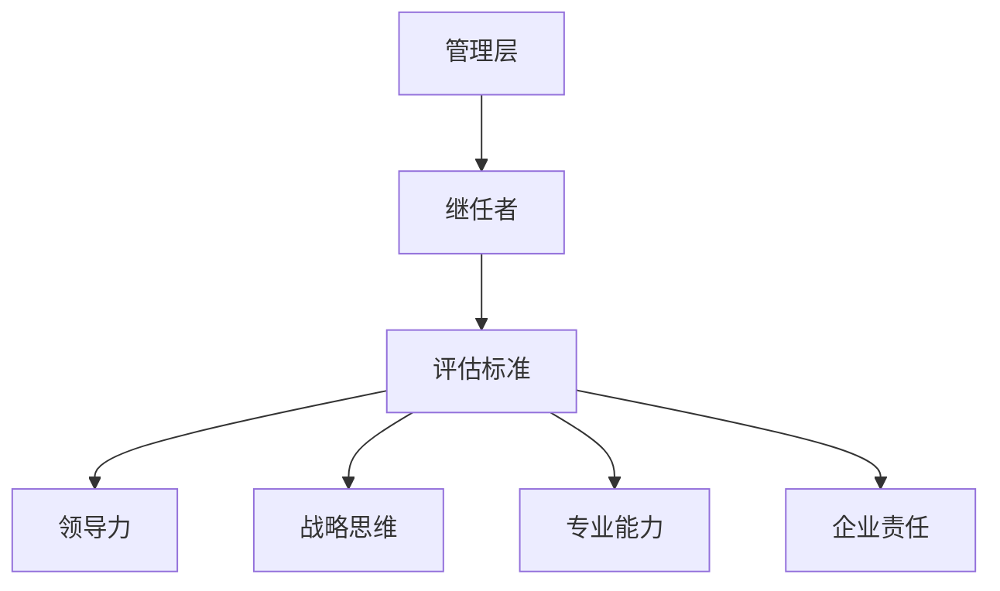
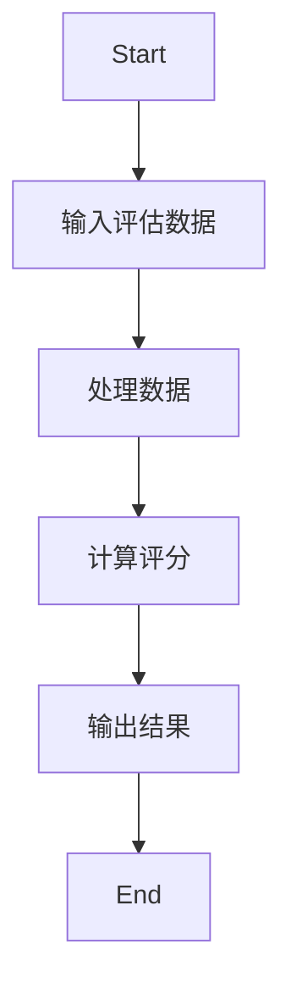
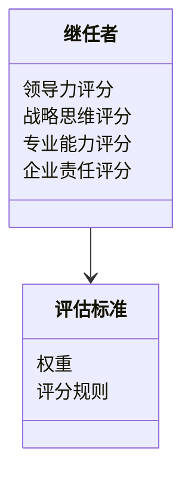
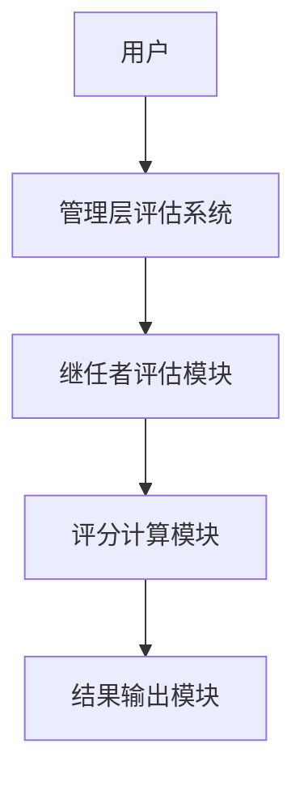
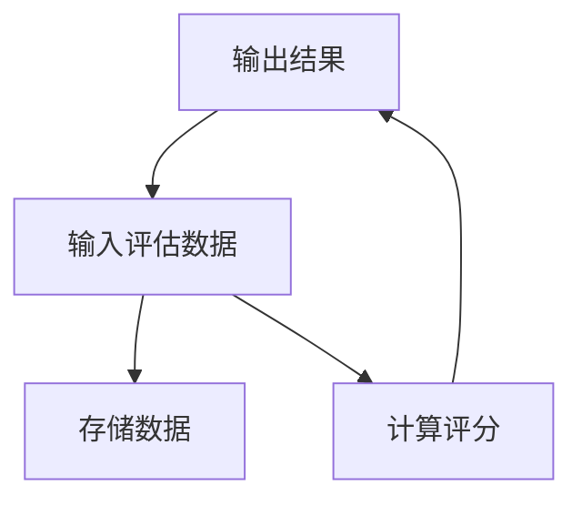

                 


# 彼得·林奇对公司管理层继任计划的评估

> 关键词：彼得·林奇，管理层继任，评估标准，领导力，战略思维

> 摘要：本文深入分析了彼得·林奇在评估公司管理层继任计划中的方法和标准。通过背景介绍、核心概念分析、算法原理讲解、系统架构设计以及项目实战，全面解析了彼得·林奇的评估体系，为公司制定有效的继任计划提供了理论和实践指导。

---

# 第一部分：背景介绍

## 第1章：管理层继任计划的重要性

### 1.1 什么是管理层继任计划
#### 1.1.1 管理层继任计划的定义
管理层继任计划是指公司为了确保在关键管理职位出现空缺时，能够及时找到合适的人选，从而保证公司业务的连续性和稳定性。这一计划通常包括识别、评估和培养潜在的接班人。

#### 1.1.2 继任计划的必要性
- 确保公司领导层的稳定性
- 避免因管理层空缺导致的业务中断
- 优化公司治理和决策效率
- 提高公司的长期竞争力

#### 1.1.3 继任计划的边界与外延
- 边界：仅限于公司关键管理职位的继任
- 外延：包括高管团队的梯队建设和后备人才培养

### 1.2 彼得·林奇与管理层继任评估
#### 1.2.1 彼得·林奇的背景介绍
彼得·林奇是美国著名的投资家和基金经理，曾管理富达麦哲伦基金，创造了辉煌的投资业绩。他的投资理念注重对管理层的评估，认为优秀的管理层是公司长期成功的关键。

#### 1.2.2 为什么彼得·林奇关注管理层继任
- 管理层的能力直接影响公司的业绩
- 继任计划的不确定性可能导致公司短期波动
- 优秀的继任者能够推动公司持续发展

#### 1.2.3 彼得·林奇的评估方法概述
彼得·林奇通过分析管理层的历史表现、战略思维、领导能力和企业责任感，评估其是否适合担任关键职位。

---

## 第2章：彼得·林奇的管理层评估标准

### 2.1 核心评估维度
#### 2.1.1 领导力与决策能力
- 继任者是否具备出色的决策能力和团队管理能力
- 是否能够在关键时刻做出正确的决策

#### 2.1.2 战略思维与愿景
- 继任者是否具备清晰的战略规划能力
- 是否能够将公司愿景与实际业务相结合

#### 2.1.3 专业能力与行业知识
- 继任者是否具备与职位相关的专业知识和技能
- 是否了解行业趋势和市场动态

#### 2.1.4 企业责任感与道德标准
- 继任者是否具备强烈的企业责任感
- 是否坚持诚信和道德标准

### 2.2 继任者评估的逻辑架构
#### 2.2.1 继任者评估的流程图


#### 2.2.2 评估维度的权重分配
- 领导力：40%
- 战略思维：30%
- 专业能力：20%
- 企业责任：10%

#### 2.2.3 评估结果的分类标准
- 优秀：评分在90分以上
- 良好：评分在70-89分
- 合格：评分在60-69分
- 不合格：评分在60分以下

---

# 第二部分：核心概念与联系

## 第3章：彼得·林奇的评估标准分析

### 3.1 核心概念原理
#### 3.1.1 继任者评估的核心要素
- 领导力
- 战略思维
- 专业能力
- 企业责任感

#### 3.1.2 评估标准的动态调整
- 根据公司战略调整评估重点
- 根据行业变化更新评估维度

#### 3.1.3 评估标准的行业适用性
- 不同行业对管理层的要求有所不同
- 评估标准需要根据行业特点进行调整

### 3.2 评估标准对比表格
| 评估维度         | 重要性评分（1-10） | 说明 |
|------------------|---------------------|------|
| 领导力           | 10                  | 核心能力 |
| 战略思维         | 8                   | 次要能力 |
| 专业能力         | 6                   | 关键能力 |
| 企业责任感       | 4                   | 基础能力 |

### 3.3 实体关系图（Mermaid）


---

# 第三部分：算法原理讲解

## 第4章：彼得·林奇的评估算法

### 4.1 算法原理
#### 4.1.1 评估模型的输入
- 管理层的历史表现数据
- 战略规划文档
- 行业趋势分析报告

#### 4.1.2 评估模型的输出
- 继任者评分
- 继任者潜力报告

#### 4.1.3 算法的数学模型
$$ \text{总评分} = \sum (\text{维度评分} \times \text{权重}) $$

### 4.2 算法流程图（Mermaid）


### 4.3 算法实现代码
```python
def peter_lynch_assessment(leader_score, strategy_score, expertise_score, responsibility_score):
    total_score = (leader_score * 0.4) + (strategy_score * 0.3) + (expertise_score * 0.2) + (responsibility_score * 0.1)
    return total_score

# 示例
leader_score = 90
strategy_score = 85
expertise_score = 75
responsibility_score = 80
print(peter_lynch_assessment(leader_score, strategy_score, expertise_score, responsibility_score))
```

---

# 第四部分：系统分析与架构设计方案

## 第5章：系统架构设计

### 5.1 问题场景介绍
- 系统需要评估公司管理层的继任者
- 需要根据彼得·林奇的评估标准进行评分

### 5.2 系统功能设计
#### 5.2.1 领域模型类图（Mermaid）


#### 5.2.2 系统架构图（Mermaid）


### 5.3 系统接口设计
- 输入接口：接受继任者的各项评分数据
- 输出接口：输出总评分和评估报告

### 5.4 系统交互图（Mermaid）


---

# 第五部分：项目实战

## 第6章：项目实战

### 6.1 环境安装
- Python 3.8+
- Mermaid工具
- Python开发环境

### 6.2 系统核心实现源代码
```python
class LeadershipSuccessorAssessment:
    def __init__(self):
        self.weights = {
            'leadership': 0.4,
            'strategy': 0.3,
            'expertise': 0.2,
            'responsibility': 0.1
        }

    def assess(self, leadership, strategy, expertise, responsibility):
        total = (leadership * self.weights['leadership'] +
                 strategy * self.weights['strategy'] +
                 expertise * self.weights['expertise'] +
                 responsibility * self.weights['responsibility'])
        return total

# 使用示例
assessment = LeadershipSuccessorAssessment()
result = assessment.assess(90, 85, 75, 80)
print(f"继任者总评分为：{result}")
```

### 6.3 代码应用解读与分析
- `LeadershipSuccessorAssessment`类封装了评估逻辑
- `assess`方法根据权重计算总评分
- 示例代码展示了如何使用该类进行评估

### 6.4 实际案例分析
假设某公司CEO的继任者各项评分为：
- 领导力：90
- 战略思维：85
- 专业能力：75
- 企业责任感：80
总评分为：
$$ 90 \times 0.4 + 85 \times 0.3 + 75 \times 0.2 + 80 \times 0.1 = 87.5 $$

### 6.5 项目小结
- 代码实现了彼得·林奇的评估算法
- 可以根据实际需求调整权重和评估维度

---

# 第六部分：最佳实践

## 第7章：最佳实践

### 7.1 小结
- 彼得·林奇的评估方法提供了系统的继任者评估框架
- 通过量化评分和权重分配，确保评估的客观性和科学性

### 7.2 注意事项
- 评估标准需要根据公司实际情况调整
- 数据输入的准确性和完整性直接影响评估结果
- 定期更新评估标准以适应行业变化

### 7.3 拓展阅读
- 《彼得·林奇的选股法则》
- 《领导力的五个维度》
- 《企业战略管理》

---

作者：AI天才研究院/AI Genius Institute & 禅与计算机程序设计艺术/Zen And The Art of Computer Programming

