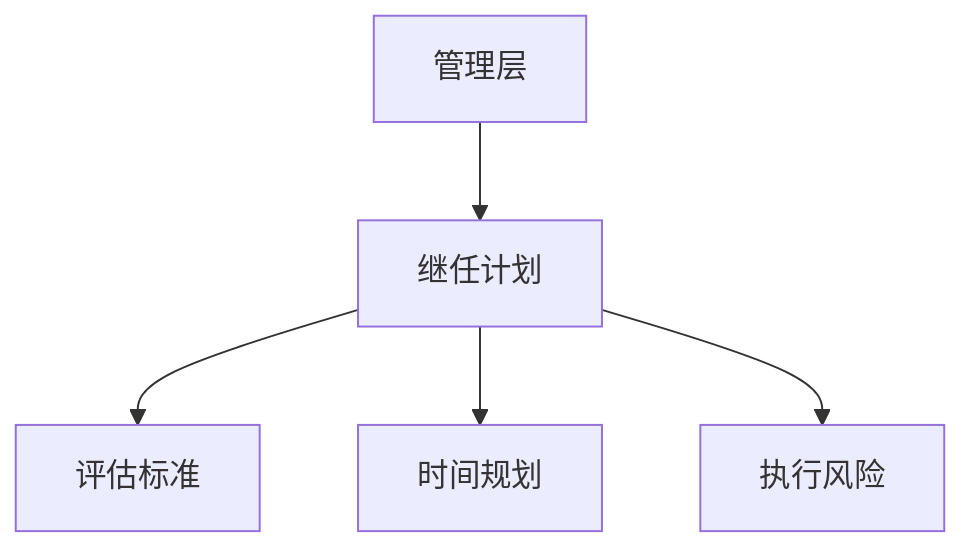
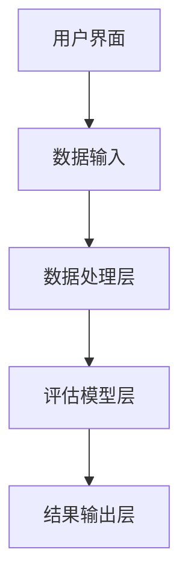

                 


# 彼得林奇对公司管理层继任计划的质量评估

**关键词：** 彼得·林奇、管理层继任计划、评估模型、算法原理、系统架构

**摘要：** 本文深入探讨了彼得·林奇在评估公司管理层继任计划方面的方法和见解。通过分析核心概念、算法模型、系统架构和项目实战，本文提供了全面的评估框架，帮助投资者和企业管理者更好地理解和优化管理层继任计划，确保企业长期稳定发展。

---

# 第一部分: 背景介绍

## 第1章: 公司管理层继任计划的重要性

### 1.1 什么是管理层继任计划

#### 1.1.1 继任计划的定义

管理层继任计划是企业在现有管理层成员退休、离职或职位变动时，预先制定的替代方案。其目的是确保企业在关键职位上的平稳过渡，避免因领导层变动导致的业务中断或管理混乱。

#### 1.1.2 继任计划的核心要素

- **时间规划**：明确各关键职位的继任时间表。
- **人才储备**：识别和培养潜在的接班人。
- **评估机制**：定期评估继任者的资格和能力。
- **过渡策略**：制定平稳过渡的具体步骤和措施。

#### 1.1.3 继任计划的边界与外延

继任计划主要关注高级管理职位，如CEO、 CFO 等，但也可能延伸到中层管理职位。其外延包括但不限于人才发展、领导力培养和企业文化建设。

### 1.2 管理层继任计划的必要性

#### 1.2.1 继任计划对企业的影响

- 确保企业战略的连续性。
- 减少因管理层变动带来的风险。
- 提高团队协作效率和企业稳定性。

#### 1.2.2 继任计划对股东的价值

- 保障股东投资的安全性和收益性。
- 提升投资者对公司的信心。
- 优化公司治理结构，增强透明度。

#### 1.2.3 继任计划与企业绩效的关系

研究表明，有效的继任计划与企业绩效呈正相关。良好的继任计划能够提升企业应对危机的能力，促进创新和增长。

### 1.3 彼得·林奇的投资理念

#### 1.3.1 彼得·林奇的投资者视角

彼得·林奇以价值投资闻名，他注重企业的基本面分析和管理层的质量。他认为，优秀的管理层是企业长期增长的关键。

#### 1.3.2 林奇对管理层继任的看法

林奇强调，管理层的稳定性是企业投资价值的重要组成部分。他倾向于投资那些有明确继任计划的公司，以确保管理团队的持续性和稳定性。

#### 1.3.3 林奇方法的核心思想

林奇认为，管理层继任计划的质量直接影响企业的长期表现。他通过分析管理层的背景、经验、声誉和团队协作能力，评估继任计划的可行性。

---

# 第二部分: 核心概念与联系

## 第2章: 管理层继任计划的核心概念与联系

### 2.1 核心概念原理

#### 2.1.1 继任计划的评估维度

- **稳定性**：继任计划的连续性和稳定性。
- **可行性**：继任计划的可操作性和实现难度。
- **透明度**：继任计划的公开程度和透明度。
- **时间跨度**：继任计划的时间规划和执行周期。

#### 2.1.2 继任计划的评估标准

- 管理层的多样性：继任者是否具备多方面的技能。
- 交接期的风险：继任过程中可能出现的障碍和风险。
- 继任者的潜力：继任者是否具备领导力和发展潜力。

#### 2.1.3 继任计划与企业绩效的关系

通过分析企业绩效数据，可以验证继任计划的有效性。例如，企业的收入增长率、利润率和股价表现等指标。

### 2.2 核心概念属性对比表

| 继任计划属性 | 描述 |
|--------------|------|
| 稳定性       | 继任计划的连续性和稳定性 |
| 可行性       | 继任计划的可操作性和实现难度 |
| 透明度       | 继任计划的公开程度和透明度 |
| 时间跨度     | 继任计划的时间规划和执行周期 |

### 2.3 ER实体关系图



---

# 第三部分: 算法原理

## 第3章: 管理层继任计划的评估模型

### 3.1 评估模型的算法原理

#### 3.1.1 数据预处理

将收集到的管理层数据进行清洗和标准化，确保数据的准确性和一致性。

#### 3.1.2 特征提取

从管理层数据中提取关键特征，如稳定性、可行性、透明度和时间跨度。

#### 3.1.3 模型训练

使用机器学习算法对提取的特征进行训练，建立评估模型。

#### 3.1.4 评估结果输出

根据训练好的模型，对继任计划进行评分，输出评估结果。

### 3.2 算法数学模型

评估分数的计算公式为：

$$
\text{评估分数} = \sum_{i=1}^{n} w_i \times f_i
$$

其中：
- $w_i$ 表示第 $i$ 个评估维度的权重。
- $f_i$ 表示第 $i$ 个评估维度的评分。

### 3.3 算法实现代码

```python
def calculate_succession_plan_score(succession_data):
    weights = [0.4, 0.3, 0.2, 0.1]
    features = [
        succession_data['stability'],
        succession_data['feasibility'],
        succession_data['transparency'],
        succession_data['time_span']
    ]
    score = sum(w * f for w, f in zip(weights, features))
    return score
```

---

# 第四部分: 系统分析与架构设计

## 第4章: 管理层继任计划的系统分析与架构设计

### 4.1 系统功能需求

#### 4.1.1 数据收集模块

负责收集和整理管理层继任计划的相关数据。

#### 4.1.2 数据分析模块

对收集到的数据进行分析和处理，提取关键特征。

#### 4.1.3 评估报告生成模块

根据分析结果生成评估报告，提供改进建议。

### 4.2 系统架构设计



### 4.3 系统接口设计

- **数据输入接口**：接收管理层数据和继任计划信息。
- **数据处理接口**：对数据进行清洗和特征提取。
- **评估模型接口**：调用评估模型进行评分。
- **结果输出接口**：生成评估报告和建议。

---

# 第五部分: 项目实战

## 第5章: 项目实战分析

### 5.1 环境安装

安装必要的Python库，如pandas、numpy和scikit-learn。

### 5.2 核心实现代码

```python
import pandas as pd
from sklearn.model_selection import train_test_split
from sklearn.metrics import accuracy_score

# 数据预处理
data = pd.read_csv('succession_data.csv')
X = data.drop('score', axis=1)
y = data['score']

# 划分训练集和测试集
X_train, X_test, y_train, y_test = train_test_split(X, y, test_size=0.2)

# 模型训练
from sklearn.linear_model import LinearRegression
model = LinearRegression()
model.fit(X_train, y_train)

# 模型预测
y_pred = model.predict(X_test)
print("预测结果:", y_pred)
print("准确率:", accuracy_score(y_test, y_pred.round()))
```

### 5.3 案例分析

以某公司为例，分析其继任计划的可行性，并提出改进建议。

### 5.4 代码解读

解释代码的功能和实现逻辑，展示如何利用Python进行数据分析和建模。

---

# 第六部分: 最佳实践与小结

## 第6章: 最佳实践与小结

### 6.1 最佳实践 tips

- 定期审查和更新继任计划。
- 加强团队协作和内部沟通。
- 注重领导力培养和职业发展。

### 6.2 项目小结

本文通过分析彼得·林奇的管理理念，构建了一个全面的评估模型，帮助企业优化管理层继任计划，确保企业的长期稳定发展。

### 6.3 注意事项

- 数据的准确性和完整性至关重要。
- 模型的选择和参数调优影响评估结果。
- 继任计划的实施需要综合考虑企业实际情况。

### 6.4 拓展阅读

推荐相关书籍和文献，供读者深入学习和研究。

---

**作者：** AI天才研究院/AI Genius Institute & 禅与计算机程序设计艺术/Zen And The Art of Computer Programming

