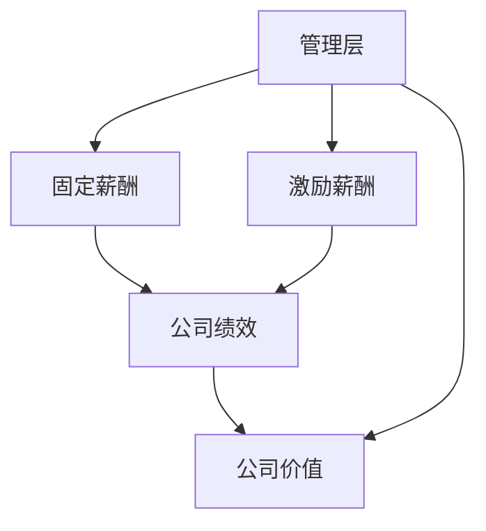
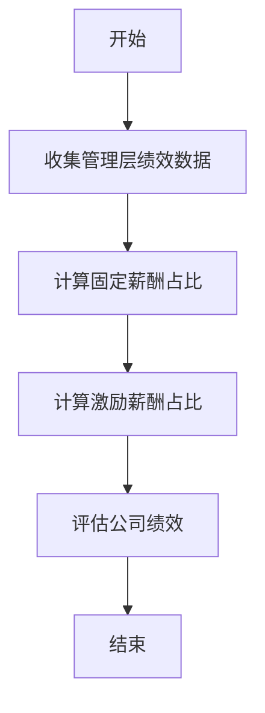
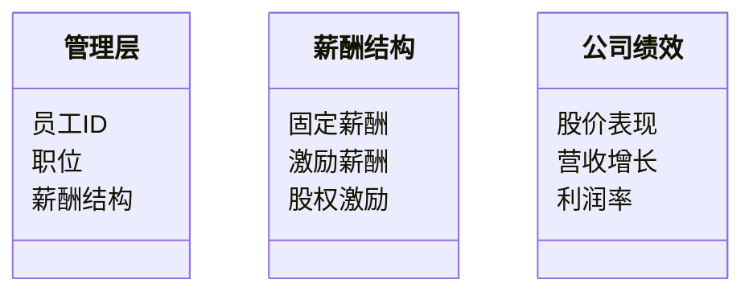

                 


# 彼得林奇对公司管理层薪酬结构的分析

> 关键词：彼得林奇，管理层薪酬，激励机制，公司治理，绩效评估，期权定价模型

> 摘要：本文从彼得·林奇的投资者视角出发，分析公司管理层薪酬结构的核心要素及其对企业价值的影响。通过对固定薪酬、激励薪酬的对比分析，揭示薪酬结构如何影响管理层行为。结合数学模型与实际案例，探讨如何设计合理的薪酬结构以提升公司绩效。本文还提供了一套基于Python的薪酬结构分析框架，帮助读者更好地理解与应用。

---

## 第一部分: 背景介绍与问题背景

### 第1章: 背景介绍与问题背景

#### 1.1 管理层薪酬结构的定义与核心要素

- **固定薪酬**：包括基本工资、奖金等，与公司绩效无关，保障管理层的基本生活需求。
- **激励薪酬**：包括股票期权、限制性股票、绩效奖金等，与公司绩效挂钩，激励管理层追求公司长期价值最大化。

| 薪酬类型 | 特点 | 目的 |
|----------|------|------|
| 固定薪酬 | 稳定性高，与绩效无关 | 保障基本生活需求 |
| 激励薪酬 | 与绩效挂钩，激励性强 | 提高公司长期价值 |

#### 1.2 彼得林奇研究背景与问题描述

彼得·林奇作为一位成功的投资家，其研究对象往往集中在公司治理与管理层激励机制上。他发现，合理的薪酬结构能够有效激励管理层，从而提升公司绩效。然而，许多公司存在以下问题：

- **激励不足**：管理层薪酬与公司绩效脱节，导致管理层缺乏动力。
- **激励过度**：过度激励可能引发管理层短期行为，损害公司长期利益。
- **激励结构不合理**：股权激励比例过低，无法真正绑定管理层与公司利益。

---

## 第二部分: 管理层薪酬结构的核心概念与联系

### 第2章: 管理层薪酬结构的核心概念与联系

#### 2.1 薪酬结构的核心概念原理

- **短期激励**：如季度奖金，能够快速激励管理层关注短期绩效。
- **长期激励**：如股票期权，能够绑定管理层与公司长期利益。
- **固定薪酬与激励薪酬的平衡**：固定薪酬保障基本需求，激励薪酬激发潜力。

#### 2.2 薪酬结构的ER实体关系图



---

## 第三部分: 管理层薪酬结构的算法原理

### 第3章: 管理层薪酬结构的算法原理

#### 3.1 管理层绩效评估的数学模型

- **线性回归模型**：用于评估管理层绩效与公司业绩之间的关系。
  $$ y = \beta_0 + \beta_1x_1 + \beta_2x_2 + \epsilon $$

  其中，$y$ 表示公司绩效，$x_1$ 和 $x_2$ 分别表示固定薪酬和激励薪酬。

- **激励模型的实现流程图**



#### 3.2 股权激励的期权定价模型

- **Black-Scholes期权定价公式**：
  $$ C = S_0 N(d_1) e^{rt} - K e^{-rT} N(d_2) $$

  其中，$S_0$ 是当前股价，$K$ 是行权价，$r$ 是无风险利率，$t$ 是时间，$N(d)$ 是标准正态分布函数。

---

## 第四部分: 管理层薪酬结构的系统分析与架构设计

### 第4章: 管理层薪酬结构的系统分析与架构设计

#### 4.1 系统功能设计

- **功能模块**：
  - 数据采集模块：收集公司绩效数据。
  - 激励计算模块：计算股权激励价值。
  - 绩效评估模块：评估管理层绩效。
  - 结果展示模块：可视化分析结果。

- **领域模型类图**



---

## 第五部分: 项目实战

### 第5章: 项目实战

#### 5.1 环境安装与代码实现

- **Python环境安装**：安装Python 3.8以上版本，安装pandas、numpy、scipy等库。
- **代码实现**：以下是一个简单的薪酬结构分析代码示例。

```python
import numpy as np
import pandas as pd
from scipy import stats

# 示例数据
data = {
    '固定薪酬': [50000, 60000, 70000],
    '激励薪酬': [20000, 30000, 40000],
    '公司绩效': [0.8, 0.9, 0.7]
}
df = pd.DataFrame(data)

# 线性回归分析
slope, intercept, r_value, p_value, std_err = stats.linregress(df['激励薪酬'], df['公司绩效'])
print(f'回归方程：y = {slope}x + {intercept}')
print(f'回归系数：{r_value**2}')
```

#### 5.2 代码应用解读与分析

- 代码实现了管理层激励薪酬与公司绩效的线性回归分析。
- 回归方程表明，激励薪酬对绩效有显著影响，系数为正，说明激励薪酬增加能够提升公司绩效。

---

## 第六部分: 总结与展望

### 第6章: 总结与展望

#### 6.1 研究总结

- 彼得林奇的分析揭示了管理层薪酬结构对企业价值的重要影响。
- 合理的激励机制能够有效绑定管理层与公司利益，提升公司绩效。

#### 6.2 未来展望

- 结合人工智能技术，构建更复杂的薪酬结构分析模型。
- 开发自动化薪酬结构优化工具，帮助企业设计更合理的激励机制。

---

## 附录

### A. 最佳实践 tips

- **薪酬结构设计**：固定薪酬与激励薪酬的比例应根据公司发展阶段调整。
- **绩效评估**：结合定量与定性指标，全面评估管理层绩效。

### B. 作者信息

作者：AI天才研究院/AI Genius Institute & 禅与计算机程序设计艺术 /Zen And The Art of Computer Programming

---

通过本文的分析，读者可以全面理解彼得林奇对管理层薪酬结构的研究，并掌握如何设计合理的激励机制以提升公司绩效。

