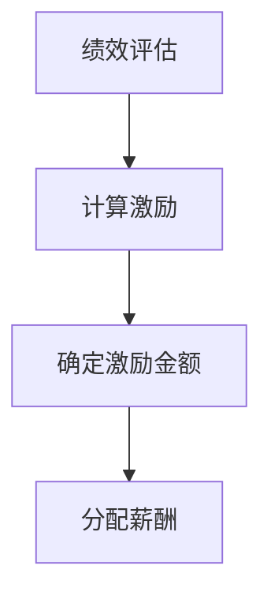
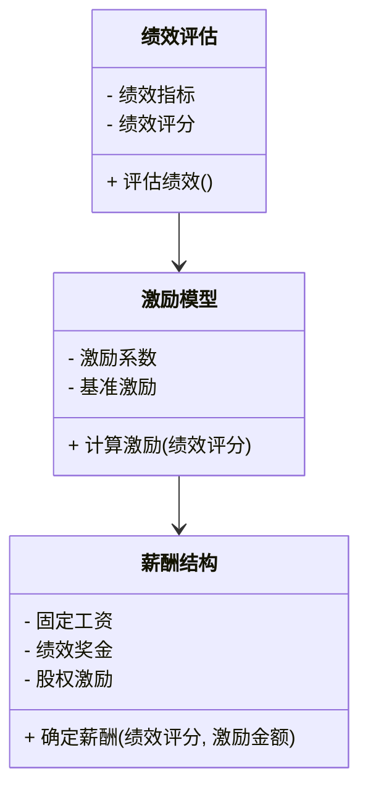
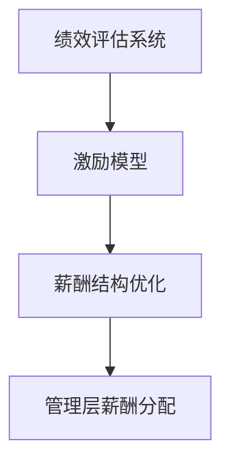

                 


# 彼得林奇对公司管理层薪酬结构的看法

## 关键词：公司治理、管理层激励、薪酬结构、彼得林奇、投资策略

## 摘要：本文从彼得林奇的投资视角，探讨公司管理层薪酬结构的设计原则，分析其对股东价值的影响，并结合实际案例提出优化建议，为公司治理提供新的思路。

---

# 目录

## 第1章 公司管理层薪酬结构的背景与问题

### 1.1 问题背景

#### 1.1.1 公司管理层薪酬结构的重要性

公司管理层的薪酬结构直接影响管理团队的积极性和公司的长期发展。合理的薪酬设计能够将管理层的利益与公司绩效紧密挂钩，激励其追求卓越的经营成果。

#### 1.1.2 当前公司管理层薪酬结构存在的问题

- 薪酬与绩效脱节：部分公司采用固定薪酬，未充分考虑绩效因素，导致管理层动力不足。
- 激励不足：过度依赖固定工资，缺乏有效的激励机制，难以激发管理层的潜力。
- 股东利益与管理层利益不一致：管理层可能追求短期业绩，忽视长期股东价值。

#### 1.1.3 问题背景的外延与边界

公司管理层薪酬结构问题不仅影响公司内部治理，还涉及股东、投资者和员工的利益。其外延包括股权激励、奖金设计、绩效考核等，边界涉及法律、税法、会计准则等因素。

### 1.2 问题描述

#### 1.2.1 薪酬结构与公司绩效的关系

合理的薪酬结构能够将管理层的个人利益与公司整体绩效相结合，促进公司长期健康发展。不合理的结构可能导致管理层短期行为，损害股东利益。

#### 1.2.2 管理层激励与股东利益的平衡

管理层激励设计需要在激励强度和股东利益之间找到平衡点，既要激励管理层积极进取，又要避免过度激励导致的风险。

#### 1.2.3 薪酬结构对员工积极性的影响

科学的薪酬结构不仅激励管理层，还能通过管理层的行为影响公司整体员工的积极性，营造良好的企业氛围。

### 1.3 问题解决

#### 1.3.1 设计合理的薪酬结构的原则

- 明确目标：薪酬结构应以公司长期发展为目标，考虑股东利益。
- 激励与约束并重：在激励管理层的同时，设置合理的约束机制，避免短期行为。
- 透明公正：薪酬结构应透明，确保公平性，避免内部矛盾。

#### 1.3.2 确保激励与绩效挂钩的方法

- 设计绩效考核指标：根据公司战略目标，设计可量化的绩效考核指标。
- 绩效奖金：将奖金与绩效考核结果挂钩，激励管理层实现目标。
- 股权激励：通过股权激励，将管理层利益与股东利益绑定。

#### 1.3.3 优化薪酬结构的具体措施

- 定期评估薪酬结构：根据公司经营状况和市场环境，定期评估并调整薪酬结构。
- 建立多层次激励体系：结合短期激励和长期激励，构建多层次的薪酬体系。
- 加强信息披露：提高薪酬结构的透明度，增强投资者和员工的信任感。

## 第2章 核心概念与联系

### 2.1 核心概念原理

#### 2.1.1 激励机制的原理

激励机制通过设定明确的目标和奖励，激发个体的内在动力，使其为实现目标而努力工作。在公司管理中，激励机制能够有效调动管理层的积极性，推动公司绩效的提升。

#### 2.1.2 绩效考核的核心要素

绩效考核是薪酬结构设计的重要组成部分，其核心要素包括：

- **考核指标**：明确的、可量化的指标，如净利润增长率、营业收入等。
- **考核周期**：根据公司战略目标设定考核周期，如季度、半年度或年度。
- **考核权重**：根据指标的重要性分配权重，确保关键指标得到充分关注。

#### 2.1.3 薪酬结构的数学模型

薪酬结构可以表示为以下数学模型：

$$
\text{薪酬} = w \times \text{固定工资} + k \times \text{绩效考核结果} + s \times \text{股权激励}
$$

其中：
- \( w \) 是固定工资比例，
- \( k \) 是绩效奖金比例，
- \( s \) 是股权激励比例。

### 2.2 概念属性对比表格

下表对比了激励机制、绩效考核和薪酬结构的核心属性：

| 概念       | 目标       | 工具/方法 | 结果       |
|------------|------------|------------|------------|
| 激励机制   | 提高管理绩效 | 绩效奖金、股权激励 | 管理层积极性提升 |
| 绩效考核   | 评估管理绩效 | KPI指标、评分体系 | 绩效奖金分配依据 |
| 薪酬结构   | 综合激励 | 固定工资、奖金、股权 | 管理层收入保障与激励 |

### 2.3 ER实体关系图

以下是薪酬结构、激励机制和绩效考核的实体关系图：

```mermaid
erDiagram
    管理层 <<--- 薪酬结构 : 包含
    薪酬结构 <<--- 激励机制 : 实现
    激励机制 <<--- 绩效考核 : 基于
```

## 第3章 激励模型的数学分析

### 3.1 濱jer模型

#### 3.1.1 模型的建立

滨jer模型是一种基于绩效的激励模型，其核心思想是通过将绩效与激励直接挂钩，激发管理者的积极性。模型公式如下：

$$
\text{激励} = k \times \text{绩效} + b
$$

其中：
- \( k \) 是激励系数，
- \( b \) 是基准激励。

#### 3.1.2 模型的数学表达

以下是一个具体的数学表达式，假设绩效评分为0.8，激励系数为1.5，基准激励为0：

$$
\text{激励金额} = 1.5 \times 0.8 + 0 = 1.2
$$

### 3.2 激励模型的实现

#### 3.2.1 激励模型的流程图

以下是激励模型的实现流程图：



### 3.3 代码实现

#### 3.3.1 激励计算的Python代码

```python
def calculate_incentive(performance, k, b):
    return k * performance + b

# 示例：绩效评分为0.8，激励系数为1.5，基准激励为0
performance = 0.8
k = 1.5
b = 0

incentive = calculate_incentive(performance, k, b)
print(f"激励金额为: {incentive}")
```

## 第4章 系统分析与架构设计方案

### 4.1 问题场景介绍

#### 4.1.1 系统目标

设计一个基于绩效的激励模型，优化公司管理层的薪酬结构，实现管理层激励与公司绩效的动态绑定。

#### 4.1.2 项目介绍

通过建立一个激励模型，分析不同绩效下的激励金额，并优化薪酬结构，确保激励机制的有效性。

### 4.2 系统功能设计

#### 4.2.1 领域模型类图

以下是领域模型类图：



### 4.3 系统架构设计

#### 4.3.1 系统架构图

以下是系统架构图：



### 4.4 系统接口设计

#### 4.4.1 系统接口

系统接口主要涉及绩效数据输入、激励模型调用和薪酬计算输出。

### 4.5 系统交互序列图

以下是系统交互序列图：

```mermaid
sequenceDiagram
    管理层输入绩效数据
    调用激励模型计算激励金额
    确定最终的薪酬结构
    输出薪酬分配结果
```

## 第5章 项目实战

### 5.1 环境安装

#### 5.1.1 环境要求

- Python 3.8+
- Mermaid图表工具
- Markdown编辑器

### 5.2 核心代码实现

#### 5.2.1 激励模型实现

```python
def calculate_incentive(performance, k, b):
    return k * performance + b

# 示例：绩效评分为0.8，激励系数为1.5，基准激励为0
performance = 0.8
k = 1.5
b = 0

incentive = calculate_incentive(performance, k, b)
print(f"激励金额为: {incentive}")
```

### 5.3 代码解读

#### 5.3.1 激励模型代码解读

上述代码定义了一个计算激励金额的函数 `calculate_incentive`，并给出了一个示例调用，计算绩效评分为0.8时的激励金额。

### 5.4 案例分析

#### 5.4.1 案例分析

假设某公司管理层的绩效评分为0.8，激励系数为1.5，基准激励为0。根据上述代码计算，激励金额为1.2。

### 5.5 项目小结

通过项目实战，我们成功地实现了基于绩效的激励模型，并验证了其在实际中的应用效果。

## 第6章 最佳实践

### 6.1 小结

- 合理的薪酬结构设计能够有效激励管理层，提升公司绩效。
- 激励机制的设计需要考虑绩效考核、股权激励等多种因素。
- 定期评估和优化薪酬结构是确保其有效性的关键。

### 6.2 注意事项

- 确保激励机制的透明性和公平性。
- 绩效考核指标应与公司战略目标一致。
- 股权激励应合理设计，避免过度激励带来的风险。

### 6.3 拓展阅读

- 彼得林奇的《投资之道》
- 股权激励相关书籍
- 公司治理经典文献

---

# 作者：AI天才研究院/AI Genius Institute & 禅与计算机程序设计艺术 /Zen And The Art of Computer Programming

