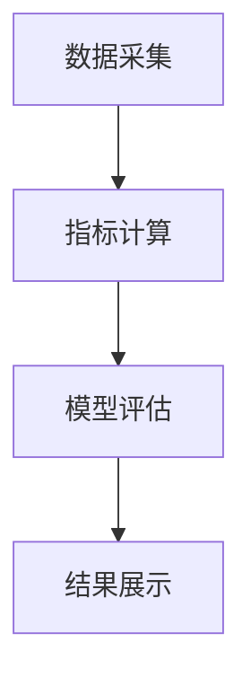
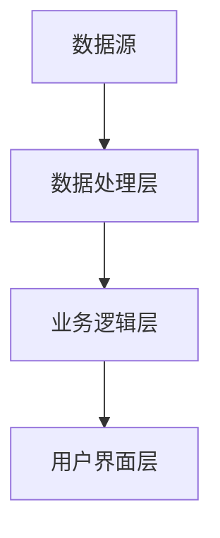
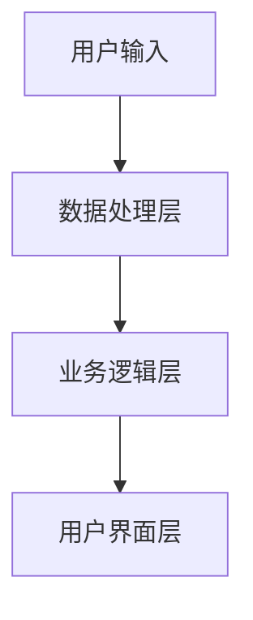

                 


# 彼得林奇对公司管理层诚信度的判断

> 关键词：彼得林奇, 管理层诚信度, 投资决策, 财务分析, 公司治理

> 摘要：本文深入探讨了彼得林奇在其投资体系中对管理层诚信度的判断方法。通过分析诚信度的核心概念、影响因素、判断技巧以及实际案例，本文揭示了诚信度在投资决策中的重要性。结合系统分析和项目实战，本文提供了如何通过量化模型和算法流程图来评估管理层诚信度的详细方法。通过本文的分析，读者将能够更好地理解如何在实际投资中应用这些方法。

---

# 第1章: 诚信度在投资中的重要性

## 1.1 诚信度的定义与核心概念

诚信度是衡量管理层在经营过程中是否遵守道德规范、保持透明和负责任的核心指标。它不仅影响公司的长期发展，还直接影响投资者的决策。

### 1.1.1 诚信度的定义

诚信度是指管理层在经营活动中是否坚持真实、透明和负责任的行为。它包括以下几个核心要素：

1. **真实性**：管理层提供的信息是否准确无误。
2. **透明性**：管理层是否愿意公开公司运营的细节。
3. **责任感**：管理层是否对公司和股东的长期利益负责。

### 1.1.2 诚信度的核心要素

- **决策透明性**：管理层在做出重大决策时是否愿意向股东和利益相关者公开信息。
- **财务透明度**：财务报表是否真实反映了公司的财务状况。
- **道德行为**：管理层在面对利益诱惑时是否坚持道德标准。

### 1.1.3 诚信度与投资决策的关系

诚信度是投资决策的重要依据。一家公司管理层的诚信度高，投资者更愿意投资，因为公司更有可能实现长期稳定的增长。

---

## 1.2 彼得林奇投资理念的背景

彼得林奇是美国著名的职业基金经理人，以其独特的投资策略和对管理层诚信度的高度重视而闻名。他的投资理念强调长期价值，而不是短期市场波动。

### 1.2.1 彼得林奇的个人投资哲学

- **长期投资**：彼得林奇主张长期持有优质股票，而不是频繁交易。
- **基本面分析**：他强调对公司基本面的深入研究，包括财务状况、管理层能力和行业地位。
- **管理层诚信度**：他认为管理层的诚信度是公司长期成功的关键因素。

### 1.2.2 诚信度在彼得林奇投资体系中的地位

在彼得林奇看来，管理层的诚信度是公司治理和投资决策的核心。他通过分析管理层的行为和公司治理结构来评估诚信度。

---

## 1.3 诚信度对管理层决策的影响

诚信度高的管理层更有可能做出有利于公司和股东的决策，而诚信度低的管理层可能倾向于追求短期利益，损害公司和股东的长期利益。

### 1.3.1 诚信度与公司治理的关系

诚信度高的管理层能够建立良好的公司治理结构，确保董事会和管理层之间的有效沟通和监督。

### 1.3.2 诚信度对财务透明度的影响

诚信度高的管理层更倾向于提供真实、准确的财务信息，增强投资者的信任。

### 1.3.3 诚信度对股东价值的影响

诚信度高的管理层能够通过稳健的经营策略和透明的沟通，提升公司的市场价值和股东收益。

---

## 1.4 本章小结

诚信度是投资决策中的关键因素。彼得林奇通过深入分析管理层的诚信度，构建了独特的投资体系，强调长期价值和公司治理的重要性。

---

# 第2章: 管理层诚信度的核心概念与分析框架

## 2.1 诚信度的核心属性

### 2.1.1 诚信度的可量化性

诚信度可以通过多个指标进行量化，例如：

- **财务指标**：如利润率、资产负债率等。
- **行为指标**：如管理层的决策透明度、信息披露频率等。

### 2.1.2 诚信度的稳定性

诚信度是一个相对稳定的长期指标，短期波动可能受到市场环境的影响。

### 2.1.3 诚信度的可观察性

通过公开信息、行业报告和公司治理结构等，可以观察和评估管理层的诚信度。

---

## 2.2 管理层诚信度的分析框架

### 2.2.1 管理层诚信度的构成要素

- **决策透明度**：管理层是否愿意公开决策过程和理由。
- **财务透明度**：财务报表是否真实反映公司财务状况。
- **道德行为**：管理层是否遵守道德规范，避免利益输送。

### 2.2.2 管理层诚信度的评估维度

- **财务指标**：如ROE（净资产收益率）、毛利率等。
- **行为指标**：如管理层的辞职率、诉讼事件等。
- **公司治理**：如董事会结构、独立董事比例等。

### 2.2.3 管理层诚信度的评估指标

- **财务指标**：ROE、毛利率、资产负债率等。
- **行为指标**：管理层的决策透明度、信息披露频率、管理层的稳定性等。
- **公司治理指标**：董事会独立性、股东权益保护等。

---

## 2.3 诚信度与管理层行为的关联性分析

### 2.3.1 诚信度与管理层决策的相关性

诚信度高的管理层更倾向于做出有利于公司和股东的决策。

### 2.3.2 诚信度与管理层道德风险的关系

诚信度低的管理层更容易出现道德风险，如利益输送、财务造假等。

### 2.3.3 诚信度对公司绩效的长期影响

诚信度高的管理层能够提升公司的长期绩效和市场价值。

---

## 2.4 本章小结

诚信度是衡量管理层行为的重要指标。通过分析诚信度的核心属性和评估维度，可以更好地理解管理层的行为模式及其对公司的影响。

---

# 第3章: 影响管理层诚信度的关键因素

## 3.1 管理层的背景与经验

### 3.1.1 管理层的教育背景与职业经历

- **教育背景**：管理层的教育背景通常与公司的管理水平密切相关。
- **职业经历**：丰富的职业经历通常意味着更高的管理水平和决策能力。

### 3.1.2 管理层的行业经验

- **行业经验**：管理层在行业内的经验和知识对公司的发展至关重要。
- **行业周期**：行业周期的变化会影响管理层的决策和诚信度。

### 3.1.3 管理层的过往业绩

- **过往业绩**：管理层的过往业绩是评估其诚信度的重要依据。
- **业绩稳定性**：稳定的过往业绩通常意味着更高的诚信度。

---

## 3.2 公司治理结构

### 3.2.1 股东结构与权力分配

- **股东结构**：控股股东和中小股东的权力分配影响公司的治理结构。
- **权力分配**：合理的权力分配能够防止权力滥用。

### 3.2.2 董事会的独立性与监督能力

- **董事会独立性**：独立董事的比例和能力影响公司的治理结构。
- **监督能力**：董事会的监督能力是衡量公司治理的重要指标。

### 3.2.3 高管团队的稳定性

- **高管团队稳定性**：高管团队的稳定性影响公司的经营稳定性和决策质量。
- **高管团队的诚信度**：高管团队的诚信度是公司治理的重要因素。

---

## 3.3 财务透明度

### 3.3.1 财务报告的准确性

- **财务报告准确性**：准确的财务报告是评估公司诚信度的重要依据。
- **财务数据的可验证性**：财务数据的可验证性是评估财务透明度的重要指标。

### 3.3.2 财务数据的可验证性

- **财务数据的可验证性**：通过第三方审计可以验证财务数据的准确性。
- **财务造假的防范机制**：有效的财务造假防范机制能够提升财务透明度。

### 3.3.3 财务造假的防范机制

- **财务造假的防范机制**：包括内部控制、审计监督等措施。
- **财务造假的后果**：财务造假会严重损害公司的诚信度和市场信任。

---

## 3.4 行业环境与竞争压力

### 3.4.1 行业竞争的激烈程度

- **行业竞争激烈程度**：激烈的行业竞争可能增加管理层的道德风险。
- **行业周期性**：行业周期性的影响也会影响管理层的决策和诚信度。

### 3.4.2 行业法规的严格性

- **行业法规的严格性**：严格的行业法规能够有效约束管理层的行为。
- **行业监管力度**：有效的行业监管能够降低管理层的道德风险。

### 3.4.3 行业周期性对管理层决策的影响

- **行业周期性**：行业周期性的变化会影响管理层的决策和诚信度。
- **行业趋势**：行业趋势的变化也会影响管理层的决策和诚信度。

---

## 3.5 本章小结

诚信度受多种因素影响，包括管理层的背景与经验、公司治理结构、财务透明度和行业环境等。通过综合分析这些因素，可以更好地评估管理层的诚信度。

---

# 第4章: 管理层诚信度的判断方法与技巧

## 4.1 财务指标分析

### 4.1.1 财务指标与诚信度的关系

财务指标是评估管理层诚信度的重要依据。通过分析财务指标，可以评估公司的财务健康状况和管理层的管理能力。

### 4.1.2 财务指标分析的具体步骤

1. **分析财务报表**：包括利润表、资产负债表和现金流量表。
2. **计算关键指标**：如ROE、毛利率、资产负债率等。
3. **对比行业平均水平**：评估公司的财务状况是否合理。

### 4.1.3 财务指标异常的识别

- **异常指标**：如毛利率异常下降、ROE持续低于行业平均水平等。
- **异常指标的分析**：需要进一步分析异常指标的原因。

---

## 4.2 管理层行为观察

### 4.2.1 管理层决策的透明性

- **决策透明性**：管理层是否愿意公开决策过程和理由。
- **信息披露频率**：管理层的信息披露频率是评估其透明性的重要指标。

### 4.2.2 管理层与股东的沟通频率

- **沟通频率**：管理层与股东的沟通频率是评估其透明性的重要指标。
- **沟通内容**：沟通内容是否涉及公司的重要决策和财务状况。

### 4.2.3 管理层的道德行为表现

- **道德行为表现**：管理层是否遵守道德规范，避免利益输送。
- **道德风险**：管理层是否存在道德风险，如利益输送、财务造假等。

---

## 4.3 历史案例分析

### 4.3.1 成功案例分析

- **案例1**：XYZ公司，管理层诚信度高，公司长期稳定发展。
- **案例2**：ABC公司，管理层诚信度低，公司出现财务造假。

### 4.3.2 失败案例分析

- **案例3**：XYZ公司，管理层诚信度低，公司出现财务造假，导致股价暴跌。
- **案例4**：ABC公司，管理层诚信度高，公司长期稳定发展。

### 4.3.3 案例分析的启示

- **诚信度的重要性**：诚信度高的管理层能够带领公司长期稳定发展。
- **诚信度的警示作用**：诚信度低的管理层可能导致公司出现财务造假等严重问题。

---

## 4.4 本章小结

通过财务指标分析和管理层行为观察，可以有效评估管理层的诚信度。历史案例分析也进一步验证了诚信度在投资决策中的重要性。

---

# 第5章: 管理层诚信度的系统分析与量化模型

## 5.1 系统分析与架构设计方案

### 5.1.1 问题场景介绍

- **问题场景**：如何量化管理层的诚信度。
- **目标**：构建一个量化模型，评估管理层的诚信度。

### 5.1.2 项目介绍

- **项目目标**：构建一个量化模型，评估管理层的诚信度。
- **项目范围**：包括财务指标分析、管理层行为观察和公司治理结构评估。

### 5.1.3 系统功能设计

- **功能模块**：包括数据采集、指标计算、模型评估和结果展示。
- **功能模块设计**：使用mermaid图进行功能设计。



### 5.1.4 系统架构设计

- **架构设计**：使用mermaid图进行系统架构设计。



### 5.1.5 系统接口设计

- **接口设计**：包括数据接口和用户界面接口。
- **接口实现**：使用RESTful API进行数据接口设计。

### 5.1.6 系统交互设计

- **交互设计**：使用mermaid图进行系统交互设计。



---

## 5.2 管理层诚信度量化模型的实现

### 5.2.1 算法原理

- **算法原理**：通过加权计算，将多个指标综合起来，评估管理层的诚信度。
- **算法流程**：数据采集、指标计算、权重分配和结果计算。

### 5.2.2 算法实现

```python
def calculate_integrity_score(roe,毛利率,资产负债率,董事会独立性,高管稳定性):
    weights = {
        'ROE': 0.3,
        '毛利率': 0.2,
        '资产负债率': 0.2,
        '董事会独立性': 0.15,
        '高管稳定性': 0.15
    }
    score = (ro

