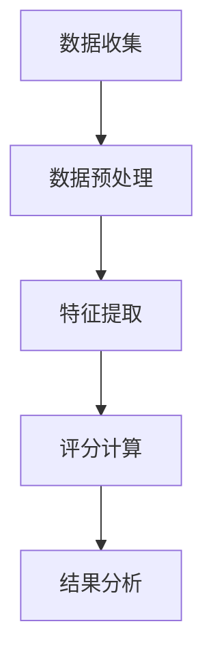
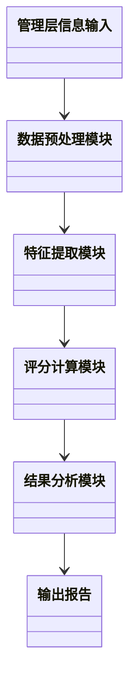
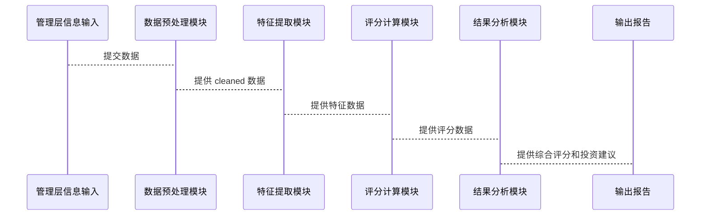

                 


# 彼得林奇对公司管理层质量的要求

## 关键词：彼得林奇，管理层质量，投资策略，企业价值，领导力

## 摘要：本文深入分析了彼得林奇对公司管理层质量的要求，探讨了管理层质量对企业价值的影响，并提出了基于彼得林奇投资理念的评估方法。文章从背景介绍、核心概念、算法原理、系统架构到项目实战，全面解析了如何通过管理层质量评估来优化投资决策。

---

# 第一部分: 背景介绍

## 第1章: 管理层质量的重要性

### 1.1 问题背景

#### 1.1.1 管理层质量的重要性
公司管理层的质量直接关系到企业的经营绩效、市场竞争力和长期发展。管理层的决策能力、战略眼光和执行力决定了企业的成败。彼得林奇作为全球著名投资经理，曾管理富达麦哲伦基金，创造了长期优异的投资业绩。他强调，投资成功的前提是选择优秀的管理层，因为管理层是企业价值的核心驱动力。

#### 1.1.2 彼得林奇的投资理念
彼得林奇的投资理念以“深入研究，长期持有”为核心。他认为，投资者应重点关注企业的基本面和管理层的质量，避免短期市场波动的干扰。他的成功在于对管理层的严格筛选，尤其是对管理层的能力、诚信和决策能力的评估。

#### 1.1.3 管理层质量与企业价值的关系
管理层质量与企业价值密切相关。优秀的管理层能够制定科学的战略，优化资源配置，提升企业效率，从而实现股东价值的最大化。相反，管理层能力不足或道德问题可能导致企业价值下降甚至崩溃。

### 1.2 问题描述

#### 1.2.1 管理层质量的核心要素
- **领导力**：管理层能否有效决策和指导团队。
- **战略思维**：管理层是否具备长期规划能力。
- **诚信**：管理层是否透明和可靠。
- **执行力**：管理层能否高效执行战略。
- **创新能力**：管理层是否能够适应变化。

#### 1.2.2 彼得林奇对管理层质量的要求
彼得林奇认为，优秀的管理层应具备以下几个关键特质：
1. **行业经验丰富**：管理层应深入了解行业动态，具备丰富的实践经验。
2. **良好的道德记录**：管理层应诚实守信，避免财务造假。
3. **清晰的战略 vision**：管理层应有明确的发展目标，并能够有效传达给团队和投资者。
4. **优秀的执行能力**：管理层应能够将战略转化为实际成果。
5. **适应变化的能力**：管理层应能够灵活应对市场变化和突发事件。

#### 1.2.3 管理层质量对企业发展的具体影响
- **企业绩效**：优秀的管理层能够提升企业盈利能力，优化资产利用率。
- **投资者信心**：管理层的诚信和能力能够增强投资者信心，吸引长期资金。
- **风险控制**：管理层的质量直接影响企业风险管理能力，降低经营风险。

### 1.3 问题解决

#### 1.3.1 如何评估公司管理层质量
评估管理层质量需要从多个维度入手，包括管理层的背景、业绩、管理风格和道德记录等。具体方法包括：
1. **财务分析**：通过财务报表评估管理层的经营能力。
2. **行业研究**：了解管理层在行业中的声誉和经验。
3. **公司治理**：评估董事会结构和公司治理机制的有效性。
4. **管理层访谈**：通过访谈了解管理层的战略思路和管理风格。

#### 1.3.2 彼得林奇的管理层质量评估方法
彼得林奇总结了以下评估方法：
1. **管理层稳定性**：管理层是否有频繁的人员变动。
2. **管理层持股**：管理层是否持有公司股份，是否与股东利益一致。
3. **管理层往绩**：管理层过去的经营业绩和决策能力。
4. **管理层沟通**：管理层是否愿意与投资者沟通，是否透明。

#### 1.3.3 管理层质量与投资决策的关系
管理层质量是投资决策的核心因素之一。优秀的管理层能够带来超额收益，而管理层问题可能导致投资失败。因此，投资者在选择投资标的时，必须优先评估管理层的质量。

### 1.4 边界与外延

#### 1.4.1 管理层质量评估的适用范围
管理层质量评估适用于所有行业，但具体评估标准可能因行业而异。例如，科技行业更看重创新能力和技术背景，而传统制造业更注重运营效率和成本控制。

#### 1.4.2 管理层质量评估的局限性
- **数据限制**：管理层的质量往往难以量化，依赖于定性分析。
- **时间因素**：管理层的表现需要时间验证，短期内难以评估。
- **行业差异**：不同行业的管理层质量标准不同，评估方法需灵活调整。

#### 1.4.3 管理层质量评估与其他投资策略的结合
管理层质量评估可以与其他投资策略结合使用，例如价值投资、成长投资等。通过结合多种策略，投资者可以更全面地评估投资标的的风险和收益。

### 1.5 概念结构与核心要素组成

#### 1.5.1 管理层质量的核心要素
- **领导力**：决策能力和团队管理能力。
- **战略思维**：长期规划和战略制定能力。
- **诚信**：道德记录和透明度。
- **执行力**：将战略转化为实际成果的能力。
- **创新能力**：适应变化和创新的能力。

#### 1.5.2 彼得林奇的管理层质量评估模型
彼得林奇的评估模型主要包括以下几个步骤：
1. **管理层背景分析**：评估管理层的行业经验、教育背景和职业经历。
2. **管理层稳定性分析**：评估管理层的稳定性，避免频繁变动。
3. **管理层持股分析**：评估管理层是否与股东利益一致。
4. **管理层往绩分析**：评估管理层过去的表现和决策能力。
5. **管理层沟通能力分析**：评估管理层是否愿意与投资者沟通。

#### 1.5.3 管理层质量评估的逻辑框架
以下是一个简单的逻辑框架：

1. **确定评估目标**：明确评估的目的和范围。
2. **收集数据**：通过财务报表、行业研究和管理层访谈等方式收集数据。
3. **评估分析**：从多个维度评估管理层的质量。
4. **综合判断**：根据评估结果，综合判断管理层的质量，并做出投资决策。

---

## 第2章: 核心概念与联系

### 2.1 核心概念原理

#### 2.1.1 管理层质量的核心要素
- **领导力**：管理层的决策能力和团队管理能力。
- **战略思维**：管理层的长期规划和战略制定能力。
- **诚信**：管理层的道德记录和透明度。
- **执行力**：管理层将战略转化为实际成果的能力。
- **创新能力**：管理层适应变化和创新的能力。

#### 2.1.2 彼得林奇的管理层质量评估标准
彼得林奇提出了以下评估标准：
1. **管理层稳定性**：管理层是否有频繁的人员变动。
2. **管理层持股**：管理层是否持有公司股份，是否与股东利益一致。
3. **管理层往绩**：管理层过去的经营业绩和决策能力。
4. **管理层沟通**：管理层是否愿意与投资者沟通，是否透明。

#### 2.1.3 管理层质量与企业绩效的关系
管理层的质量直接影响企业的绩效。优秀的管理层能够制定科学的战略，优化资源配置，提升企业效率，从而实现股东价值的最大化。相反，管理层能力不足或道德问题可能导致企业绩效下降。

### 2.2 管理层质量属性特征对比表格

| 属性       | 特征描述                                         | 重要性（高/中/低） |
|------------|------------------------------------------------|---------------------|
| 领导力     | 管理层的决策能力和团队管理能力                 | 高                   |
| 战略思维   | 管理层的长期规划和战略制定能力                 | 高                   |
| 诚信       | 管理层的道德记录和透明度                       | 高                   |
| 执行力     | 管理层将战略转化为实际成果的能力               | 中                   |
| 创新能力   | 管理层适应变化和创新的能力                     | 中                   |

### 2.3 ER实体关系图

```mermaid
erDiagram
    company {
        id
        name
        industry
        market_value
    }
    management_team {
        id
        name
        role
        experience
    }
    investor {
        id
        name
        investment_amount
    }
    company --> management_team : 拥有
    company --> investor : 投资
    management_team --> investor : 影响
```

---

## 第3章: 算法原理讲解

### 3.1 管理层质量评估算法概述

#### 3.1.1 算法目标
通过彼得林奇的管理层质量评估方法，构建一个量化模型，评估管理层的质量。模型将从多个维度对管理层进行评分，最终得出一个综合评分。

#### 3.1.2 算法步骤
1. **数据收集**：收集公司的财务数据、管理层信息和行业数据。
2. **数据预处理**：清洗数据，处理缺失值和异常值。
3. **特征提取**：从数据中提取相关特征，例如管理层的稳定性、持股比例等。
4. **评分计算**：根据每个特征的重要性，计算每个特征的评分，并综合得出综合评分。
5. **结果分析**：根据综合评分，判断管理层的质量，并给出投资建议。

#### 3.1.3 算法流程图


#### 3.1.4 评分公式
综合评分公式如下：
$$
\text{综合评分} = \sum_{i=1}^{n} w_i \times \text{评分}_i
$$
其中，$w_i$ 是第 $i$ 个特征的权重，$\text{评分}_i$ 是第 $i$ 个特征的评分。

### 3.2 管理层质量评估的数学模型

#### 3.2.1 管理层质量评分模型
$$
\text{管理层质量评分} = 0.3 \times \text{领导力评分} + 0.3 \times \text{战略思维评分} + 0.2 \times \text{诚信评分} + 0.1 \times \text{执行力评分} + 0.1 \times \text{创新能力评分}
$$

#### 3.2.2 管理层质量评分示例
假设某公司管理层的评分如下：
- 领导力评分：90
- 战略思维评分：85
- 诚信评分：95
- 执行力评分：80
- 创新能力评分：75

综合评分计算如下：
$$
\text{综合评分} = 0.3 \times 90 + 0.3 \times 85 + 0.2 \times 95 + 0.1 \times 80 + 0.1 \times 75 = 27 + 25.5 + 19 + 8 + 7.5 = 87
$$

---

## 第4章: 系统分析与架构设计

### 4.1 系统功能设计

#### 4.1.1 功能需求
- **数据收集**：收集公司管理层的信息，包括背景、业绩、持股等。
- **数据预处理**：清洗数据，处理缺失值和异常值。
- **特征提取**：从数据中提取相关特征，例如管理层的稳定性、持股比例等。
- **评分计算**：根据每个特征的重要性，计算每个特征的评分，并综合得出综合评分。
- **结果分析**：根据综合评分，判断管理层的质量，并给出投资建议。

#### 4.1.2 系统架构设计


#### 4.1.3 系统接口设计
- **输入接口**：接收公司管理层的信息，包括背景、业绩、持股等。
- **输出接口**：输出综合评分和投资建议。

#### 4.1.4 系统交互流程


---

## 第5章: 项目实战

### 5.1 项目环境安装

#### 5.1.1 安装Python和相关库
```bash
pip install pandas numpy matplotlib
```

#### 5.1.2 安装其他工具
- **Jupyter Notebook**：用于数据处理和分析。
- **Excel**：用于数据整理和初步分析。

### 5.2 管理层质量评分系统核心代码

#### 5.2.1 数据预处理代码
```python
import pandas as pd
import numpy as np

# 读取数据
data = pd.read_csv('management_team.csv')

# 处理缺失值
data.dropna(inplace=True)

# 处理异常值
data = data[(data['market_value'] > 0) & (data['experience'] > 0)]
```

#### 5.2.2 特征提取代码
```python
# 提取特征
features = data[['leadership', 'strategic_thinking', 'integrity', 'execution', 'innovation']]
```

#### 5.2.3 评分计算代码
```python
# 计算综合评分
weights = [0.3, 0.3, 0.2, 0.1, 0.1]
scores = features.dot(weights)
data['total_score'] = scores
```

#### 5.2.4 结果分析代码
```python
# 分析结果
high_score = data[data['total_score'] > 85]
print("管理层质量优秀的企业：", high_score['name'].tolist())
```

### 5.3 代码实现与应用

#### 5.3.1 数据来源
数据来源包括公司公告、财务报表、行业报告等。

#### 5.3.2 代码实现步骤
1. **数据预处理**：清洗数据，处理缺失值和异常值。
2. **特征提取**：从数据中提取相关特征。
3. **评分计算**：根据每个特征的重要性，计算综合评分。
4. **结果分析**：根据综合评分，判断管理层的质量，并给出投资建议。

### 5.4 实际案例分析

#### 5.4.1 案例背景
假设我们有一家公司的管理层数据如下：
| 属性       | 值           |
|------------|--------------|
| leadership  | 90           |
| strategic_thinking | 85          |
| integrity  | 95           |
| execution  | 80           |
| innovation | 75           |

#### 5.4.2 计算过程
$$
\text{综合评分} = 0.3 \times 90 + 0.3 \times 85 + 0.2 \times 95 + 0.1 \times 80 + 0.1 \times 75 = 87
$$

#### 5.4.3 分析结果
综合评分为87分，属于优秀水平。根据彼得林奇的投资理念，这是一家值得投资的企业。

### 5.5 项目小结

#### 5.5.1 项目总结
通过本项目，我们成功构建了一个基于彼得林奇管理层质量评估方法的评分系统，能够量化评估管理层的质量，并为投资决策提供参考。

#### 5.5.2 经验总结
- 数据预处理是关键，数据的准确性和完整性直接影响评估结果。
- 特征选择需要结合具体行业特点，不同行业的评估标准可能不同。
- 综合评分需要根据实际情况调整权重，以反映不同特征的重要性。

---

## 第6章: 最佳实践

### 6.1 小结

通过本文的分析，我们可以得出以下结论：
- 管理层质量是影响企业价值的重要因素。
- 彼得林奇的管理层质量评估方法为投资者提供了有效的工具。
- 构建一个基于彼得林奇理念的管理层质量评分系统，能够帮助投资者做出更科学的投资决策。

### 6.2 注意事项

- **数据质量**：数据的准确性和完整性直接影响评估结果，必须重视数据预处理。
- **行业差异**：不同行业的评估标准可能不同，需根据实际情况调整。
- **动态调整**：管理层质量是一个动态变化的过程，需定期更新评估结果。

### 6.3 拓展阅读

- **彼得林奇的投资策略**：深入学习彼得林奇的投资理念和方法。
- **公司治理**：研究公司治理结构对管理层质量的影响。
- **领导力研究**：阅读相关领导力书籍，提升对领导力的理解。

---

## 作者：AI天才研究院/AI Genius Institute & 禅与计算机程序设计艺术 /Zen And The Art of Computer Programming

