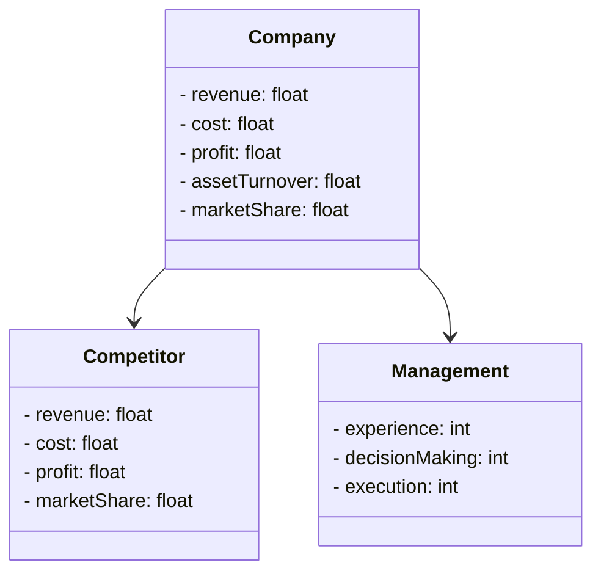
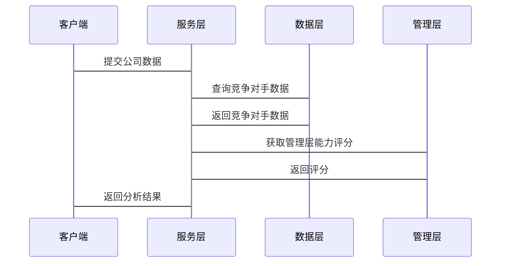

                 


# 彼得林奇对公司经营效率的分析方法

> 关键词：彼得·林奇，公司经营效率，投资分析，财务指标，竞争优势，管理层评估

> 摘要：本文详细探讨了彼得·林奇对公司经营效率的分析方法，从其投资理念、分析框架到具体操作步骤，结合系统分析与实战案例，全面解析如何利用林奇方法评估公司经营效率。

---

## 第一部分: 彼得·林奇投资理念概述

### 第1章: 彼得·林奇与公司经营效率分析

#### 1.1 彼得·林奇的背景与投资理念
##### 1.1.1 彼得·林奇的生平简介
彼得·林奇（Peter Lynch）是美国著名的基金经理和投资专家，以其在富达投资管理公司的卓越表现而闻名。他于1977年加入该公司，管理麦哲伦基金长达14年，期间基金年平均回报率高达29%，远超市场平均水平。

##### 1.1.2 林奇的投资哲学与方法
林奇强调长期投资和深入研究企业的基本面，认为市场波动为投资者提供了廉价买入优质资产的机会。他的投资策略注重公司基本面分析，尤其是对经营效率的关注。

##### 1.1.3 林奇对公司分析的独特视角
林奇善于通过分析公司的财务指标、竞争优势和管理层能力，评估其经营效率和未来盈利能力。他认为，经营效率是决定公司长期价值的关键因素。

#### 1.2 公司经营效率的核心概念
##### 1.2.1 经营效率的定义与内涵
经营效率指公司在资源利用和价值创造上的能力，包括资产周转率、成本控制和利润转化等方面。

##### 1.2.2 经营效率与企业价值的关系
高经营效率通常意味着公司能够更有效地利用资源，创造更高的利润，从而提升企业价值。

##### 1.2.3 林奇分析方法的边界与外延
林奇的分析方法主要关注财务指标和竞争优势，但其核心思想可以扩展到公司治理和管理层能力等方面。

---

## 第二部分: 林奇分析方法的核心框架

### 第2章: 林奇分析方法的理论基础

#### 2.1 财务指标在经营效率分析中的应用
##### 2.1.1 主要财务指标的定义与计算
- 资产周转率：$$ \text{资产周转率} = \frac{\text{营业收入}}{\text{平均资产}} $$
- 净利润率：$$ \text{净利润率} = \frac{\text{净利润}}{\text{营业收入}} $$
- 成本控制率：$$ \text{成本控制率} = \frac{\text{成本}}{\text{营业收入}} $$

#### 2.2 竞争优势与市场地位的评估
##### 2.2.1 竞争优势的分类
- 绝对竞争优势：公司在成本、质量或技术上显著优于竞争对手。
- 相对竞争优势：公司在某些方面优于同行，但并非绝对优势。

#### 2.3 管理层能力的判断标准
##### 2.3.1 管理层的背景与经验
##### 2.3.2 管理层的战略决策能力
##### 2.3.3 管理层的执行力与团队建设

### 第3章: 林奇分析方法的逻辑架构

#### 3.1 分析框架的构成要素
- 财务指标：资产周转率、净利润率等。
- 竞争优势：绝对优势、相对优势。
- 管理层能力：背景、决策能力、执行力。

#### 3.2 各要素之间的关系与权重
##### 3.2.1 财务指标与竞争优势的关系
- 高资产周转率表明公司高效利用资产，可能具有竞争优势。
- 高净利润率反映公司盈利能力，可能具备成本控制优势。

#### 3.3 林奇分析方法的系统性与可操作性
- 系统性：全面考虑财务、竞争和管理层因素。
- 可操作性：通过量化指标和定性分析相结合，便于实际操作。

---

## 第三部分: 林奇分析方法的系统分析与架构设计

### 第4章: 系统分析与架构设计

#### 4.1 问题场景介绍
通过分析一家虚构的公司（例如，XYZ公司）的财务数据和市场地位，评估其经营效率。

#### 4.2 系统功能设计（领域模型）


#### 4.3 系统架构设计


#### 4.4 系统接口设计
- 输入：公司财务数据、竞争对手数据、管理层能力评估。
- 输出：公司经营效率评分、竞争优势分析、管理层能力评分。

#### 4.5 系统交互设计


---

## 第四部分: 项目实战与案例分析

### 第5章: 项目实战

#### 5.1 环境安装
- 数据库：MySQL或MongoDB。
- 开发工具：Python、Jupyter Notebook。
- 库：pandas、numpy、scikit-learn。

#### 5.2 核心实现源代码
```python
import pandas as pd
import numpy as np

def calculate_asset_turnover(revenue, assets):
    return revenue / ((assets + np.mean(assets)) / 2)

def calculate_profit_margin(net_profit, revenue):
    return net_profit / revenue * 100

# 示例数据
data = {
    'revenue': [1000, 1200, 1500],
    'assets': [500, 600, 700],
    'net_profit': [100, 120, 150]
}

df = pd.DataFrame(data)

# 计算资产周转率和净利润率
df['asset_turnover'] = df.apply(lambda row: calculate_asset_turnover(row['revenue'], row['assets']), axis=1)
df['profit_margin'] = df.apply(lambda row: calculate_profit_margin(row['net_profit'], row['revenue']), axis=1)

print(df)
```

#### 5.3 案例分析
以XYZ公司为例，分析其经营效率：
1. 计算资产周转率和净利润率。
2. 评估其竞争优势。
3. 分析管理层能力。
4. 综合评分。

---

## 第五部分: 总结与展望

### 第6章: 总结与展望

#### 6.1 最佳实践
- 综合考虑财务指标、竞争优势和管理层能力。
- 结合定量分析和定性评估。

#### 6.2 小结
彼得·林奇的分析方法为我们提供了一个系统化的框架，通过深入分析公司的财务表现、市场地位和管理层能力，能够有效评估其经营效率。

#### 6.3 注意事项
- 数据来源的准确性。
- 分析框架的适用性。
- 持续关注公司动态。

#### 6.4 拓展阅读
推荐书籍：《彼得·林奇的成功投资》、《投资最重要的事情》。

---

## 作者：AI天才研究院/AI Genius Institute & 禅与计算机程序设计艺术 /Zen And The Art of Computer Programming

---

这篇文章系统地介绍了彼得·林奇的公司经营效率分析方法，从理论到实践，结合案例和代码实现，为读者提供了全面的指导。希望对您在投资分析和公司评估方面有所帮助！

