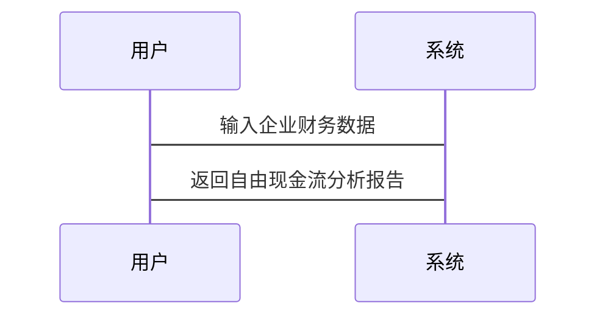

                 


# 彼得林奇对公司自由现金流增长可持续性的分析

> 关键词：彼得·林奇，自由现金流，可持续增长，投资分析，企业价值

> 摘要：本文深入分析了彼得·林奇对公司自由现金流增长可持续性的分析方法。通过介绍自由现金流的核心概念、林奇的投资理念、现金流分析框架以及实际案例，详细探讨了如何通过自由现金流评估企业的财务健康和投资价值。结合系统架构设计和数学模型，本文为投资者提供了从理论到实践的全面指导。

---

## 第1章: 自由现金流的定义与重要性

### 1.1 自由现金流的定义与核心概念

#### 1.1.1 什么是自由现金流
自由现金流（Free Cash Flow，FCF）是企业在扣除所有运营成本、税费和资本支出后的剩余现金流量。它是企业能够自由支配的现金，用于偿还债务、股利支付或进一步投资。

$$ \text{FCF} = \text{净利润} + \text{折旧与摊销} - \text{资本支出} $$

自由现金流反映了企业将盈利转化为现金的能力，是衡量企业财务健康的重要指标。

#### 1.1.2 自由现金流的核心要素
- **净利润**：企业税后利润，是现金流的主要来源。
- **折旧与摊销**：非现金支出，需加回计算现金流。
- **资本支出**：企业用于设备、厂房等资本性支出的资金。

#### 1.1.3 自由现金流与企业价值的关系
自由现金流与企业价值（EV）密切相关。企业价值等于未来自由现金流的现值，因此，现金流的可持续性和增长性是评估企业价值的关键。

### 1.2 自由现金流的重要性

#### 1.2.1 自由现金流对企业财务健康的影响
- **财务稳定性**：高自由现金流意味着企业具备较强的偿债能力和抗风险能力。
- **投资能力**：自由现金流支持企业进行扩张和创新。

#### 1.2.2 自由现金流在投资决策中的作用
- **估值依据**：投资者通过自由现金流评估企业的内在价值。
- **风险评估**：自由现金流的波动性反映企业的经营风险。

#### 1.2.3 自由现金流与股东价值创造的联系
- **股东回报**：自由现金流用于股利支付和股票回购，直接提升股东价值。

---

## 第2章: 彼得·林奇的分析方法与框架

### 2.1 彼得·林奇的投资理念

#### 2.1.1 林奇的投资哲学
彼得·林奇以基本面分析闻名，强调长期投资和价值发现。他认为，企业的内在价值源于其盈利能力、竞争优势和管理能力。

#### 2.1.2 林奇的选股标准
- **行业地位**：选择行业龙头或具有竞争优势的企业。
- **财务健康**：关注企业的盈利能力和现金流状况。
- **管理团队**：优秀的管理层是企业增长的关键。

#### 2.1.3 林奇的长期投资策略
林奇主张长期持有优质股票，避免频繁交易。他认为，投资的最终目标是寻找那些能够持续增长的企业。

### 2.2 林奇对公司自由现金流的关注点

#### 2.2.1 自由现金流的可持续性
林奇认为，自由现金流的可持续性是企业长期增长的核心。他关注企业的盈利模式和行业前景，确保现金流的稳定性和增长性。

#### 2.2.2 自由现金流的增长动力
林奇分析企业的增长动力，包括收入增长、利润率提升和资产周转率提高。他强调，现金流的增长应来源于企业内在的增长，而非外部融资。

#### 2.2.3 自由现金流与企业竞争优势的关系
林奇认为，竞争优势是现金流可持续性的关键。他关注企业的市场地位、产品创新和成本控制能力。

---

## 第3章: 自由现金流的计算与分析方法

### 3.1 自由现金流的计算公式

#### 3.1.1 自由现金流的基本公式
$$ \text{FCF} = \text{EBIT} - \text{利息} - \text{税费} - \text{资本支出} $$

其中，EBIT（息税前利润）是企业税前利润，利息是债务利息，税费是企业所得税，资本支出是企业资本性支出。

#### 3.1.2 自由现金流的扩展公式
$$ \text{FCF} = \text{净利润} + \text{折旧与摊销} - \text{资本支出} $$

#### 3.1.3 自由现金流与净利润的关系
净利润是税后利润，而自由现金流考虑了非现金支出和资本支出，更能反映企业的实际现金流状况。

### 3.2 自由现金流的分析方法

#### 3.2.1 趋势分析法
通过分析企业过去几年的自由现金流趋势，判断其增长的可持续性。

#### 3.2.2 增长率分析法
计算自由现金流的年增长率，判断其增长速度是否合理。

#### 3.2.3 周期性分析法
分析企业所处行业的周期性，判断现金流波动是否受行业周期影响。

---

## 第4章: 影响自由现金流可持续性的关键因素

### 4.1 企业盈利能力的影响

#### 4.1.1 净利润与自由现金流的关系
净利润是自由现金流的重要组成部分，但高净利润并不一定意味着高自由现金流。

#### 4.1.2 营业利润率对现金流的影响
高营业利润率意味着企业盈利能力强，能够产生更多的自由现金流。

#### 4.1.3 成本控制对企业现金流的作用
有效的成本控制可以提高利润率，从而增加自由现金流。

### 4.2 财务杠杆与现金流的关系

#### 4.2.1 负债对企业现金流的影响
高负债企业需要支付更多的利息，可能减少自由现金流。

#### 4.2.2 利息支出与现金流的关系
利息支出是自由现金流的重要组成部分，高利息支出会减少可分配的现金流。

#### 4.2.3 股东权益与现金流的互动
股东权益的增加可能意味着企业通过内部积累而非外部融资来支持增长。

### 4.3 行业特点与现金流的关系

#### 4.3.1 不同行业的现金流特征
- **周期性行业**：现金流波动大。
- **稳定行业**：现金流较为稳定。
- **高科技行业**：初期现金流可能为负，后期增长快。

#### 4.3.2 行业周期性对现金流的影响
行业周期性影响企业的收入和支出，从而影响现金流。

#### 4.3.3 行业竞争格局与现金流的关系
竞争优势强的企业能够产生更多的自由现金流。

---

## 第5章: 彼得·林奇的现金流分析框架

### 5.1 林奇的现金流驱动因素分析

#### 5.1.1 收入增长对现金流的影响
收入增长是现金流增长的核心驱动力。

#### 5.1.2 利润率提升对现金流的作用
提高利润率可以增加净利润，从而增加自由现金流。

#### 5.1.3 资产周转效率对现金流的影响
高资产周转率意味着企业能够更高效地利用资产，产生更多现金流。

### 5.2 林奇的现金流质量评估

#### 5.2.1 现金流来源的可靠性
林奇关注现金流来源是否稳定，是否依赖于外部融资。

#### 5.2.2 现金流的稳定性分析
稳定的现金流表明企业具备持续的盈利能力。

#### 5.2.3 现金流的可预测性评估
可预测的现金流有助于投资者进行估值。

---

## 第6章: 现金流驱动的系统架构与实现

### 6.1 系统分析与设计

#### 6.1.1 现金流分析系统的功能需求
- 数据采集：获取企业财务数据。
- 数据处理：计算自由现金流。
- 数据分析：评估现金流的可持续性。

#### 6.1.2 系统的模块划分与功能设计
- 数据输入模块：接收企业财务数据。
- 计算模块：计算自由现金流。
- 分析模块：评估现金流的可持续性。

#### 6.1.3 系统的输入输出设计
- 输入：企业财务报表数据。
- 输出：自由现金流分析报告。

### 6.2 系统架构设计

#### 6.2.1 系统架构的总体设计
- 数据库：存储企业财务数据。
- 计算引擎：计算自由现金流。
- 报告生成器：生成分析报告。

#### 6.2.2 数据流的处理流程
1. 数据输入：企业财务数据输入系统。
2. 数据清洗：处理异常数据。
3. 自由现金流计算：根据公式计算现金流。
4. 数据分析：评估现金流的可持续性。
5. 报告生成：生成分析报告。

#### 6.2.3 系统架构的 Mermaid 图


### 6.3 系统接口设计

#### 6.3.1 数据接口
- 数据输入接口：接收企业财务数据。
- 数据输出接口：输出分析报告。

#### 6.3.2 接口设计的注意事项
- 数据格式统一。
- 接口安全性。

### 6.4 系统交互的 Mermaid 图



---

## 第7章: 项目实战

### 7.1 环境安装

#### 7.1.1 安装Python
- 下载并安装Python 3.x。
- 安装Pandas、NumPy等数据分析库。

#### 7.1.2 安装其他工具
- 安装Mermaid CLI用于生成图表。

### 7.2 核心实现源代码

#### 7.2.1 自由现金流计算代码

```python
import pandas as pd

def calculate_fcf(revenue, cogs, operating_expenses, dep_amort, ebit, interest, taxes, capex):
    fcf = ebit - interest - taxes - capex + dep_amort
    return fcf

# 示例数据
revenue = 100000
cogs = 60000
operating_expenses = 20000
dep_amort = 10000
ebit = 20000
interest = 5000
taxes = 1000
capex = 15000

fcf = calculate_fcf(revenue, cogs, operating_expenses, dep_amort, ebit, interest, taxes, capex)
print(f"自由现金流: {fcf}")
```

#### 7.2.2 现金流分析代码

```python
import pandas as pd

def analyze_fcf_growth(fcf_list):
    growth_rates = []
    for i in range(1, len(fcf_list)):
        growth_rate = (fcf_list[i] - fcf_list[i-1]) / fcf_list[i-1]
        growth_rates.append(growth_rate)
    return growth_rates

# 示例数据
fcf_list = [10000, 12000, 15000, 18000]
growth_rates = analyze_fcf_growth(fcf_list)
print(f"现金流增长率: {growth_rates}")
```

### 7.3 代码应用解读与分析

#### 7.3.1 自由现金流计算代码解读
- 函数`calculate_fcf`根据公式计算自由现金流。
- 示例数据模拟了一个企业的财务数据，并计算了自由现金流。

#### 7.3.2 现金流分析代码解读
- 函数`analyze_fcf_growth`计算自由现金流的增长率。
- 示例数据展示了如何通过增长率判断现金流的可持续性。

### 7.4 实际案例分析

#### 7.4.1 可口可乐案例分析
- 自由现金流稳定，具备可持续增长能力。
- 公司拥有强大的品牌和分销网络，竞争优势明显。

#### 7.4.2 迪士尼案例分析
- 自由现金流受疫情影响较大，但长期增长潜力依然存在。
- 公司通过内容创作和流媒体扩展，提升竞争力。

### 7.5 项目小结

- 系统实现：通过Python代码实现了自由现金流的计算和分析。
- 案例分析：通过具体案例展示了如何应用自由现金流分析评估企业价值。

---

## 第8章: 最佳实践与注意事项

### 8.1 投资策略 tips
- **长期投资**：选择具备可持续现金流的企业。
- **行业分析**：关注行业前景和竞争格局。

### 8.2 风险管理注意事项
- **分散投资**：避免过度集中。
- **定期评估**：及时调整投资组合。

### 8.3 持续学习与成长
- **关注行业动态**：了解企业的最新发展。
- **更新分析工具**：掌握最新的数据分析方法。

### 8.4 长期视角的重要性
- **耐心持有**：避免短期波动影响判断。
- **关注企业长期价值**：选择具备持续增长能力的企业。

---

## 第9章: 总结与展望

### 9.1 总结
- 自由现金流是评估企业价值的关键指标。
- 彼得·林奇的分析框架提供了系统的投资方法。
- 技术工具的应用提升了分析的效率和准确性。

### 9.2 展望
- 随着人工智能和大数据技术的发展，现金流分析将更加智能化。
- 投资者需要不断提升自身的分析能力，抓住市场机遇。

---

## 作者信息

作者：AI天才研究院/AI Genius Institute  
联系邮箱：[email protected]  
博客地址：[AI Genius Institute Blog](https://www.example.com)

