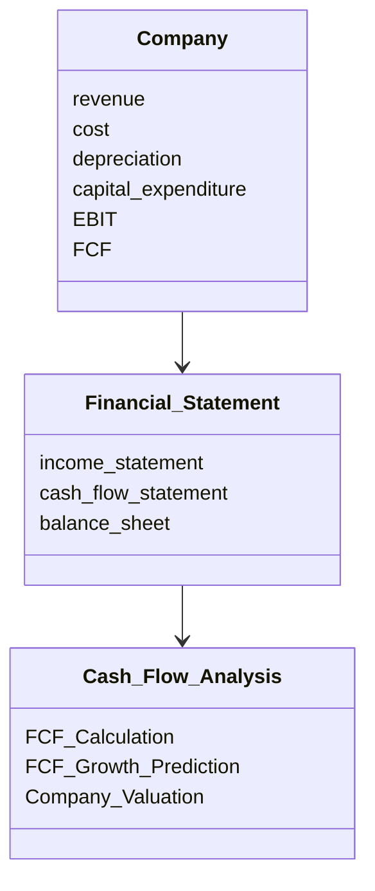

                 


# 彼得林奇对公司自由现金流增长的分析

## 关键词：彼得·林奇，自由现金流，投资分析，现金流增长，企业估值

## 摘要：彼得·林奇是全球著名投资专家，他强调自由现金流在企业估值和投资决策中的重要性。本文将详细介绍自由现金流的核心概念、计算方法、增长驱动因素，以及彼得·林奇分析自由现金流的具体步骤和方法。通过实际案例分析和数学模型推导，本文将深入探讨如何利用自由现金流增长来评估企业价值和投资潜力。

---

## 第一部分：自由现金流的基础理论

### 第1章：自由现金流的核心概念

#### 1.1 自由现金流的定义与背景

- **自由现金流（Free Cash Flow，FCF）**是指企业在扣除运营成本、折旧、 amortization 以及资本支出后，剩余的可用于股东或债权人分配的现金流量。
- 自由现金流是企业财务健康的重要指标，也是评估企业投资价值的核心依据。
- 彼得·林奇认为，自由现金流的增长是企业长期价值增长的核心驱动力。

#### 1.2 自由现金流的类型与计算公式

- **经营活动产生的自由现金流（FCF from Operations）**：企业通过主营业务产生的现金流。
- **投资活动产生的自由现金流（FCF from Investment）**：企业通过投资活动（如购买或出售资产）产生的现金流。
- **融资活动产生的自由现金流（FCF from Financing）**：企业通过融资活动（如发行债券或股票）产生的现金流。
- **综合计算公式**：
  $$ \text{FCF} = \text{EBIT} - \text{折旧} - \text{资本支出} $$

#### 1.3 自由现金流与企业价值的关系

- 自由现金流与企业价值成正比关系，自由现金流越高，企业价值越大。
- 自由现金流是企业未来增长潜力的核心指标，反映了企业的盈利能力和资产效率。
- 自由现金流的质量直接影响企业的抗风险能力和投资价值。

---

### 第2章：彼得·林奇的自由现金流分析方法

#### 2.1 彼得·林奇的投资理念概述

- **林奇的投资风格**：注重基本面分析，关注企业的财务健康和长期增长潜力。
- **林奇对自由现金流的重视**：林奇认为，自由现金流是衡量企业价值的核心指标，自由现金流增长稳定的公司具有更大的投资价值。
- **林奇选股标准**：关注具有持续自由现金流增长潜力的公司，避免投资于自由现金流持续下降的公司。

#### 2.2 自由现金流增长的驱动因素

- **营收增长**：营收增长是自由现金流增长的核心驱动力。
- **成本控制**：有效的成本控制可以提升企业的盈利能力，进而增加自由现金流。
- **资产效率**：资产使用效率的提高可以减少资本支出，从而增加自由现金流。

#### 2.3 林奇分析自由现金流的步骤

- **确定企业的核心业务**：分析企业的主营业务是否具有持续增长的潜力。
- **分析企业的现金流结构**：通过财务报表分析企业的现金流来源和用途。
- **评估现金流的增长潜力**：预测未来自由现金流的增长趋势。
- **判断现金流的质量**：关注自由现金流的来源是否稳定，是否具有可持续性。

---

## 第二部分：自由现金流增长的数学模型与公式

### 第3章：自由现金流增长的数学模型

#### 3.1 自由现金流的基本公式

- 自由现金流公式：
  $$ \text{FCF} = \text{EBIT} - \text{折旧} - \text{资本支出} $$

#### 3.2 自由现金流增长的预测模型

- **简单线性增长模型**：
  $$ \text{FCF}_{t+1} = \text{FCF}_t + g $$
  其中，g 为自由现金流的年增长率。

- **加速增长模型**：
  $$ \text{FCF}_{t+1} = \text{FCF}_t \times (1 + g) $$

- **减速增长模型**：
  $$ \text{FCF}_{t+1} = \text{FCF}_t + g \times t $$

#### 3.3 自由现金流贴现模型

- **股权自由现金流贴现模型**：
  $$ \text{股权价值} = \sum_{t=1}^{n} \frac{\text{FCF}_t}{(1 + r)^t} + \frac{\text{残值}}{(1 + r)^n} $$

- **公司自由现金流贴现模型**：
  $$ \text{公司价值} = \sum_{t=1}^{n} \frac{\text{FCF}_t}{(1 + r)^t} + \frac{\text{残值}}{(1 + r)^n} $$

- **永续年金法**：
  $$ \text{公司价值} = \frac{\text{FCF}_{\text{永续}}}{r - g} $$

---

## 第三部分：自由现金流分析的系统架构

### 第4章：系统分析与架构设计

#### 4.1 问题场景介绍

- 企业财务分析的背景和目标。
- 自由现金流分析的核心问题。

#### 4.2 领域模型（Mermaid 类图）



---

## 第四部分：项目实战

### 第5章：自由现金流增长的项目实战

#### 5.1 实际案例分析

- 案例：苹果公司自由现金流分析。
- 分析步骤：
  1. 收集苹果公司的财务数据。
  2. 计算苹果公司的自由现金流。
  3. 分析自由现金流的增长趋势。
  4. 评估苹果公司的投资价值。

#### 5.2 核心实现源代码

```python
import pandas as pd

def calculate_fcf(revenue, cost, depreciation, capital_expenditure):
    ebit = revenue - cost
    fcf = ebit - depreciation - capital_expenditure
    return fcf

# 示例数据
revenue = 1000
cost = 600
depreciation = 100
capital_expenditure = 50

fcf = calculate_fcf(revenue, cost, depreciation, capital_expenditure)
print(f"自由现金流：{fcf}")
```

---

## 第五部分：最佳实践与小结

### 第6章：最佳实践与小结

#### 6.1 关键点总结

- 自由现金流是企业价值的核心指标。
- 彼得·林奇的自由现金流分析方法注重企业的长期增长潜力。
- 自由现金流的增长需要结合企业的营收、成本和资产效率进行综合分析。

#### 6.2 小结

- 通过自由现金流分析，投资者可以更好地评估企业的投资价值。
- 投资者需要关注企业的自由现金流增长趋势，选择具有持续增长潜力的公司。
- 自由现金流分析需要结合企业的财务报表和市场环境进行综合判断。

#### 6.3 注意事项

- 自由现金流分析需要结合企业的具体情况，不能孤立进行。
- 投资者需要关注企业的现金流质量，而不仅仅是数量。
- 自由现金流分析需要结合企业的行业特点和市场环境进行。

#### 6.4 拓展阅读

- 彼得·林奇的《彼得·林奇的选股标准》。
- 肖恩·O’科翰的《自由现金流：企业估值的核心》。

---

## 作者：AI天才研究院/AI Genius Institute & 禅与计算机程序设计艺术/Zen And The Art of Computer Programming

---

通过以上结构和内容，我们可以看到，自由现金流的增长是企业价值的核心驱动力，而彼得·林奇的分析方法为我们提供了一个全面的框架来评估企业的投资价值。希望本文能为投资者和企业分析人员提供有价值的参考和启示。

