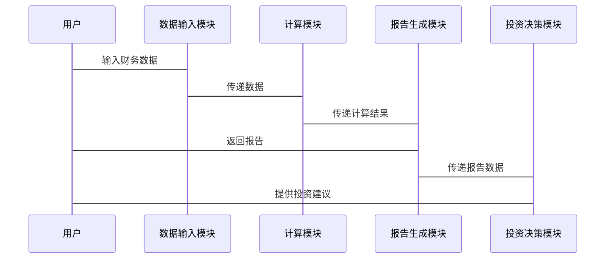

                 

# 彼得林奇对公司自由现金流转换率的分析

> 关键词：彼得·林奇，自由现金流，转换率，投资分析，财务指标

> 摘要：本文深入分析了彼得·林奇对公司自由现金流转换率的分析方法，详细阐述了自由现金流的定义、计算公式及其与企业价值的关系。通过实际案例分析，展示了如何运用自由现金流转换率评估企业的投资价值，并结合系统架构设计，提出了基于现金流转换率的投资策略。

---

## 第一部分: 自由现金流转换率的核心概念

### 第1章: 自由现金流的基本定义

#### 1.1 自由现金流的定义
自由现金流（Free Cash Flow，简称FCF）是指公司在扣除所有运营成本、税费和资本支出后的剩余现金流量。它是公司用于偿还债务、支付股息、回购股票或进行其他投资活动的可用现金。

$$\text{自由现金流} = \text{营业收入} - \text{营业成本} - \text{税费} - \text{资本支出}$$

#### 1.2 自由现金流的计算公式
自由现金流的计算公式可以进一步细化为以下两种形式：

$$\text{FCF} = \text{净利润} + \text{非现金支出}$$
$$\text{FCF} = \text{营业收入} - \text{营业成本} - \text{税费} - \text{资本支出}$$

#### 1.3 自由现金流与企业价值的关系
自由现金流是衡量企业财务健康状况的重要指标，它反映了企业在扣除所有支出后能够产生的剩余现金流量。高自由现金流意味着企业具备较强的盈利能力和发展潜力。

### 第2章: 彼得·林奇的投资理念与方法

#### 2.1 彼得·林奇的投资者画像
彼得·林奇是一位价值投资者，他注重长期持有优质股票，并通过深入研究公司的财务状况和行业地位来选择投资标的。他的投资理念强调以下几点：
1. **长期持有**：避免频繁交易，减少交易成本。
2. **深入研究**：通过分析财务报表和行业趋势，识别具有竞争优势的企业。
3. **分散投资**：通过投资于不同行业和公司的股票，降低投资风险。

#### 2.2 彼得·林奇的投资策略
彼得·林奇的投资策略主要基于以下几个方面：
1. **价值投资**：寻找被市场低估的优质公司。
2. **基本面分析**：通过分析公司的财务报表，评估其盈利能力、成长潜力和财务健康状况。
3. **行业分析**：选择具有长期增长潜力的行业，并投资于该行业的龙头企业。

### 第3章: 自由现金流转换率的数学模型与公式

#### 3.1 自由现金流转换率的公式推导
自由现金流转换率（Free Cash Flow to EBITDA Ratio）是指自由现金流与息税折旧及摊销前利润（EBITDA）的比率。其计算公式为：

$$\text{FCF转换率} = \frac{\text{自由现金流}}{\text{EBITDA}}$$

其中，EBITDA的计算公式为：

$$\text{EBITDA} = \text{营业收入} - \text{营业成本} - \text{税费}$$

#### 3.2 自由现金流转换率的行业差异
不同行业的自由现金流转换率存在显著差异。例如，制造业和科技行业的自由现金流转换率通常较低，而金融和公用事业行业的自由现金流转换率较高。

#### 3.3 自由现金流转换率的财务报表分析
通过分析财务报表，可以更好地理解自由现金流转换率的计算和应用。以下是主要的财务报表项目及其与自由现金流转换率的关系：

1. **资产负债表**：提供公司的资产、负债和所有者权益信息，帮助评估公司的财务健康状况。
2. **利润表**：提供公司的营业收入、营业成本和净利润信息，帮助计算自由现金流。
3. **现金流量表**：提供公司经营活动、投资活动和筹资活动的现金流量信息，帮助计算自由现金流。

---

## 第二部分: 自由现金流转换率的系统分析与架构设计

### 第5章: 自由现金流转换率的系统分析

#### 5.1 系统分析的背景与目标
自由现金流转换率的系统分析旨在通过构建一个完整的现金流分析系统，帮助企业更好地评估和管理自由现金流。该系统的目标包括：
1. 提供准确的自由现金流计算功能。
2. 分析自由现金流转换率，并生成相应的报告。
3. 为投资决策提供数据支持。

#### 5.2 系统功能设计
以下是自由现金流转换率分析系统的功能设计：

1. **数据输入模块**：用户可以输入公司的财务数据，包括营业收入、营业成本、税费、资本支出等。
2. **计算模块**：系统根据输入的财务数据，计算自由现金流和自由现金流转换率。
3. **报告生成模块**：系统生成包含自由现金流转换率分析的报告，并提供可视化图表。
4. **投资决策模块**：基于自由现金流转换率分析结果，系统为投资者提供投资建议。

#### 5.3 系统架构设计
以下是自由现金流转换率分析系统的架构设计：

#### 5.4 系统接口设计
系统接口设计包括以下几个部分：

1. **数据输入接口**：用户可以通过网页或API输入财务数据。
2. **计算接口**：系统通过内部API调用计算模块，完成自由现金流和转换率的计算。
3. **报告生成接口**：系统通过接口生成报告，并将其存储在数据库中。
4. **投资决策接口**：系统根据计算结果，通过接口向用户提供建议。

#### 5.5 系统交互设计
以下是系统交互设计的序列图：

---

## 第三部分: 自由现金流转换率的实战案例

### 第6章: 自由现金流转换率的实战分析

#### 6.1 实战分析背景
以苹果公司为例，分析其自由现金流转换率。以下是苹果公司2020年的财务数据：

| 项目             | 数额（亿美元） |
|------------------|----------------|
| 营业收入         | 3943.8         |
| 营业成本         | 2283.7         |
| 税费             | 93.9           |
| 资本支出         | 320.8          |
| 净利润           | 1001.9         |
| 自由现金流       | 1053.9         |

#### 6.2 自由现金流转换率的计算
根据上述数据，苹果公司的自由现金流转换率为：

$$\text{FCF转换率} = \frac{1053.9}{1001.9} \approx 1.052$$

这意味着苹果公司的自由现金流略高于其净利润。

#### 6.3 投资建议
基于自由现金流转换率的分析，苹果公司的自由现金流转换率接近1，表明其自由现金流与净利润基本持平。因此，苹果公司具备较强的盈利能力和发展潜力，适合长期投资。

---

## 第四部分: 总结与展望

### 第7章: 总结与展望

#### 7.1 核心结论
通过本文的分析，我们可以得出以下结论：
1. 自由现金流转换率是衡量企业财务健康状况的重要指标。
2. 彼得·林奇的投资理念强调价值投资和长期持有，这与自由现金流转换率的分析方法高度契合。
3. 通过构建自由现金流转换率分析系统，可以帮助投资者更好地评估企业的投资价值。

#### 7.2 未来展望
未来，随着大数据和人工智能技术的发展，自由现金流转换率的分析方法将更加智能化和自动化。投资者可以通过更加精准的数据分析和预测模型，做出更加科学的投资决策。

---

## 作者：AI天才研究院/AI Genius Institute & 禅与计算机程序设计艺术 /Zen And The Art of Computer Programming

---

以上是《彼得林奇对公司自由现金流转换率的分析》的技术博客文章的完整目录和内容框架。通过本文的分析，读者可以深入理解自由现金流转换率的核心概念，并学会如何将其应用于实际投资分析中。

