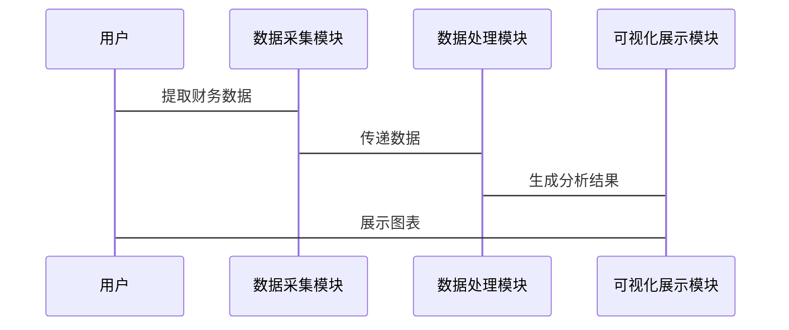

                 


# 彼得·林奇对公司营业利润率趋势的分析

> 关键词：营业利润率，彼得·林奇，投资分析，趋势分析，财务指标

> 摘要：本文从彼得·林奇的投资理念出发，详细分析了营业利润率这一关键财务指标的构成、计算方法及其在投资分析中的应用。通过对比不同行业的营业利润率，结合趋势分析方法，探讨如何利用营业利润率的变化趋势进行投资决策。文章还提供了实际案例和系统架构设计，帮助读者更好地理解和应用这一分析方法。

---

## 第一部分：背景介绍

### 第1章：营业利润率的基本概念

#### 1.1 什么是营业利润率

- **定义**：营业利润率是衡量公司盈利能力的重要指标，表示每单位收入中能够转化为利润的比例。
- **意义**：营业利润率能够反映公司的成本控制能力、运营效率以及市场竞争力。较高的营业利润率通常意味着公司具有较强的盈利能力。
- **与净利润率的区别**：净利润率考虑了所有费用（包括利息和税金），而营业利润率仅关注营业收入与营业成本之间的关系。

#### 1.2 营业利润率的计算方法

- **公式**：营业利润率 = （营业收入 - 营业成本） / 营业收入 × 100%
- **步骤**：
  1. 确定公司的营业收入和营业成本。
  2. 计算营业利润（营业收入 - 营业成本）。
  3. 将营业利润除以营业收入，得到营业利润率。
- **影响因素**：
  - 行业特性：不同行业的成本结构不同，影响营业利润率。
  - 公司规模：规模较大的公司可能通过 economies of scale 提高营业利润率。
  - 管理效率：高效的管理可以降低营业成本，提高利润率。

#### 1.3 营业利润率的行业差异

- **行业对比**：例如，零售业的营业利润率通常较低，而软件行业的营业利润率较高。
- **行业特点**：高固定成本行业（如制造业）可能通过提高销量来提高营业利润率。
- **选择行业**：投资者应选择与自身投资策略匹配的行业，关注行业的长期增长潜力。

### 第2章：彼得·林奇的投资理念

#### 2.1 彼得·林奇的简介

- **生平**：彼得·林奇是美国著名投资经理人，曾管理富达麦哲伦基金，取得了卓越的投资业绩。
- **投资风格**：注重基本面分析，偏好具有稳定增长潜力的公司。
- **经典理论**：彼得·林奇强调选择具有强大竞争优势和管理团队的公司。

#### 2.2 彼得·林奇对营业利润率的重视

- **分析体系中的地位**：营业利润率是彼得·林奇分析公司财务状况的重要指标之一。
- **投资决策**：彼得·林奇通过分析营业利润率的趋势，评估公司的盈利能力是否稳定或改善。
- **经典案例**：例如，他如何通过分析某一公司营业利润率的持续增长，判断其投资价值。

---

## 第二部分：营业利润率趋势分析的核心概念

### 第3章：营业利润率的构成与属性

#### 3.1 营业利润率的构成要素

- **收入**：公司通过销售产品或服务获得的总收入。
- **成本**：生产产品或提供服务所发生的直接成本。
- **费用**：包括销售费用、管理费用等，但通常不包括在营业利润率的计算中。

#### 3.2 营业利润率的属性对比

- **时间属性**：分析不同时间段（季度、年度）的营业利润率变化，识别趋势。
- **行业属性**：不同行业的营业利润率差异较大，需结合行业特点进行分析。
- **公司规模属性**：大公司可能通过规模效应提高营业利润率。

#### 3.3 营业利润率的ER实体关系图

```mermaid
erDiagram
    company {
        id
        name
        industry
    }
    financial_data {
        id
        revenue
        cost_of_goods_sold
        operating_income
        operating_profit_margin
    }
    analysis_result {
        id
        company_id
        period
        profit_margin
        trend
    }
    company --|> financial_data : belongs_to
    financial_data --|> analysis_result : leads_to
```

---

## 第三部分：营业利润率趋势分析的方法

### 第4章：营业利润率趋势分析的核心方法

#### 4.1 营业利润率趋势的计算方法

- **同比分析**：比较同一时间段（如去年同期）的营业利润率变化。
- **环比分析**：比较相邻时间段（如上季度）的营业利润率变化。
- **趋势类型识别**：通过数据点的变化，识别营业利润率是呈现上升、下降还是波动趋势。

#### 4.2 营业利润率波动性分析

- **波动原因**：行业周期性、公司战略调整、市场环境变化等。
- **稳定性评估**：长期稳定的营业利润率表明公司具有较强的盈利能力。

#### 4.3 营业利润率趋势分析的图表展示

- **折线图**：展示不同时间段的营业利润率变化趋势。
- **柱状图**：对比不同公司或行业的营业利润率。

```mermaid
lineChart
    title 营业利润率趋势
    xaxis
        label 财务年度
        values 2018,2019,2020,2021,2022
    yaxis
        label 营业利润率（%）
    plot
        "2018" 12
        "2019" 15
        "2020" 14
        "2021" 18
        "2022" 20
```

---

## 第四部分：基于营业利润率趋势的投资策略

### 第5章：投资策略的核心要素

#### 5.1 选择投资目标的条件

- **营业利润率稳定增长**：表明公司具有良好的盈利能力。
- **行业地位稳固**：选择行业龙头或具有竞争优势的公司。
- **财务健康状况**：关注公司的资产负债情况和现金流状况。

#### 5.2 投资策略的制定

- **长期投资**：选择营业利润率持续增长的公司，长期持有。
- **短期投资**：根据营业利润率的短期波动，进行波段操作。

#### 5.3 风险管理

- **止损策略**：设定止损点，避免重大损失。
- **分散投资**：通过投资不同行业的公司，降低风险。

---

## 第五部分：系统分析与架构设计方案

### 第6章：系统架构设计

#### 6.1 系统功能设计

- **数据采集**：从财务报表中提取营业收入和营业成本数据。
- **趋势计算**：计算营业利润率，并生成趋势分析结果。
- **可视化展示**：通过图表展示营业利润率的变化趋势。

#### 6.2 系统架构图


#### 6.3 接口设计

- **数据接口**：提供API用于数据采集和处理。
- **用户接口**：提供友好的用户界面，方便用户查看分析结果。

#### 6.4 交互流程



---

## 第六部分：项目实战

### 第7章：项目实战与案例分析

#### 7.1 环境安装

- **工具安装**：安装Python、Pandas、Matplotlib等工具。
- **数据获取**：从公开的财务报表中获取数据。

#### 7.2 核心实现

```python
import pandas as pd
import matplotlib.pyplot as plt

# 假设data为包含财务数据的DataFrame
data['operating_profit_margin'] = (data['revenue'] - data['cost_of_goods_sold']) / data['revenue'] * 100

# 绘制趋势图
plt.plot(data['year'], data['operating_profit_margin'], label='Operating Profit Margin')
plt.xlabel('Year')
plt.ylabel('Profit Margin (%)')
plt.title('Trend Analysis of Operating Profit Margin')
plt.legend()
plt.show()
```

#### 7.3 实际案例分析

- **案例选择**：选择某行业内的两家公司，分析其营业利润率趋势。
- **结果解读**：根据趋势判断投资价值。

#### 7.4 项目小结

- **关键点**：掌握数据分析方法和工具，能够根据趋势判断投资价值。
- **注意事项**：结合行业特点和公司具体情况，避免单一指标误导。

---

## 第七部分：总结与展望

### 第8章：总结与展望

#### 8.1 总结

- **核心内容**：本文详细介绍了营业利润率的计算方法、分析方法及其在投资中的应用。
- **主要收获**：通过彼得·林奇的案例，读者可以掌握如何利用营业利润率进行投资决策。

#### 8.2 展望

- **未来研究方向**：结合更多财务指标，构建更完善的分析模型。
- **技术发展**：利用人工智能技术，提高分析的准确性和效率。

#### 8.3 最佳实践 tips

- **数据准确性**：确保数据来源可靠，避免错误分析。
- **持续学习**：关注行业动态和市场变化，及时调整分析策略。
- **风险管理**：合理分散投资，控制风险。

---

作者：AI天才研究院 / AI Genius Institute & 禅与计算机程序设计艺术 / Zen And The Art of Computer Programming

