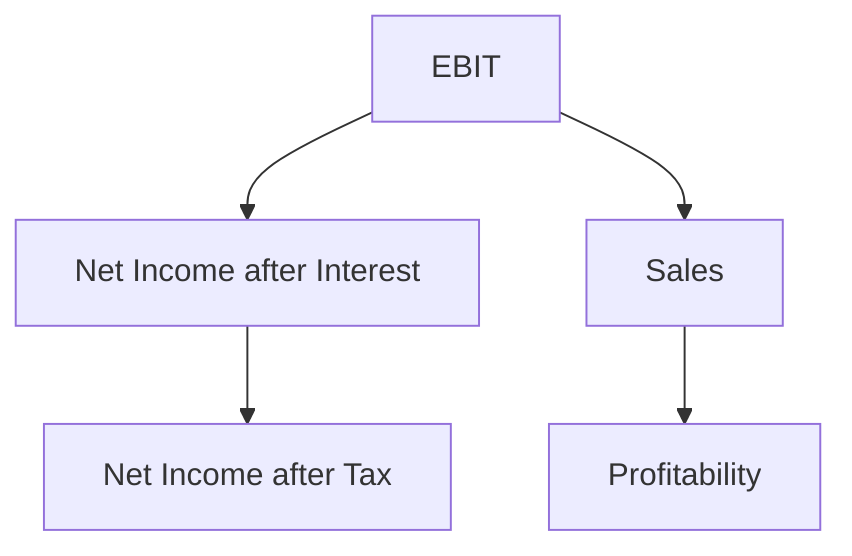
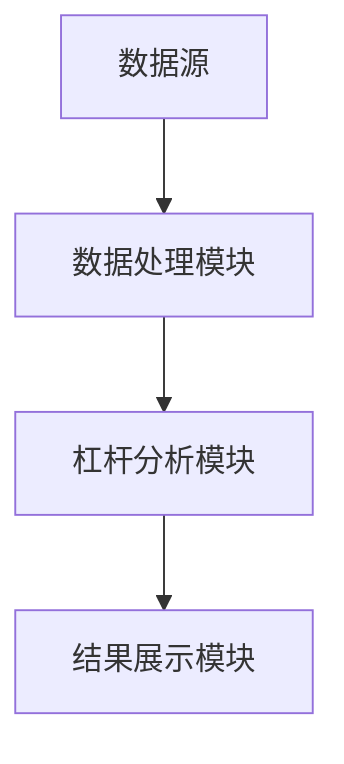

                 


# 彼得林奇对公司营运杠杆与财务杠杆组合效应的分析

## 关键词：彼得·林奇，杠杆，投资分析，财务杠杆，营运杠杆

## 摘要：  
本文深入分析了彼得·林奇在投资分析中对营运杠杆和财务杠杆组合效应的研究。通过介绍杠杆的基本概念、分析它们的协同作用以及在企业中的实际应用，探讨了林奇如何利用杠杆组合效应进行投资决策，并结合实际案例和数学模型，为投资者提供了实用的分析框架和投资策略。

---

## 正文

### 第一部分：背景介绍

#### 第1章：杠杆的基本概念与作用

##### 1.1 营运杠杆的核心概念

- **定义**：营运杠杆衡量了企业息税前利润（EBIT）的变化对销售额变化的敏感程度。
- **特征**：
  - 杠杆作用：销售额增加时，EBIT增长更快。
  - 风险：高营运杠杆意味着更高的收益波动风险。
- **数学模型**：
  $$ EBIT = EBITA - 非利息支出 $$
  其中，EBITA是息税前折旧前利润。

##### 1.2 财务杠杆的核心概念

- **定义**：财务杠杆衡量了企业净利润对EBIT变化的敏感程度。
- **特征**：
  - 放大收益：财务杠杆可以增加净利润。
  - 增加风险：财务杠杆可能导致企业陷入财务困境。
- **数学模型**：
  $$ Net\ Profit\ after\ interest = EBIT \times (1 - 税率) - 利息支出 $$

##### 1.3 营运杠杆与财务杠杆的联系与区别

- **联系**：两者都通过杠杆效应影响企业收益，但作用对象不同。
- **区别**：
  - 营运杠杆影响EBIT，财务杠杆影响净利润。
  - 营运杠杆与企业经营效率相关，财务杠杆与资本结构相关。
- **综合效应**：
  $$ Total\ Return = 营运杠杆效应 + 财务杠杆效应 $$

#### 第2章：彼得·林奇的投资理念与分析框架

##### 2.1 彼得·林奇的投资哲学

- **价值投资的核心理念**：寻找被市场低估的公司，长期持有。
- **林奇的投资风格**：注重基本面分析，关注企业的营运能力和财务健康。
- **成功案例**：通过分析杠杆效应成功投资于一些公司。

##### 2.2 林奇的杠杆分析框架

- **营运杠杆在企业分析中的作用**：评估企业收益的稳定性。
- **财务杠杆在企业分析中的作用**：评估企业的资本结构风险。
- **协同效应**：营运杠杆和财务杠杆的结合可以放大收益。

#### 第3章：营运杠杆与财务杠杆的组合效应

##### 3.1 营运杠杆与财务杠杆的协同作用

- **营运杠杆如何影响企业收益**：提高销售额时，EBIT增长更快。
- **财务杠杆如何放大收益或风险**：通过债务融资放大净利润。
- **数学模型**：
  $$ Total\ Return = (EBIT \times (1 - 税率)) \times (1 + 财务杠杆系数) $$

##### 3.2 营运杠杆与财务杠杆的平衡点

- **平衡点的定义**：EBIT等于利息支出的税后价值。
- **计算公式**：
  $$ EBIT = 利息支出 \times (1 - 税率) $$

##### 3.3 林奇对杠杆组合效应的见解

- **企业分析**：林奇关注企业的杠杆组合是否合理。
- **投资者建议**：在投资时，需考虑企业的杠杆组合是否优化。
- **经典案例分析**：通过具体案例说明林奇如何分析杠杆效应。

### 第二部分：核心概念与联系

#### 第4章：核心概念的深入分析

##### 4.1 营运杠杆与财务杠杆的属性对比

| 特性                | 营运杠杆                          | 财务杠杆                          |
|---------------------|----------------------------------|----------------------------------|
| 作用对象            | EBIT                             | 净利润                            |
| 杠杆效应            | 放大EBIT变化                     | 放大净利润变化                    |
| 风险                | 高收益伴随高风险                | 高收益伴随高财务风险            |
| 应用场景            | 评估企业经营效率                  | 评估资本结构风险                |

##### 4.2 营运杠杆与财务杠杆的关系



### 第三部分：算法原理

#### 第5章：杠杆效应的量化分析

##### 5.1 杠杆效应的数学模型

- **营运杠杆比率**：
  $$ 营运杠杆比率 = \frac{EBIT}{EBIT - 非利息支出} $$
- **财务杠杆比率**：
  $$ 财务杠杆比率 = \frac{Net\ Income}{Net\ Income - 利息支出} $$

##### 5.2 杠杆效应的Python实现

```python
import pandas as pd
import numpy as np

def calculate_leverage_ratios(financials):
    ebit = financials['EBIT']
    ebita = financials['EBITDA']
    non_interest_expense = financials['非利息支出']
    interest_expense = financials['利息支出']
    net_income = financials['净利润']
    
    # 营运杠杆比率
    operating_leverage_ratio = ebit / (ebit - non_interest_expense)
    
    # 财务杠杆比率
    financial_leverage_ratio = net_income / (net_income - interest_expense)
    
    return {
        'operating_leverage_ratio': operating_leverage_ratio,
        'financial_leverage_ratio': financial_leverage_ratio
    }

# 示例数据
financials = {
    'EBIT': 100,
    'EBITDA': 150,
    '非利息支出': 20,
    '利息支出': 30,
    '净利润': 50
}

ratios = calculate_leverage_ratios(financials)
print("营运杠杆比率:", ratios['operating_leverage_ratio'])
print("财务杠杆比率:", ratios['financial_leverage_ratio'])
```

### 第四部分：系统分析与架构设计

#### 第6章：系统分析与架构设计

##### 6.1 系统分析

- **问题场景**：分析企业的杠杆效应，评估投资风险。
- **项目介绍**：开发一个基于杠杆效应的企业分析系统。

##### 6.2 系统架构设计



### 第五部分：项目实战

#### 第7章：项目实战与案例分析

##### 7.1 环境安装

- **安装Python**：用于数据处理和分析。
- **安装Pandas和NumPy**：用于数据操作。

##### 7.2 核心代码实现

```python
import pandas as pd
import numpy as np

def analyze_leverage(ebit, ebitda, non_interest, interest, net_income):
    # 计算营运杠杆比率
    operating_leverage = ebit / (ebit - non_interest)
    # 计算财务杠杆比率
    financial_leverage = net_income / (net_income - interest)
    return operating_leverage, financial_leverage

# 示例数据
ebit = 100
ebitda = 150
non_interest = 20
interest = 30
net_income = 50

# 调用函数
ol, fl = analyze_leverage(ebit, ebitda, non_interest, interest, net_income)
print("营运杠杆比率:", ol)
print("财务杠杆比率:", fl)
```

##### 7.3 案例分析与解读

- **案例**：假设某公司EBIT为100，利息支出为30，税率25%。
- **分析**：
  - EBIT = 100
  - 利息支出 = 30
  - 税后净利润 = (100 - 30) * (1 - 0.25) = 52.5
- **结论**：财务杠杆系数为52.5 / 30 = 1.75，表示每增加1元的EBIT，净利润增加1.75元。

### 第六部分：最佳实践与小结

#### 第8章：最佳实践与小结

##### 8.1 投资建议

- **分散投资**：避免过度依赖单一杠杆效应。
- **关注企业基本面**：选择具有稳定营运杠杆和合理财务杠杆的企业。

##### 8.2 风险控制

- **监控杠杆比率**：定期检查企业的杠杆比率，避免过高风险。
- **市场波动应对**：在市场波动时，调整投资组合中的杠杆比例。

##### 8.3 拓展阅读

- **深入研究**：阅读彼得·林奇的著作，学习更多投资策略。
- **工具应用**：利用金融分析工具进一步分析杠杆效应。

---

## 作者：AI天才研究院/AI Genius Institute & 禅与计算机程序设计艺术 /Zen And The Art of Computer Programming

