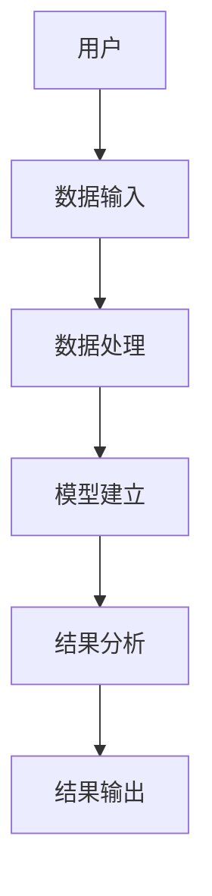
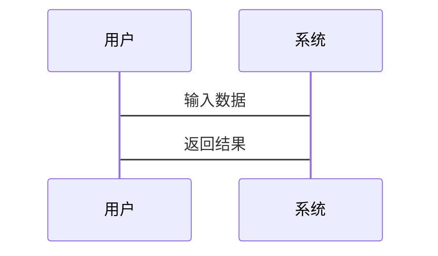

                 


# 彼得林奇对公司营运杠杆与财务杠杆组合效应的动态分析

> 关键词：彼得·林奇，营运杠杆，财务杠杆，组合效应，动态分析

> 摘要：本文将结合彼得·林奇的投资理念，深入分析公司营运杠杆与财务杠杆的组合效应，通过数学模型和动态分析的方法，探讨如何优化杠杆组合以实现企业价值最大化。我们将从核心概念出发，结合实际案例，逐步推导组合效应的数学模型，并通过Python代码实现动态分析，最后总结最佳实践。

---

# 第一部分: 背景介绍与核心概念

## 第1章: 营运杠杆与财务杠杆的定义与核心要素

### 1.1 营运杠杆的基本概念
#### 1.1.1 落实杠杆的定义
杠杆效应是指通过借入资金或其他方式放大收益或风险的现象。在公司财务中，杠杆可以分为营运杠杆和财务杠杆。

$$
\text{杠杆效应} = \frac{\text{收益变化}}{\text{资本变化}}
$$

#### 1.1.2 落实杠杆的核心要素
- **固定成本**: 公司运营中不可避免的固定支出，如租金、工资等。
- **边际成本**: 每增加一单位产量的额外成本。
- **销售量**: 产品或服务的销售数量。

#### 1.1.3 落实杠杆的数学模型
$$
\text{营运杠杆系数} = \frac{\text{息税前利润(EBIT)变化}{\text{销售收入变化}}
$$

### 1.2 财务杠杆的基本概念
#### 1.2.1 落实杠杆的定义
财务杠杆是指通过借入债务来放大股东收益或风险的现象。

$$
\text{财务杠杆系数} = \frac{\text{普通股每股收益(ROE)}}{\text{息税前利润(EBIT)}}
$$

#### 1.2.2 落实杠杆的核心要素
- **债务规模**: 公司借入的债务金额。
- **利息支出**: 债务融资的成本。
- **税率**: 税务抵扣对杠杆的影响。

#### 1.2.3 落实杠杆的数学模型
$$
\text{财务杠杆系数} = \frac{\text{EBIT + 利息支出}}{\text{EBIT}}
$$

### 1.3 营运杠杆与财务杠杆的组合效应
#### 1.3.1 组合效应的定义
营运杠杆与财务杠杆的组合效应是指两者共同作用下对股东收益的影响。

$$
\text{总杠杆系数} = \text{营运杠杆系数} \times \text{财务杠杆系数}
$$

#### 1.3.2 组合效应的边界条件
- **销售量**: 在某一范围内，组合效应的变化会受到销售量的影响。
- **债务规模**: 债务规模的增加会增加财务杠杆，但可能影响公司的信用评级。
- **税率**: 税率的变化会影响财务杠杆的效果。

#### 1.3.3 组合效应的数学表达式
$$
\text{总杠杆系数} = \frac{\text{EBIT + 利息支出}}{\text{EBIT}} \times \frac{\text{EBIT变化}{\text{销售收入变化}}
$$

---

## 第2章: 营运杠杆与财务杠杆的核心概念与联系

### 2.1 营运杠杆与财务杠杆的对比分析
#### 2.1.1 核心概念对比
| 比较维度 | 营运杠杆 | 财务杠杆 |
|---------|---------|---------|
| 定义     | 通过固定成本和边际成本的结合放大收益变化 | 通过债务融资放大股东收益变化 |
| 影响因素 | 销售量、固定成本 | 债务规模、利息支出、税率 |
| 数学模型 | $$ \text{营运杠杆系数} = \frac{\text{EBIT变化}}{\text{销售收入变化} $$ | $$ \text{财务杠杆系数} = \frac{\text{EBIT + 利息支出}}{\text{EBIT}} $$ |

#### 2.1.2 影响因素对比
- 营运杠杆主要受销售量和固定成本的影响。
- 财务杠杆主要受债务规模和税率的影响。

#### 2.1.3 数学模型对比
- 营运杠杆的数学模型关注收益变化对销售量的敏感性。
- 财务杠杆的数学模型关注收益变化对债务融资的敏感性。

### 2.2 营运杠杆与财务杠杆的动态关系
#### 2.2.1 动态关系的定义
营运杠杆与财务杠杆的动态关系是指两者在不同销售量和债务规模下的相互作用。

#### 2.2.2 动态关系的数学表达式
$$
\text{总杠杆系数} = \text{营运杠杆系数} \times \text{财务杠杆系数}
$$

#### 2.2.3 动态关系的案例分析
假设某公司营运杠杆系数为2，财务杠杆系数为1.5，则总杠杆系数为3。这意味着销售收入每增加10%，息税前利润（EBIT）增加20%，而普通股每股收益（ROE）增加30%。

### 2.3 营运杠杆与财务杠杆的组合效应分析
#### 2.3.1 组合效应的数学模型
$$
\text{总杠杆系数} = \frac{\text{EBIT + 利息支出}}{\text{EBIT}} \times \frac{\text{EBIT变化}{\text{销售收入变化}}
$$

#### 2.3.2 组合效应的动态变化
随着销售量的增加，营运杠杆和财务杠杆的组合效应会动态变化。在销售量较低时，营运杠杆的作用较小，而财务杠杆的作用较大。随着销售量的增加，营运杠杆的作用逐渐增强，而财务杠杆的作用相对减弱。

#### 2.3.3 组合效应的边界条件
- 销售量达到一定程度后，营运杠杆的作用会超过财务杠杆的作用。
- 税率的变化会影响财务杠杆的效果。

---

# 第三部分: 算法原理与数学模型

## 第3章: 营运杠杆与财务杠杆的数学模型

### 3.1 营运杠杆的数学模型
#### 3.1.1 营运杠杆的公式推导
$$
\text{营运杠杆系数} = \frac{\text{EBIT变化}{\text{销售收入变化}
$$

#### 3.1.2 营运杠杆的案例分析
假设某公司销售收入增加10%，EBIT增加20%，则营运杠杆系数为2。

#### 3.1.3 营运杠杆的动态分析
随着销售收入的增加，营运杠杆系数会动态变化。在销售量较低时，营运杠杆系数较小，随着销售量的增加，营运杠杆系数逐渐增大。

### 3.2 财务杠杆的数学模型
#### 3.2.1 财务杠杆的公式推导
$$
\text{财务杠杆系数} = \frac{\text{EBIT + 利息支出}}{\text{EBIT}}
$$

#### 3.2.2 财务杠杆的案例分析
假设某公司EBIT为100万元，利息支出为50万元，则财务杠杆系数为1.5。

#### 3.2.3 财务杠杆的动态分析
随着债务规模的增加，财务杠杆系数会动态变化。在债务规模较小时，财务杠杆系数较小，随着债务规模的增加，财务杠杆系数逐渐增大。

### 3.3 营运杠杆与财务杠杆的组合效应模型
#### 3.3.1 组合效应的公式推导
$$
\text{总杠杆系数} = \frac{\text{EBIT + 利息支出}}{\text{EBIT}} \times \frac{\text{EBIT变化}{\text{销售收入变化}
$$

#### 3.3.2 组合效应的案例分析
假设某公司营运杠杆系数为2，财务杠杆系数为1.5，则总杠杆系数为3。这意味着销售收入每增加10%，息税前利润（EBIT）增加20%，而普通股每股收益（ROE）增加30%。

#### 3.3.3 组合效应的动态分析
随着销售量的增加，营运杠杆和财务杠杆的组合效应会动态变化。在销售量较低时，财务杠杆的作用较大，随着销售量的增加，营运杠杆的作用逐渐增强。

---

## 第4章: 营运杠杆与财务杠杆的动态分析算法

### 4.1 动态分析的基本原理
动态分析是通过数学模型和算法，研究营运杠杆和财务杠杆的组合效应在不同条件下的变化。

### 4.2 动态分析的实现步骤
1. 收集数据：包括销售收入、EBIT、利息支出等。
2. 建立数学模型：推导营运杠杆系数、财务杠杆系数和总杠杆系数的公式。
3. 模拟分析：通过Python代码实现动态分析，模拟不同销售量和债务规模下的组合效应。

### 4.3 动态分析的案例分析
假设某公司销售收入为1000万元，EBIT为200万元，利息支出为50万元，税率为25%。我们可以通过Python代码模拟不同销售量和债务规模下的组合效应。

---

# 第四部分: 系统分析与架构设计

## 第5章: 系统分析与架构设计

### 5.1 系统分析
1. 问题场景介绍：分析公司营运杠杆与财务杠杆的组合效应。
2. 系统功能设计：建立数学模型，模拟动态变化。
3. 系统架构设计：使用Mermaid图展示系统结构和交互流程。

### 5.2 系统架构设计


### 5.3 系统交互设计


---

## 第6章: 项目实战

### 6.1 环境安装
安装Python和相关库（如numpy、pandas、matplotlib）。

### 6.2 系统核心实现源代码
```python
import numpy as np
import matplotlib.pyplot as plt

# 定义变量
sales = np.linspace(100, 200, 100)
EBIT = 0.2 * sales
interest_expense = 0.05 * sales
tax_rate = 0.25

# 计算营运杠杆系数
operating_leverage = EBIT / sales

# 计算财务杠杆系数
EBIT_after_tax = EBIT * (1 - tax_rate)
financial_leverage = (EBIT_after_tax + interest_expense) / EBIT_after_tax

# 计算总杠杆系数
total_leverage = operating_leverage * financial_leverage

# 绘制图形
plt.plot(sales, operating_leverage, label='Operating Leverage')
plt.plot(sales, financial_leverage, label='Financial Leverage')
plt.plot(sales, total_leverage, label='Total Leverage')
plt.xlabel('Sales')
plt.ylabel('Leverage Coefficient')
plt.legend()
plt.show()
```

### 6.3 代码应用解读与分析
- **数据输入**: 销售收入、EBIT、利息支出等数据。
- **数据处理**: 计算营运杠杆系数、财务杠杆系数和总杠杆系数。
- **结果分析**: 绘制图形，展示不同销售量下的杠杆效应。

### 6.4 实际案例分析
通过具体案例，分析不同销售量和债务规模下的组合效应。

### 6.5 项目小结
总结项目实现的关键点和注意事项。

---

## 第7章: 最佳实践 tips、小结、注意事项、拓展阅读

### 7.1 最佳实践 tips
- 在实际应用中，要考虑税率、债务规模等多方面因素。
- 动态分析可以帮助企业优化杠杆组合，实现价值最大化。

### 7.2 小结
本文通过数学模型和动态分析的方法，探讨了营运杠杆与财务杠杆的组合效应。结合彼得·林奇的投资理念，提出了优化杠杆组合的策略。

### 7.3 注意事项
- 动态分析的前提是数据的准确性和模型的合理性。
- 在实际应用中，要考虑企业的具体情况和市场环境。

### 7.4 拓展阅读
- 彼得·林奇的《投资之道》
- 财务杠杆与营运杠杆的经典文献

---

# 作者：AI天才研究院/AI Genius Institute & 禅与计算机程序设计艺术 /Zen And The Art of Computer Programming

---

通过以上步骤，我们逐步分析了彼得·林奇对公司营运杠杆与财务杠杆组合效应的动态分析，结合数学模型和Python代码，深入探讨了杠杆组合的优化策略。希望本文能为读者提供有价值的见解和实践指导。

