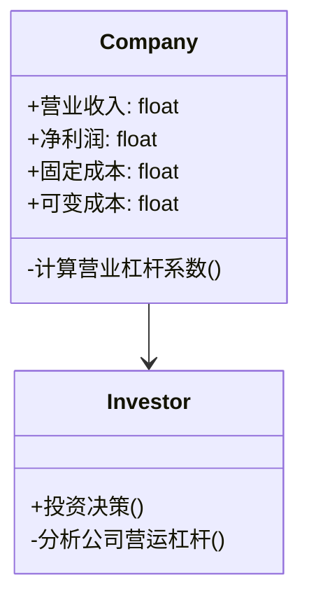
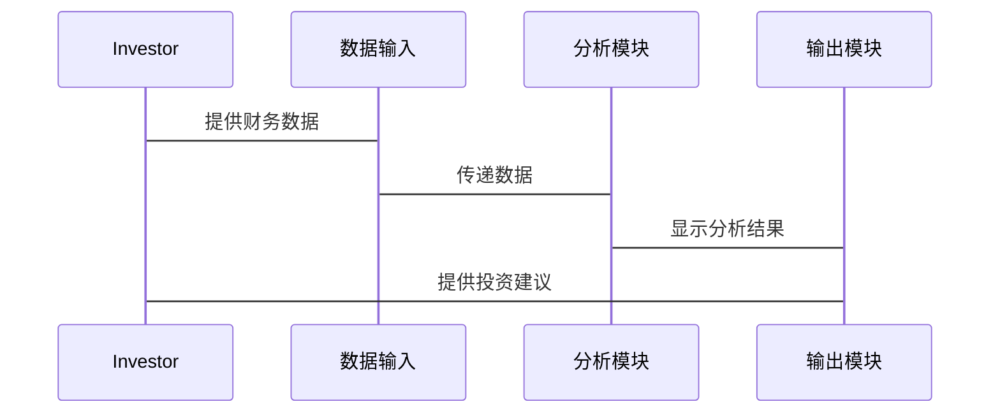

                 


```markdown
# 彼得林奇对公司营运杠杆的分析

## 关键词：彼得·林奇，营运杠杆，投资分析，财务杠杆，企业竞争优势

## 摘要：  
彼得·林奇是世界著名投资经理人，他提出的营运杠杆分析方法在投资决策中具有重要意义。本文详细介绍了营运杠杆的基本概念、分析框架、实际案例以及系统架构设计，并通过Python代码实现和Mermaid图表展示，帮助读者深入理解如何在实际投资中应用营运杠杆分析。文章最后总结了最佳实践建议和未来研究方向。

---

# 第1章: 引言

## 1.1 彼得·林奇及其投资理念

### 1.1.1 彼得·林奇的生平简介  
彼得·林奇（Peter Lynch）是美国著名的投资经理人，曾管理富达麦哲伦基金（Fidelity Magellan Fund），创造了辉煌的投资业绩。他以其独特的选股方法和深入的公司研究闻名，强调长期投资和对公司基本面的分析。

### 1.1.2 彼得·林奇的投资哲学  
林奇主张投资于自己了解的公司，注重公司的竞争优势和成长潜力。他认为，投资者应关注企业的营运效率和盈利能力，而非仅仅依赖市场趋势。

### 1.1.3 营运杠杆在投资中的重要性  
营运杠杆是衡量企业盈利能力的重要指标，反映了企业固定成本与可变成本的结构。通过分析营运杠杆，投资者可以更好地评估公司的盈利能力和风险承受能力。

## 1.2 本书的目的与结构  
### 1.2.1 本书的核心目标  
本文旨在通过分析彼得·林奇的营运杠杆理论，帮助投资者理解和应用这一分析方法，提升投资决策的科学性。

### 1.2.2 本书的章节安排  
本文分为七章，从引言到总结，系统地介绍营运杠杆的基本概念、分析框架、实际案例以及系统架构设计。

### 1.2.3 本书的适用读者  
本书适合投资专业人士、金融从业者以及对投资分析感兴趣的学生和自学者。

## 1.3 本章小结  
### 1.3.1 核心概念回顾  
营运杠杆是衡量企业盈利能力的关键指标，影响企业的风险和回报。

### 1.3.2 下文预览  
下一章将深入探讨营运杠杆的基本概念和类型，分析其对投资决策的影响。

---

# 第2章: 营运杠杆的基本概念

## 2.1 营运杠杆的定义与特征

### 2.1.1 营运杠杆的定义  
营运杠杆（Operating Leverage）是指企业通过固定成本和可变成本的比例，影响净利润变动与营业收入变动之间的关系。高营运杠杆意味着固定成本较高，净利润受营业收入波动的影响较大。

### 2.1.2 营运杠杆的核心特征  
- 固定成本占比高：如租金、工资等。
- 变动成本占比低：如原材料成本。
- 净利润波动较大：营业收入小幅度变化可能导致净利润大幅波动。

### 2.1.3 营运杠杆与财务杠杆的区别  
营运杠杆关注企业内部成本结构，而财务杠杆关注企业资本结构中的债务比例。两者共同影响企业的资本成本和风险。

## 2.2 营运杠杆的类型

### 2.2.1 固定成本与可变成本  
- 固定成本：不随产量变化而变化的成本。
- 可变成本：随产量变化而变化的成本。

### 2.2.2 营业杠杆系数  
营业杠杆系数（Degree of Operating Leverage, DOL）= %变动后的净利润变动 / %变动后的营业收入变动。

### 2.2.3 不同行业中的营运杠杆差异  
- 高营运杠杆行业：如制造业、零售业。
- 低营运杠杆行业：如软件服务行业。

## 2.3 营运杠杆对投资决策的影响

### 2.3.1 营运杠杆与企业盈利能力的关系  
高营运杠杆可能导致企业净利润波动大，影响盈利能力的稳定性。

### 2.3.2 营运杠杆与企业风险的关系  
高营运杠杆企业风险较高，因为净利润对营业收入变化更敏感。

### 2.3.3 投资者如何利用营运杠杆进行决策  
投资者应评估企业的成本结构和行业特点，选择具有稳定盈利能力的公司。

## 2.4 本章小结  
### 2.4.1 核心概念总结  
营运杠杆影响企业的盈利能力，投资者需结合行业特点和公司成本结构进行分析。

---

# 第3章: 营运杠杆的分析框架

## 3.1 营运杠杆分析的基本步骤

### 3.1.1 确定企业的业务模式  
了解企业的核心业务和收入来源，分析其盈利模式。

### 3.1.2 分析企业的成本结构  
识别固定成本和可变成本，评估成本结构对净利润的影响。

### 3.1.3 评估企业的收入来源  
分析收入的稳定性和增长潜力，判断企业盈利的可持续性。

## 3.2 营运杠杆的关键指标

### 3.2.1 营业利润率  
营业利润率=净利润 / 营业收入，反映企业经营效率。

### 3.2.2 营业杠杆系数  
通过计算DOL，评估营业收入变化对净利润的影响。

### 3.2.3 净利润与营业收入的关系  
高营运杠杆企业净利润受营业收入波动影响较大。

## 3.3 营运杠杆与企业竞争优势

### 3.3.1 核心竞争力的识别  
分析企业在行业中的竞争优势，判断其成本结构是否合理。

### 3.3.2 行业地位对企业营运杠杆的影响  
行业地位高的企业可能拥有更强的成本控制能力。

### 3.3.3 竞争优势的可持续性分析  
评估企业竞争优势是否能长期维持，影响其营运杠杆的稳定性。

## 3.4 本章小结  
### 3.4.1 分析框架总结  
通过分析企业的业务模式、成本结构和收入来源，评估其营运杠杆的影响。

---

# 第4章: 实际案例分析

## 4.1 案例一：制造业企业的营运杠杆分析

### 4.1.1 公司背景  
某制造企业以固定成本较高的生产模式为主。

### 4.1.2 成本结构分析  
固定成本占比高，可变成本占比低。

### 4.1.3 营业杠杆系数计算  
通过计算DOL，评估企业净利润受营业收入变化的影响。

## 4.2 案例二：软件服务行业的营运杠杆分析

### 4.2.1 公司背景  
软件企业通常具有较低的固定成本。

### 4.2.2 成本结构分析  
可变成本较高，固定成本较低。

### 4.2.3 营业杠杆系数计算  
分析其营业杠杆系数，判断盈利能力的稳定性。

## 4.3 案例三：零售行业的营运杠杆分析

### 4.3.1 公司背景  
零售行业通常具有较高的固定成本。

### 4.3.2 成本结构分析  
固定成本如租金和工资占比高。

### 4.3.3 营业杠杆系数计算  
评估其净利润对营业收入变化的敏感性。

## 4.4 本章小结  
### 4.4.1 案例分析总结  
不同行业具有不同的营运杠杆特征，投资者需结合行业特点进行分析。

---

# 第5章: 系统分析与架构设计

## 5.1 问题场景介绍  
通过构建一个分析框架，帮助投资者快速评估企业的营运杠杆情况。

## 5.2 系统功能设计

### 5.2.1 领域模型（Mermaid类图）  


### 5.2.2 系统架构设计（Mermaid架构图）  
```mermaid
container 营运杠杆分析系统 {
    component 数据输入 {
        +公司财务数据
    }
    component 分析模块 {
        +计算营业杠杆系数
        +生成分析报告
    }
    component 输出模块 {
        +显示结果
    }
}
```

### 5.2.3 系统接口设计  
定义API接口，供投资者调用分析功能。

### 5.2.4 系统交互设计（Mermaid序列图）  


## 5.3 本章小结  
### 5.3.1 系统设计总结  
通过构建系统架构，投资者可以更高效地分析企业的营运杠杆情况。

---

# 第6章: 项目实战

## 6.1 环境安装  
安装Python和必要的库，如pandas、numpy。

## 6.2 系统核心实现源代码

### 6.2.1 计算营业杠杆系数的Python代码  
```python
import pandas as pd

def calculate_operating_leverage(revenue, net_profit):
    dol = (revenue - (revenue - net_profit)) / net_profit
    return dol

# 示例数据
data = {'营业收入': [1000, 2000, 3000],
        '净利润': [100, 200, 300]}
df = pd.DataFrame(data)

# 计算营业杠杆系数
dol = calculate_operating_leverage(df['营业收入'], df['净利润'])
print("营业杠杆系数:", dol)
```

### 6.2.2 数据分析与可视化  
使用Matplotlib绘制营业杠杆系数的折线图。

## 6.3 代码应用解读与分析  
通过代码实现数据分析，帮助投资者评估企业的营运杠杆情况。

## 6.4 实际案例分析  
以具体公司为例，应用代码进行分析，展示结果。

## 6.5 本章小结  
### 6.5.1 项目总结  
通过实际操作，投资者可以更好地理解营运杠杆的分析方法。

---

# 第7章: 总结与展望

## 7.1 本章总结  
### 7.1.1 核心内容回顾  
详细介绍了营运杠杆的基本概念、分析框架、实际案例和系统设计。

### 7.1.2 投资者实战技巧  
强调理解企业成本结构和行业特点的重要性。

## 7.2 最佳实践 tips  
- 选择适合的行业进行投资。
- 结合财务杠杆分析综合评估企业风险。

## 7.3 未来研究方向  
- 开发更智能化的分析工具。
- 深入研究不同行业中的营运杠杆差异。

## 7.4 本章小结  
### 7.4.1 总结回顾  
营运杠杆是投资决策中的重要因素，投资者需结合多方面因素进行分析。

---

# 作者：AI天才研究院/AI Genius Institute & 禅与计算机程序设计艺术 /Zen And The Art of Computer Programming
```

