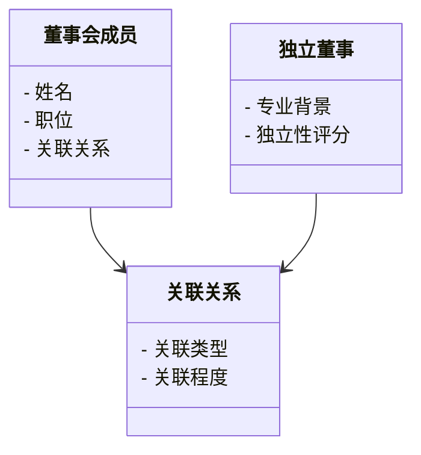
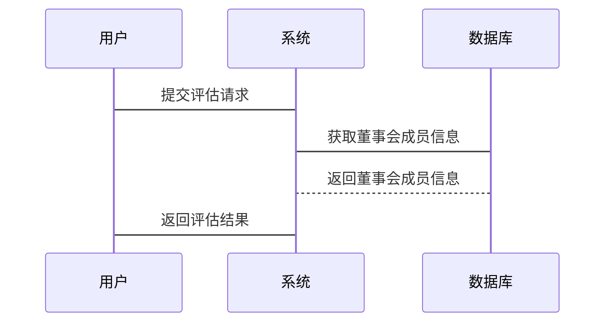

                 


# 彼得林奇对公司董事会独立性的评估

> 关键词：彼得林奇，董事会独立性，公司治理，评估框架，风险管理

> 摘要：本文详细探讨了彼得·林奇对公司董事会独立性的评估方法，从理论到实践，结合实际案例，分析了独立性评估的核心概念、影响因素及具体实施步骤。通过系统化的方法，帮助读者全面理解如何有效评估董事会独立性，以提升公司治理效率和风险管理能力。

---

## 第1章 公司治理与董事会的职责

### 1.1 公司治理的基本概念

#### 1.1.1 公司治理的定义
公司治理是指通过一系列制度、流程和机制，确保公司战略目标的实现，最大化股东利益，并满足利益相关者的合法诉求。其核心在于平衡股东、董事会、管理层和外部利益相关者之间的关系。

#### 1.1.2 公司治理的核心要素
- **治理结构**：包括董事会、监事会、管理层等组织架构。
- **决策机制**：董事会的决策流程和规则。
- **监督机制**：内部审计、外部审计和监事会的监督。
- **透明度**：信息披露的及时性和完整性。

#### 1.1.3 董事会的法律地位与职责
董事会是公司治理的核心机构，负责制定公司战略、监督管理层、评估重大决策的风险，并代表股东利益。其职责包括制定公司章程、批准财务报表、监督高管绩效等。

---

### 1.2 董事会独立性的重要性

#### 1.2.1 独立性在公司治理中的作用
董事会独立性是公司治理的关键因素，直接影响董事会的决策质量和公司整体表现。独立的董事会能够避免利益冲突，确保决策的客观性和公正性。

#### 1.2.2 独立性对股东价值的影响
独立的董事会能够有效监督管理层，防止滥用职权，提升公司治理效率，从而增强投资者信心，提升公司市值。

#### 1.2.3 独立性与公司风险管理的关系
独立的董事会能够更好地识别和评估风险，制定有效的风险管理策略，降低公司经营中的不确定性。

---

## 第2章 董事会独立性的核心概念

### 2.1 独立性的定义与标准

#### 2.1.1 独立性的多维度定义
独立性可以从多个维度进行定义，包括职能独立性、结构独立性、行为独立性等。其中，职能独立性强调董事会在决策过程中不受管理层或其他利益相关者的干扰。

#### 2.1.2 独立性评估的国际标准
国际上，如美国的《萨班斯-奥克斯利法案》（SOX法案）和英国的《公司治理准则》都对董事会独立性提出了明确要求。

#### 2.1.3 独立性与相关利益冲突的对比
独立性与利益冲突是两个相关但不同的概念。独立性强调董事会成员在决策中不受个人利益的影响，而利益冲突则指董事会成员与公司存在直接利益关系，可能影响决策的客观性。

---

### 2.2 影响董事会独立性的主要因素

#### 2.2.1 董事的背景与关联性
董事会成员的背景、职业经历和与其他利益相关者的关联性直接影响其独立性。例如，如果董事会成员与公司高管有密切关联，可能会影响其决策的独立性。

#### 2.2.2 董事会结构的复杂性
董事会的结构，如董事会规模、独立董事比例、董事会委员会设置等，也会影响其独立性。复杂的结构可能导致职责不清，降低独立性。

#### 2.2.3 公司文化与治理环境的影响
公司文化和治理环境对董事会独立性的影响不容忽视。例如，某些公司文化可能鼓励董事会成员迎合管理层的决策，而非独立思考。

---

## 第3章 董事会独立性的评估方法

### 3.1 定性评估方法

#### 3.1.1 基于董事会成员关系的分析
通过分析董事会成员与公司高管、大股东之间的关系，评估其独立性。例如，如果董事会成员与公司高管有亲属关系，可能影响其独立性。

#### 3.1.2 利益相关性评估
评估董事会成员是否与公司存在直接的经济利益关系，如持股比例、关联交易等。

#### 3.1.3 董事会决策过程的独立性评估
通过观察董事会的决策过程，评估其是否遵循独立的决策流程，如是否充分讨论、是否存在多数人意见压制少数人的情况等。

---

### 3.2 定量评估方法

#### 3.2.1 独立性评分系统
通过制定一套评分标准，对董事会成员的独立性进行量化评估。例如，可以将独立性分为五个等级（如1到5分），并根据具体情况进行评分。

#### 3.2.2 独立性指数的计算
通过综合多个指标，计算董事会独立性指数。例如，可以使用加权平均法，根据各个指标的重要性进行加权计算。

#### 3.2.3 数据分析与建模方法
通过数据分析和建模方法，对董事会独立性进行预测和评估。例如，可以使用逻辑回归模型，根据董事会成员的背景、关联性等变量，预测其独立性。

---

## 第4章 彼得林奇的评估框架

### 4.1 评估方法的核心要素

#### 4.1.1 关键指标的选取
彼得林奇的评估框架强调选取能够反映董事会独立性的关键指标，如董事会成员的独立性评分、独立董事比例、董事会决策的透明度等。

#### 4.1.2 评估流程的步骤
彼得林奇的评估流程包括以下几个步骤：
1. **收集数据**：收集董事会成员的背景信息、关联关系等。
2. **分析数据**：分析数据，识别潜在的利益冲突和关联性。
3. **评分与评估**：根据评分标准，对董事会独立性进行评分。
4. **提出建议**：根据评估结果，提出改进建议。

#### 4.1.3 案例分析
通过具体案例分析，说明彼得林奇评估方法的应用。例如，分析某公司的董事会结构，评估其独立性，并提出改进建议。

---

## 第5章 系统分析与架构设计

### 5.1 系统功能设计

#### 5.1.1 领域模型
使用mermaid类图展示董事会独立性评估系统的领域模型，包括董事会成员、独立董事、关联关系等核心实体及其关系。



#### 5.1.2 系统架构设计
使用mermaid架构图展示系统的整体架构，包括数据层、业务逻辑层和用户界面层。


#### 5.1.3 系统接口设计
定义系统接口，例如：
- 获取董事会成员信息接口
- 计算独立性评分接口
- 生成评估报告接口

#### 5.1.4 系统交互
使用mermaid序列图展示系统交互过程，例如用户提交评估请求，系统处理并返回评估结果。



---

## 第6章 项目实战

### 6.1 环境安装与配置

#### 6.1.1 安装Python环境
使用Anaconda或虚拟环境安装Python 3.8及以上版本。

#### 6.1.2 安装依赖库
安装必要的依赖库，如pandas、numpy、scikit-learn等。

### 6.2 核心代码实现

#### 6.2.1 数据预处理
```python
import pandas as pd

# 读取数据
df = pd.read_csv('board_members.csv')

# 清洗数据
df.dropna(inplace=True)
```

#### 6.2.2 独立性评分模型
```python
from sklearn.linear_model import LogisticRegression

# 训练模型
model = LogisticRegression()
model.fit(X_train, y_train)

# 预测评分
predictions = model.predict(X_test)
```

#### 6.2.3 评估报告生成
```python
# 生成报告
report = pd.DataFrame({
    '董事会成员': members,
    '独立性评分': scores
})
report.to_csv('independence_report.csv', index=False)
```

### 6.3 案例分析与解读
通过具体案例分析，展示如何使用上述代码进行董事会独立性评估，并解读评估结果。

---

## 第7章 最佳实践与总结

### 7.1 关键点回顾
- 独立性是公司治理的核心要素。
- 彼得林奇的评估框架提供了系统化的评估方法。
- 技术手段（如数据分析和建模）能够有效提升评估效率。

### 7.2 小结
通过本文的探讨，读者可以全面理解彼得林奇的董事会独立性评估方法，并能够将其应用于实际工作中。

### 7.3 注意事项
- 数据的准确性和完整性直接影响评估结果。
- 在实际应用中，需要结合具体情况进行调整和优化。

### 7.4 拓展阅读
推荐进一步阅读彼得林奇的相关著作，以及公司治理领域的最新研究成果。

---

## 作者：AI天才研究院/AI Genius Institute & 禅与计算机程序设计艺术 /Zen And The Art of Computer Programming

