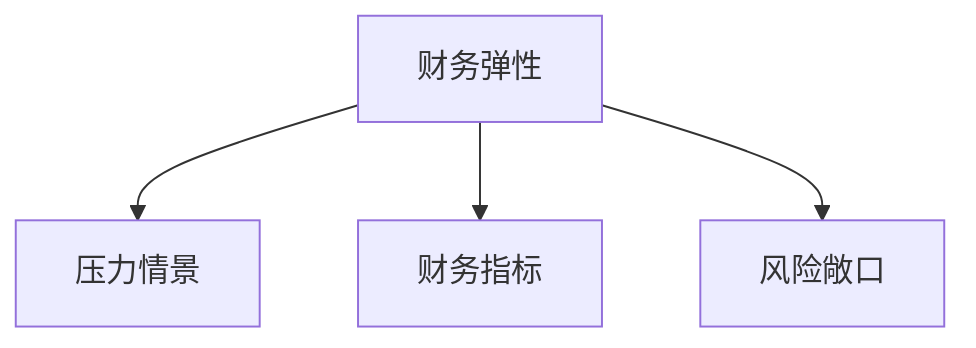

                 


# 彼得林奇对公司财务弹性的压力测试方法

## 关键词：彼得林奇、财务弹性、压力测试、风险管理、企业财务、弹性分析、压力测试模型

## 摘要：本文详细介绍了彼得林奇的压力测试方法，探讨了财务弹性的核心概念，分析了压力测试的算法原理，并结合实际案例进行详细解读。文章从背景介绍到系统分析，再到项目实战，层层深入，帮助读者全面理解并掌握压力测试的应用。

---

## 第一部分: 背景介绍与核心概念

## 第1章: 财务弹性与压力测试的背景

### 1.1 什么是财务弹性

#### 1.1.1 财务弹性的定义
财务弹性是指企业在面对外部环境变化时，能够保持财务稳定并快速调整的能力。它反映了企业在不同压力下的财务状况和应对能力。

#### 1.1.2 财务弹性的重要性
财务弹性是企业在市场波动、经济危机或突发事件中的生存和发展的关键。具备财务弹性的企业能够在压力下维持运营，并抓住市场机会实现增长。

#### 1.1.3 财务弹性核心要素
- **流动性**：企业快速变现资产的能力。
- **资本结构**：企业债务与股权的比例。
- **盈利能力**：企业持续产生利润的能力。
- **现金流**：企业现金流入和流出的平衡。

### 1.2 压力测试的定义与作用

#### 1.2.1 压力测试的定义
压力测试是一种评估企业在极端市场条件下财务状况的方法，通过模拟各种不利情景，分析企业的风险承受能力。

#### 1.2.2 压力测试的目的
- 识别企业在极端情况下的财务脆弱性。
- 评估企业应对危机的能力。
- 优化企业资本结构和风险管理策略。

#### 1.2.3 压力测试的分类
- **情景分析**：基于假设情景的压力测试。
- **敏感性分析**：分析单一变量变化的影响。
- **蒙特卡洛模拟**：通过随机抽样模拟多种可能结果。

### 1.3 彼得林奇与压力测试方法

#### 1.3.1 彼得林奇的背景介绍
彼得·林奇是美国著名投资经理人，以其在富达基金的卓越表现闻名。他强调基本面分析和长期投资，尤其擅长识别企业财务健康状况。

#### 1.3.2 彼得林奇的压力测试方法
林奇的压力测试方法基于对企业财务报表的深入分析，重点关注企业的现金流、负债结构和盈利能力。他通过模拟极端市场条件，评估企业的财务弹性。

#### 1.3.3 方法的核心思想与特点
- **基本面驱动**：以企业财务数据为基础。
- **情景模拟**：通过假设极端市场条件，评估企业应对能力。
- **动态调整**：根据测试结果优化企业财务结构。

## 第2章: 财务弹性与压力测试的关系

### 2.1 财务弹性的概念模型

#### 2.1.1 财务弹性的维度
- **短期弹性**：应对短期压力的能力。
- **中期弹性**：应对中长期变化的能力。
- **长期弹性**：适应长期战略调整的能力。

#### 2.1.2 财务弹性的衡量指标
- **流动比率**：衡量短期偿债能力。
- **速动比率**：更严格的短期偿债指标。
- **利息覆盖倍数**：衡量债务偿还能力。
- **净现金流**：评估企业现金生成能力。

#### 2.1.3 财务弹性的动态变化
财务弹性并非固定不变，会随着市场环境、企业战略和管理决策的变化而调整。企业需要定期进行压力测试，动态评估财务弹性。

### 2.2 压力测试与财务弹性

#### 2.2.1 压力测试对财务弹性的影响
压力测试可以揭示企业在极端情况下的财务弹性，帮助企业识别潜在风险，并采取措施增强弹性。

#### 2.2.2 财务弹性在压力测试中的作用
财务弹性是压力测试的重要评估指标，它决定了企业在压力下的生存能力和恢复能力。

#### 2.2.3 财务弹性与企业风险管理的关系
财务弹性是企业风险管理的核心内容，压力测试则是评估和管理财务弹性的重要工具。

### 2.3 财务弹性压力测试的核心概念

#### 2.3.1 核心概念的定义与属性
- **压力情景**：测试中假设的极端市场条件。
- **财务指标**：用于评估财务弹性的关键指标。
- **风险敞口**：企业在特定情景下的风险暴露程度。

#### 2.3.2 核心概念的对比分析
| 概念 | 定义 | 作用 |
|------|------|------|
| 压力情景 | 极端市场条件假设 | 评估企业应对能力 |
| 财务指标 | 衡量财务弹性的指标 | 量化企业风险 |
| 风险敞口 | 企业暴露在风险中的程度 | 识别潜在风险点 |

#### 2.3.3 核心概念的ER实体关系图


---

## 第三部分: 系统分析与架构设计

## 第3章: 财务弹性压力测试的系统架构

### 3.1 系统功能设计

#### 3.1.1 功能模块
- **数据输入**：接收企业财务数据和市场情景。
- **模型选择**：选择适用的压力测试模型。
- **计算引擎**：执行压力测试计算。
- **结果输出**：展示测试结果和分析报告。

#### 3.1.2 功能流程
1. 用户输入企业财务数据和市场情景。
2. 系统选择合适的压力测试模型。
3. 计算引擎执行测试，生成结果。
4. 输出报告，供企业决策参考。

### 3.2 系统架构设计

#### 3.2.1 系统架构图


#### 3.2.2 关键模块设计
- **数据输入模块**：负责接收和解析输入数据。
- **模型选择模块**：根据数据特征选择合适的测试模型。
- **计算引擎模块**：执行压力测试计算。
- **结果输出模块**：生成测试报告和可视化结果。

### 3.3 接口设计

#### 3.3.1 API接口
- **输入接口**：接收企业财务数据和压力情景。
- **输出接口**：返回测试结果和报告。

#### 3.3.2 数据格式
- 输入：JSON格式的财务数据和情景描述。
- 输出：JSON格式的测试结果和报告。

### 3.4 交互流程

#### 3.4.1 交互流程图


---

## 第四部分: 项目实战与案例分析

## 第4章: 财务弹性压力测试的项目实战

### 4.1 环境安装

#### 4.1.1 系统要求
- 操作系统：Windows、Linux、macOS
- 软件：Python 3.8+, Jupyter Notebook, Mermaid CLI

#### 4.1.2 安装步骤
1. 安装Python和pip。
2. 安装必要的库：numpy, pandas, matplotlib, seaborn。
3. 安装Mermaid CLI。

### 4.2 核心代码实现

#### 4.2.1 数据预处理
```python
import pandas as pd

# 读取财务数据
df = pd.read_csv('financial_data.csv')

# 数据清洗
df.dropna(inplace=True)
df['year'] = pd.to_datetime(df['year'])
```

#### 4.2.2 压力测试模型实现
```python
import numpy as np

def stress_test(df, scenario):
    # 计算不同情景下的财务指标
    if scenario == 'recession':
        df['revenue'] *= 0.8
        df['profit'] *= 0.6
    elif scenario == 'crisis':
        df['revenue'] *= 0.5
        df['profit'] *= 0.4
    return df
```

#### 4.2.3 结果可视化
```python
import matplotlib.pyplot as plt

def plot_results(results):
    plt.figure(figsize=(10,6))
    plt.plot(results['year'], results['revenue'], label='Revenue')
    plt.plot(results['year'], results['profit'], label='Profit')
    plt.title('Stress Test Results')
    plt.xlabel('Year')
    plt.ylabel('Value')
    plt.legend()
    plt.show()
```

### 4.3 案例分析

#### 4.3.1 案例背景
某制造企业在经济衰退情景下的财务弹性测试。

#### 4.3.2 数据分析
- 原收入：1000万
- 原利润：200万
- 测试情景：经济衰退（收入下降20%，利润下降40%）

#### 4.3.3 测试结果
- 新收入：800万
- 新利润：120万

#### 4.3.4 结果解读
企业在经济衰退情景下，收入和利润显著下降，但仍然保持正向现金流，具备一定的财务弹性。

---

## 第五部分: 最佳实践与小结

## 第5章: 最佳实践与小结

### 5.1 小结

- 本文详细介绍了彼得林奇的压力测试方法，分析了财务弹性的核心概念，探讨了压力测试的算法原理，并结合实际案例进行了详细解读。

### 5.2 注意事项

- 压力测试结果仅供参考，实际操作需结合企业具体情况。
- 数据质量对测试结果影响重大，需确保数据准确。
- 定期进行压力测试，及时调整企业财务策略。

### 5.3 拓展阅读

- 彼得林奇的其他投资策略。
- 其他压力测试方法（如蒙特卡洛模拟）。
- 财务弹性在不同行业中的应用。

---

## 作者：AI天才研究院 & 禅与计算机程序设计艺术

