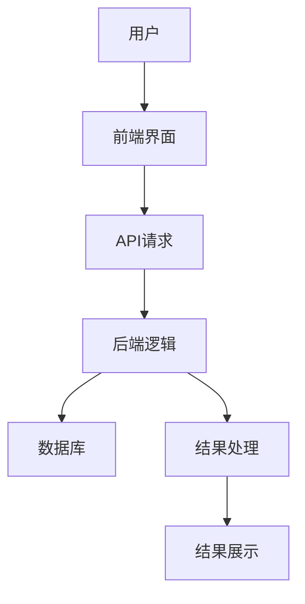
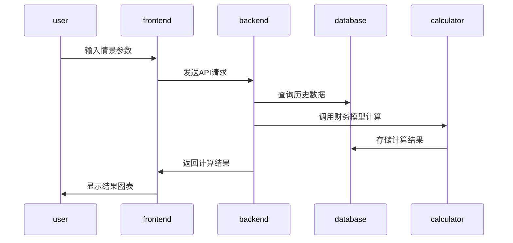

                 


# 彼得林奇对公司财务弹性的多情景压力测试方法

## 关键词：
- 彼得林奇
- 财务弹性
- 多情景压力测试
- 风险管理
- 投资策略

## 摘要：
本文系统地介绍了彼得·林奇提出的财务弹性概念及其在多情景压力测试中的应用方法。通过详细分析财务弹性的核心要素、多情景压力测试的原理与算法，结合实际案例和系统架构设计，展示了如何在复杂多变的商业环境中评估和优化企业的财务弹性。本文旨在为投资决策者和风险管理专业人士提供理论依据和实践指导，帮助他们在不同情景下制定稳健的投资策略，确保企业财务健康与可持续发展。

---

## 第一部分: 财务弹性与多情景压力测试概述

### 第1章: 财务弹性的定义与重要性

#### 1.1 财务弹性的核心概念
##### 1.1.1 财务弹性的定义
财务弹性是指企业在面对内外部环境变化时，能够调整其财务结构和运营策略，以维持或恢复财务健康的能力。换句话说，财务弹性是企业在面对压力时的“缓冲器”，能够帮助企业抵御短期冲击并实现长期稳健发展。

##### 1.1.2 财务弹性的关键特征
- **流动性**：企业快速变现资产的能力，以应对突发的资金需求。
- **资本结构**：企业债务与股权的比例，影响企业的财务风险。
- **盈利能力**：企业通过高效运营创造利润的能力。
- **灵活性**：企业调整预算、成本和战略的能力。

##### 1.1.3 财务弹性与企业生存能力的关系
企业财务弹性越强，越能在市场波动、经济衰退或其他负面事件中保持稳定，从而提高生存能力和竞争优势。

#### 1.2 多情景压力测试的背景
##### 1.2.1 传统压力测试的局限性
传统压力测试通常基于单一情景或假设，无法全面评估企业在多种极端条件下的应对能力。例如，仅测试企业在经济衰退下的表现，可能忽略了其他风险因素如行业竞争加剧或政策变化的影响。

##### 1.2.2 多情景压力测试的提出
多情景压力测试是一种更为全面的风险管理方法，通过模拟多种可能的经济、市场和行业情景，评估企业在不同环境下的财务表现和应对策略。

##### 1.2.3 多情景压力测试的意义
- 提供更全面的风险评估。
- 帮助企业在复杂环境中制定灵活的应对策略。
- 为投资决策提供更可靠的依据。

#### 1.3 彼得林奇财务弹性方法的核心思想
##### 1.3.1 彼得林奇投资策略概述
彼得·林奇是美国著名投资经理人，以其在波士顿有限合伙公司（Fidelity Management）的卓越表现闻名。他强调长期投资、基本面分析和对公司财务状况的深入理解。

##### 1.3.2 财务弹性的投资视角
彼得林奇认为，财务弹性是企业在市场波动中保持投资价值的关键因素。他关注企业的财务健康状况，尤其是其在不利条件下的应对能力。

##### 1.3.3 多情景压力测试的应用价值
通过多情景压力测试，投资者可以评估企业在不同市场条件下的财务表现，从而做出更明智的投资决策。

---

### 第2章: 多情景压力测试的理论基础

#### 2.1 财务弹性分析模型
##### 2.1.1 财务弹性的数学模型
财务弹性可以表示为：
$$
\text{财务弹性} = \frac{\text{财务缓冲能力}}{\text{外部压力}}
$$
其中，财务缓冲能力包括企业的流动资产、盈利能力等，外部压力则包括市场波动、经济衰退等因素。

##### 2.1.2 模型的输入变量与输出变量
- **输入变量**：企业的财务数据（如流动资产、负债、收入、利润）、市场情景参数（如经济增长率、利率变化）。
- **输出变量**：企业在不同情景下的财务健康指标（如净收益、现金流、资本结构）。

##### 2.1.3 模型的假设条件与边界
- 假设市场情景独立且可预测。
- 忽略企业内部管理决策的随机性。
- 假设企业在测试期间保持现有战略和运营效率。

#### 2.2 多情景压力测试方法
##### 2.2.1 多情景压力测试的定义
多情景压力测试是通过模拟多种可能的市场和经济情景，评估企业财务状况在不同条件下的表现。

##### 2.2.2 多情景压力测试的步骤
1. **确定情景范围**：基于历史数据和专家判断，选择若干典型情景（如经济衰退、行业竞争加剧、政策变化）。
2. **构建模型**：将企业的财务指标与情景参数相关联，建立数学模型。
3. **运行测试**：输入不同情景参数，计算企业财务表现。
4. **分析结果**：评估企业在不同情景下的财务弹性，并制定应对策略。

##### 2.2.3 多情景压力测试的分类
- **单一变量测试**：调整一个变量（如收入增长率）进行测试。
- **多变量测试**：同时调整多个变量（如收入、成本、利率）。
- **情景分析测试**：基于假设情景（如经济衰退、行业整合）进行测试。

#### 2.3 财务弹性与多情景压力测试的关系
##### 2.3.1 财务弹性在多情景测试中的地位
财务弹性是多情景压力测试的核心评估指标，用于衡量企业在不同情景下的财务健康状况。

##### 2.3.2 多情景测试对财务弹性的影响
多情景测试可以帮助企业识别潜在风险，优化资本结构和运营策略，从而提升财务弹性。

##### 2.3.3 财务弹性与企业风险管理的结合
通过多情景压力测试，企业可以更好地识别和应对潜在风险，制定灵活的风险管理策略。

---

### 第3章: 多情景压力测试的核心概念与联系

#### 3.1 财务弹性分析的核心要素
##### 3.1.1 财务弹性分析的维度
- **流动性**：企业快速变现的能力。
- **资本结构**：债务与股权的比例。
- **盈利能力**：企业的盈利能力和可持续性。
- **灵活性**：企业调整预算和战略的能力。

##### 3.1.2 财务弹性分析的关键指标
- **流动比率**：$$\text{流动比率} = \frac{\text{流动资产}}{\text{流动负债}}$$
- **速动比率**：$$\text{速动比率} = \frac{\text{速动资产}}{\text{流动负债}}$$
- **净利润率**：$$\text{净利润率} = \frac{\text{净利润}}{\text{收入}}$$

##### 3.1.3 财务弹性分析的驱动因素
- 市场需求变化。
- 成本和价格波动。
- 财务政策调整。

#### 3.2 多情景压力测试的原理与方法
##### 3.2.1 多情景压力测试的原理
通过模拟多种情景，评估企业在不同条件下的财务表现，从而识别潜在风险并制定应对策略。

##### 3.2.2 多情景压力测试的方法
- **情景构建**：基于历史数据和专家判断，构建多个典型情景。
- **模型构建**：将企业财务指标与情景参数相关联，建立数学模型。
- **测试运行**：输入不同情景参数，计算企业财务表现。
- **结果分析**：评估企业在不同情景下的财务弹性，制定应对策略。

##### 3.2.3 多情景压力测试的分类
- **单一变量测试**：调整一个变量（如收入增长率）。
- **多变量测试**：同时调整多个变量（如收入、成本、利率）。
- **情景分析测试**：基于假设情景（如经济衰退、行业整合）进行测试。

#### 3.3 财务弹性与多情景压力测试的关系
##### 3.3.1 财务弹性在多情景测试中的地位
财务弹性是多情景压力测试的核心评估指标，用于衡量企业在不同情景下的财务健康状况。

##### 3.3.2 多情景测试对财务弹性的影响
多情景测试可以帮助企业识别潜在风险，优化资本结构和运营策略，从而提升财务弹性。

##### 3.3.3 财务弹性与企业风险管理的结合
通过多情景压力测试，企业可以更好地识别和应对潜在风险，制定灵活的风险管理策略。

---

## 第4章: 多情景压力测试的算法原理

#### 4.1 算法原理概述
多情景压力测试的算法通常包括以下几个步骤：
1. **情景构建**：定义多个可能的市场或经济情景。
2. **模型构建**：建立企业财务指标与情景参数之间的关系模型。
3. **情景输入**：将不同情景参数输入模型，计算企业财务表现。
4. **结果分析**：比较不同情景下的财务弹性，制定应对策略。

#### 4.2 算法步骤详细解释
##### 4.2.1 情景构建
- 确定情景范围：例如，经济衰退、行业整合、政策变化等。
- 定义情景参数：如经济增长率、利率、行业竞争强度等。

##### 4.2.2 模型构建
- 建立财务指标与情景参数的关系模型，例如：
$$
\text{净利润} = \text{收入} - \text{成本} - \text{税金}
$$
其中，收入和成本可能受到情景参数的影响。

##### 4.2.3 情景输入与计算
- 将不同情景参数输入模型，计算企业在每种情景下的财务指标。

##### 4.2.4 结果分析
- 比较不同情景下的财务弹性，识别潜在风险点，制定应对策略。

#### 4.3 算法的数学模型与公式
##### 4.3.1 情景参数化
假设情景参数包括经济增长率（$$g$$）、利率（$$r$$）和行业竞争强度（$$c$$）。

##### 4.3.2 财务指标计算
企业净利润公式：
$$
\text{净利润} = \text{收入} - \text{成本} - \text{税金}
$$
其中，收入和成本可能受到情景参数的影响，例如：
$$
\text{收入} = \text{基准收入} \times (1 + g)
$$
$$
\text{成本} = \text{基准成本} \times (1 + c)
$$

##### 4.3.3 财务弹性评估
通过比较不同情景下的净利润、流动比率等指标，评估企业的财务弹性。

#### 4.4 算法实现的Python代码示例
```python
# 定义情景参数
scenarios = [
    {'g': 0.05, 'r': 0.02, 'c': 0.1},
    {'g': -0.03, 'r': 0.07, 'c': 0.2}
]

# 定义基准财务数据
base_income = 1000000
base_cost = 600000
tax_rate = 0.2

# 计算不同情景下的净利润
for scenario in scenarios:
    g = scenario['g']
    c = scenario['c']
    income = base_income * (1 + g)
    cost = base_cost * (1 + c)
    net_income = income - cost - (income * tax_rate)
    print(f"Scenario: {scenario}, 净利润: {net_income}")
```

#### 4.5 算法优化与改进
- **情景参数的选取**：确保情景参数的合理性和代表性。
- **模型的准确性**：通过历史数据验证模型的预测能力。
- **结果的可解释性**：确保分析结果易于理解，并能为决策提供支持。

---

## 第5章: 系统分析与架构设计方案

#### 5.1 系统应用场景
多情景压力测试系统可以应用于企业财务分析、投资决策、风险管理等领域，帮助企业在复杂环境中制定稳健的财务策略。

#### 5.2 系统功能设计
##### 5.2.1 领域模型设计
- **用户管理**：用户身份验证与权限管理。
- **情景管理**：定义和管理不同情景参数。
- **模型计算**：根据情景参数计算企业财务指标。
- **结果展示**：可视化展示不同情景下的财务表现。

##### 5.2.2 系统架构设计
- **前端界面**：用户友好的界面，方便输入情景参数和查看结果。
- **后端逻辑**：处理用户请求，执行模型计算。
- **数据库**：存储用户数据和计算结果。

##### 5.2.3 系统接口设计
- **API接口**：提供RESTful API，方便与其他系统集成。
- **数据接口**：支持导入和导出数据文件。

##### 5.2.4 系统交互设计
- **用户输入**：用户输入情景参数。
- **系统计算**：系统根据输入参数计算财务指标。
- **结果展示**：系统展示计算结果，并提供可视化图表。

#### 5.3 系统架构图（Mermaid）


#### 5.4 系统功能模块实现
##### 5.4.1 数据输入模块
用户可以通过前端界面输入情景参数，系统将参数传递给后端逻辑。

##### 5.4.2 模型计算模块
后端逻辑接收参数后，调用财务模型进行计算，并将结果存储在数据库中。

##### 5.4.3 结果展示模块
系统将计算结果以可视化图表形式展示给用户，帮助用户更好地理解和分析。

#### 5.5 系统交互序列图（Mermaid）


---

## 第6章: 项目实战——多情景压力测试系统开发

#### 6.1 项目背景
在当前经济环境下，企业需要具备应对多种市场情景的能力。通过开发一个多情景压力测试系统，可以帮助企业在不同条件下评估财务弹性，制定灵活的应对策略。

#### 6.2 项目目标
- 开发一个多情景压力测试系统，支持用户输入情景参数，计算企业财务指标，并展示结果。

#### 6.3 项目实现
##### 6.3.1 环境安装
- **Python 3.8+**
- **Flask框架**：用于后端开发
- **Plotly/D3.js**：用于数据可视化
- **PostgreSQL**：用于数据存储

##### 6.3.2 核心代码实现
```python
from flask import Flask, request, jsonify
import plotly.express as px
import pandas as pd
import psycopg2

app = Flask(__name__)

# 数据库连接
conn = psycopg2.connect(
    dbname='financial_elasticity',
    user='admin',
    password='password',
    host='localhost'
)

@app.route('/api/scenarios', methods=['POST'])
def calculate_elasticity():
    data = request.json
    scenarios = data['scenarios']
    results = []
    
    for scenario in scenarios:
        g = scenario['g']
        r = scenario['r']
        c = scenario['c']
        
        # 计算收入和成本
        income = base_income * (1 + g)
        cost = base_cost * (1 + c)
        net_income = income - cost - (income * tax_rate)
        
        results.append({
            'scenario': scenario,
            'net_income': net_income
        })
    
    # 将结果存储到数据库
    cursor = conn.cursor()
    for result in results:
        cursor.execute(
            "INSERT INTO financial_results (scenario, net_income) VALUES (%s, %s)",
            (str(result['scenario']), result['net_income'])
        )
    cursor.close()
    
    return jsonify(results)

if __name__ == '__main__':
    app.run(debug=True)
```

##### 6.3.3 代码解读与分析
- **后端逻辑**：接收前端发送的情景参数，计算财务指标，并将结果存储在数据库中。
- **数据可视化**：使用Plotly生成可视化图表，帮助用户直观理解财务弹性。

##### 6.3.4 案例分析
假设我们有一个制造企业，基准收入为100万元，基准成本为60万元，税率为20%。我们模拟两种情景：
1. **情景1**：经济增长率5%，利率2%，行业竞争强度10%。
2. **情景2**：经济增长率-3%，利率7%，行业竞争强度20%。

计算结果如下：
- **情景1**：净利润 = 100万*(1+0.05) - 60万*(1+0.1) - (100万*(1+0.05)*0.2) = 105万 - 66万 - 21万 = 18万。
- **情景2**：净利润 = 100万*(1-0.03) - 60万*(1+0.2) - (100万*(1-0.03)*0.2) = 97万 - 72万 - 17.4万 = -12.4万。

通过比较可以看出，情景1下企业能够保持盈利，而情景2下企业将出现亏损，财务弹性较弱。

##### 6.3.5 项目小结
通过开发一个多情景压力测试系统，企业可以更有效地评估和优化其财务弹性，制定灵活的应对策略。

---

## 第7章: 最佳实践与总结

#### 7.1 最佳实践
##### 7.1.1 小结
多情景压力测试是评估企业财务弹性的重要工具，能够帮助企业识别潜在风险，制定灵活的应对策略。

##### 7.1.2 注意事项
- 情景参数的选择应基于历史数据和专家判断。
- 模型的准确性需要通过历史数据验证。
- 结果的可解释性是制定决策的关键。

##### 7.1.3 拓展阅读
- 彼得·林奇的《彼得·林奇的成功投资法则》。
- 风险管理领域的经典著作《风险管理与金融创新》。

#### 7.2 总结
本文系统地介绍了彼得·林奇提出的财务弹性概念及其在多情景压力测试中的应用方法。通过详细分析财务弹性的核心要素、多情景压力测试的原理与算法，并结合实际案例和系统架构设计，展示了如何在复杂多变的商业环境中评估和优化企业的财务弹性。希望本文能够为投资决策者和风险管理专业人士提供理论依据和实践指导，帮助他们在不同情景下制定稳健的投资策略，确保企业财务健康与可持续发展。

---

## 作者
作者：AI天才研究院/AI Genius Institute  
合著者：禅与计算机程序设计艺术/Zen And The Art of Computer Programming

