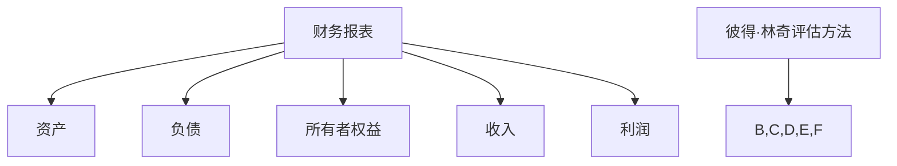
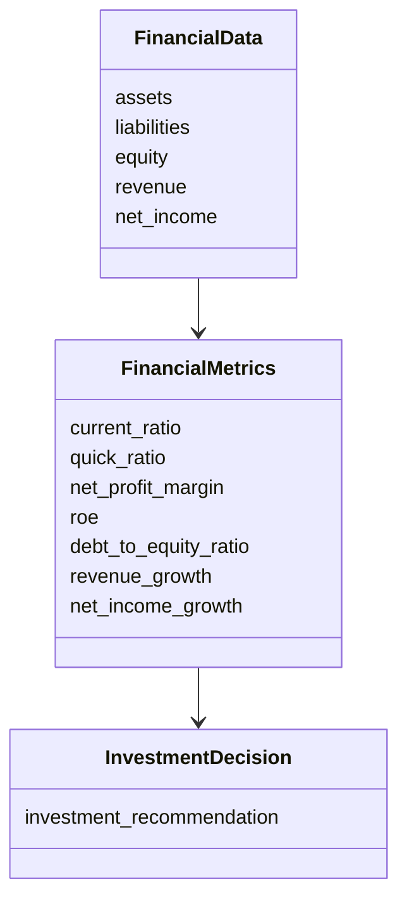
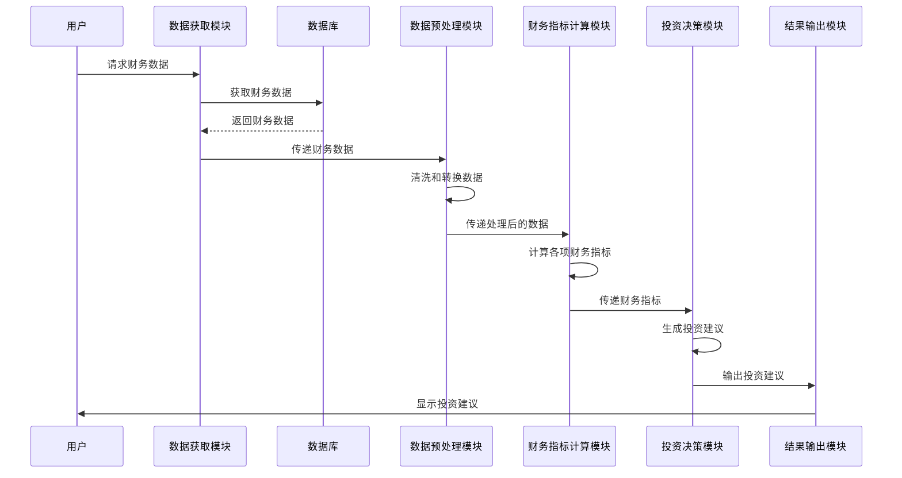

                 


# 彼得林奇对公司财务报表质量的评估

## 关键词
- 彼得·林奇
- 财务报表质量评估
- 投资分析
- 企业财务健康
- 价值投资

## 摘要
彼得·林奇是美国著名的投资经理人，以其在富达麦哲伦基金的卓越表现闻名。本文深入分析彼得·林奇如何评估公司财务报表的质量，探讨其方法的核心要素、算法原理及实际应用。文章通过背景介绍、核心概念、算法流程、系统设计和项目实战等部分，全面解析彼得·林奇的投资理念及其在现代财务分析中的应用，为投资者提供实用的指导。

---

## 第1章：背景介绍

### 1.1 财务报表质量评估的背景

#### 1.1.1 财务报表的基本概念
财务报表是企业财务状况和经营成果的官方记录，包括资产负债表、利润表和现金流量表。这些报表提供了企业的资产、负债、所有者权益、收入和利润等关键信息，是投资者评估企业价值的重要依据。

#### 1.1.2 财务报表质量评估的重要性
财务报表质量直接影响企业的信用评级、投资决策和市场表现。高质量的财务报表能够准确反映企业的财务健康状况，帮助投资者识别潜在风险和机会。对于彼得·林奇而言，财务报表质量评估是其价值投资策略的核心环节。

#### 1.1.3 财务报表质量评估的边界与外延
财务报表质量评估通常包括对企业财务数据的准确性、完整性、合规性和合理性分析。其外延涉及对企业经营效率、盈利能力、财务风险和未来增长潜力的评估。

### 1.2 彼得·林奇的介绍

#### 1.2.1 彼得·林奇的生平简介
彼得·林奇（Peter Lynch）是美国著名投资经理人，曾管理富达麦哲伦基金（Fidelity Magellan Fund），并取得了卓越的投资业绩。他以其独特的投资理念和对企业的深入分析闻名。

#### 1.2.2 彼得·林奇的投资理念
彼得·林奇主张价值投资，强调通过深入分析企业的财务报表和经营状况，寻找具有持续增长潜力的公司。他认为，市场的短期波动不应影响长期投资者的决策，关键在于企业的基本面。

#### 1.2.3 彼得·林奇与财务报表分析的关系
彼得·林奇在其投资实践中，高度重视财务报表的质量评估。他认为，只有通过仔细分析企业的财务报表，才能准确判断企业的财务健康状况和未来盈利能力。

### 1.3 财务报表质量评估的核心要素

#### 1.3.1 财务报表的主要组成部分
财务报表由资产负债表、利润表和现金流量表组成。资产负债表反映企业的资产、负债和所有者权益；利润表反映企业的收入和利润；现金流量表反映企业的现金流情况。

#### 1.3.2 财务报表质量评估的核心指标
- **流动性比率**：如现金比率、速动比率，用于评估企业的短期偿债能力。
- **盈利能力指标**：如净利率、ROE（净资产收益率），用于评估企业的盈利能力。
- **杠杆比率**：如资产负债率，用于评估企业的财务杠杆和风险。
- **增长能力指标**：如收入增长率、净利润增长率，用于评估企业的增长潜力。

#### 1.3.3 彼得·林奇评估方法的独特性
彼得·林奇在财务报表质量评估中，注重对企业未来增长潜力的分析。他不仅关注企业的当前财务状况，还关注企业未来的盈利能力和发展前景。

---

## 第2章：核心概念与联系

### 2.1 核心概念与联系

#### 2.1.1 核心概念
- **财务报表**：企业的财务状况和经营成果的记录。
- **财务报表质量**：财务报表的准确性和完整性。
- **彼得·林奇评估方法**：基于财务报表的深入分析，评估企业的财务健康状况和投资价值。

#### 2.1.2 核心概念之间的关系
通过对比分析，可以发现财务报表质量评估是彼得·林奇投资策略的核心，而彼得·林奇的方法则为财务报表质量评估提供了独特的视角和工具。

#### 2.1.3 通过表格和ER图展示概念联系

##### 表格对比：
| 概念 | 定义 | 关系 |
|------|------|------|
| 财务报表 | 企业的财务状况和经营成果的记录 | 核心 |
| 财务报表质量 | 财务报表的准确性和完整性 | 关键因素 |
| 彼得·林奇评估方法 | 基于财务报表的分析方法 | 核心工具 |

##### ER图：


### 2.2 核心概念原理

#### 2.2.1 财务报表质量评估的原理
财务报表质量评估的核心在于通过分析企业的财务数据，识别潜在的风险和机会。通过流动性、盈利能力、杠杆和增长能力等指标的分析，可以全面评估企业的财务健康状况。

#### 2.2.2 彼得·林奇评估方法的原理
彼得·林奇的方法强调对企业未来增长潜力的分析。他不仅关注企业的当前财务状况，还关注企业的未来盈利能力和发展前景。通过分析企业的财务报表，他能够识别出那些具有持续增长潜力的公司。

#### 2.2.3 两者的异同点分析
- **相同点**：两者都强调财务报表的准确性和完整性，都关注企业的财务健康状况和盈利能力。
- **不同点**：彼得·林奇的方法更注重企业未来增长潜力的分析，而传统的财务报表质量评估更关注企业的当前财务状况。

---

## 第3章：算法原理讲解

### 3.1 财务报表质量评估的算法流程

#### 3.1.1 算法流程图


### 3.2 算法实现

#### 3.2.1 Python代码实现
```python
def calculate_financial_ratios(assets, liabilities, equity, revenue, net_income):
    # 计算流动性比率
    current_ratio = assets / liabilities
    quick_ratio = (assets - equity) / liabilities
    
    # 计算盈利能力指标
    net_profit_margin = net_income / revenue * 100
    roe = net_income / equity * 100
    
    # 计算杠杆比率
    debt_to_equity_ratio = liabilities / equity
    
    # 计算增长能力指标
    revenue_growth = (revenue - previous_revenue) / previous_revenue * 100
    net_income_growth = (net_income - previous_net_income) / previous_net_income * 100
    
    return current_ratio, quick_ratio, net_profit_margin, roe, debt_to_equity_ratio, revenue_growth, net_income_growth
```

### 3.3 数学模型与公式

#### 3.3.1 流动性比率
- **现金比率**：
  $$ \text{现金比率} = \frac{\text{现金及现金等价物}}{\text{流动负债}} $$
- **速动比率**：
  $$ \text{速动比率} = \frac{\text{流动资产} - \text{存货}}{\text{流动负债}} $$

#### 3.3.2 盈利能力指标
- **净利率**：
  $$ \text{净利率} = \frac{\text{净利润}}{\text{营业收入}} \times 100\% $$
- **净资产收益率（ROE）**：
  $$ \text{ROE} = \frac{\text{净利润}}{\text{所有者权益}} \times 100\% $$

#### 3.3.3 杠杆比率
- **资产负债率**：
  $$ \text{资产负债率} = \frac{\text{总负债}}{\text{总资产}} \times 100\% $$

#### 3.3.4 增长能力指标
- **收入增长率**：
  $$ \text{收入增长率} = \frac{\text{当年收入} - \text{上期收入}}{\text{上期收入}} \times 100\% $$
- **净利润增长率**：
  $$ \text{净利润增长率} = \frac{\text{当年净利润} - \text{上期净利润}}{\text{上期净利润}} \times 100\% $$

---

## 第4章：系统分析与架构设计

### 4.1 问题场景介绍

#### 4.1.1 财务报表质量评估的常见问题
- 数据准确性问题：如何确保财务数据的准确性和完整性？
- 数据分析问题：如何通过算法和模型，准确评估企业的财务健康状况？
- 投资决策问题：如何根据财务报表分析结果，制定有效的投资策略？

#### 4.1.2 彼得·林奇方法的实际应用挑战
- 数据获取困难：如何获取高质量的财务数据？
- 分析复杂性：如何处理复杂的财务数据和分析模型？
- 投资决策的不确定性：如何在市场波动中保持投资策略的稳定性？

### 4.2 系统功能设计

#### 4.2.1 领域模型（mermaid类图）


### 4.3 系统架构设计

#### 4.3.1 系统架构（mermaid架构图）


### 4.4 系统接口设计

#### 4.4.1 接口描述
- 数据获取接口：从数据库或API获取企业的财务数据。
- 数据预处理接口：清洗和转换数据，确保数据的准确性和完整性。
- 财务指标计算接口：根据财务数据，计算各项财务指标。
- 投资决策接口：根据财务指标，生成投资建议。

### 4.5 系统交互流程

#### 4.5.1 交互流程图（mermaid序列图）


---

## 第5章：项目实战

### 5.1 环境安装

#### 5.1.1 安装Python和必要的库
- 安装Python：可以从官方网站下载并安装。
- 安装必要的库：`pandas`, `numpy`, `matplotlib`, `seaborn`

```bash
pip install pandas numpy matplotlib seaborn
```

### 5.2 核心实现

#### 5.2.1 数据获取与预处理
```python
import pandas as pd

# 从CSV文件中读取财务数据
df = pd.read_csv('financial_data.csv')

# 数据预处理
df.dropna(inplace=True)
df = df.astype(float)
```

#### 5.2.2 财务指标计算
```python
def calculate_ratios(df):
    # 计算流动性比率
    current_ratio = df['assets'] / df['liabilities']
    quick_ratio = (df['assets'] - df['equity']) / df['liabilities']
    
    # 计算盈利能力指标
    net_profit_margin = (df['net_income'] / df['revenue']) * 100
    roe = (df['net_income'] / df['equity']) * 100
    
    # 计算杠杆比率
    debt_to_equity_ratio = df['liabilities'] / df['equity']
    
    # 计算增长能力指标
    revenue_growth = ((df['revenue'] - df['previous_revenue']) / df['previous_revenue']) * 100
    net_income_growth = ((df['net_income'] - df['previous_net_income']) / df['previous_net_income']) * 100
    
    return current_ratio, quick_ratio, net_profit_margin, roe, debt_to_equity_ratio, revenue_growth, net_income_growth
```

#### 5.2.3 投资决策
```python
def investment_decision(current_ratio, quick_ratio, net_profit_margin, roe, debt_to_equity_ratio, revenue_growth, net_income_growth):
    if (current_ratio > 2 and quick_ratio > 1 and net_profit_margin > 10 and roe > 15 and debt_to_equity_ratio < 1 and revenue_growth > 5 and net_income_growth > 10):
        return "买入"
    elif (current_ratio < 1.5 or quick_ratio < 0.8 or net_profit_margin < 5 or roe < 10 or debt_to_equity_ratio > 2 or revenue_growth < 0 or net_income_growth < 5):
        return "卖出"
    else:
        return "观望"
```

### 5.3 案例分析

#### 5.3.1 案例背景
假设我们有一家企业的财务数据如下：
- 资产：1000万元
- 负债：400万元
- 所有者权益：600万元
- 营业收入：800万元
- 净利润：100万元
- 上期收入：700万元
- 上期净利润：80万元

#### 5.3.2 数据处理
```python
df = pd.DataFrame({
    'assets': [1000],
    'liabilities': [400],
    'equity': [600],
    'revenue': [800],
    'net_income': [100],
    'previous_revenue': [700],
    'previous_net_income': [80]
})
```

#### 5.3.3 财务指标计算
```python
current_ratio, quick_ratio, net_profit_margin, roe, debt_to_equity_ratio, revenue_growth, net_income_growth = calculate_ratios(df)
print(f"流动比率：{current_ratio[0]:.2f}")
print(f"速动比率：{quick_ratio[0]:.2f}")
print(f"净利率：{net_profit_margin[0]:.2f}%")
print(f"ROE：{roe[0]:.2f}%")
print(f"资产负债率：{debt_to_equity_ratio[0]:.2f}")
print(f"收入增长率：{revenue_growth[0]:.2f}%")
print(f"净利润增长率：{net_income_growth[0]:.2f}%")
```

#### 5.3.4 投资决策
```python
decision = investment_decision(current_ratio, quick_ratio, net_profit_margin, roe, debt_to_equity_ratio, revenue_growth, net_income_growth)
print(f"投资决策：{decision}")
```

---

## 第6章：最佳实践、小结、注意事项与拓展阅读

### 6.1 最佳实践
- **持续学习**：财务报表分析是一门不断发展的学科，投资者需要不断学习新的知识和技能。
- **数据准确性**：确保财务数据的准确性和完整性，避免因数据错误导致的决策失误。
- **综合分析**：结合定量分析和定性分析，全面评估企业的财务健康状况和投资价值。

### 6.2 小结
彼得·林奇的财务报表质量评估方法为我们提供了一种系统化的分析工具，帮助投资者识别具有持续增长潜力的公司。通过本文的分析和实战，我们可以更好地理解和应用这一方法。

### 6.3 注意事项
- **数据质量**：财务数据的准确性和完整性是分析的基础。
- **市场环境**：投资者需要关注宏观经济环境和市场趋势，避免因市场波动影响投资决策。
- **风险管理**：投资者应制定合理的风险管理策略，降低投资风险。

### 6.4 拓展阅读
- 《彼得·林奇的选股法则》
- 《财务报表分析与股票估值》
- 《投资学基础》

---

## 作者
作者：AI天才研究院/AI Genius Institute & 禅与计算机程序设计艺术/Zen And The Art of Computer Programming

