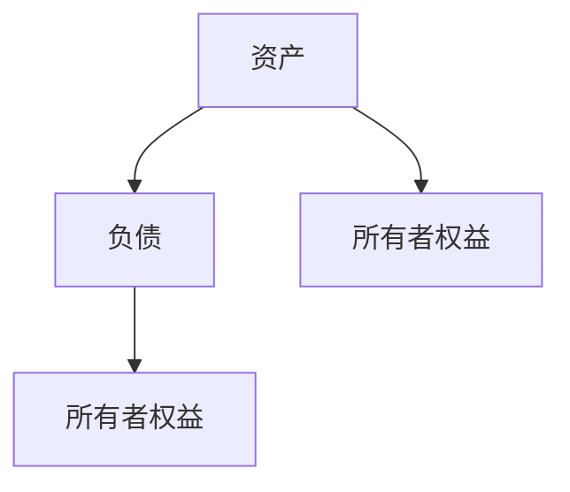
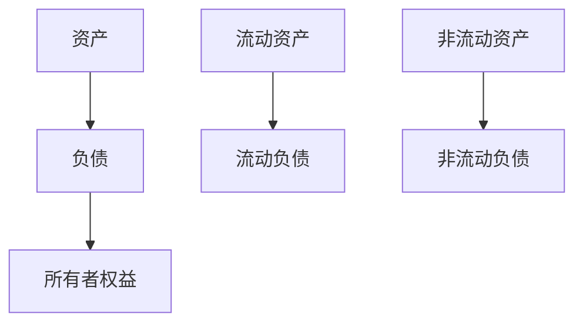
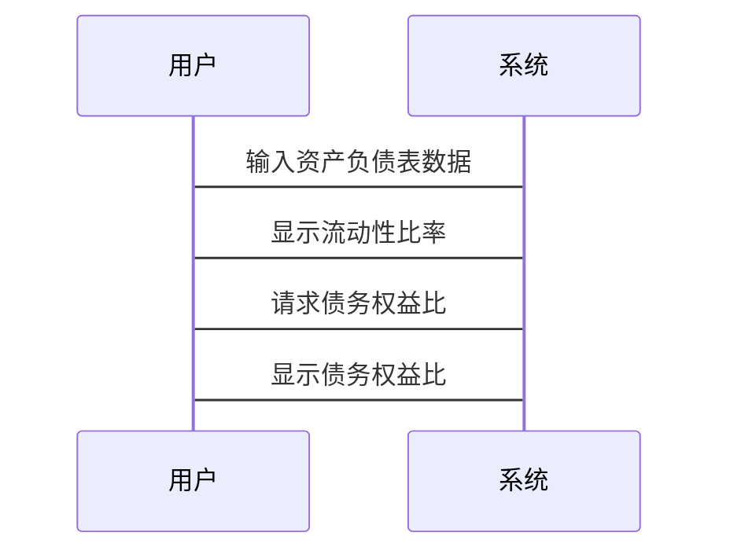

                 


# 彼得林奇对公司资产负债表质量的深度分析

> 关键词：彼得·林奇，资产负债表，财务分析，投资策略，公司财务

> 摘要：本文深入分析了彼得·林奇对公司资产负债表质量的分析方法，探讨了资产负债表的核心要素、质量评估指标、分析算法及其实战案例。通过系统性地讲解资产负债表的结构、流动性分析、偿债能力分析以及资产与负债结构分析，结合彼得·林奇的投资哲学，为读者提供一套全面的资产负债表质量评估体系。

---

# 第一部分: 背景介绍

## 第1章: 公司资产负债表质量分析的背景与重要性

### 1.1 资产负债表的基本概念与作用

#### 1.1.1 资产负债表的定义与组成

资产负债表是反映企业在某一特定会计期间内财务状况的报表，由资产、负债和所有者权益三部分组成。其中：

- **资产**：企业拥有的资源，包括流动资产（如现金、应收账款）和非流动资产（如固定资产、无形资产）。
- **负债**：企业对外部的债务，包括流动负债（如应付账款、短期借款）和非流动负债（如长期债券）。
- **所有者权益**：企业资产扣除负债后剩余的部分，代表股东对企业的所有权。

#### 1.1.2 资产负债表在企业财务管理中的作用

资产负债表不仅是企业财务健康状况的“晴雨表”，也是投资者评估企业价值的重要工具。通过资产负债表，投资者可以了解企业的偿债能力、运营效率和财务杠杆等关键指标。

#### 1.1.3 彼得·林奇对资产负债表分析的独特视角

彼得·林奇（Peter Lynch）是全球著名的投资专家，他特别强调对资产负债表的深入分析。他认为，一个企业的财务健康状况往往可以通过资产负债表的细节看出端倪。例如，他会关注企业的流动资产与流动负债的比例，以评估企业的短期偿债能力。

### 1.2 资产负债表质量分析的背景

#### 1.2.1 企业财务健康评估的重要性

在投资领域，资产负债表质量分析是评估企业财务健康状况的核心工具。通过分析资产负债表，投资者可以判断企业的偿债能力、运营效率和财务风险。

#### 1.2.2 彼得·林奇的投资哲学与资产负债表分析

彼得·林奇的投资哲学强调“bottom-up”方法，即从具体的企业分析入手。他认为，资产负债表的质量直接反映了企业的管理能力和财务健康状况。例如，他会重点关注企业的流动资产与流动负债的比例，以评估企业的短期偿债能力。

#### 1.2.3 当前经济环境下的资产负债表分析挑战

在当前复杂的经济环境中，资产负债表分析面临许多挑战，例如全球经济波动、通货膨胀和金融创新等。这些因素要求投资者更加细致地分析资产负债表，以识别潜在的风险和机会。

### 1.3 本书的核心目标与内容框架

#### 1.3.1 本书的核心目标

本书的核心目标是通过深入分析彼得·林奇的资产负债表分析方法，帮助读者掌握如何通过资产负债表评估企业的财务健康状况，并在投资决策中做出明智的选择。

#### 1.3.2 本书的主要内容框架

- 第一部分：背景介绍
  - 介绍资产负债表的基本概念和作用。
  - 探讨彼得·林奇对资产负债表分析的独特视角。
- 第二部分：核心概念与联系
  - 分析资产负债表的核心要素和质量评估指标。
  - 绘制资产负债表的实体关系图。
- 第三部分：算法原理讲解
  - 详细讲解资产负债表质量分析的算法和模型。
  - 使用mermaid流程图和Python代码示例进行说明。
- 第四部分：系统分析与架构设计
  - 绘制资产负债表的领域模型类图和系统架构图。
  - 通过实际案例进行详细分析和解读。

#### 1.3.3 本书的适用读者群体

本书适用于投资领域的从业者、企业财务管理人员、金融分析师以及对资产负债表分析感兴趣的投资者。

---

# 第二部分: 核心概念与联系

## 第2章: 资产负债表的核心要素与质量评估指标

### 2.1 资产负债表的结构与组成

#### 2.1.1 资产、负债与所有者权益的定义与关系

- **资产**：企业拥有的资源，包括流动资产和非流动资产。
- **负债**：企业对外部的债务，包括流动负债和非流动负债。
- **所有者权益**：企业资产扣除负债后剩余的部分，代表股东对企业的所有权。

资产、负债和所有者权益之间的关系可以用公式表示为：

$$ \text{资产} = \text{负债} + \text{所有者权益} $$

#### 2.1.2 资产负债表的基本公式

$$ \text{资产} = \text{负债} + \text{所有者权益} $$

这一公式是资产负债表的核心，反映了企业财务状况的基本平衡关系。

#### 2.1.3 资产负债表的编制与审计要求

资产负债表的编制需要遵循会计准则，确保数据的准确性和一致性。审计是保证资产负债表真实性和可靠性的关键环节。

### 2.2 资产负债表质量分析的关键指标

#### 2.2.1 流动资产与流动负债的定义与重要性

- **流动资产**：可以在一年内转换为现金的资产，包括现金、应收账款、存货等。
- **流动负债**：需要在一年内偿还的债务，包括应付账款、短期借款等。

流动资产与流动负债的比例是衡量企业短期偿债能力的重要指标。

#### 2.2.2 速动比率、流动比率等核心指标的计算与意义

- **流动比率**：
  $$ \text{流动比率} = \frac{\text{流动资产}}{\text{流动负债}} $$
  
  流动比率越高，企业的短期偿债能力越强。

- **速动比率**：
  $$ \text{速动比率} = \frac{\text{流动资产} - \text{存货}}{\text{流动负债}} $$

  速动比率比流动比率更加保守，因为它排除了存货这一变现能力较低的资产。

#### 2.2.3 负债结构的合理性分析

负债结构的合理性分析需要关注企业的资本结构是否合理，是否存在过高的短期负债比例。

### 2.3 资产负债表质量分析的实体关系图

以下是资产负债表的核心要素关系图：



---

# 第三部分: 算法原理讲解

## 第3章: 资产负债表质量分析的算法与模型

### 3.1 资产负债表质量分析的基本算法

#### 3.1.1 流动性分析算法

流动性分析算法主要用于评估企业的短期偿债能力，具体步骤如下：

1. 收集企业的流动资产和流动负债数据。
2. 计算流动比率和速动比率：
   $$ \text{流动比率} = \frac{\text{流动资产}}{\text{流动负债}} $$
   $$ \text{速动比率} = \frac{\text{流动资产} - \text{存货}}{\text{流动负债}} $$
3. 分析比率是否合理，判断企业的短期偿债能力。

#### 3.1.2 偿债能力分析算法

偿债能力分析算法用于评估企业的长期偿债能力，具体步骤如下：

1. 收集企业的总负债和所有者权益数据。
2. 计算债务权益比：
   $$ \text{债务权益比} = \frac{\text{总负债}}{\text{所有者权益}} $$
3. 分析比率是否合理，判断企业的长期偿债能力。

#### 3.1.3 资产与负债结构分析算法

资产与负债结构分析算法用于评估企业的资本结构，具体步骤如下：

1. 收集企业的流动资产、非流动资产、流动负债和非流动负债数据。
2. 计算流动资产与非流动资产的比例，流动负债与非流动负债的比例：
   $$ \text{流动资产比例} = \frac{\text{流动资产}}{\text{资产总额}} $$
   $$ \text{流动负债比例} = \frac{\text{流动负债}}{\text{负债总额}} $$
3. 分析比例是否合理，判断企业的资本结构是否优化。

### 3.2 核心算法的数学模型与公式

#### 3.2.1 流动性分析的数学模型

流动性分析的数学模型如下：

$$ \text{流动性比率} = \frac{\text{流动性资产}}{\text{流动性负债}} $$

其中，流动性资产包括现金、应收账款和存货，流动性负债包括应付账款和短期借款。

#### 3.2.2 偿债能力分析的数学模型

偿债能力分析的数学模型如下：

$$ \text{债务权益比} = \frac{\text{总负债}}{\text{所有者权益}} $$

该模型用于评估企业长期偿债能力。

---

# 第四部分: 系统分析与架构设计

## 第4章: 资产负债表分析的系统架构设计

### 4.1 问题场景介绍

在实际投资中，投资者需要快速、准确地分析企业的资产负债表，以评估其财务健康状况。为了实现这一目标，可以构建一个基于资产负债表分析的系统。

### 4.2 系统功能设计

以下是系统的功能设计：


### 4.3 系统架构设计

以下是系统的架构设计：



### 4.4 系统接口设计

系统接口设计如下：

1. 输入接口：接收企业的资产负债表数据。
2. 处理接口：计算流动性比率、债务权益比和资产与负债结构比例。
3. 输出接口：显示分析结果。

### 4.5 系统交互设计

以下是系统的交互设计：



---

# 第五部分: 项目实战

## 第5章: 资产负债表分析的实战案例

### 5.1 案例背景介绍

假设我们有一家企业的资产负债表数据如下：

| 资产类别 | 金额（万元） |
|----------|--------------|
| 现金      | 50           |
| 应收账款  | 80           |
| 存货      | 30           |
| 固定资产  | 200          |
| 无形资产  | 50           |

| 负债类别 | 金额（万元） |
|----------|--------------|
| 应付账款  | 40           |
| 短期借款  | 30           |
| 长期借款  | 80           |

| 所有者权益 | 金额（万元） |
|------------|--------------|
| 实收资本   | 100          |
| 盈余公积    | 40           |

### 5.2 系统核心实现源代码

以下是Python实现的资产负债表分析代码：

```python
def calculate_liquidity_ratio(current_assets, current_liabilities):
    return current_assets / current_liabilities

def calculate_debt_equity_ratio(total_liabilities, equity):
    return total_liabilities / equity

# 输入数据
current_assets = 50 + 80 + 30 = 160
current_liabilities = 40 + 30 = 70
total_liabilities = 40 + 30 + 80 = 150
equity = 100 + 40 = 140

# 计算流动性比率
liquidity_ratio = calculate_liquidity_ratio(current_assets, current_liabilities)
print(f"流动性比率 = {liquidity_ratio}")

# 计算债务权益比
debt_equity_ratio = calculate_debt_equity_ratio(total_liabilities, equity)
print(f"债务权益比 = {debt_equity_ratio}")
```

### 5.3 代码应用解读与分析

通过上述代码，我们可以计算出：

$$ \text{流动性比率} = \frac{160}{70} \approx 2.29 $$

$$ \text{债务权益比} = \frac{150}{140} \approx 1.07 $$

这两个比率表明，企业的短期偿债能力较强，而长期偿债能力处于合理水平。

### 5.4 案例小结

通过实际案例分析，我们可以看到，资产负债表分析在实际投资中的重要性。通过计算流动性比率和债务权益比，投资者可以快速评估企业的财务健康状况。

---

# 第六部分: 总结与展望

## 第6章: 资产负债表质量分析的总结与展望

### 6.1 总结

本文通过深入分析彼得·林奇的资产负债表分析方法，探讨了资产负债表的核心要素、质量评估指标、分析算法及其实战案例。通过系统性地讲解资产负债表的结构、流动性分析、偿债能力分析以及资产与负债结构分析，结合彼得·林奇的投资哲学，为读者提供了一套全面的资产负债表质量评估体系。

### 6.2 投资建议与注意事项

投资者在进行资产负债表分析时，应注意以下几点：

1. **结合其他财务报表**：资产负债表分析应与利润表和现金流量表分析相结合。
2. **关注行业特点**：不同行业对资产负债表分析的关注点有所不同。
3. **考虑宏观经济环境**：宏观经济环境会影响企业的财务状况。

### 6.3 未来展望

随着人工智能和大数据技术的发展，资产负债表分析将更加智能化和自动化。投资者可以利用这些技术工具，进一步提高分析效率和准确性。

---

# 作者

作者：AI天才研究院/AI Genius Institute & 禅与计算机程序设计艺术/Zen And The Art of Computer Programming

