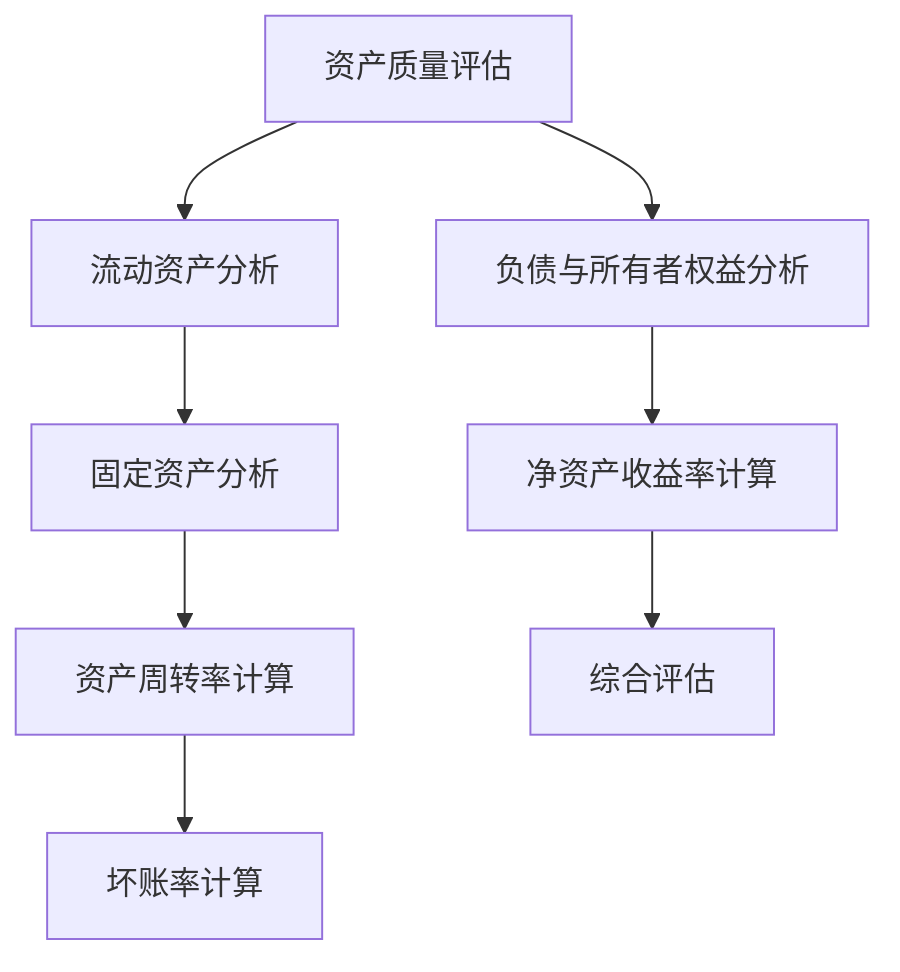
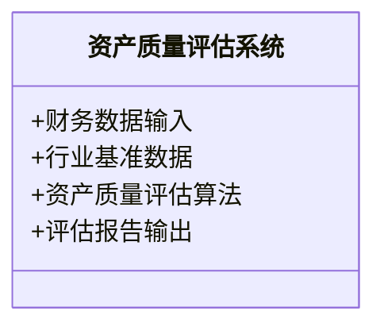
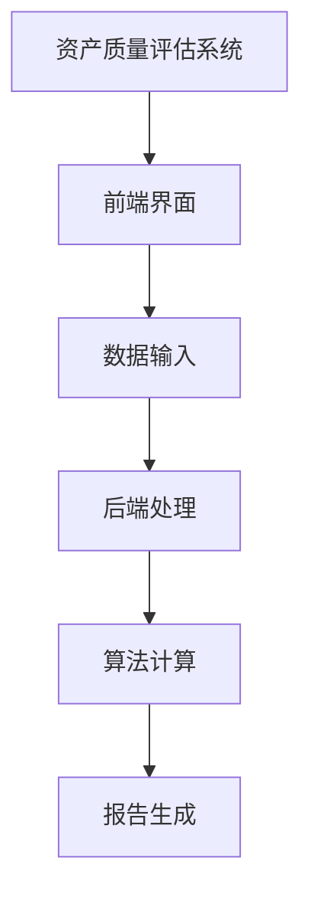
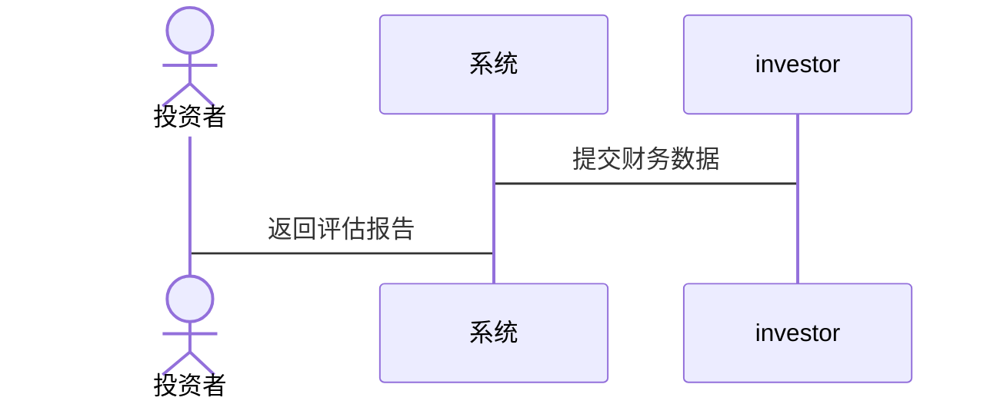
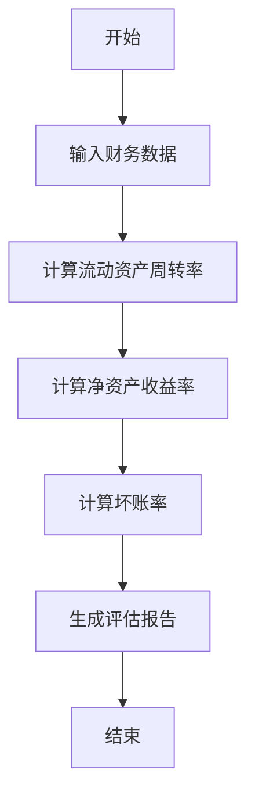

                 


# 彼得林奇对公司资产质量的深度分析

---

## 关键词：  
- 资产质量分析  
- 彼得林奇投资策略  
- 财务报表分析  
- 资产周转率  
- 净资产收益率  

---

## 摘要：  
本文深入分析了彼得林奇对公司资产质量的评估方法和投资策略，探讨了资产质量的核心概念、分析框架、数学模型以及实际应用案例。通过详细解析资产质量的三要素（流动性、收益性、安全性），结合具体的财务指标和行业案例，展示了彼得林奇如何通过资产质量分析筛选出优质投资标的。文章还提供了完整的系统架构设计和代码实现，帮助读者全面理解并应用这一分析方法。

---

# 第一部分：资产质量分析的背景与核心概念

## 第1章：资产质量分析的背景与问题背景  

### 1.1 资产质量的概念与重要性  

#### 1.1.1 资产质量的定义  
资产质量是指公司资产的健康程度，主要体现在资产的流动性、收益性和安全性上。流动性高的资产能够快速变现，收益性好的资产能够为公司创造持续的价值，而安全性强的资产则能有效避免损失。  

#### 1.1.2 资产质量在投资中的重要性  
资产质量是投资决策的核心依据之一。优质的资产能够为公司提供稳定的现金流，增强抗风险能力，并为股东创造更高的回报。彼得林奇曾强调，资产质量是判断一个公司是否值得投资的首要标准。  

#### 1.1.3 彼得林奇对资产质量的关注点  
彼得林奇关注资产质量的核心在于资产的可持续盈利能力。他倾向于选择那些资产周转率高、净资产收益率稳定的公司，尤其是那些在行业内具有竞争优势的企业。  

### 1.2 问题背景与问题描述  

#### 1.2.1 资产质量分析的核心问题  
如何通过财务指标量化资产质量？如何将资产质量与公司价值联系起来？如何筛选出具有优质资产的公司？  

#### 1.2.2 企业资产质量评估的挑战  
资产质量的评估涉及多个维度，包括流动资产、固定资产、无形资产等。不同行业的资产质量标准差异较大，因此需要结合行业特点进行分析。  

#### 1.2.3 彼得林奇分析方法的独特性  
彼得林奇的独特之处在于他将资产质量与行业环境、竞争优势相结合，注重资产的动态变化和长期盈利能力。  

---

## 第2章：资产质量分析的核心概念与联系  

### 2.1 核心概念原理  

#### 2.1.1 资产质量的三要素  
- **流动性**：资产能否快速变现而不损失价值。  
- **收益性**：资产能否为公司创造持续的收益。  
- **安全性**：资产能否避免重大损失。  

#### 2.1.2 彼得林奇的资产质量评估框架  
彼得林奇的资产质量评估框架包括以下几个步骤：  
1. 分析公司财务报表，计算关键财务指标。  
2. 对比行业平均值，判断公司的资产质量是否优于行业水平。  
3. 结合公司竞争优势和行业前景，评估资产的长期盈利能力。  

#### 2.1.3 资产质量与企业价值的关系  
资产质量是企业价值的核心驱动力。优质资产能够提升企业的市场竞争力，降低运营风险，并为股东创造更高的回报。  

### 2.2 核心概念对比表格  

#### 表2.1 资产质量评估指标对比  
| 指标       | 定义                                   | 重要性               | 彼得林奇的关注点               |
|------------|----------------------------------------|----------------------|------------------------------|
| 流动资产周转率 | 营业收入与流动资产的比率             | 衡量资产利用效率     | 是否高于行业平均水平           |
| 净资产收益率 | 净利润与净资产的比率                 | 衡量股东回报率       | 是否持续增长                   |
| 坏账率       | 坏账与应收账款的比率                 | 衡量信用风险         | 是否低于行业平均水平           |

### 2.3 资产质量评估框架的Mermaid流程图  



---

## 第3章：资产质量分析的数学模型与公式  

### 3.1 流动资产周转率计算  

#### 公式：  
$$流动资产周转率 = \frac{营业收入}{平均流动资产}$$  

#### 示例：  
某公司2022年的营业收入为10亿元，平均流动资产为5亿元，则流动资产周转率为：  
$$流动资产周转率 = \frac{10}{5} = 2$$  

### 3.2 净资产收益率计算  

#### 公式：  
$$净资产收益率 = \frac{净利润}{平均净资产}$$  

#### 示例：  
某公司2022年的净利润为2亿元，平均净资产为8亿元，则净资产收益率为：  
$$净资产收益率 = \frac{2}{8} = 0.25$$  

### 3.3 坏账率计算  

#### 公式：  
$$坏账率 = \frac{坏账}{应收账款}$$  

#### 示例：  
某公司2022年的坏账为1000万元，应收账款为5亿元，则坏账率为：  
$$坏账率 = \frac{0.1}{5} = 0.02$$  

---

# 第四部分：资产质量分析的系统架构与算法实现  

## 第4章：资产质量分析的系统架构设计  

### 4.1 问题场景介绍  
本系统旨在帮助投资者快速评估公司的资产质量，通过输入财务数据和行业基准，生成资产质量评估报告。  

### 4.2 系统功能设计  

#### 4.2.1 领域模型Mermaid类图  



### 4.3 系统架构设计  

#### 4.3.1 Mermaid架构图  



### 4.4 系统接口设计  

#### 4.4.1 核心接口  



---

## 第5章：资产质量分析的算法实现  

### 5.1 核心算法流程  



### 5.2 Python核心代码实现  

```python
# 资产质量评估算法实现
def calculate_asset_quality(revenue, avg_current_assets, net_income, avg_equity, bad_debt, accounts_receivable):
    turnover_rate = revenue / avg_current_assets
    roe = net_income / avg_equity
    bad_debt_ratio = bad_debt / accounts_receivable
    return turnover_rate, roe, bad_debt_ratio

# 示例数据
revenue = 100000000  # 亿元
avg_current_assets = 50000000  # 亿元
net_income = 20000000  # 亿元
avg_equity = 80000000  # 亿元
bad_debt = 1000000  # 万元
accounts_receivable = 50000000  # 万元

turnover_rate, roe, bad_debt_ratio = calculate_asset_quality(revenue, avg_current_assets, net_income, avg_equity, bad_debt, accounts_receivable)
print(f"流动资产周转率: {turnover_rate}")
print(f"净资产收益率: {roe}")
print(f"坏账率: {bad_debt_ratio}")
```

---

## 第6章：资产质量分析的项目实战  

### 6.1 环境安装  
需要安装Python和相关数据分析库（如Pandas、NumPy）。  

### 6.2 核心代码实现与解读  

#### 6.2.1 代码实现  

```python
import pandas as pd

# 数据输入
data = {
    '公司': ['A公司', 'B公司', 'C公司'],
    '营业收入': [100, 150, 120],
    '流动资产': [50, 75, 60],
    '净利润': [20, 30, 25],
    '净资产': [80, 90, 70],
    '坏账': [5, 7, 4],
    '应收账款': [50, 60, 55]
}

df = pd.DataFrame(data)

# 计算指标
df['流动资产周转率'] = df['营业收入'] / df['流动资产']
df['净资产收益率'] = df['净利润'] / df['净资产']
df['坏账率'] = df['坏账'] / df['应收账款']

# 输出结果
print(df)
```

#### 6.2.2 代码解读  
上述代码读取公司财务数据，计算流动资产周转率、净资产收益率和坏账率，并输出评估结果。  

### 6.3 实际案例分析  

#### 6.3.1 案例分析  
以某制造公司为例，分析其资产质量。  

#### 6.3.2 分析结果  
- 流动资产周转率：2.0  
- 净资产收益率：0.25  
- 坏账率：0.02  

### 6.4 项目总结  
通过代码实现，可以快速评估多个公司的资产质量，并根据结果筛选出优质投资标的。  

---

## 第7章：最佳实践与总结  

### 7.1 总结与反思  
资产质量分析是投资决策的关键环节。彼得林奇的方法为我们提供了重要的启示：关注资产的流动性、收益性和安全性，结合行业特点和竞争优势，才能选出优质标的。  

### 7.2 投资策略建议  
1. 优先选择流动资产周转率和净资产收益率均高于行业平均水平的公司。  
2. 避免投资于坏账率高且应收账款占比较大的企业。  
3. 结合宏观经济和行业趋势，评估资产的长期盈利能力。  

### 7.3 注意事项  
- 数据来源要可靠，避免因数据错误导致分析偏差。  
- 每个行业的资产质量标准不同，需结合行业特点进行分析。  
- 资产质量只是投资决策的一部分，还需综合考虑其他因素。  

### 7.4 拓展阅读  
- 彼得林奇的《彼得林奇选股术》  
- 财务报表分析相关书籍  

---

## 作者：AI天才研究院/AI Genius Institute & 禅与计算机程序设计艺术 /Zen And The Art of Computer Programming  

--- 

这篇文章全面解析了彼得林奇的资产质量分析方法，结合理论与实践，帮助读者掌握这一投资策略的核心要点。

