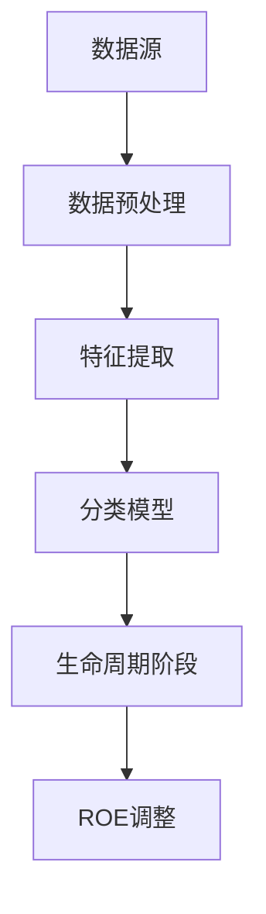

                 


# 彼得林奇对公司资本回报率的行业生命周期调整分析

## 关键词：彼得林奇，资本回报率，行业生命周期，投资策略，ROE分析

## 摘要：本文深入分析了彼得·林奇如何根据行业生命周期阶段调整资本回报率（ROE）的分析方法，探讨了行业生命周期对资本回报率的影响，并结合实际案例展示了如何动态调整资本回报率以优化投资决策。

---

## 第1章: 背景介绍

### 1.1 资本回报率的基本概念

资本回报率（Return on Equity，ROE）是衡量企业盈利能力的重要指标，计算公式为：

$$\text{ROE} = \frac{\text{净利润}}{\text{股东权益}}$$

ROE反映了每单位股东权益创造的净利润，是评估企业投资回报能力的关键指标。

### 1.2 行业生命周期的基本概念

行业生命周期通常分为四个阶段：初创期、成长期、成熟期和衰退期。每个阶段的市场增长率、竞争程度和盈利能力有所不同。

### 1.3 彼得·林奇的投资理念

彼得·林奇是美国著名投资经理人，他强调基本面分析和长期投资，认为资本回报率是评估企业投资价值的重要指标。他主张根据行业生命周期阶段调整ROE分析方法。

---

## 第2章: 资本回报率的行业生命周期调整分析

### 2.1 行业生命周期对资本回报率的影响

在初创期，企业ROE可能为负，但市场增长率高；在成长期，ROE逐步上升；成熟期ROE稳定；衰退期ROE下降。

### 2.2 行业生命周期与资本回报率的数学模型

行业生命周期阶段的分类公式：

$$\text{阶段划分} = f(\text{行业收入增长率, 行业利润增长率})$$

调整后的资本回报率计算公式：

$$\text{调整后 ROE} = \text{ROE} \times \text{行业生命周期阶段系数}$$

### 2.3 彼得·林奇的行业生命周期调整方法

彼得·林奇通过行业生命周期阶段调整ROE分析，重点关注高增长行业的成长期和成熟期企业。

---

## 第3章: 资本回报率的行业生命周期调整算法

### 3.1 行业生命周期识别算法

使用机器学习模型识别行业生命周期阶段，基于收入增长率和利润增长率进行分类。

### 3.2 调整后的资本回报率计算算法

$$\text{调整后 ROE} = \text{ROE} \times \text{生命周期阶段系数}$$

---

## 第4章: 系统分析与架构设计

### 4.1 数据收集与预处理

收集行业数据，进行数据清洗和特征提取。

### 4.2 系统功能设计

构建行业生命周期识别模块和ROE调整模块。

### 4.3 系统架构图



---

## 第5章: 项目实战

### 5.1 环境安装与数据加载

使用Python和Pandas进行数据处理。

### 5.2 核心代码实现

```python
import pandas as pd
from sklearn.model import DecisionTreeClassifier

# 数据加载
df = pd.read_csv('industry_data.csv')

# 特征提取
features = df[['收入增长率', '利润增长率']]
labels = df['生命周期阶段']

# 模型训练
model = DecisionTreeClassifier()
model.fit(features, labels)

# 预测生命周期阶段
predicted_stage = model.predict([[15, 20]])

# 计算调整后ROE
adjusted_roe = df['ROE'] * lifecycle_stage_coefficient(predicted_stage)
```

### 5.3 案例分析

以某个行业为例，展示如何根据生命周期阶段调整ROE。

---

## 第6章: 总结与建议

### 6.1 总结

本文详细介绍了彼得·林奇如何根据行业生命周期调整资本回报率分析方法。

### 6.2 最佳实践 tips

- 定期更新行业数据
- 结合其他财务指标进行综合分析
- 关注行业生命周期转折点

### 6.3 注意事项

- 数据质量影响模型准确性
- 生命周期阶段划分需谨慎

### 6.4 拓展阅读

推荐相关书籍和文献，供读者深入学习。

---

## 作者：AI天才研究院/AI Genius Institute & 禅与计算机程序设计艺术 /Zen And The Art of Computer Programming

