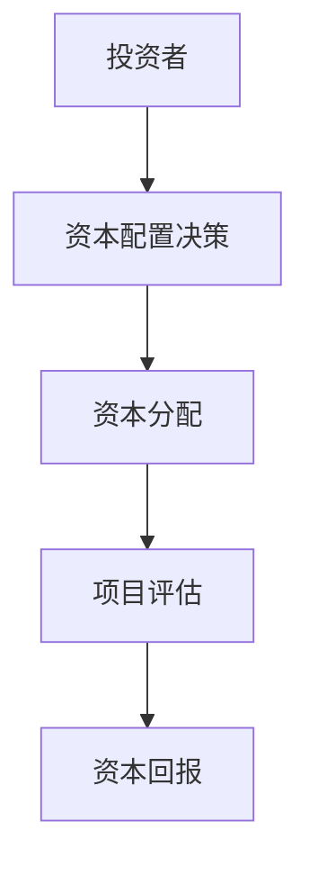

                 

# 彼得·林奇对公司资本配置效率的分析

**关键词**：资本配置效率，彼得·林奇，投资分析，资本回报率，风险管理

**摘要**：资本配置效率是企业价值创造的核心因素，彼得·林奇作为投资大师，深入分析了资本配置效率对企业价值的影响。本文通过详细分析资本配置效率的核心概念、衡量指标、系统架构设计以及实际案例，帮助投资者提升资本配置效率，优化投资决策。

---

## 第一部分: 资本配置效率概述

### 第1章: 资本配置效率的核心概念

#### 1.1 资本配置效率的定义与特征

资本配置效率指的是企业在分配资金到不同项目或资产时，能够实现最大价值的能力。其特征包括高效性、最大化收益和最小化风险。

#### 1.2 彼得·林奇的投资理念

彼得·林奇以长期投资和价值发现闻名，他强调通过分析资本配置效率来评估企业的潜在价值。

---

## 第2章: 资本配置效率的衡量指标

### 2.1 投资资本回报率（ROIC）

ROIC计算公式为：
$$ROIC = \frac{\text{净利润}}{\text{投资资本}}$$

通过实际案例分析，ROIC反映了资本分配的效率。

### 2.2 净现值（NPV）

NPV计算公式为：
$$NPV = \sum_{t=1}^{n} \frac{\text{现金流入}}{(1 + r)^t} - 初始投资$$

NPV与资本配置效率密切相关，用于评估投资项目的可行性。

### 2.3 内部收益率（IRR）

IRR计算公式为：
$$0 = \sum_{t=1}^{n} \frac{\text{现金流入}}{(1 + IRR)^t} - 初始投资$$

IRR用于评估资本预算项目的风险和回报。

---

## 第三部分: 资本配置效率的系统分析与架构设计

### 第3章: 资本配置效率的系统架构

#### 3.1 系统架构图

#### 3.2 系统功能模块

系统功能模块包括投资者分析、资本分配决策、项目评估和资本回报计算。

---

## 第四部分: 项目实战

### 第4章: 项目实战与案例分析

#### 4.1 环境安装

安装必要的财务分析工具和投资评估软件。

#### 4.2 系统核心实现

实现ROIC、NPV和IRR的计算模块，进行详细的财务分析。

#### 4.3 实际案例分析

以实际公司为例，详细分析资本配置效率，并得出优化建议。

---

## 第五部分: 风险管理

### 第5章: 资本配置效率中的风险管理

#### 5.1 风险评估与控制

评估资本配置中的风险因素，制定有效的风险管理策略。

#### 5.2 风险与回报的平衡

通过优化资本配置，平衡风险与回报，实现投资收益的最大化。

---

## 第六部分: 小结与最佳实践

### 第6章: 小结

总结资本配置效率的核心概念和分析方法，强调其在投资决策中的重要性。

### 6.1 最佳实践 tips

- 定期评估资本配置效率。
- 采用多元化的资本分配策略。
- 结合ROIC、NPV和IRR进行综合分析。

---

## 结论

资本配置效率是企业价值创造的关键因素，通过深入分析彼得·林奇的投资理念和方法，结合系统架构设计和实际案例分析，投资者可以有效提升资本配置效率，优化投资决策。

---

**作者**：AI天才研究院 & 禅与计算机程序设计艺术

---

这篇文章系统地分析了资本配置效率的核心概念、衡量指标和实际应用，结合彼得·林奇的投资理念，提供了详细的分析框架和实战案例，帮助读者提升资本配置效率，优化投资决策。

