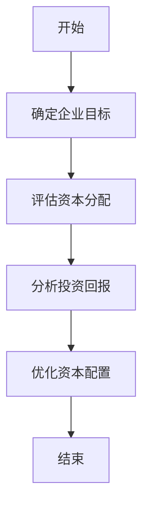
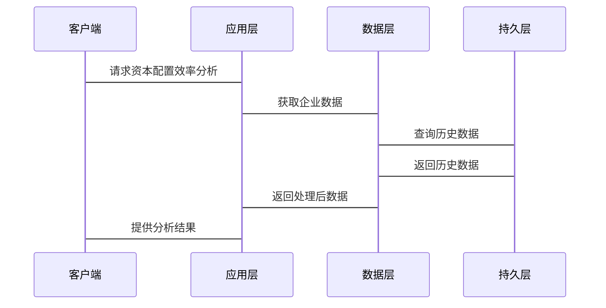

                 


# 彼得林奇对公司资本配置效率的历史分析

---

## 关键词：
- 彼得林奇
- 资本配置效率
- 投资分析
- 财务管理
- 投资策略

---

## 摘要：
本文深入分析了彼得林奇对公司资本配置效率的独特见解及其历史应用。通过解析资本配置效率的核心概念、数学模型、系统架构以及实际案例，本文揭示了彼得林奇如何通过高效资本配置为企业创造价值。文章结构清晰，内容涵盖背景介绍、核心概念、算法原理、系统设计和项目实战，为投资者和企业管理者提供了实用的分析框架和实践指南。

---

## 目录大纲：

### 第一部分：资本配置效率的背景与重要性

#### 第1章：资本配置效率的背景与重要性

##### 1.1 资本配置效率的定义与核心概念

- 1.1.1 资本配置效率的定义
- 1.1.2 资本配置效率的核心要素
- 1.1.3 资本配置效率的边界与外延

##### 1.2 资本配置效率的历史背景

- 1.2.1 工业化时代的企业资本配置模式
- 1.2.2 信息时代对企业资本配置的影响
- 1.2.3 彼得林奇投资理念的形成背景

##### 1.3 彼得林奇与资本配置效率

- 1.3.1 彼得林奇的投资哲学概述
- 1.3.2 彼得林奇对资本配置效率的重视
- 1.3.3 彼得林奇分析方法的独特性

##### 1.4 本章小结

### 第二部分：资本配置效率的核心概念与联系

#### 第2章：资本配置效率的核心概念与联系

##### 2.1 资本配置效率的核心原理

- 2.1.1 资本配置效率的衡量指标
- 2.1.2 资本配置效率的驱动因素
- 2.1.3 资本配置效率与企业价值的关系

##### 2.2 核心概念对比分析

- 2.2.1 资本配置效率与资本回报率的对比
- 2.2.2 资本配置效率与资产周转率的对比
- 2.2.3 资本配置效率与股东权益回报率的对比

##### 2.3 实体关系图与流程图

- 2.3.1 资本配置效率的ER实体关系图
  ```mermaid
  graph TD
      A[资本] --> B[配置]
      B --> C[效率]
      C --> D[企业价值]
  ```

- 2.3.2 资本配置效率的分析流程图
  ```mermaid
  graph TD
      A[开始] --> B[确定企业目标]
      B --> C[评估资本分配]
      C --> D[分析投资回报]
      D --> E[优化资本配置]
      E --> F[结束]
  ```

##### 2.4 本章小结

### 第三部分：资本配置效率的数学模型与算法原理

#### 第3章：资本配置效率的数学模型与算法原理

##### 3.1 资本配置效率的数学模型

- 3.1.1 资本回报率（ROE）模型
  $$ROE = \frac{Net\ Profit}{Total\ Equity}$$
- 3.1.2 资产回报率（ROA）模型
  $$ROA = \frac{Net\ Profit}{Total\ Assets}$$
- 3.1.3 净现值（NPV）模型
  $$NPV = \sum_{t=1}^{n} \frac{CF_t}{(1 + r)^t}$$

##### 3.2 彼得林奇分析方法的数学实现

- 3.2.1 股东权益回报率（ROE）分析
- 3.2.2 资产轻量化分析
- 3.2.3 投资回报率（ROI）分析

##### 3.3 算法流程图



##### 3.4 本章小结

### 第四部分：资本配置效率的系统分析与架构设计

#### 第4章：资本配置效率的系统分析与架构设计

##### 4.1 问题场景介绍

- 资本配置效率的分析框架
- 彼得林奇分析方法的系统结构

##### 4.2 系统功能设计

- 领域模型mermaid类图
  ```mermaid
  classDiagram
      class 资本配置效率 {
          股东权益回报率(ROE)
          资产回报率(ROA)
          净现值(NPV)
      }
      class 投资分析框架 {
          数据收集
          指标分析
          决策支持
      }
      class 企业价值评估 {
          投资回报分析
          资本分配优化
          价值评估报告
      }
  ```

##### 4.3 系统架构设计

- 系统架构mermaid架构图
  ```mermaid
  architecture
      客户端 <---> 应用层
      应用层 <---> 数据层
      数据层 <---> 持久层
  ```

##### 4.4 系统接口设计

- 关键接口描述
  - 数据收集接口
  - 指标分析接口
  - 决策支持接口

##### 4.5 系统交互mermaid序列图



##### 4.6 本章小结

### 第五部分：资本配置效率的项目实战

#### 第5章：资本配置效率的项目实战

##### 5.1 经典案例分析

- 5.1.1 可口可乐公司分析
  - 数据收集与整理
  - ROE与ROA分析
  - 投资回报评估
- 5.1.2 通用电气公司分析
  - 资本分配策略
  - NPV分析与投资决策
  - 价值评估报告

##### 5.2 项目核心实现源代码

- 资本配置效率分析的Python实现
  ```python
  def calculate_roe(net_profit, total_equity):
      return net_profit / total_equity
  
  def calculate_roa(net_profit, total_assets):
      return net_profit / total_assets
  
  def calculate_npv(cash_flows, discount_rate):
      return sum(cash_flow / (1 + discount_rate)**t for t, cash_flow in enumerate(cash_flows))
  
  # 示例数据
  net_profit = 1000000
  total_equity = 5000000
  total_assets = 10000000
  discount_rate = 0.1
  cash_flows = [100000, 150000, 200000, 250000, 300000]
  
  roe = calculate_roe(net_profit, total_equity)
  roa = calculate_roa(net_profit, total_assets)
  npv = calculate_npv(cash_flows, discount_rate)
  
  print(f"ROE: {roe:.2f}%")
  print(f"ROA: {roa:.2f}%")
  print(f"NPV: {npv:.2f}")
  ```

##### 5.3 代码应用解读与分析

- 函数实现与数据处理
- 分析结果解读
- 案例分析总结

##### 5.4 本章小结

### 第六部分：资本配置效率的总结与最佳实践

#### 第6章：总结与最佳实践

##### 6.1 学习总结

- 资本配置效率的核心要点
- 彼得林奇分析方法的精髓
- 个人理解和感悟

##### 6.2 最佳实践 tips

- 有效数据收集的关键
- 指标分析的注意事项
- 投资决策中的常见误区

##### 6.3 注意事项

- 数据的准确性和完整性
- 模型的适用性和局限性
- 决策的及时性和灵活性

##### 6.4 拓展阅读推荐

- 推荐书籍和资源
- 进一步学习的方向
- 专业组织和社区推荐

##### 6.5 本章小结

### 附录：作者信息

作者：AI天才研究院/AI Genius Institute & 禅与计算机程序设计艺术/Zen And The Art of Computer Programming

---

这个目录大纲全面覆盖了资本配置效率的核心概念、数学模型、系统架构和实际案例分析，结合彼得林奇的投资理念，为读者提供了从理论到实践的完整指导。

