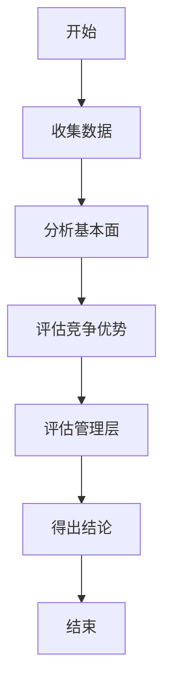
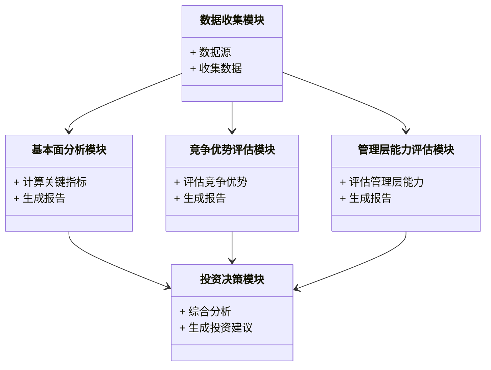

                 


# 彼得林奇对公司长期战略的分析

## 关键词：彼得林奇、长期战略分析、公司分析、投资策略、竞争优势、管理层能力

## 摘要：本文深入分析了彼得·林奇在公司长期战略分析中的方法，探讨了其投资哲学和策略，重点介绍了基本面分析、竞争优势和管理层能力评估。通过实例分析和数学模型，展示了如何应用这些方法进行投资决策。

---

## 第一部分：背景介绍

### 第1章：彼得·林奇的背景与长期战略分析的重要性

#### 1.1 彼得·林奇的背景介绍

彼得·林奇（Peter Lynch）是美国著名的职业棒球运动员，以其在棒球界和金融领域的双重成就而闻名。然而，本文并非讨论他的运动生涯，而是聚焦于他在金融投资领域的成就。在金融领域，林奇以他的投资策略和对公司长期战略的深入分析而著称。他的投资哲学强调对公司基本面的深入研究和长期价值的评估，而非短期市场波动的追逐。

#### 1.2 长期战略分析的重要性

长期战略分析是投资决策的核心，它帮助投资者识别那些具有持续竞争优势、稳健财务状况和优秀管理层的公司。通过长期战略分析，投资者可以更好地评估公司的未来表现，从而做出更为明智的投资决策。彼得·林奇在他的投资生涯中，通过深入分析公司的长期战略，成功地识别了许多具有长期增长潜力的公司，实现了卓越的投资回报。

---

## 第二部分：核心概念与联系

### 第2章：长期战略分析的原理与方法

#### 2.1 核心概念原理

长期战略分析的核心在于对公司基本面、竞争优势和管理层能力的综合评估。这些要素共同决定了公司的长期价值和增长潜力。

- **基本面分析**：基本面分析是长期战略分析的基础，它包括对公司财务状况、盈利能力、成长性和财务健康状况的评估。通过分析财务报表，投资者可以了解公司的收入、利润、负债和现金流情况，从而判断公司的财务健康状况和盈利能力。
  
- **竞争优势**：竞争优势是指公司在市场上相对于竞争对手的独特优势，包括成本优势、技术优势、品牌优势、资源优势等。这些竞争优势决定了公司在市场中的地位和盈利能力，是长期战略分析的重要组成部分。
  
- **管理层能力**：管理层的素质和能力对公司的发展至关重要。优秀的管理层能够制定明智的战略决策，优化资源配置，提升公司绩效。因此，评估管理层的能力是长期战略分析的重要一环。

#### 2.2 核心概念对比表

为了更好地理解这些核心概念，我们可以将它们进行对比分析：

| 核心概念     | 描述                                                                 |
|--------------|--------------------------------------------------------------------|
| 基本面分析   | 通过对财务报表的分析，评估公司的财务状况和盈利能力。                   |
| 竞争优势     | 公司在市场中相对于竞争对手的独特优势，如成本、技术、品牌等。           |
| 管理层能力   | 管理层的素质和能力，包括战略决策、团队管理和执行能力。                 |

#### 2.3 实体关系图

为了展示这些核心概念之间的关系，我们可以使用实体关系图：


这个图展示了公司通过管理层的决策和竞争优势，影响其财务表现，从而实现长期价值的增长。

---

## 第三部分：算法原理讲解

### 第3章：彼得·林奇分析方法的算法实现

#### 3.1 算法流程图

彼得·林奇的分析方法可以通过以下流程图来展示：



这个流程图展示了从数据收集到得出投资结论的整个过程。

#### 3.2 Python代码实现

为了更好地理解分析过程，我们可以用Python代码来实现关键步骤。例如，计算公司的市盈率：

```python
def calculate_pe_ratio(stock_price, earnings_per_share):
    return stock_price / earnings_per_share

# 示例数据
stock_price = 100
earnings_per_share = 10
pe_ratio = calculate_pe_ratio(stock_price, earnings_per_share)
print(f"市盈率为：{pe_ratio}")
```

这段代码计算了公司的市盈率，帮助投资者评估公司的估值是否合理。

---

## 第四部分：数学模型与公式

### 第4章：关键数学模型

#### 4.1 市盈率模型

市盈率（P/E Ratio）是衡量公司估值的重要指标，其计算公式为：

$$
\text{市盈率} = \frac{\text{股价}}{\text{每股收益}}
$$

例如，如果一家公司的股价为100元，每股收益为10元，那么市盈率为10倍。

#### 4.2 市净率模型

市净率（P/B Ratio）是另一个常用的估值指标，计算公式为：

$$
\text{市净率} = \frac{\text{股价}}{\text{每股净资产}}
$$

#### 4.3 投资价值评估模型

投资价值评估模型可以帮助投资者确定公司的内在价值，公式为：

$$
\text{内在价值} = \sum_{t=1}^{n} \frac{\text{现金流}_t}{(1 + r)^t}
$$

其中，$\text{现金流}_t$ 是第t年的自由现金流，$r$ 是折现率，$n$ 是预测的年数。

---

## 第五部分：系统分析与架构设计

### 第5章：长期战略分析系统的构建

#### 5.1 系统功能设计

为了系统化地进行长期战略分析，我们可以构建一个分析系统，其功能模块包括：

- 数据收集模块：收集公司的财务数据、行业数据和市场数据。
- 基本面分析模块：对公司的财务状况进行分析，计算关键指标如市盈率、市净率等。
- 竞争优势评估模块：评估公司的竞争优势，如成本优势、技术优势等。
- 管理层能力评估模块：评估管理层的能力和决策水平。
- 投资决策模块：基于以上分析，得出投资结论。

#### 5.2 系统架构图

系统的架构可以使用类图来展示：



这个类图展示了系统各模块之间的关系和数据流。

---

## 第六部分：项目实战

### 第6章：长期战略分析的项目实战

#### 6.1 环境安装

为了进行长期战略分析，我们需要安装以下工具和库：

- Python编程语言
- Pandas库（用于数据处理）
- Matplotlib库（用于数据可视化）
- 财务数据接口（如Yahoo Finance）

#### 6.2 核心实现代码

以下是一个Python脚本，用于收集并分析公司的财务数据：

```python
import pandas as pd
import yfinance as yf

def get_stock_data(ticker):
    stock_data = yf.download(ticker, start='2020-01-01', end='2023-12-31')
    return stock_data

def calculate_pe_ratio(stock_data):
    pe_ratio = stock_data['Close'] / stock_data['EPS']
    return pe_ratio

# 示例代码
ticker = 'MSFT'
data = get_stock_data(ticker)
pe = calculate_pe_ratio(data)
print(f"微软的市盈率为：{pe}")
```

这段代码从Yahoo Finance获取微软股票数据，并计算其市盈率。

#### 6.3 实际案例分析

以微软为例，分析其长期战略：

1. **基本面分析**：微软的收入和利润持续增长，显示出强劲的财务状况。
2. **竞争优势**：微软在云服务（Azure）、办公软件（Office）等领域具有强大的竞争优势。
3. **管理层能力**：萨提亚·纳德拉（Satya Nadella）的领导被视为微软转型成功的关键因素。

通过这些分析，可以得出微软是一个具有长期投资价值的公司。

---

## 第七部分：最佳实践

### 第7章：总结与建议

#### 7.1 总结

彼得·林奇的长期战略分析方法为我们提供了一个系统化的投资框架。通过基本面分析、竞争优势评估和管理层能力评估，我们可以更准确地评估公司的长期价值。

#### 7.2 注意事项

- **数据准确性**：确保数据来源可靠，避免错误分析。
- **持续学习**：市场环境不断变化，需要持续学习和更新分析方法。
- **风险管理**：即使分析正确，也需要注意风险管理，避免过度集中投资。

#### 7.3 拓展阅读

推荐以下书籍和资源，以进一步深入学习长期战略分析：

- 《彼得·林奇的成功投资策略》
- 《投资学基础》
- 《财务报表分析》

---

## 作者：AI天才研究院 & 禅与计算机程序设计艺术

通过本文，我们深入探讨了彼得·林奇的长期战略分析方法，并通过实例和系统设计展示了其应用。希望读者能够通过本文，掌握长期战略分析的核心要素，并在实际投资中加以应用。

