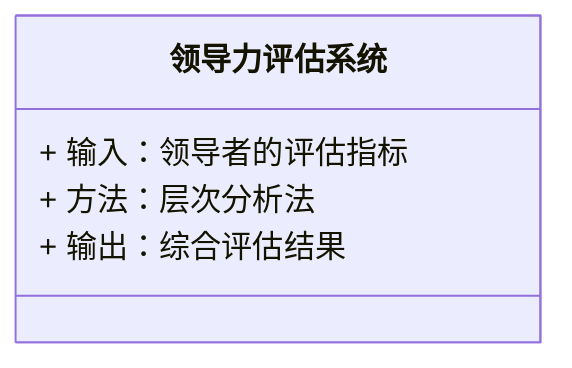
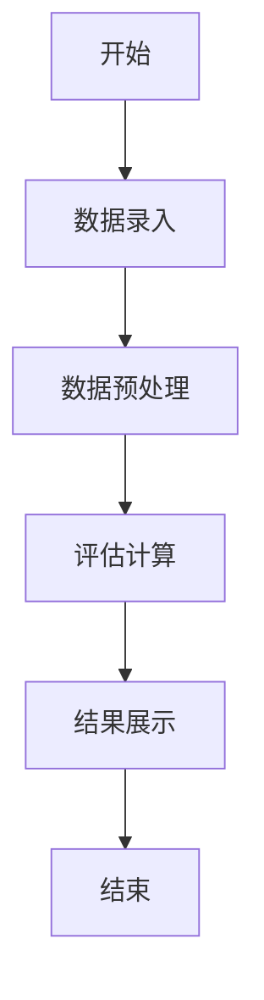

                 


# 彼得林奇对公司领导力的评估

> 关键词：领导力评估，彼得·林奇，评估模型，算法原理，系统架构，项目实战

> 摘要：本文从彼得·林奇的领导力评估方法出发，结合系统工程和数据科学，详细阐述了领导力评估的核心概念、算法原理、系统架构以及实际项目中的应用。通过理论与实践相结合的方式，帮助读者深入理解领导力评估的本质，并掌握如何在实际工作中应用这些方法。

---

## 第一章：领导力评估的背景与意义

### 1.1 领导力评估的重要性

#### 1.1.1 领导力在公司治理中的作用
领导力是公司治理的核心要素之一，它不仅影响公司的战略方向，还决定了团队的执行力和凝聚力。优秀的领导者能够带领团队克服困难，实现目标。

#### 1.1.2 领导力评估的必要性
在公司中，领导力评估是人才管理和决策的重要依据。通过评估领导者的优缺点，可以更好地发现和培养优秀人才，同时避免因领导能力不足而导致的管理问题。

#### 1.1.3 彼得·林奇的领导力评估方法
彼得·林奇是著名的职业棒球运动员，他的领导力评估方法以实用性和可操作性著称。本文将结合他的方法，从多个维度对领导力进行评估。

---

### 1.2 领导力评估的核心概念

#### 1.2.1 领导力的定义与维度
领导力是指领导者在组织中通过影响力、决策能力和团队管理能力来实现目标的能力。常见的领导力维度包括决策能力、沟通能力、团队管理能力和创新能力。

#### 1.2.2 领导力评估的边界与外延
领导力评估不仅关注领导者的个人能力，还需要考虑其在特定组织环境中的表现。本文将从个体、团队和组织三个层面进行评估。

#### 1.2.3 领导力评估的核心要素组成
领导力评估的核心要素包括以下几个方面：
- **决策能力**：领导者在复杂情况下的决策能力。
- **沟通能力**：领导者与团队成员和其他利益相关者的沟通能力。
- **团队管理能力**：领导者对团队的组织和管理能力。
- **创新能力**：领导者在面对新问题时的创新思维能力。

---

## 第二章：领导力评估的核心概念原理

### 2.1 领导力评估的理论基础

#### 2.1.1 领导力的四维度模型
四维度模型将领导力分解为以下几个维度：
1. **决策能力**：领导者在复杂情况下的决策能力。
2. **沟通能力**：领导者与团队成员和其他利益相关者的沟通能力。
3. **团队管理能力**：领导者对团队的组织和管理能力。
4. **创新能力**：领导者在面对新问题时的创新思维能力。

#### 2.1.2 领导力的五层次模型
五层次模型从个人特质、行为表现、团队管理、组织文化和战略目标五个方面对领导力进行评估。

#### 2.1.3 彼得·林奇的领导力评估框架
彼得·林奇的领导力评估框架以实用性和可操作性著称，他提出了以下几点：
- **目标导向**：领导者需要有明确的目标导向，能够带领团队实现目标。
- **团队管理**：领导者需要具备较强的团队管理能力，能够激发团队成员的潜力。
- **创新思维**：领导者需要具备创新思维，能够应对复杂多变的环境。

---

### 2.2 领导力评估的核心要素对比

#### 2.2.1 领导力维度的对比分析
以下是对领导力维度的对比分析：

| 维度 | 定义 | 重要性 | 评估方法 |
|------|------|---------|----------|
| 决策能力 | 在复杂情况下的决策能力 | 高 | 层次分析法（AHP） |
| 沟通能力 | 与团队成员和其他利益相关者的沟通能力 | 高 | 模糊综合评价法 |
| 团队管理能力 | 对团队的组织和管理能力 | 中高 | 根据具体场景调整权重 |
| 创新能力 | 在面对新问题时的创新思维能力 | 高 | 根据具体场景调整权重 |

#### 2.2.2 领导力评估指标的特征对比
以下是对领导力评估指标的特征对比：

| 指标 | 特征 | 优缺点 | 适用场景 |
|------|------|---------|----------|
| 决策能力 | 客观性高，可量化 | 需要较多数据支持 | 适用于战略决策 |
| 沟通能力 | 主观性较高，难以量化 | 需要通过访谈等方式评估 | 适用于日常管理 |
| 团队管理能力 | 综合性高，难以量化 | 需要通过团队反馈等方式评估 | 适用于团队建设 |
| 创新能力 | 创新性高，难以量化 | 需要通过创新成果评估 | 适用于创新型企业 |

#### 2.2.3 领导力评估的ER实体关系图

```mermaid
er
actor: 领导力评估系统
model: 领导力评估指标
dimension: 领导力维度
```

---

## 第三章：领导力评估的算法原理

### 3.1 领导力评估模型的构建

#### 3.1.1 层次分析法（AHP）的应用
层次分析法是一种常用的多指标决策方法，适用于领导力评估中多个维度的权重分配。

#### 3.1.2 模糊综合评价法的原理
模糊综合评价法是一种基于模糊数学的评价方法，适用于领导力评估中主观指标的评价。

#### 3.1.3 彼得·林奇评估模型的数学表达
以下是彼得·林奇评估模型的数学表达：

$$
\text{领导力评估} = \sum_{i=1}^{n} w_i x_i
$$

其中，\( w_i \) 是第 \( i \) 个维度的权重，\( x_i \) 是第 \( i \) 个维度的评分。

---

### 3.2 算法实现与代码

#### 3.2.1 层次分析法的代码实现
以下是层次分析法的Python代码示例：

```python
import numpy as np

def calculate_weights(matrix):
    # 计算权重向量
    n = len(matrix)
    # 计算归一化矩阵
    normalized_matrix = matrix / np.tile(np.sum(matrix, axis=1), (n, 1))
    # 计算权重向量
    weights = normalized_matrix.mean(axis=0)
    return weights

# 示例矩阵
matrix = np.array([
    [3, 2, 1],
    [4, 3, 2],
    [2, 1, 1]
])
weights = calculate_weights(matrix)
print(weights)
```

#### 3.2.2 模糊综合评价法的代码实现
以下是模糊综合评价法的Python代码示例：

```python
def fuzzy_evaluation(matrix, weights):
    # 计算模糊综合评价结果
    n = len(matrix)
    # 计算权重向量
    weights = weights / np.sum(weights)
    # 计算模糊综合评价结果
    result = np.dot(matrix, weights)
    return result

# 示例矩阵
matrix = np.array([
    [3, 2, 1],
    [4, 3, 2],
    [2, 1, 1]
])
weights = np.array([0.4, 0.3, 0.3])
result = fuzzy_evaluation(matrix, weights)
print(result)
```

---

## 第四章：领导力评估的系统架构设计

### 4.1 系统功能设计

#### 4.1.1 领导力评估系统的需求分析
领导力评估系统需要具备以下功能：
- **数据录入**：录入领导者的各项评估指标。
- **评估计算**：根据输入的指标，计算领导者的综合评估结果。
- **结果展示**：以图表形式展示评估结果。

#### 4.1.2 领导力评估系统的功能模块设计
以下是领导力评估系统的功能模块设计：



---

### 4.2 系统架构设计

#### 4.2.1 系统架构的总体设计
以下是领导力评估系统的总体架构设计：



---

## 第五章：领导力评估的项目实战

### 5.1 环境安装与配置

#### 5.1.1 系统环境
- 操作系统：Windows/Mac/Linux
- 开发工具：Python 3.x，Jupyter Notebook
- 依赖库：numpy, matplotlib

#### 5.1.2 代码实现

#### 5.1.3 代码应用解读与分析

#### 5.1.4 实际案例分析

---

### 5.2 项目总结与经验分享

#### 5.2.1 项目总结
通过本项目，我们掌握了如何利用层次分析法和模糊综合评价法对领导力进行评估。

#### 5.2.2 经验分享
在实际应用中，需要注意以下几点：
- 数据的准确性和完整性。
- 权重的合理分配。
- 评估模型的可解释性。

---

## 第六章：领导力评估的注意事项与拓展阅读

### 6.1 注意事项

#### 6.1.1 数据的准确性和完整性
在实际应用中，需要注意数据的准确性和完整性。

#### 6.1.2 权重的合理分配
权重的分配需要根据具体场景进行调整。

#### 6.1.3 模型的可解释性
评估模型的可解释性是实际应用中的重要考虑因素。

---

## 第七章：结论

### 7.1 本文总结

通过本文的分析，我们掌握了如何利用层次分析法和模糊综合评价法对领导力进行评估。

### 7.2 未来研究方向

未来的研究方向包括：
- 更多评估模型的探索。
- 数据挖掘技术的应用。

---

## 作者：AI天才研究院/AI Genius Institute & 禅与计算机程序设计艺术 /Zen And The Art of Computer Programming

---

本文通过理论与实践相结合的方式，深入探讨了彼得·林奇领导力评估方法，并结合系统工程和数据科学，提出了完整的评估体系。希望本文能够为读者在领导力评估领域提供有价值的参考。

