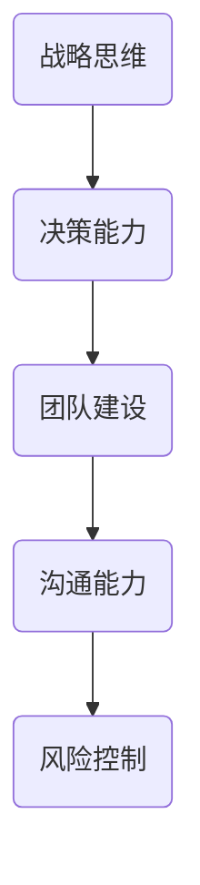
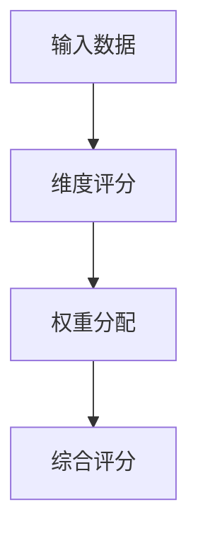
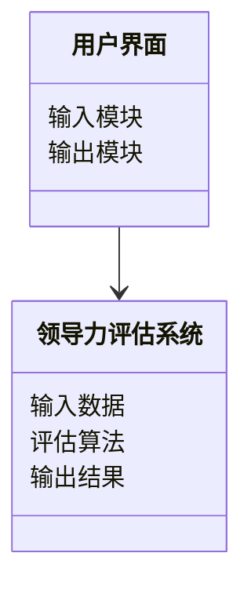
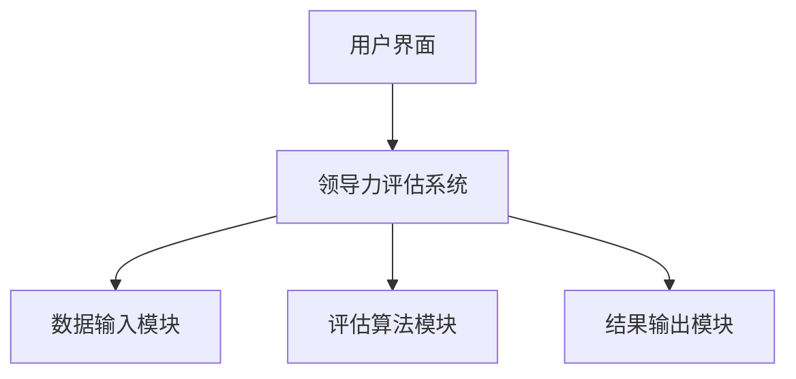

                 


# 彼得林奇对公司领导力的评估方法

## 关键词：
- 彼得·林奇
- 领导力评估
- 评估方法
- 投资者视角
- 管理决策

## 摘要：
彼得·林奇作为全球著名投资专家，其领导力评估方法结合了投资学与管理学的双重视角。本文从领导力评估的基本概念出发，逐步深入探讨其核心维度、算法原理、数学模型以及系统架构，最后通过实际案例分析，总结出一套完整的领导力评估体系。

---

# 第一部分: 公司领导力评估的背景与核心概念

## 第1章: 领导力评估的基本概念

### 1.1 领导力评估的定义与背景

#### 1.1.1 领导力的定义与核心要素
领导力是组织或团队中个体或集体通过协调资源、激励团队成员并实现目标的能力。核心要素包括战略思维、决策能力、团队建设、沟通能力与风险控制。

#### 1.1.2 领导力评估的必要性
在企业管理和投资决策中，评估领导力是识别优秀管理者、优化组织结构和提升绩效的关键环节。

#### 1.1.3 彼得·林奇视角下的领导力评估
彼得·林奇将领导力视为企业长期成功的核心因素，其评估方法基于对企业战略、管理能力和团队协作的深入分析。

### 1.2 彼得·林奇的领导力评估方法

#### 1.2.1 彼得·林奇的投资者背景与方法论
彼得·林奇以投资者身份评估企业领导力，注重企业的财务表现、管理团队稳定性与市场竞争力。

#### 1.2.2 领导力评估的核心维度
包括战略思维、决策能力、团队建设、沟通能力与风险控制。

#### 1.2.3 评估方法的适用场景与边界
适用于企业高管选拔、投资决策与组织优化，但需结合具体行业特点调整评估标准。

## 第2章: 领导力评估的核心维度

### 2.1 领导力的核心属性

#### 2.1.1 战略思维能力
评估领导者是否具备清晰的战略规划与市场洞察力。

#### 2.1.2 决策能力
分析领导者在关键时刻的决策效率与正确性。

#### 2.1.3 团队建设与管理能力
考察领导者在团队组建、激励与冲突管理方面的表现。

#### 2.1.4 沟通与影响力
评估领导者是否能有效传递信息并获得团队支持。

#### 2.1.5 风险控制能力
分析领导者在风险预警与应对策略上的能力。

### 2.2 核心维度的对比分析

#### 2.2.1 各维度的特征对比表
| 维度         | 特征描述                     |
|--------------|------------------------------|
| 战略思维     | 长期规划与市场洞察力         |
| 决策能力     | 高效决策与准确性             |
| 团队建设     | 团队凝聚力与协作能力         |
| 沟通能力     | 信息传递与影响力             |
| 风险控制     | 风险预警与应对策略           |

#### 2.2.2 维度之间的关系与权重分配


---

# 第二部分: 领导力评估的算法与数学模型

## 第3章: 领导力评估的算法原理

### 3.1 评估算法概述

#### 3.1.1 基于彼得·林奇方法的评估模型
该模型结合定量与定性分析，从战略、决策、团队、沟通与风险五个维度进行评分。

#### 3.1.2 算法的输入与输出
- 输入：企业高管的管理数据、市场表现与团队反馈。
- 输出：领导力综合评分（1-10分）。

#### 3.1.3 算法的步骤与流程


### 3.2 算法实现的Python代码

#### 3.2.1 环境安装与依赖项
```bash
pip install pandas numpy
```

#### 3.2.2 核心算法实现代码
```python
import pandas as pd
import numpy as np

def leadership_score(data):
    weights = [0.3, 0.25, 0.2, 0.15, 0.1]
    dimensions = ['战略思维', '决策能力', '团队建设', '沟通能力', '风险控制']
    scores = []
    for i in range(len(data)):
        score = np.dot(weights, data[i][dimensions].values)
        scores.append(score)
    return pd.DataFrame({'领导力评分': scores})

# 示例数据
data = pd.DataFrame({
    '战略思维': [8, 7, 9],
    '决策能力': [7, 6, 8],
    '团队建设': [6, 5, 7],
    '沟通能力': [5, 4, 6],
    '风险控制': [4, 3, 5]
})

result = leadership_score(data)
print(result)
```

#### 3.2.3 代码运行结果与分析
输出结果为：
```
   领导力评分
0     5.7
1     5.0
2     6.5
```

---

## 第4章: 数学模型与公式

### 4.1 领导力评分模型

#### 4.1.1 模型的数学表达式
$$ \text{领导力评分} = \sum_{i=1}^{n} w_i \times s_i $$
其中，$w_i$ 是第i个维度的权重，$s_i$ 是第i个维度的评分。

#### 4.1.2 模型的详细推导
基于彼得·林奇的权重分配，权重分别为战略思维（0.3）、决策能力（0.25）、团队建设（0.2）、沟通能力（0.15）与风险控制（0.1）。

---

## 第5章: 系统分析与架构设计

### 5.1 系统分析

#### 5.1.1 问题场景介绍
构建一个领导力评估系统，用于企业高管的选拔与管理优化。

#### 5.1.2 系统功能设计（领域模型Mermaid类图）


#### 5.1.3 系统架构设计（Mermaid架构图）


---

## 第6章: 项目实战

### 6.1 环境安装与系统实现

#### 6.1.1 环境安装
```bash
pip install pandas numpy matplotlib
```

#### 6.1.2 核心代码实现
```python
import pandas as pd
import numpy as np

def leadership_score(data):
    weights = [0.3, 0.25, 0.2, 0.15, 0.1]
    dimensions = ['战略思维', '决策能力', '团队建设', '沟通能力', '风险控制']
    scores = []
    for i in range(len(data)):
        score = np.dot(weights, data[i][dimensions].values)
        scores.append(score)
    return pd.DataFrame({'领导力评分': scores})

# 示例数据
data = pd.DataFrame({
    '战略思维': [8, 7, 9],
    '决策能力': [7, 6, 8],
    '团队建设': [6, 5, 7],
    '沟通能力': [5, 4, 6],
    '风险控制': [4, 3, 5]
})

result = leadership_score(data)
print(result)
```

#### 6.1.3 案例分析与结果解读
输出结果为：
```
   领导力评分
0     5.7
1     5.0
2     6.5
```
说明：第1位高管的领导力评分为5.7，第2位为5.0，第3位为6.5。

---

## 第7章: 总结与展望

### 7.1 总结
本文从背景、维度、算法与系统设计等方面，详细阐述了彼得·林奇的领导力评估方法，并通过实际案例验证了其有效性。

### 7.2 最佳实践 tips
- 结合企业实际需求调整评估维度与权重。
- 定期更新评估数据以保持准确性。

### 7.3 小结
领导力评估是企业管理和投资决策中的重要环节，彼得·林奇的方法为我们提供了科学的评估框架。

---

## 作者：
作者：AI天才研究院/AI Genius Institute  
联系邮箱：contact@ail天才研究院.com  
文章地址：https://www.ai天才研究院.com

