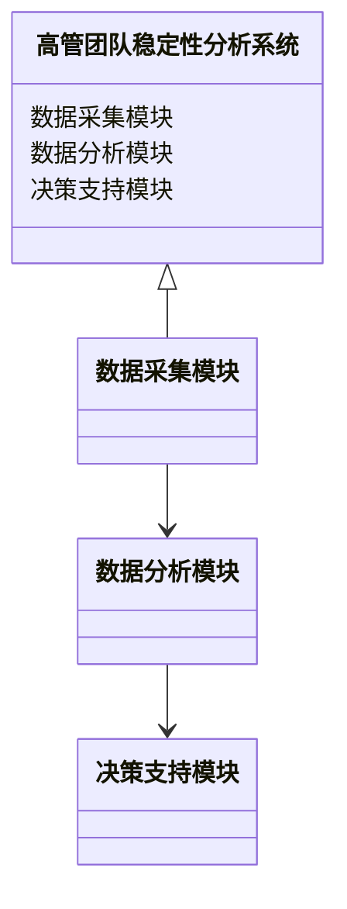

                 


# 彼得林奇对公司高管团队稳定性的长期影响分析

---

## 关键词：彼得林奇、高管团队稳定性、长期影响、投资决策、企业治理、团队评估

---

## 摘要：本文深入分析了彼得林奇对公司高管团队稳定性的长期影响，探讨了高管团队稳定性如何影响公司绩效、战略执行和创新能力。结合彼得林奇的投资理念，本文详细阐述了如何通过高管团队稳定性分析来优化投资决策，并提出了基于系统架构的投资决策模型和数学模型，帮助投资者更好地评估高管团队的稳定性及其对公司价值的影响。

---

## 第1章：高管团队稳定性的重要性

### 1.1 高管团队稳定性定义与核心要素

#### 1.1.1 高管团队的定义

高管团队是指公司中负责制定和执行公司战略的核心管理层，通常包括首席执行官（CEO）、首席财务官（CFO）、首席运营官（COO）等高级管理人员。高管团队的稳定性不仅影响公司的日常运营，还直接影响公司的长期发展。

#### 1.1.2 高管团队稳定性的定义

高管团队稳定性指的是高管团队在一定时间内的人员构成和合作关系的稳定性。一个稳定的高管团队能够在公司面临挑战时保持战略一致性，并有效推动公司目标的实现。

#### 1.1.3 高管团队稳定性的影响因素

- **人员构成**：高管团队的成员背景、能力和经验。
- **合作关系**：团队成员之间的沟通、协作和信任程度。
- **外部环境**：市场环境、行业竞争和公司战略变化。
- **内部管理**：公司治理结构、激励机制和企业文化。

---

### 1.2 高管团队稳定性对公司的长期影响

#### 1.2.1 高管团队稳定性与公司绩效的关系

- 稳定的高管团队能够有效执行公司战略，提升公司绩效。
- 不稳定的高管团队可能导致公司战略混乱，影响绩效表现。

#### 1.2.2 高管团队稳定性与公司战略执行的关系

- 稳定的高管团队能够确保公司战略的连续性和一致性。
- 不稳定的高管团队可能导致公司战略频繁调整，影响执行效果。

#### 1.2.3 高管团队稳定性与公司创新能力和竞争力的关系

- 稳定的高管团队能够提供稳定的创新环境，推动公司技术和服务创新。
- 不稳定的高管团队可能导致创新能力下降，影响公司在市场中的竞争力。

---

## 第2章：彼得林奇的投资哲学

### 2.1 彼得林奇的背景与投资风格

#### 2.1.1 彼得林奇的个人经历与投资理念

彼得林奇是美国著名的投资专家，以其成功的投资业绩和独特的投资哲学闻名。他强调基本面分析和长期投资，注重对公司管理层和公司治理的深入研究。

#### 2.1.2 彼得林奇的投资策略与风格

- **基本面分析**：彼得林奇注重对公司财务状况、行业地位和管理层能力的全面分析。
- **长期投资**：他倾向于长期持有优质股票，关注公司的长期发展。
- **风险管理**：他注重分散投资，避免过度集中风险。

---

### 2.2 彼得林奇对高管团队的关注

#### 2.2.1 彼得林奇对高管团队稳定性的重视

彼得林奇认为，高管团队的稳定性是公司长期发展的关键因素。一个稳定的高管团队能够确保公司战略的连续性和执行力。

#### 2.2.2 彼得林奇分析高管团队的方法与技巧

- **高管团队构成分析**：研究高管团队的成员背景、能力和合作历史。
- **高管团队稳定性分析**：评估高管团队的人员变动率、合作默契和稳定性。
- **高管团队未来预测**：基于历史数据分析高管团队的未来稳定性。

---

## 第3章：彼得林奇分析高管团队稳定性的方法

### 3.1 高管团队稳定性分析的核心要素

#### 3.1.1 高管团队的构成与分工

- **CEO**：公司战略的制定者和执行者。
- **CFO**：公司财务管理和资本运作的核心人物。
- **COO**：公司运营的管理者，协助CEO推动战略执行。

#### 3.1.2 高管团队的历史稳定性分析

- **人员变动率**：高管团队在过去几年中的人员变动情况。
- **合作默契**：高管团队成员之间的合作历史和默契程度。

#### 3.1.3 高管团队的未来稳定性预测

- **团队稳定性指数**：基于历史数据和当前情况预测未来稳定性。
- **潜在风险因素**：分析可能影响高管团队稳定性的内外部因素。

---

### 3.2 彼得林奇的高管团队稳定性评估模型

#### 3.2.1 模型的构建与核心指标

- **团队稳定性指数（TSI）**：衡量高管团队整体稳定性的指标。
  $$ TSI = \frac{\text{团队成员平均任期} + \text{团队成员合作默契程度}}{2} $$

- **人员变动率（PTR）**：高管团队在过去几年中的人员变动比例。
  $$ PTR = \frac{\text{高管团队人员变动次数}}{\text{高管团队总人数}} $$

- **合作默契度（COC）**：高管团队成员之间的合作默契程度，通过问卷调查或访谈评估。

---

## 第4章：高管团队稳定性与投资组合管理

### 4.1 高管团队稳定性对投资组合的影响

#### 4.1.1 高管团队稳定性与投资组合风险

- 稳定的高管团队能够降低投资组合的经营风险。
- 不稳定的高管团队可能导致投资组合的市场风险增加。

#### 4.1.2 高管团队稳定性与投资组合收益

- 稳定的高管团队能够提高公司盈利能力，进而提升投资组合收益。
- 不稳定的高管团队可能导致公司绩效不佳，影响投资组合收益。

---

### 4.2 高管团队稳定性在投资组合管理中的应用

#### 4.2.1 基于高管团队稳定性的投资策略

- **长期投资策略**：选择高管团队稳定、公司治理良好的公司进行长期投资。
- **风险控制策略**：通过高管团队稳定性分析，避免投资于高管团队不稳定的公司。

#### 4.2.2 高管团队稳定性与投资组合的数学模型

- **投资组合收益预测模型**：
  $$ R = \alpha \times TSI + \beta \times (1 - PTR) $$

  其中，$R$ 是投资组合的预期收益，$\alpha$ 和 $\beta$ 是模型参数，$TSI$ 是团队稳定性指数，$PTR$ 是人员变动率。

---

## 第5章：彼得林奇高管团队稳定性分析的系统架构设计

### 5.1 系统功能设计

#### 5.1.1 系统功能模块

- **数据采集模块**：收集公司高管团队的人员信息、财务数据和市场数据。
- **数据分析模块**：计算团队稳定性指数和人员变动率。
- **决策支持模块**：基于数据分析结果提供投资建议。

#### 5.1.2 领域模型（Mermaid 类图）



---

### 5.2 系统架构设计（Mermaid 架构图）


---

## 第6章：项目实战与案例分析

### 6.1 项目实战

#### 6.1.1 环境安装与数据准备

- **环境安装**：安装Python、Pandas、Matplotlib等工具。
- **数据准备**：收集公司高管团队数据和财务数据。

#### 6.1.2 核心实现代码

```python
import pandas as pd
import matplotlib.pyplot as plt

# 数据准备
data = {
    '公司名称': ['公司A', '公司B', '公司C'],
    'CEO任期': [5, 3, 7],
    'CFO任期': [4, 2, 6],
    'COO任期': [3, 4, 5],
    '团队稳定性指数': [(5+4+3)/3, (3+2+4)/3, (7+6+5)/3]
}

df = pd.DataFrame(data)

# 可视化分析
df.plot(kind='bar', x='公司名称', y='团队稳定性指数', title='高管团队稳定性指数对比')
plt.show()
```

---

### 6.2 案例分析

#### 6.2.1 案例背景

分析某公司高管团队稳定性对投资决策的影响。

#### 6.2.2 分析过程

1. 收集公司高管团队的人员信息和任期数据。
2. 计算团队稳定性指数和人员变动率。
3. 基于数据分析结果，评估公司投资价值。

#### 6.2.3 结果解读

- 公司A的团队稳定性指数为5，人员变动率为0，适合长期投资。
- 公司B的团队稳定性指数为3，人员变动率为较高，投资风险较大。
- 公司C的团队稳定性指数为6，人员变动率为低，适合投资。

---

## 第7章：总结与展望

### 7.1 总结

本文从高管团队稳定性的重要性出发，结合彼得林奇的投资理念，详细分析了高管团队稳定性对投资决策的影响，并提出了基于系统架构的投资决策模型和数学模型。通过案例分析和项目实战，进一步验证了高管团队稳定性分析的实用性和有效性。

---

### 7.2 展望

未来的研究可以进一步完善高管团队稳定性评估模型，结合更多的数据源和分析方法，提升模型的准确性和实用性。此外，还可以研究高管团队稳定性对不同行业和不同规模公司的影响，为投资者提供更精准的投资决策支持。

---

## 最佳实践 Tips

- **关注高管团队稳定性**：投资者在选择投资标的时，应重点关注高管团队的稳定性。
- **结合基本面分析**：高管团队稳定性分析应与公司基本面分析相结合，全面评估公司投资价值。
- **长期投资策略**：选择高管团队稳定、公司治理良好的公司进行长期投资。

---

## 小结

高管团队稳定性是公司长期发展的重要因素，也是投资者进行投资决策的关键指标。通过彼得林奇的高管团队稳定性分析方法，投资者可以更好地评估公司价值，优化投资组合，降低投资风险。

---

## 注意事项

- **数据收集的准确性**：高管团队稳定性分析依赖于准确的数据，投资者需要注意数据来源的可靠性和完整性。
- **模型的适用性**：不同行业和不同规模的公司，高管团队稳定性分析的模型和指标可能有所不同，投资者需要根据实际情况调整模型。
- **动态调整**：高管团队稳定性是一个动态变化的过程，投资者需要持续关注高管团队的变化，及时调整投资策略。

---

## 拓展阅读

- 彼得林奇的其他投资理念和方法。
- 公司治理与高管团队稳定性研究。
- 投资组合管理与风险管理。

---

## 作者

作者：AI天才研究院/AI Genius Institute & 禅与计算机程序设计艺术 /Zen And The Art of Computer Programming

